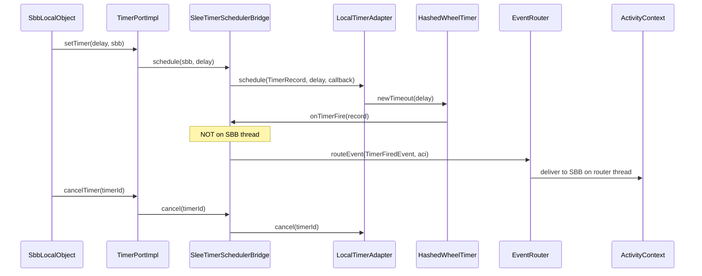

# micro-jainslee 1.1.0

Lightweight JAIN SLEE 1.1 runtime modules (`jainslee-api`, `jainslee-core`, `jainslee-apt`, adapters) plus the RestComm JAIN-SLEE container with LMAX Disruptor event routing and WildFly 10 integration.

[](pom.xml)
[](jainslee-core/pom.xml)

---

## Timer Scheduler Integration

micro-jainslee 1.1.0 replaces the in-process `HierarchicalTimingWheel` with **jSS7 `TimerScheduler`** via `SleeTimerSchedulerBridge`.

| Component | Package | Role |
|-----------|---------|------|
| **`TimerPortImpl`** | `com.microjainslee.core` | JAIN SLEE 1.1 §9 timer façade |
| **`SleeTimerSchedulerBridge`** | `com.microjainslee.core` | Schedules via jSS7; fires on `EventRouter` |
| **`LocalTimerAdapter`** | `org.restcomm.protocols.ss7.scheduler.impl` | Netty `HashedWheelTimer` (10 ms tick) |
| **`TimerFacilityBackendBridge`** | `org.mobicents.slee.runtime.facilities` | Mobicents container adapter sketch |

**Design rule:** timer callbacks must **never** invoke SBB code on the hashed-wheel thread. `SleeTimerSchedulerBridge` posts `TimerFiredEvent` to `EventRouter`, preserving JAIN SLEE single-threaded event delivery per activity.

Full cutover gate and TCK checklist: [`docs/TCK_TIMER_CUTOVER.md`](docs/TCK_TIMER_CUTOVER.md)

**Timer flow (micro-jainslee):**



> **Container note:** `TimerFacilityImpl` still defaults to `FaultTolerantScheduler`. Wiring the bridge into the Mobicents container requires TCK sign-off — see the cutover doc.

---

## Event Router (Disruptor)

The RestComm container routes SBB events through **N × LMAX Disruptor** executors (one worker per ring buffer):

- Activities are **pinned** to an executor via `ActivityHashingEventRouterExecutorMapper`
- Events on the same activity are processed **serially** (JAIN SLEE ordering guarantee)
- Default ring size: 262144 slots per executor; blocking wait strategy
- Enabled via WildFly `EventRouterConfiguration`; override with `-Djainslee.eventrouter.useDisruptor=true`

| Property | Default | Purpose |
|----------|---------|---------|
| `jainslee.eventrouter.threads` | CPU cores | Disruptor executor count |
| `jainslee.eventrouter.ringsize` | 262144 | Ring buffer slots per executor |
| `jainslee.eventrouter.waitstrategy` | blocking | `blocking` or `busyspin` |
| `jainslee.sbb.pool.min` | 500 | Pre-warmed SBB instances |
| `jainslee.sbb.pool.max` | 50000 | Max active SBB instances |

---

## WildFly 10

Container modules integrate with WildFly 10 subsystem APIs:

- `org.wildfly.clustering.*` — distributed state and failover
- `org.wildfly.transaction.client` — JTA-aware timer and event delivery
- `org.wildfly.naming` — JNDI for Infinispan timer containers
- Infinispan 8 caches for replicated SBB state

For jSS7 protocol timers in the same JVM, use a **separate** Infinispan container (`microjainslee`) — do not share `jss7-timers`.

---

## Modules

| Module | Artifact | Description |
|--------|----------|-------------|
| `jainslee-api` | `com.microjainslee:jainslee-api` | SLEE 1.1 API surface (`TimerPort`, `TimerFiredEvent`) |
| `jainslee-core` | `com.microjainslee:jainslee-core` | `EventRouter`, `SleeTimerSchedulerBridge`, `TimerPortImpl` |
| `jainslee-apt` | `com.microjainslee:jainslee-apt` | Annotation processing |
| `adapters/adapter-quarkus` | `com.microjainslee:adapter-quarkus` | Quarkus integration adapter |
| `ra-connectors` | `com.microjainslee:ra-connectors` | Resource adaptor connectors |
| `container/` | Mobicents modules | Full JAIN-SLEE container, timers, router, profiles |

---

## Build

```bash
# micro-jainslee modules only
mvn -pl jainslee-core -am install -DskipTests

# full tree (container + tools)
mvn clean install -DskipTests
```

### Maven coordinates

```xml
<dependency>
    <groupId>com.microjainslee</groupId>
    <artifactId>jainslee-core</artifactId>
    <version>1.1.0</version>
</dependency>
```

jSS7 scheduler dependency (transitive via `jainslee-core`):

```xml
<dependency>
    <groupId>org.restcomm.protocols.ss7.scheduler</groupId>
    <artifactId>scheduler</artifactId>
    <version>9.4.0</version>
</dependency>
```

---

## Documentation

| Document | Content |
|----------|---------|
| [`docs/TCK_TIMER_CUTOVER.md`](docs/TCK_TIMER_CUTOVER.md) | Timer backend cutover checklist, TCK gate, rollback |
| [`../docs/`](../docs/) | Container design notes (parent repo) |

---

## Changelog

### 1.1.0
- `SleeTimerSchedulerBridge` — jSS7 `TimerScheduler` integration with `EventRouter` handoff
- `TimerPortImpl` replaces `HierarchicalTimingWheel`
- `TimerFiredEvent` API; `TimerFacilityBackendBridge` container adapter sketch
- TCK cutover documentation

### 1.0.x
- micro-jainslee Phase 1: `jainslee-api`, `jainslee-core`, `jainslee-apt`, RA mock
- LMAX Disruptor event router; WildFly 10 container integration

---

## License

GNU Affero General Public License v3.0 (RestComm JAIN-SLEE lineage)

**Maintainer:** [nhanth87](https://github.com/nhanth87)
