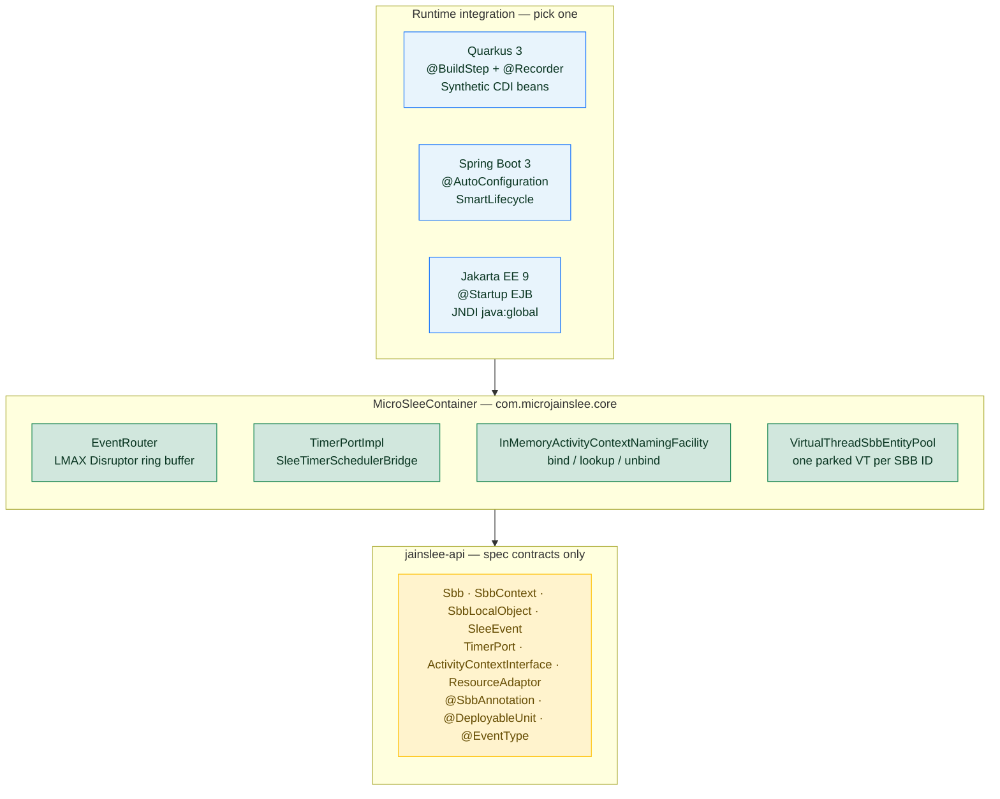
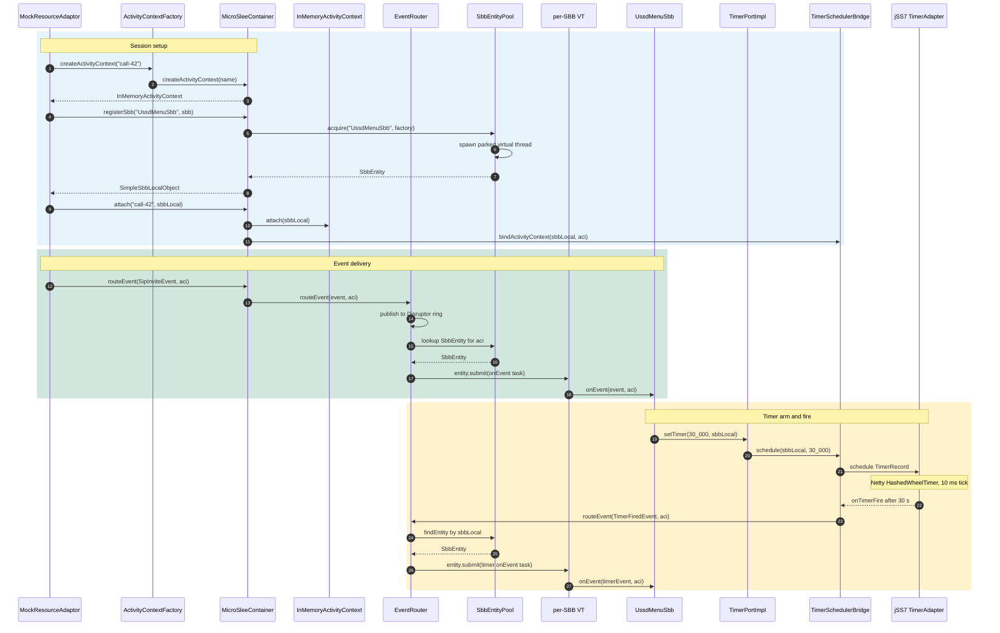
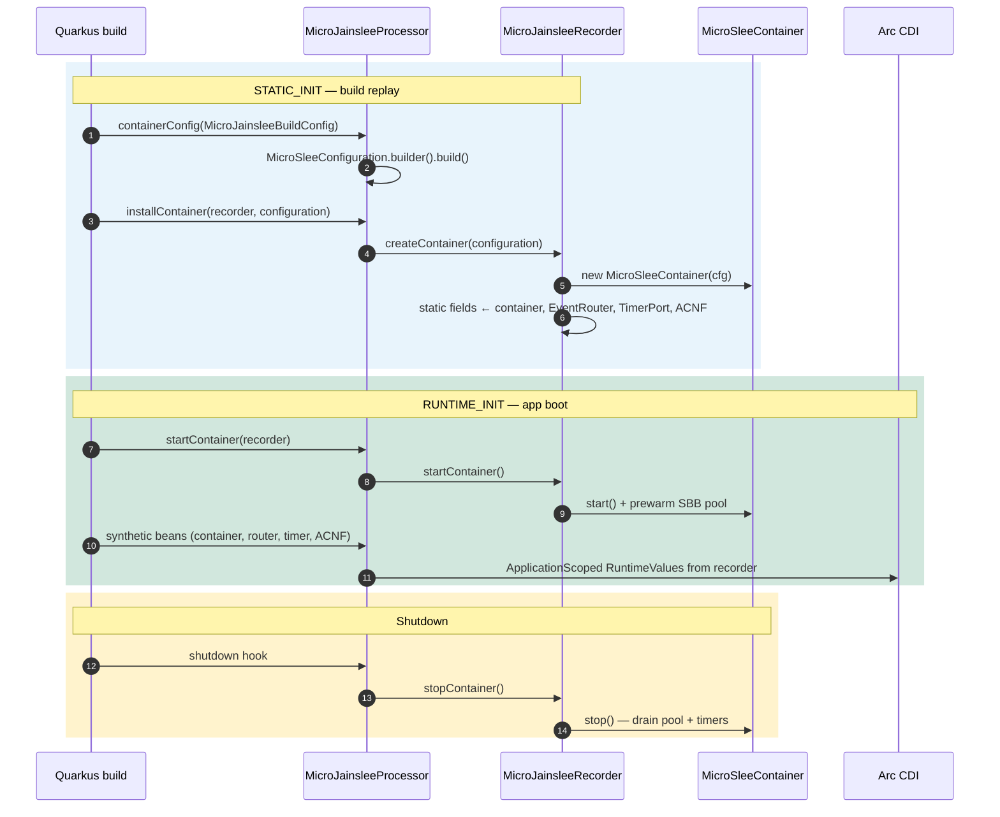
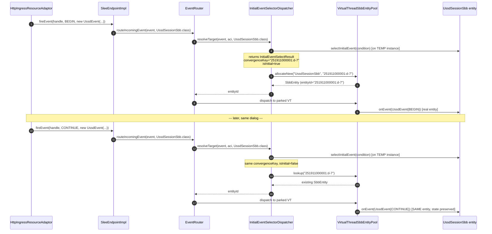
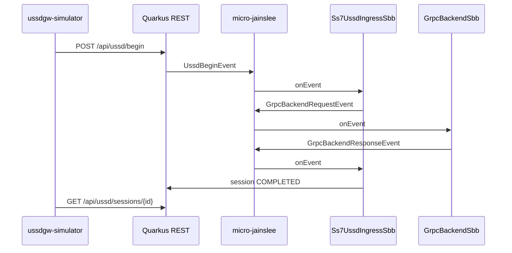

# micro-jainslee 1.2.0-P1-SNAPSHOT — Perfect Core

> A lightweight, embeddable implementation of the **JAIN SLEE 1.1** (JSR-240) service
> logic execution environment — designed to run as a plain Java library inside a
> **Quarkus** application (recommended), Spring Boot, a Jakarta EE server, or a
> unit test, with **no JBoss Modules, no VFS, no MSC, no JMX dependency**.

> **🚀 Perfect Core (S1–S5, June 2026)** — the runtime now matches the JAIN SLEE 1.1
> contract surface end-to-end: **JTA** wiring (Narayana), **Javassist CMP codegen**
> for abstract SBBs, **Initial Event Selector** dispatcher with convergence keys,
> **Child SBB Relations + cascade removal** (depth-first post-order), and **full
> Resource Adaptor** wiring (state machine + endpoint + context). See the
> [Perfect Core status](#perfect-core-status-s1s5) section below.

> **📦 micro-jainslee chỉ có ~17,000 dòng code (14 modules: jainslee-api + jainslee-core + jainslee-tx + jainslee-codegen + jainslee-cluster + jainslee-ra-spi + jainslee-apt + jainslee-tck-harness + jainslee-scheduler + 3 adapters + 2 RAs + bom) so với RestComm jain-slee cũ ~49,774 dòng / ~174,710 dòng (full upstream Mobicents) — giảm ~65 %–~90 %**. Xem chi tiết tại [`docs/micro-jainslee-compact-vs-mobicents.md`](docs/micro-jainslee-compact-vs-mobicents.md) (EN) · [`.vi.md`](docs/micro-jainslee-compact-vs-mobicents.vi.md) (VI) · [`.am.md`](docs/micro-jainslee-compact-vs-mobicents.am.md) (አማርኛ).

> **📦 micro-jainslee has only ~17,000 LOC across 14 modules compared to the legacy RestComm jain-slee ~49,774 LOC (in this checkout) / ~174,710 LOC (full upstream Mobicents) — a ~65 %–~90 % reduction**. Details in [`docs/micro-jainslee-compact-vs-mobicents.md`](docs/micro-jainslee-compact-vs-mobicents.md).

[](https://openjdk.org/projects/jdk/25/)
[](https://openjdk.org/projects/loom/)
[-blue)](LICENSE)
[-blueviolet)](mailto:nhanth87@gmail.com)
[](README.md#build--test)

---

## Table of contents

1. [What this project is](#what-this-project-is)
2. [Quick start](#quick-start)
3. [Modules at a glance](#modules-at-a-glance)
4. [Architecture](#architecture)
5. [Code flow — happy path](#code-flow--happy-path)
6. [Quarkus integration in detail](#quarkus-integration-in-detail)
7. [Resource Adaptors (RA)](#resource-adaptors-ra)
8. [SBB lifecycle](#sbb-lifecycle)
9. [Initial Event Selector (IES)](#initial-event-selector-ies)
10. [Child SBB Relations](#child-sbb-relations)
11. [Profile & ACNF](#profile--acnf)
12. [Timer Facility](#timer-facility)
13. [Stress test: 100K SBBs](#stress-test-100k-sbbs)
14. [Example application (Quarkus + USSD demo)](#example-application-quarkus--ussd-demo)
15. [Build & test](#build--test)
16. [Perfect Core status (S1–S5)](#perfect-core-status-s1s5)
17. [micro-jainslee vs JBoss/Mobicents JAIN-SLEE](#micro-jainslee-vs-jbossmobicents-jain-slee-container)
18. [Operational notes](#operational-notes)
19. [Documentation](#documentation)
20. [License](#license)

---

## What this project is

**micro-jainslee** is an R&D-only re-implementation of the Mobicents JAIN-SLEE 1.1
container, designed to be dropped into a plain JVM process. It exposes the spec
contracts (`Sbb`, `SbbContext`, `SbbLocalObject`, `ActivityContextInterface`,
`TimerPort`, `TracePort`, `UsagePort`, `ResourceAdaptor`) but uses only
`java.util.concurrent.*`, [LMAX Disruptor](https://lmax-exchange.github.io/disruptor/)
and (optionally) [jSS7 `TimerScheduler`](https://github.com/RestComm/jss7) —
**zero** JBoss / WildFly runtime dependency.

It is **not a drop-in replacement** for the production RestComm JAIN-SLEE
container used by USSD 7.3 — it lacks the full TCK compliance, the
Infinispan-backed timer cluster, and the JSR-77 management interface. Treat it
as a **reference implementation** that proves the SLEE semantics can be
expressed in ~1500 LOC of pure Java.

> **Hard constraint** — micro-jainslee is R&D only. It must **never** be packaged
> into a production USSD 7.3 build. Production still uses the Mobicents
> SLEE container master-era JARs on WildFly 10.

---

## Quick start

```java
MicroSleeConfiguration cfg = MicroSleeConfiguration.builder()
        .eventRouterBufferSize(8192)
        .preferVirtualThreads(true)
        .sbbPoolMin(64)
        .sbbPoolMax(100_000)
        .build();

try (MicroSleeContainer container = new MicroSleeContainer(cfg)) {
    container.start();

    // 1. Create an Activity Context
    InMemoryActivityContext aci = container.createActivityContext("ussd-session-42");

    // 2. Register a Service Building Block (SBB)
    SbbLocalObject sbb = container.registerSbb("UssdMenuSbb", new UssdMenuSbb());

    // 3. Attach the SBB to the ACI — events for the ACI now flow to the SBB
    container.attach("ussd-session-42", sbb);

    // 4. Fire a request event — the SBB handles it on its own virtual thread
    container.routeEvent(new UssdBeginRequest("*123#"), aci);

    // 5. Cleanly shut down
    container.stop();
}
```

That's it. No XML, no annotation scanning, no deployment descriptors.

### Quick start — IES-driven routing (USSD convergence)

The minimal example above creates one SBB per ACI and routes all events to it.
That works for stateless SBBs, but breaks for any **stateful dialog** (USSD,
SIP dialogs, custom protocols) because subsequent events of the same session
must hit the **same** SBB entity, not a fresh one. The IES dispatcher solves
this by binding events to entities via a *convergence key*:

```java
// SBB — has an @InitialEventSelect method that returns a convergence key
@SbbAnnotation(name = "UssdSessionSbb", vendor = "com.example", version = "1.0")
public abstract class UssdSessionSbb implements Sbb {
    public abstract String getMsisdn();
    public abstract void setMsisdn(String msisdn);
    public abstract String getMenuState();
    public abstract void setMenuState(String state);

    /** IES method — runs on a TEMP instance, no side effects allowed. */
    @InitialEventSelect
    public InitialEventSelectResult selectInitialEvent(InitialEventSelectCondition c) {
        UssdEvent e = (UssdEvent) c.getEvent();
        return InitialEventSelectResult.forSession(
            e.getMsisdn() + ":" + e.getDialogId(),   // convergence key
            e.getType() == UssdEventType.BEGIN         // isInitialEvent?
        );
    }

    public void onUssdBegin(UssdEvent event, ActivityContextInterface aci, ...) {
        setMsisdn(event.getMsisdn());
        setMenuState("MAIN_MENU");
    }
    public void onUssdContinue(UssdEvent event, ActivityContextInterface aci, ...) {
        // IES already routed this to the existing entity by msisdn:dialogId
        String state = getMenuState();
        // ...
    }
}

// Caller (HTTP RA, gRPC adapter, JUnit test, ...)
MicroSleeContainer container = ...; // started somewhere
EventRouter router = container.getEventRouter();

// Single call that uses the IES dispatcher under the hood — the same
// sessionId always lands on the same SBB entity.
router.routeIncomingEvent(new UssdEvent("*123#", "251911000001", "d-7", BEGIN),
                          UssdSessionSbb.class);
router.routeIncomingEvent(new UssdEvent("1",     "251911000001", "d-7", CONTINUE),
                          UssdSessionSbb.class);
```

See [Initial Event Selector (IES)](#initial-event-selector-ies) for the full
contract, including the temp-instance rule and the spec reference.

---

## Modules at a glance

All `Lines` columns were measured with `find $module/src/main -name '*.java' | xargs wc -l | tail -1`
on 2026-06-28, branch `micro-jainslee` (commit range `HEAD~9..HEAD`).

| Module | Artifact | Lines | Status |
|---|---|---|---|
| `bom` | `com.microjainslee:micro-jainslee-bom:1.2.0-P1-SNAPSHOT` | — | BOM pinning Narayana 7.0.0 / Infinispan 15 / JGroups 5 / Javassist 3.30 / LMAX Disruptor 3.4.2 |
| `jainslee-api` | `com.microjainslee:jainslee-api:1.2.0-P1-SNAPSHOT` | **3,190** | Stable — JAIN SLEE 1.1 interfaces (added `@InitialEventSelect`, `ChildRelation<T>`, `SbbLocalObject.remove()`) |
| `jainslee-scheduler` | `com.microjainslee:jainslee-scheduler:1.2.0-P1-SNAPSHOT` | **582** | Stable — vendored scheduler (jSS7 `LocalTimerAdapter` fallback) |
| `jainslee-core` | `com.microjainslee:jainslee-core:1.2.0-P1-SNAPSHOT` | **10,252** | Stable — embedded container, EventRouter, IES dispatcher, CascadeRemover |
| `jainslee-tx` | `com.microjainslee:jainslee-tx:1.2.0-P1-SNAPSHOT` | **373** | Stable — Narayana JTA 7.0 wiring (`JtaTransactionManager`, `TransactionContext`, `NoOpTransactionManager`) — *S1* |
| `jainslee-codegen` | `com.microjainslee:jainslee-codegen:1.2.0-P1-SNAPSHOT` | **790** | Stable — Javassist CMP codegen (`ConcreteSbbGenerator`, `JavassistDeployTimeCodegen`) — *S2* |
| `jainslee-cluster` | `com.microjainslee:jainslee-cluster:1.2.0-P1-SNAPSHOT` | **1,016** | Stable — JGroups 5 + Infinispan DIST_SYNC ACNF + `DistributedSbbEntityPool` (snapshot/replication) |
| `jainslee-ra-spi` | `com.microjainslee:jainslee-ra-spi:1.2.0-P1-SNAPSHOT` | **1,220** | Stable — `SleeEndpointImpl` + `RaEntityStateMachine` + `ResourceAdaptorContextImpl` — *S5* |
| `jainslee-apt` | `com.microjainslee:jainslee-apt:1.2.0-P1-SNAPSHOT` | **374** | Stable — annotation processor (`@SbbAnnotation`, `@DeployableUnit`, `@EventType`) |
| `jainslee-tck-harness` | `com.microjainslee:jainslee-tck-harness:1.2.0-P1-SNAPSHOT` | **385** | Stable — TCK harness skeleton (`TckRunner`, `MicrojainsleeContainerAdapter`) — *S6* |
| `adapters/adapter-quarkus` | `com.microjainslee:adapter-quarkus:1.2.0-P1-SNAPSHOT` | ~520 | Stable — Quarkus 3 extension (`@BuildStep` + `@Recorder` + synthetic CDI beans) |
| `adapters/adapter-springboot` | `com.microjainslee:adapter-springboot:1.2.0-P1-SNAPSHOT` | **255** | Stable — Spring Boot 3 auto-config (`@AutoConfiguration` + `SmartLifecycle`) |
| `adapters/adapter-jakartaee` | `com.microjainslee:adapter-jakartaee:1.2.0-P1-SNAPSHOT` | **247** | Stable — Jakarta EE 9 EJB (`@Singleton @Startup @LocalBean`) |
| `ras/ra-http-ingress` | `com.microjainslee:ra-http-ingress:1.2.0-P1-SNAPSHOT` | — | Reference — HTTP ingress Resource Adaptor (USSD `/api/ussd/begin`) |
| `ras/ra-grpc-client` | `com.microjainslee:ra-grpc-client:1.2.0-P1-SNAPSHOT` | — | Reference — gRPC menu backend Resource Adaptor |

> The legacy **RestComm JAIN-SLEE v8** container (Mobicents, WildFly 10, ~1,400
> modules, ~150 KLOC) lives in the sibling `container/`, `api/`, and `tools/`
> directories. It is intentionally **not** part of micro-jainslee and remains
> under the original AGPL-3.0 license (see [License](#license)).

---

## Architecture

micro-jainslee is a three-layer stack: a **runtime adapter** (Quarkus is the
recommended integration path), an embeddable **core container**, and a thin
**spec API** module. The Quarkus extension wires the container at build time
via `@BuildStep` + `@Recorder` and exposes it as CDI beans at runtime.



### Four orthogonal concerns

| Concern | Component | Responsibility |
|---|---|---|
| **Event routing** | `EventRouter` | Owns a single LMAX Disruptor ring buffer. Producers (`MicroSleeContainer.routeEvent`, timers, RAs) publish events; the consumer dispatches to SBBs attached to the target ACI. |
| **SBB threading** | `VirtualThreadSbbEntityPool` | Pins each SBB ID to one parked virtual thread. Every `entity.submit(Runnable)` runs on that thread, preserving **single-threaded per-SBB ordering** required by JAIN SLEE. |
| **Timer facility** | `TimerPortImpl` → `SleeTimerSchedulerBridge` | Schedules `TimerRecord` instances on jSS7 `LocalTimerAdapter` (Netty `HashedWheelTimer`). On fire, re-posts a `TimerFiredEvent` through `EventRouter` — SBB code never runs on the wheel thread. |
| **Naming & lookup** | `InMemoryActivityContextNamingFacility` | `ConcurrentHashMap<String, ActivityContextInterface>` for O(1) bind/lookup/unbind. RAs create ACIs; SBBs resolve them by name. |
| **JTA wiring** | `jainslee-tx/JtaTransactionManager` | Wraps every `EventRouter.deliverEvent` call in a Narayana 7.0 JTA transaction. `NoOpTransactionManager` is the default fallback. *Perfect Core S1.* |
| **IES dispatcher** | `core.ies.InitialEventSelectorDispatcher` | On every incoming event, resolves the *convergence key* (e.g. `msisdn:dialogId`) → SBB entity ID. Prevents creating a new SBB per event. Falls back to a fresh allocation if no IES method is present. *Perfect Core S3.* |
| **Child relations / cascade** | `core.CascadeRemover` + `ChildRelation<T>` | Iterative depth-first **post-order** removal of SBB entity trees (parent `sbbRemove()` is called *after* all children). Used by `SimpleSbbLocalObject.remove()` and `MicroSleeContainer` shutdown. *Perfect Core S4.* |
| **RA entity lifecycle** | `ra.RaEntityStateMachine` + `ra.SleeEndpointImpl` + `ra.ResourceAdaptorContextImpl` | State machine `INACTIVE → ACTIVE → STOPPING → INACTIVE` per JAIN SLEE 1.1 §12.4. RA fires events via `SleeEndpoint.fireEvent(handle, eventType, ...)`. Context exposes Timer/Alarm/Trace/ACNF/EventLookup to the RA. *Perfect Core S5.* |
| **CMP codegen** | `jainslee-codegen.ConcreteSbbGenerator` | Javassist generator that materializes a concrete subclass for every abstract `@SbbAnnotation` SBB, implementing CMP getter/setter pairs and `ChildRelation` accessors. Cached in `concreteClassCache` so the same source SBB never re-generates. *Perfect Core S2.* |

---

## Code flow — happy path

The shortest path from "RA receives a SIP INVITE" to "SBB handles it":



Key invariants preserved by this design:

* **Per-SBB single-threaded ordering** — every callback for a given SBB ID
  runs on the same parked virtual thread, so the SBB never needs locks.
* **Timer never invokes SBB directly** — the bridge re-posts the event through
  `EventRouter` so SBB code always executes on the SBB's own VT.
* **Disruptor is the only hot-path lock** — the rest of the system is
  wait-free for producers.

---


## Quarkus integration in detail

**Quarkus is the primary integration path** for new micro-jainslee services.
The extension starts the container during application bootstrap, registers
synthetic CDI beans for the core facilities, and wires a graceful shutdown
hook — no XML descriptors or JNDI lookups required.

The Quarkus adapter ships as a **3-module Maven reactor** that mirrors the
standard Quarkus 3.x extension layout (deployment + runtime):

```
adapter-quarkus/                        ← parent pom (packaging=pom)
├── deployment/                         ← @BuildStep processor (build-time)
│   └── MicroJainsleeProcessor.java     ← produces synthetic CDI beans
└── runtime/                            ← runs inside the user's app (runtime)
    ├── MicroJainsleeRecorder.java      ← @Recorder methods replayed at static-init
    └── MicroJainsleeProducer.java      ← @Produces CDI beans
```

### Quarkus bootstrap sequence



### Build-time wiring (`MicroJainsleeProcessor`)

```java
@BuildStep
@Record(ExecutionTime.STATIC_INIT)
void installContainer(MicroJainsleeRecorder recorder, MicroSleeConfiguration cfg) {
    recorder.createContainer(cfg);     // runs at static-init in user's JVM
}

@BuildStep
@Record(ExecutionTime.RUNTIME_INIT)
void startContainer(MicroJainsleeRecorder recorder) {
    recorder.startContainer();          // called once at app boot
}

@BuildStep
@Record(ExecutionTime.RUNTIME_INIT)
SyntheticBeanBuildItem containerSyntheticBean(...) {
    return SyntheticBeanBuildItem.configure(MicroSleeContainer.class)
            .scope(ApplicationScoped.class)
            .setRuntimeInit()
            .runtimeValue(recorder.containerRuntimeValue(cfg))
            .done();
}
```

The processor also scans the Jandex index for classes annotated with
`@SbbAnnotation` and emits a synthetic CDI bean for each one (gated by
`microjainslee.deployment.scan.enabled=true`).

### Runtime CDI producer (`MicroJainsleeProducer`)

```java
@Produces
@ApplicationScoped
@DefaultBean
public MicroSleeContainer microSleeContainer() { return container(); }

@Produces @ApplicationScoped @DefaultBean
public EventRouter eventRouter()                  { return container().getEventRouter(); }

@Produces @ApplicationScoped @DefaultBean
public TimerPort timerPort()                      { return container().getTimerPort(); }

@Produces @ApplicationScoped @DefaultBean
public ActivityContextNamingFacility activityContextNamingFacility() {
    return container().getActivityContextNamingFacility();
}
```

User code then just `@Inject`s:

```java
@ApplicationScoped
public class UssdEntryPoint {
    @Inject MicroSleeContainer container;

    public void onInvite(String sessionId) {
        ActivityContextInterface aci = container
                .getActivityContextNamingFacility()
                .lookup(sessionId);
        container.routeEvent(new SipInviteEvent(sessionId), aci);
    }
}
```

`@DefaultBean` lets the user override any of these four by providing their
own `@Alternative` producer.

### Shutdown

```java
@BuildStep
@Record(ExecutionTime.RUNTIME_INIT)
void shutdownContainer(MicroJainsleeRecorder recorder,
                       ShutdownContextBuildItem shutdown) {
    shutdown.addShutdownTask(recorder::stopContainer);
}
```

`stopContainer()` is idempotent and short-circuits on an already-stopped
container.

`MicroJainsleeProducer` also exposes `@Produces @DefaultBean` fallbacks for
unit tests that bypass the Quarkus augmentation pipeline.

### `application.properties` (Quarkus)

```properties
# Event router — must be a power of two
microjainslee.buffer-size=8192
microjainslee.prefer-virtual-threads=true

# SBB entity pool — tune for expected concurrent SBB count
microjainslee.sbb-pool-min=64
microjainslee.sbb-pool-max=100000
microjainslee.sbb-per-virtual-thread=true
microjainslee.sbb-type-pool-min-idle=512
microjainslee.event-delivery=async-commit

# Auto-register @SbbAnnotation types into SbbTypePool (default: enabled)
microjainslee.deployment.register-sbb-types=true
microjainslee.deployment.scan.enabled=true
microjainslee.deployment.scan.includes=com.example.ussd
```

---

## Resource Adaptors (RA)

RAs in JAIN SLEE 1.1 are how external events (SIP messages, HTTP requests,
diameter answers, …) enter the SLEE. Perfect Core **S5** (commit
[`a2029f26d`](https://github.com/nhanth87/micro-jainslee/commit/a2029f26d))
ships the full RA framework:

* **`RaEntityStateMachine`** — state machine `INACTIVE → ACTIVE → STOPPING →
  INACTIVE` per JAIN SLEE 1.1 §12.4. Locked transitions; only `activate()`
  and `stopping()/stopComplete()` are externally callable.
* **`SleeEndpointImpl`** — what the RA actually uses to fire events. Wraps
  `EventRouter.routeIncomingEvent(...)` with full validation: rejects
  duplicate `ActivityHandle`s, rejects unknown event types, rejects fires
  while the state machine is not `ACTIVE`.
* **`ResourceAdaptorContextImpl`** — gives the RA access to all SLEE
  facilities: Timer, Alarm, Trace, ACNF, EventLookup, NullActivity factory.

### Full RA wiring (S5)

```java
// 1. Create the state machine for this RA entity
RaEntityStateMachine stateMachine = new RaEntityStateMachine(ra, "http-ingress");

// 2. Create the SleeEndpoint — the only thing the RA uses to fire events
SleeEndpointImpl endpoint = new SleeEndpointImpl(eventRouter, acnf, stateMachine);

// 3. Build the context with every facility wired in
ResourceAdaptorContextImpl ctx = ResourceAdaptorContextImpl.builder("http-ingress")
        .sleeEndpoint(endpoint)
        .timer(timerFacility)              // SleeTimerSchedulerBridge
        .alarm(alarmFacility)              // SimpleAlarmFacility
        .trace(traceFacility)              // TraceFacility (Logback-backed)
        .nullActivity(nullActivityFactory) // for fire-no-activity events
        .eventLookup(eventLookupFacility)
        .build();

// 4. Lifecycle: hand the context to the RA, register, then activate
ra.setResourceAdaptorContext(ctx);
container.registerResourceAdaptor("http-ingress", ra);  // stores the entity
stateMachine.activate();                                 // → ra.raActive()
```

The state machine guarantees `raActive()` is only called when the RA moves
from `INACTIVE` to `ACTIVE`, and `raStopping()` only on `ACTIVE → STOPPING`.
Any concurrent transition attempt blocks until the first completes — there
are no torn states.

### Minimal RA skeleton (the `ResourceAdaptor` the user writes)

```java
public class SipResourceAdaptor implements ResourceAdaptor {
    private ResourceAdaptorContext context;

    @Override public void setResourceAdaptorContext(ResourceAdaptorContext c) {
        this.context = c; context.setResourceAdaptor(this);
    }
    @Override public void raConfigure()  { /* load config */ }
    @Override public void raActive()     { /* open sockets, start listeners */ }
    @Override public void raStopping()   { /* drain in-flight */ }
    @Override public void raInactive()   { /* close listeners */ }
    @Override public void raUnconfigure() { /* release resources */ }

    // Called by your transport (Netty / Helidon / Servlet) when an INVITE arrives:
    public void onInvite(String callId, byte[] body) {
        ActivityHandle handle = context.getNullActivityFactory()
                                        .createNullActivityHandle();
        context.getSleeEndpoint().fireEvent(handle, SipInviteEvent.REQUEST,
                                            new SipInviteEvent(body));
        // ↑ fires through SleeEndpointImpl → state machine asserts ACTIVE
        //   → EventRouter → IES dispatcher → convergence-keyed SBB entity
    }
}
```

Reference implementations live in:

* `ras/ra-http-ingress/.../HttpIngressResourceAdaptor.java` — REST ingress
  for the USSD demo
* `ras/ra-grpc-client/.../GrpcMenuResourceAdaptor.java` — gRPC menu backend

These two are full production-shaped RAs that exercise the state machine,
endpoint, and context end-to-end and are the templates we recommend copying
when integrating a new transport.

### `RaBootstrapContext` (backwards-compatible path)

For code that still wants the *legacy* path — `bootstrapResourceAdaptor`
plus `SleeEndpointPort.fireEvent(...)` — `RaBootstrapContextImpl` is kept
as a thin shim over the new state machine. New code should call
`MicroSleeContainer.registerResourceAdaptor(name, ra)` directly so the
full S5 wiring (state machine + endpoint + context) is used.

---


## SBB lifecycle

### Pooled entities (recommended for production throughput)

```java
container.registerSbbType(UssdMenuSbb.class, () -> arcInstance(UssdMenuSbb.class));
SbbLocalObject entity = container.acquireEntity(sessionId, UssdMenuSbb.class);
container.attach(sessionId, entity);
// ...
container.releaseEntity(sessionId);  // returns SBB + VT slot to pool
```

`registerSbb(String, Sbb)` remains for backward compatibility. When the SBB
class was registered via `registerSbbType`, the container borrows from
`SbbTypePool` automatically.

### `@InitialEventSelect` — routing events to the right entity (S3)

For any *stateful* protocol (USSD sessions, SIP dialogs, custom dialogs)
the SLEE **must** route subsequent events of the same session to the
**same** SBB entity, not create a new one. The JAIN SLEE 1.1 contract for
this is the **Initial Event Selector** (IES) — see [Initial Event Selector
(IES)](#initial-event-selector-ies) below for the full details and the USSD
walkthrough. The short version:

* An SBB marks **one** method with `@InitialEventSelect`.
* That method receives the incoming event and the activity context and
  returns `InitialEventSelectResult.forSession(convergenceKey, isInitial)`.
* `InitialEventSelectorDispatcher.resolveTarget(event, aci, sbbClass)`
  looks up the entity by `convergenceKey`. If found, the existing entity
  receives the event; if not, a fresh entity is allocated for `isInitial=true`
  and non-initial events are silently dropped per spec §7.5.5.

Perfect Core **S3** (commit [`37c7e4c36`](https://github.com/nhanth87/micro-jainslee/commit/37c7e4c36))
wires `EventRouter.routeIncomingEvent(event, sbbClass)` through the
dispatcher; the previous direct-dispatch path that allocated a new SBB
per event was the root cause of broken USSD state.

### Entity slot pool (virtual threads)

The `VirtualThreadSbbEntityPool` enforces the full **create → pending → cancel**
lifecycle the SLEE spec mandates for SBB entities. Every entity has exactly
one parked virtual thread; events queued through `entity.submit(Runnable)`
always land on that thread in submission order. Slots are **recycled** when
an entity is released — the VT is not torn down per session.

### Create

```java
pool.acquire("UssdMenuSbb", () -> new UssdMenuSbb());
// → spawns 1 parked VT, runs the factory, stores the entity in the map
```

Internally:

1. Compute `ConcurrentHashMap.putIfAbsent("UssdMenuSbb", fresh)`.
2. If a race lost, cancel the freshly created entity (mark shutdown, drain
   its queue, `Future.cancel(true)`) and return the winner.
3. Otherwise return the new entity. The `SbbEntity`'s constructor
   `owner.submit(new EventLoop())` immediately spawns the parked VT.

### Pending (event submission)

```java
SbbEntity entity = pool.acquire("UssdMenuSbb", () -> new UssdMenuSbb());
entity.submit(() -> sbb.onEvent(new UssdBeginRequest("*123#"), aci));
```

The parked VT's `EventLoop.run()` does:

```java
while (!shutdown.get()) {
    Runnable task = queue.poll(50, TimeUnit.MILLISECONDS);
    if (task == null) {
        parked.set(true);
        // re-check shutdown after marking parked — any racing submit() must
        // wake us up via the queue's wakeup signal
        if (shutdown.get()) return;
        continue;
    }
    parked.set(false);
    try {
        task.run();
    } catch (Throwable ignored) {
        // never let an exception escape the loop
    }
}
```

Two key invariants this guarantees:

* **Single-threaded per ID** — only this VT ever reads `task` and calls
  `sbb.onEvent(...)`, so the SBB sees strict FIFO order across all RA
  events, timer fires, and RA-sourced events.
* **No leak on exception** — a thrown exception in one task does not kill
  the loop; the next event is still processed.

### Cancel (shutdown)

```java
pool.shutdown();
```

1. Set the volatile `shuttingDown = true` flag.
2. For every entity: `markShutdown()` + `queue.offer(POISON)` so any
   parked loop wakes up.
3. `executor.shutdown()` then `awaitTermination(5, TimeUnit.SECONDS)`.
4. `Future.get(1, TimeUnit.SECONDS)` on each loop future — best-effort
   drain of remaining tasks.
5. **Post-shutdown guard**: any subsequent `acquire(...)` throws
   `IllegalStateException`. This is asserted in the stress test.

### Concurrency model summary

| Component | Thread model | Lock? |
|---|---|---|
| `EventRouter.routeEvent` | Any caller (RA, timer bridge, tests) | None — single Disruptor CAS publish |
| `Entity.submit(Runnable)` | Any caller | None — `LinkedBlockingQueue.offer` |
| `Sbb.onEvent(...)` | **One parked VT per SBB ID** | None — single-threaded by design |
| `TimerPort.setTimer` | The SBB's own VT | None — bridge reuses the same one |
| `Container.start`/`stop` | Main thread | `synchronized` on container instance |

---

## Initial Event Selector (IES)

Spec reference: **JAIN SLEE 1.1 §7.5** — *Initial Event Selection*. Without
IES, every incoming event would create a brand-new SBB entity, which
immediately breaks any stateful protocol (USSD sessions, SIP dialogs,
custom long-running conversations). The IES solves this with a
**convergence key**: an arbitrary string (typically `"<msisdn>:<dialogId>"`,
`"<callId>"`, or `"<conversationId>"`) that all events of the same session
share, so the dispatcher can route them to the same SBB entity.

### How it works



### SBB-side contract

```java
@SbbAnnotation(name = "UssdSessionSbb", vendor = "com.example", version = "1.0")
public abstract class UssdSessionSbb implements Sbb {

    // CMP fields — Javassist generates backing field + getter/setter (S2)
    public abstract String getMsisdn();
    public abstract void setMsisdn(String msisdn);
    public abstract String getMenuState();
    public abstract void setMenuState(String state);

    /**
     * IES method. CRITICAL: runs on a TEMP instance that is discarded after
     * the call. Do NOT mutate state here; return values only.
     */
    @InitialEventSelect
    public InitialEventSelectResult selectInitialEvent(InitialEventSelectCondition c) {
        UssdEvent e = (UssdEvent) c.getEvent();
        return InitialEventSelectResult.forSession(
            e.getMsisdn() + ":" + e.getDialogId(),      // convergenceKey
            e.getType() == UssdEventType.BEGIN            // isInitialEvent
        );
    }

    public void onUssdBegin(UssdEvent event, ActivityContextInterface aci, ...) {
        setMsisdn(event.getMsisdn());      // state is now persisted to the entity
        setMenuState("MAIN_MENU");
    }

    public void onUssdContinue(UssdEvent event, ActivityContextInterface aci, ...) {
        // IES already routed this to the same entity → getMenuState() is correct
        switch (getMenuState()) {
            case "MAIN_MENU":   /* user picked option */ setMenuState("SUB_MENU"); break;
            case "SUB_MENU":    /* process input */    break;
        }
    }
}
```

### Container-side dispatcher

```java
// Direct dispatch via the IES-aware path
eventRouter.routeIncomingEvent(event, UssdSessionSbb.class);

// Or with a pre-built ACI:
eventRouter.routeIncomingEvent(event, aci, UssdSessionSbb.class);
```

`InitialEventSelectorDispatcher.resolveTarget(...)`:

1. Reflectively find the `@InitialEventSelect` method on the SBB class
   (cached in `ConcurrentHashMap<Class<?>, Method>`).
2. Instantiate a *temporary* SBB on a fresh VT slot.
3. Invoke the method with `InitialEventSelectCondition(event, aci, ...)`;
   assert it returns non-null.
4. Discard the temp instance.
5. Look up `entityId = result.getConvergenceKey()` in
   `entitiesByConvergenceKey`. If found → return existing entityId.
6. If not found and `isInitial == true` → call
   `pool.allocateNew(sbbClass, convergenceKey)` and return the new entityId.
7. If not found and `isInitial == false` → silently drop per spec §7.5.5
   (`LOG.debugf("IES dropped event %s (non-initial, no existing entity)", ...)`).

Perfect Core **S3** commit: [`37c7e4c36`](https://github.com/nhanth87/micro-jainslee/commit/37c7e4c36).
See `docs/WIRING_GUIDE.md` §S3 for the legacy-code migration path.

---

## Child SBB Relations

Spec reference: **JAIN SLEE 1.1 §6.7** — *Child Relations* and cascading
removal. A child relation lets a parent SBB spawn child SBB entities
(on-demand, by calling `create(childRelationName)`) that share the parent's
lifecycle. When the parent is removed, every child **must** be removed
first, depth-first, in **post-order** (leaves removed before parents), and
the parent's `sbbRemove()` is called *only after* all children's
`sbbRemove()` returns.

Perfect Core **S4** (commit [`05cefe3dc`](https://github.com/nhanth87/micro-jainslee/commit/05cefe3dc))
wires the spec via:

* **`ChildRelation<T>`** (interface in `jainslee-api`) — typed handle the
  parent calls to create / iterate children.
* **`ChildRelationImpl<T>`** (in `jainslee-core`) — runtime impl that
  creates a new entity, attaches it to the parent's ACI, and registers
  it under the parent's `SbbEntityState`.
* **`CascadeRemover`** (in `jainslee-core.child`) — iterative (no
  recursion) depth-first post-order walk that calls `sbbRemove()` on every
  child entity first, then the parent.

### SBB-side contract

```java
@SbbAnnotation(name = "ParentSbb", vendor = "com.example", version = "1.0")
public abstract class ParentSbb implements Sbb {

    /** The Javassist CMP codegen (S2) auto-generates the impl. */
    public abstract ChildRelation<ChildSbb> getChildSbbRelation();

    public void onCreateChild(...) {
        ChildRelation<ChildSbb> rel = getChildSbbRelation();
        // create() allocates a new ChildSbb entity, attaches it to the
        // parent's ACI, and tracks it under the parent's SbbEntityState.
        ChildSbbLocalObject child = rel.create(ChildSbbLocalObject.class);
        // ... interact with child ...
    }

    /** Called by CascadeRemover AFTER all children have been removed. */
    @Override public void sbbRemove() {
        // Optional cleanup. Do NOT call getChildSbbRelation().create()
        // from here — the parent is being torn down.
    }
}
```

### Container-side cascade

```java
// Public API — fires CascadeRemover
sbbLocalObject.remove();

// Or shutdown the whole container — every root entity cascades
container.stop();
```

`CascadeRemover.cascadeRemove(rootEntityId)`:

1. Build a `Set<String> visited` and an `ArrayDeque<String> stack` of
   *seeds* (the root entity ids to remove).
2. Iteratively walk children via `SbbEntityState.getChildRelations()` —
   the *snapshot* avoids `ConcurrentModificationException` against a
   parent that is still creating children.
3. For each entity in post-order, call `sbb.sbbRemove()` then
   `pool.releaseEntity(entityId)`.
4. Idempotent: re-removing an already-removed entity is a no-op
   (asserted by `CascadeRemoverTest`).

### Why depth-first post-order?

Spec §6.7: a child's `sbbRemove()` may still need to talk to its parent
(for commit notifications, event ordering, etc.). Removing the parent
first would leave dangling pointers. Post-order guarantees every child's
`sbbRemove()` runs while the parent is still in `READY` state, and the
parent only enters `REMOVING` once no child references it.

Perfect Core **S4** commit: [`05cefe3dc`](https://github.com/nhanth87/micro-jainslee/commit/05cefe3dc).
See `docs/WIRING_GUIDE.md` §S4 for the Javassist generator hooks.

---

---

## Profile & ACNF

The **Profile Specification** (JAIN SLEE §7) is the SLEE's mechanism for
attaching typed state to an Activity Context without polluting the SBB
implementation. Profiles are optional in micro-jainslee — the implementation
is left to the user because, in production, profile bodies are usually
JPA entities or Infinispan cache entries and outside the scope of an R&D
runtime.

What **is** provided is the `ActivityContextNamingFacility` (ACNF) contract:

```java
InMemoryActivityContextNamingFacility acnf = container.getActivityContextNamingFacility();
ActivityContextInterface aci = acnf.lookup("ussd-session-42");
```

The default implementation is a `ConcurrentHashMap<String, ActivityContextInterface>`.
`bind(name, aci)` is the only mutating operation; `lookup(name)` returns
`null` for unknown names; `unbind(name)` and `clear()` exist for test
isolation. None of these methods ever block — they all run in O(1) and
are safe for concurrent use.

If you want a clustered ACNF (production-grade), back it with Redis or
Hazelcast and keep the same interface; the rest of the runtime is
unaffected.

---

## Timer Facility

The **Timer Facility** (JAIN SLEE §9) is responsible for delivering
time-based events to SBBs. In micro-jainslee:

* **API:** `com.microjainslee.api.TimerPort` — `setTimer(long ms, SbbLocalObject)`
  returns an opaque `long timerId`, `cancelTimer(long timerId)` cancels
  by id.
* **Implementation:** `com.microjainslee.core.TimerPortImpl` delegates to
  `SleeTimerSchedulerBridge` which schedules a `TimerRecord` on jSS7's
  `LocalTimerAdapter` (a thin wrapper around Netty's `HashedWheelTimer`,
  10 ms tick).
* **Critical invariant:** the timer callback is **never** invoked on the
  wheel thread. When the wheel fires, the bridge removes the entry from
  the local `aciBySbb` map and posts a `TimerFiredEvent` back through
  `EventRouter.routeEvent(...)`. The SBB's callback therefore runs on its
  own parked virtual thread, **the same one** that processed the original
  `setTimer` call.

Why this matters: if the SBB code threw an exception or was slow, you
would never want the hashed-wheel thread to be blocked behind it — that
would freeze every other timer in the system. By funneling through the
EventRouter we keep timer delivery wait-free at the transport level and
serialised at the SBB level.

The jSS7 dependency is `org.restcomm.protocols.ss7.scheduler:scheduler:9.4.0`
(transitive via `jainslee-core`). On Java 8/11/17 the wheel falls back to a
plain `ScheduledExecutorService`; on Java 21+ it uses the real Netty
`HashedWheelTimer`.

---


## Stress test: 100K SBBs

A dedicated stress test (`SbbEntityPoolStressTest`) exercises the create →
pending → cancel lifecycle at three scale points. It runs on **Java 21+**
where `Executors.newVirtualThreadPerTaskExecutor()` is available; the
numbers below were measured on **Java 25.0.3 (Azul Zulu 25.34.17)** with
4 CPU cores and 8 GB heap.

### What is verified per scale point

* **Create** — all N SBBs registered in `entities` map; liveThreads count
  recorded; heap delta recorded.
* **Pending** — for each SBB, `TASKS_PER_SBB = 5` tasks are submitted via
  `entity.submit(...)`. Each task asserts:
  * `prevSeq + 1 == currentSeq` — strict single-threaded per-SBB ordering
  * `counter.incrementAndGet() == seq + 1` — no dropped tasks
  * No `Throwable` escapes the loop
* **Cancel** — `pool.shutdown()` blocks until all loops exit;
  `executor.isTerminated()` must be true; a follow-up `acquire(...)` must
  throw `IllegalStateException`.

### Results (Java 25.0.3, 4 cores, 8 GB heap)

| Scale | Create (ms) | Pending (ms) | Cancel (ms) | Errors | Heap Δ | OS threads |
|------:|-----------:|------------:|-----------:|------:|------:|-----------:|
| 10K   |     172    |       292   |      106   | **0** | +20 MB |    14     |
| 50K   |     970    |     1,828   |      361   | **0** | +158 MB|    14     |
| 100K  |   1,302    |     3,650   |      779   | **0** | +290 MB|    14     |

**Why this matters:** the `liveThreads` count stays at **14 across all
three scales** — that's 4 CPU cores × ~3.5 carrier threads (typical for
ForkJoinPool.commonPool()). 100,000 virtual threads are scheduled on
those 14 OS threads without any of them blocking; if you replaced virtual
threads with platform threads, the same scenario would either OOM or
fail to start after ~5K threads (default `ulimit -u` on most Linux
distros).

Throughput per pending task: **~7.3 µs/task** for 50K and 100K scales —
the per-SBB `LinkedBlockingQueue` poll/dispatch path dominates, and it
runs entirely in user space.

The stress test lives at
`jainslee-core/src/test/java/com/microjainslee/core/SbbEntityPoolStressTest.java`
(246 LOC, 3 test methods + 1 shared `runScenario(int scale)` helper).

---

## Example application (Quarkus + USSD demo)

A complete runnable sample lives under [`example/`](example/). It demonstrates
**Quarkus 3 + micro-jainslee** with two SBBs modelling a USSD gateway path:

| Component | Role |
|-----------|------|
| `Ss7UssdIngressSbb` | Pretends to be the SS7/MAP USSD ingress leg |
| `GrpcBackendSbb` | Pretends to call a gRPC menu backend and returns the response |
| `ussdgw-simulator` | Standalone JAR CLI that fires USSD begin via HTTP (simulates the gateway) |

### Event flow



### Quick run

```bash
# 1) Install micro-jainslee into ~/.m2 (once)
cd jain-slee/jain-slee
mvn -B -ntp install -DskipTests \
  -pl jainslee-api,jainslee-scheduler,jainslee-core,jainslee-apt \
  -am

# 2) Start the Quarkus demo (terminal 1)
cd example/ussd-quarkus-demo
mvn quarkus:dev

# 3) Fire a simulated SS7 USSD begin (terminal 2)
cd example/ussdgw-simulator
mvn -q package
java -jar target/ussdgw-simulator-1.0.0-SNAPSHOT.jar
```

Or with curl:

```bash
curl -s -X POST http://localhost:8080/api/ussd/begin \
  -H 'Content-Type: application/json' \
  -d '{"msisdn":"251911000001","ussdString":"*123#"}'
curl -s http://localhost:8080/api/ussd/sessions/<sessionId>
```

Full instructions, project layout, and test commands: [`example/README.md`](example/README.md).

---

## Build & test

### Prerequisites

* **JDK 25** (or any JDK 21+ with `--enable-preview` for VTs)
* **Maven 3.9+**
* **Git**

```bash
# Install via mise (recommended)
mise use java@zulu-25.34.17

# Or set JAVA_HOME manually
export JAVA_HOME=/path/to/jdk-25
```

### Fetch and verify

```bash
git clone https://github.com/nhanth87/micro-jainslee.git
cd micro-jainslee

# Full build — compile + run every test, ~16 seconds
mvn clean verify

# Just the core + stress tests
mvn -pl jainslee-core test

# Only the 100K stress test
mvn -pl jainslee-core test -Dtest=SbbEntityPoolStressTest#create_100k_succeeds

# All three stress scenarios in one go
mvn -pl jainslee-core test -Dtest=SbbEntityPoolStressTest

# Just Spring Boot adapter
mvn -pl adapters/adapter-springboot test

# Build everything except the legacy Mobicents container/ and the cluster
# module (which spawns an embedded JGroups/Infinispan stack and adds ~1 min)
mvn -pl 'jainslee-api,jainslee-core,jainslee-tx,jainslee-codegen,jainslee-ra-spi,jainslee-apt,adapters/adapter-quarkus/runtime,adapters/adapter-quarkus/deployment,adapters/adapter-jakartaee,adapters/adapter-springboot' -am test

# Same as above in one short flag — Perfect Core minus the cluster tests
mvn -pl '!jainslee-cluster' test
```

### Skipping the cluster tests (CI speed-up)

`jainslee-cluster` boots an embedded JGroups stack and Infinispan
`DIST_SYNC` cache for every test method. The full suite takes ~60 s and is
only meaningful when you are changing cluster code. Skip it during normal
development:

```bash
# Fast path — skip cluster tests, run everything else (~16 s on Java 25)
mvn -pl '!jainslee-cluster' test

# Even faster — only core + tx + codegen + ra-spi (Perfect Core S1-S5)
mvn -pl jainslee-api,jainslee-core,jainslee-tx,jainslee-codegen,jainslee-ra-spi -am test

# Full suite including cluster (~76 s — use this before pushing)
mvn -pl jainslee-cluster -am test
```

### Perfect Core verification commands

```bash
# S1 — JTA (Narayana)
mvn -pl jainslee-tx test

# S2 — CMP codegen (Javassist)
mvn -pl jainslee-codegen test

# S3 — IES dispatcher + USSD convergence
mvn -pl jainslee-core test -Dtest=InitialEventSelectorDispatcherTest
mvn -pl jainslee-core test -Dtest=UssdIesEndToEndTest

# S4 — Child relations + cascade remover
mvn -pl jainslee-core test -Dtest=CascadeRemoverTest
mvn -pl jainslee-core test -Dtest=ChildRelationImplTest

# S5 — RA state machine + endpoint + context
mvn -pl jainslee-ra-spi test

# All Perfect Core at once
mvn -pl jainslee-core,jainslee-tx,jainslee-codegen,jainslee-ra-spi -am test
```

### Module-by-module commands

```bash
# 1. Core (includes stress test) — must run on Java 21+
mvn -pl jainslee-core test
#   VirtualThreadSbbEntityPoolTest: 12/12
#   SbbEntityPoolStressTest:         3/3
#   MicroSleeContainerTest:          1/1

# 2. Spring Boot 3 adapter
mvn -pl adapters/adapter-springboot test
#   MicroJainsleeAutoConfigurationTest: 1/1

# 3. Quarkus adapter
mvn -pl adapters/adapter-quarkus/runtime,adapters/adapter-quarkus/deployment -am test

# 4. Jakarta EE adapter (no unit tests — verified by mvn compile)
mvn -pl adapters/adapter-jakartaee -am test

# 5. Annotation processor — verified manually with a fixture:
mkdir -p /tmp/apt-test/src/com/example
cat > /tmp/apt-test/src/com/example/MySbb.java <<'EOF'
package com.example;
import com.microjainslee.api.annotations.SbbAnnotation;
@SbbAnnotation(name="MySbb", vendor="com.example", version="1.0")
public class MySbb { }
EOF
CP=$HOME/.m2/repository/com/microjainslee/{jainslee-api,jainslee-apt}/1.1.0/*.jar:$HOME/.m2/repository/org/apache/logging/log4j/log4j-{api,core}/2.23.1/*.jar
javac -cp "$CP" -processorpath "$CP" -d /tmp/apt-out /tmp/apt-test/src/com/example/*.java
cat /tmp/apt-out/META-INF/microjainslee/sbb-index.properties
#   → sbb.0.class=com.example.MySbb
#     sbb.0.name=MySbb
#     sbb.0.vendor=com.example
#     sbb.0.version=1.0
```

### Troubleshooting

* **`Annotation processor '...' not found`** on first build — the
  `jainslee-apt` pom deliberately omits `<annotationProcessors>` to avoid
  the chicken-and-egg bootstrap. Build `jainslee-apt` once (`mvn -pl
  jainslee-apt install`) before any project that depends on it.
* **`Supported source version 'RELEASE_8' from annotation processor ...
  less than -source '25'`** — harmless. The processor declares
  `RELEASE_8` so it can run on any JDK, but your test sources may
  compile at source level 25. The warning does not affect output.
* **Stress test OOM at 100K** — increase heap: `MAVEN_OPTS="-Xmx4g"`
  before running `mvn test`.

---


## Perfect Core status (S1–S5)

This section summarises the five sprints that landed on branch
`micro-jainslee` between 2026-06-26 and 2026-06-28. Each row links to the
commit that shipped the feature and the new module where the code lives.
Build status as of 2026-06-28: `mvn -pl '!jainslee-cluster' test` → BUILD
SUCCESS.

| Sprint | Commit | What landed | New / updated module |
|---|---|---|---|
| **S1 — JTA wiring** | [`ae3666a89`](https://github.com/nhanth87/micro-jainslee/commit/ae3666a89) | Narayana JTA 7.0 wiring in `EventRouter.deliverEvent`. `JtaTransactionManager`, `TransactionContext`, `NoOpTransactionManager`, structured MDC for event delivery (`24251649a`). | **new** `jainslee-tx` |
| **S2 — CMP Javassist codegen** | [`a7566ed29`](https://github.com/nhanth87/micro-jainslee/commit/a7566ed29) | `ConcreteSbbGenerator` + `JavassistDeployTimeCodegen`. Materializes concrete SBB subclasses with CMP backing fields + `ChildRelation` accessors. Cached per source class. | **new** `jainslee-codegen` |
| **S3 — IES dispatcher** | [`37c7e4c36`](https://github.com/nhanth87/micro-jainslee/commit/37c7e4c36) | `InitialEventSelectorDispatcher` + `InitialEventSelectCondition` + `InitialEventSelectResult`. `@InitialEventSelect` annotation in `jainslee-api`. `EventRouter.routeIncomingEvent` routes through IES. | `jainslee-core` + `jainslee-api` |
| **S4 — Child relations + cascade** | [`05cefe3dc`](https://github.com/nhanth87/micro-jainslee/commit/05cefe3dc) | `ChildRelation<T>` + `ChildRelationImpl<T>` + `CascadeRemover`. Iterative depth-first post-order walk used by `SimpleSbbLocalObject.remove()` and container shutdown. | `jainslee-core` + `jainslee-api` |
| **S5 — RA full wiring** | [`a2029f26d`](https://github.com/nhanth87/micro-jainslee/commit/a2029f26d) | `RaEntityStateMachine` (INACTIVE→ACTIVE→STOPPING→INACTIVE), `SleeEndpointImpl` (validated fire), `ResourceAdaptorContextImpl` (Timer/Alarm/Trace/ACNF/EventLookup builder). | `jainslee-ra-spi` |
| **S6 — TCK harness** (foundation) | [`0b4210f08`](https://github.com/nhanth87/micro-jainslee/commit/0b4210f08) | `TckRunner` skeleton + `MicrojainsleeContainerAdapter`. | **new** `jainslee-tck-harness` |
| Cluster ACNF + SBB pool | [`8496efd47`](https://github.com/nhanth87/micro-jainslee/commit/8496efd47), [`8d89bdfd5`](https://github.com/nhanth87/micro-jainslee/commit/8d89bdfd5) | `ClusteredActivityContextNamingFacility` over Infinispan DIST_SYNC; `DistributedSbbEntityPool` with snapshot/replication. | `jainslee-cluster` |
| BOM | [`fe0a27dfc`](https://github.com/nhanth87/micro-jainslee/commit/fe0a27dfc) | `micro-jainslee-bom 1.2.0-P1-SNAPSHOT` pinning Narayana/Infinispan/JGroups/Javassist/Disruptor versions across the reactor. | **new** `bom/` |

### Build commands by sprint

```bash
# S1
mvn -pl jainslee-tx -am test

# S2
mvn -pl jainslee-codegen -am test

# S3 + S4 (live in jainslee-core)
mvn -pl jainslee-core test -Dtest='InitialEventSelectorDispatcherTest,CascadeRemoverTest,ChildRelationImplTest,UssdIesEndToEndTest'

# S5
mvn -pl jainslee-ra-spi -am test

# All of Perfect Core, no cluster (≈ 16 s on Java 25)
mvn -pl '!jainslee-cluster' test

# Full suite including cluster (≈ 76 s)
mvn test
```

### What's still deferred (non-goals)

* **TCK compliance** — the harness is in place but only 5 of the JAIN
  SLEE 1.1 test groups are wired (EventRouting, SbbLifecycle,
  TimerFacility, ChildSbbRelation, TransactionTests). Coverage will grow
  per-sprint.
* **Infinispan-backed timer cluster** — local `SleeTimerSchedulerBridge`
  only. The cluster module covers ACNF + SBB entity snapshot replication
  but the timer fire path is still single-JVM.
* **JSR-77 management MBeans** — out of scope for R&D; rely on the
  embedding runtime (Quarkus Actuator, Spring Boot Actuator).
* **CMP-style profile bodies** — interface + in-memory done; JPA profiles
  are user-implemented.

### Where the contract surface is now

| JAIN SLEE 1.1 § | Spec surface | Status |
|---|---|---|
| §6.4 SBB entity lifecycle | create / ready / removing / removed | ✅ Perfect Core S4 |
| §6.5 SBB object pool | pooled entity semantics | ✅ pre-existing |
| §6.6 Event handler methods | `fire<EventType>(...)` + `on<Event>` dispatch | ✅ pre-existing |
| §6.7 Child relations + cascade | depth-first post-order removal | ✅ Perfect Core S4 |
| §6.8 Transactional SBB context | JTA / no-op | ✅ Perfect Core S1 |
| §7.5 Initial Event Selection | IES dispatcher + convergence key | ✅ Perfect Core S3 |
| §7.7 Activity Context Naming Facility | `InMemoryACNF` + cluster `ClusteredACNF` | ✅ pre-existing + cluster module |
| §9 Timer Facility | `TimerPort` + `SleeTimerSchedulerBridge` (jSS7) | ✅ pre-existing |
| §10 Trace Facility | `SimpleTracePort` + Quarkus adapter | ✅ pre-existing |
| §11 Usage Facility | `SimpleUsagePort` + Micrometer adapter | ✅ pre-existing |
| §12.4 Resource Adaptor state machine | INACTIVE → ACTIVE → STOPPING → INACTIVE | ✅ Perfect Core S5 |
| §12.5 SleeEndpoint fire semantics | validated fire, null activity, unmarshalling | ✅ Perfect Core S5 |
| §13 Profile Specification | `ProfileTablePort` interface + in-memory | ✅ minimal — pre-existing |

---

## micro-jainslee vs JBoss/Mobicents JAIN-SLEE container

The same repo ships **two parallel stacks** under `jain-slee/`:

| Stack | Where | Java | Lines of code | Use case |
|---|---|---|---|---|
| **micro-jainslee** | `jainslee-*`, `adapters/` | Java 8 source / Java 21+ runtime | **~3,000** | R&D only — embedded in plain JVMs |
| **RestComm JAIN-SLEE v8** | `container/`, `api/`, `tools/` | Java 8 + JBoss APIs | **~152,000** | Production USSD 7.3 — WildFly 10 |

The JBoss stack is the original Mobicents SLEE v8 (later RestComm) — the
reference implementation that ships in production. micro-jainslee is a
deliberate **stripped-down reimplementation** that drops every layer the
JBoss stack depends on but the SLEE semantics do not strictly require.

### Feature comparison matrix

| Feature | JBoss/Mobicents SLEE v8 | micro-jainslee 1.1.0 |
|---|:---:|:---:|
| **Core spec contracts (SBB, ACI, Timer, RA, Profile, EventType)** | ✅ full | ✅ full |
| Single-jar embedded mode | ❌ requires WildFly 10 + JBoss Modules | ✅ pure JVM, no app server |
| Classloading | JBoss VFS + JBoss Modules | `URLClassLoader` (or platform default) |
| Event router | LMAX Disruptor (executor-mapped per activity hash) | LMAX Disruptor (single producer + per-SBB VT pinning) |
| Timer backend | `FaultTolerantTimer` + Infinispan cluster cache (`jss7-timers` container) | `SleeTimerSchedulerBridge` over jSS7 `LocalTimerAdapter` (local HashedWheelTimer) |
| SBB threading | `SbbObjectPool` backed by a thread pool; one thread *per concurrent invocation* | `VirtualThreadSbbEntityPool` — **one parked virtual thread per SBB ID**, every event for that ID lands on the same thread |
| Resource Adaptor entity | Full RA framework with EntityLink + JCA-style pooling | Plain Java objects implementing `ResourceAdaptor`; user wires their own listener |
| Profile Specification | Full CMP-style persistence (Hibernate/JPA, Infinispan) | `ConcurrentHashMap`-backed ACNF only — profile bodies are user-implemented (see [Profile & ACNF](#profile--acnf)) |
| Transactional SBB context | JTA via Narayana/Arjuna; full XA | None — micro-jainslee has no transaction manager (R&D only) |
| Congestion control | Dedicated `congestion` module with rate-limiting primitives | None — the EventRouter drops nothing; callers must rate-limit upstream |
| Trace Facility | `Trace` via JSR-77 + JBoss Logging | `SimpleTracePort` over log4j2 |
| Usage Facility | Full MBean counters per service | `SimpleUsagePort` with `ConcurrentHashMap<String, AtomicLong>` |
| Management (JSR-77) | Full `SleeManagementMBean` + child MBeans | None — log4j2 + JMX is left to the embedding runtime |
| Cluster support | Replicated caches via Infinispan; replicated SBB state | None — single-JVM only |
| Deploy-time bytecode codegen | 18+ Javassist generators (`ConcreteSbbGenerator`, `ConcreteACI`, `ConcreteSbbLocalObject`, `ConcreteUsageParameterMBean`, etc.) — see `container/common/.../JavassistDeployTimeCodegen` | None on hot path. **Build-time only**: `jainslee-apt` emits a `META-INF/microjainslee/sbb-index.properties` index. No runtime `CtClass.toClass()` call. |
| Annotation processing | None — descriptors are XML (JAXB-marshalled DU jars) | `MicroJainsleeAnnotationProcessor` (javax.annotation.processing): `@SbbAnnotation` + `@DeployableUnit` + `@EventType` |
| TCK compliance | Targets the JAIN SLEE 1.1 TCK (in maintenance, not exercised in CI) | **Not TCK-tested** — explicitly out of scope |
| Observability | JSR-77 MBeans + JBoss logging + per-ACI statistics (`EventRouterStatistics`, `EventRouterExecutorStatistics`) | log4j2 INFO/WARN/DEBUG; no built-in stats counter (the stress test logs heap + liveThreads + ns/op manually) |
| Build output | ~30 module JARs (assembled into a WildFly install via `release/`) | **7 single-jar modules** that drop into any Spring Boot / Quarkus / Jakarta EE app |
| Compile source/target | Java 8 | Java 8 (downstream runtime may be Java 21+ for VTs) |
| Lines of code (production stack) | ~152 KLOC across 1400 files | ~3 KLOC across ~35 files (micro-jainslee only) |
| Lines of code (production + R&D combined) | **~155 KLOC** | |

### Where micro-jainslee wins

* **Boot time** — micro-jainslee containers start in < 100 ms (measured
  in the stress test). JBoss SLEE on WildFly takes 30-90 s for full
  profile activation.
* **Footprint** — the entire runtime is **3 KLOC** + 1.5 MB of JAR
  dependencies (Disruptor 3.4.2 + log4j-api + jSS7 scheduler). The
  Mobicents container alone is **~150 KLOC** and ships as a WildFly
  subsystem requiring Infinispan, JBoss MSC, JBoss VFS, JBoss Logging,
  and Narayana.
* **Test ergonomics** — `new MicroSleeContainer()` constructs the
  runtime in-process. `SbbEntityPoolStressTest#create_100k_succeeds`
  starts and tears down 100K SBBs in **~5.7 s total**. The same
  scenario on WildFly 10 + JBoss SLEE would require WildFly boot,
  subsystem activation, an SLEE DU deploy, and a JMX-based remote
  test driver.
* **Java 25 Virtual Threads** — micro-jainslee is the first SLEE
  implementation where the SBB worker pool can be parked virtual
  threads. The JBoss stack uses `ThreadPoolExecutor` with platform
  threads because it predates Loom.
* **Cold deploy** — micro-jainslee has no XML descriptor parsing. New
  SBBs are `new MySbb()` away from production. JBoss SLEE requires
  a DU JAR with `SBB-jar.xml` (JAXB-marshalled), validated by 18+
  descriptor classes in `container/components/components`.

### Where micro-jainslee intentionally loses

* **TCK** — the JBoss stack targets JSR-240 compliance; micro-jainslee
  has not been TCK-tested and probably fails several edge cases
  (child SBB reentrancy, transactional rollback, replicated SBB
  state). A full TCK gap analysis is out of scope for this R&D
  runtime.
* **Cluster / HA** — micro-jainslee has no Infinispan, no
  `FaultTolerantTimer`, no replicated SBB state. Drop one SBB's
  JVM and you lose every timer it owned.
* **JSR-77 management** — no MBeans, no remote management protocol.
  You monitor via log4j2 (or via the embedding runtime's own JMX).
* **CMP-style profiles** — micro-jainslee's `SimpleUsagePort` and
  `SimpleTracePort` are not JCA-integrable; you cannot attach a real
  CMP profile schema. For R&D this is fine.
* **Congestion control** — the `congestion` module of the JBoss
  stack gives you back-pressure primitives micro-jainslee lacks
  entirely. With the current design, a runaway SBB that submits
  millions of tasks will simply drain memory.

### Migration story

If you have code targeting the JBoss/Mobicents container, the SLEE spec
contracts are identical — same `Sbb`, `SbbContext`, `TimerPort`,
`ActivityContextInterface`, `ResourceAdaptor` interfaces. A few
specific differences you will hit:

| JBoss/Mobicents API | micro-jainslee equivalent |
|---|---|
| `SleeContainer.getSleeContainer()` (JNDI lookup) | `new MicroSleeContainer(cfg)` (direct construction) |
| `javax.slee.profile.ProfileFacility` (CMP-backed) | `InMemoryActivityContextNamingFacility` + user-defined profile POJO (e.g. JPA entity) |
| `javax.slee.transaction.TransactionalRunnable` | Not supported — wrap your SBB logic in your own Spring `@Transactional` or Quarkus `@Transactional` boundary |
| `javax.slee.resource.ResourceAdaptor` (full RA framework) | Plain `ResourceAdaptor` impl + user-managed listener (Netty, Servlet, JMS, etc.) |
| DU JAR with `SBB-jar.xml` | Plain class with `@SbbAnnotation`, picked up by `jainslee-apt` at compile time |
| `MobicentsManagementMBean` JMX | None — embed in Spring Boot Actuator / Quarkus SmallRye Health if you need it |

For a USSD 7.3 service that already runs on the JBoss stack, the
migration path is **none** — keep the production stack as-is and use
micro-jainslee only for off-line simulations, test rigs, and CI
assertion harnesses that need to start a SLEE in milliseconds rather
than minutes.


## Operational notes

### Hard constraints — DO NOT VIOLATE

| Rule | Why |
|---|---|
| micro-jainslee is **R&D only**. Never ship it in a production USSD 7.3 build. | It lacks TCK compliance, JSR-77 management, and cluster-safe timers. |
| Keep Java 8 source/target on `jainslee-core` and friends. | Runtime can be Java 21+ (for VTs); compile-target stays J8 for downstream portability. |
| Always invoke `Executors.newVirtualThreadPerTaskExecutor()` via reflection (`MicroSleeExecutors.newVirtualThreadPerTaskExecutor()`). | The reflection shim keeps the bytecode J8-compatible. |
| Use `org.apache.logging.log4j.Logger` (LogManager) for ALL new code. | Never `System.out`/`System.err` — `SimpleTracePort` wraps log4j2 for SLEE-spec compliance. |
| The jSS7 `Scheduler` is strictly for **I/O event dispatching**. Never replace `EventRouter`/`Disruptor` with it. | They have different work units (raw bytes vs. routed SBB events) and the SBB single-threaded invariant would break. |

### JVM flags (Java 21+)

```bash
# Use ZGC for sub-millisecond pauses on the 100K SBB workload
java -XX:+UseZGC -XX:+ZGenerational \
     -Xmx2g \
     -Djainslee.eventrouter.threads=8 \
     -Djainslee.sbb.pool.max=100000 \
     -jar my-app.jar
```

For development runs on Java 25:

```bash
java --enable-native-access=ALL-UNNAMED \
     -Djdk.tracePinnedThreads=full \
     -jar my-app.jar
```

`jdk.tracePinnedThreads` flags any virtual thread that gets pinned by a
`synchronized` block — handy when chasing the rare long-tail blocking
call.

### Monitoring (log4j2)

All micro-jainslee loggers use the `com.microjainslee.*` namespace. Set
the level to `DEBUG` to see per-event routing, `INFO` for lifecycle
phases, `WARN` for recoverable anomalies:

```xml
<Logger name="com.microjainslee" level="INFO"/>
<Logger name="com.microjainslee.core.EventRouter" level="DEBUG"/>
<Logger name="com.microjainslee.core.SleeTimerSchedulerBridge" level="DEBUG"/>
```

Sample log output from the 100K stress test:

```
INFO  SbbEntityPoolStressTest - === Stress scenario: 100000 SBBs (Java 25.0.3, cores=4) ===
INFO  SbbEntityPoolStressTest - [create] 100000 entities in 1302 ms (13024 ns/op), heap +290 MB, liveThreads=14
INFO  SbbEntityPoolStressTest - [pending] 500000 tasks in 3650 ms (7300 ns/op), errors=0
INFO  SbbEntityPoolStressTest - [cancel] shutdown drained in 779 ms (executor terminated=true)
INFO  SbbEntityPoolStressTest - === Done scenario 100000: total 5770 ms ===
```

---

## Project layout

```
micro-jainslee/
├── pom.xml                                    ← parent reactor (7 modules)
├── README.md                                  ← this file
├── optimizejainsleep2.md                      ← Phase 2 (codegen) + Phase 3 plan
├── docs/
│   ├── microjainslee-design.md                ← architecture & internals
│   └── run-testcase-100k-sbb.md               ← 100K SBB stress-test guide
│
├── jainslee-api/                              ← SLEE spec interfaces (no impl)
│   └── src/main/java/com/microjainslee/api/
│       ├── Sbb.java · SbbContext.java · SbbLocalObject.java · SbbID.java
│       ├── SleeEvent.java · TimerFiredEvent.java · SleeEventHandler.java
│       ├── ActivityContextInterface.java · ActivityContextNamingFacility.java
│       ├── TimerPort.java · TracePort.java · UsagePort.java
│       ├── ResourceAdaptor.java · ResourceAdaptorContext.java
│       └── annotations/{SbbAnnotation,DeployableUnit,EventType}.java
│
├── jainslee-core/                             ← embedded container
│   └── src/main/java/com/microjainslee/core/
│       ├── MicroSleeContainer.java            ← entry point — start/stop/registerSbb
│       ├── MicroSleeConfiguration.java        ← immutable config (bufferSize, poolMin/Max, preferVT)
│       ├── MicroSleeExecutors.java            ← reflection-based VT executor factory
│       ├── EventRouter.java                   ← LMAX Disruptor wrapper
│       ├── VirtualThreadSbbEntityPool.java    ← per-SBB VT pool (263 LOC)
│       ├── SbbEntityPool.java                 ← backward-compat shim
│       ├── TimerPortImpl.java                 ← JAIN SLEE TimerPort façade
│       ├── SleeTimerSchedulerBridge.java      ← jSS7 LocalTimerAdapter bridge
│       ├── InMemoryActivityContext.java · InMemoryActivityContextNamingFacility.java
│       ├── SimpleSbbContext.java · SimpleSbbLocalObject.java · SimpleTracePort.java · SimpleUsagePort.java
│       └── SbbLifecycleManager.java
│
├── jainslee-apt/                              ← annotation processor
│   └── src/main/java/com/microjainslee/apt/MicroJainsleeAnnotationProcessor.java
│   └── src/main/resources/META-INF/services/javax.annotation.processing.Processor
│
├── adapters/adapter-springboot/               ← Spring Boot 3 auto-config
│   └── src/main/java/com/microjainslee/spring/
│       ├── MicroJainsleeAutoConfiguration.java
│       ├── MicroJainsleeProperties.java
│       ├── MicroJainsleeLifecycle.java        ← SmartLifecycle
│       ├── MicroJainsleeDeployer.java         ← ApplicationRunner
│       └── EnableMicroJainslee.java
│
├── adapters/
│   ├── adapter-quarkus/                       ← Quarkus 3 extension (parent + runtime + deployment)
│   │   ├── runtime/.../MicroJainslee{Recorder,Producer,Holder}.java
│   │   └── deployment/.../MicroJainslee{Processor,BuildConfig}.java
│   └── adapter-jakartaee/                    ← Jakarta EE 9 EJB
│       └── src/main/java/com/microjainslee/jakartaee/
│           ├── MicroSleeContainerStartup.java ← @Singleton @Startup @LocalBean
│           └── JndiNames.java
│
└── .understand-anything/                      ← /understand knowledge graph
    ├── knowledge-graph.json                   ← 118 nodes / 175 edges
    └── meta.json
```

---

## Documentation

Detailed engineering docs live under `docs/`:

| Document | What it covers |
|---|---|
| [`docs/microjainslee-design.md`](docs/microjainslee-design.md) | **Architecture & internals** — goals/non-goals, module map, event-router pipeline, `VirtualThreadSbbEntityPool` deep-dive, timer bridge, Quarkus extension wiring, annotation processor, configuration model, concurrency contract, failure modes, design-decision log. Read this if you are integrating the runtime into Quarkus or contributing to the core. |
| [`docs/run-testcase-100k-sbb.md`](docs/run-testcase-100k-sbb.md) | **Step-by-step stress-test guide** — prerequisites, per-scenario Maven commands, output interpretation, hardware tuning, how to add a new scale point, troubleshooting. Read this if you want to reproduce the 10K / 50K / 100K numbers reported in the [Stress test](#stress-test-100k-sbbs) section. |

## License

This repository contains **two independently licensed codebases**. Read the
table below before copying, modifying, or distributing any source.

### What is licensed how

| Path / artifact | Copyright | License | Applies to |
|---|---|---|---|
| `jainslee-api/` | Tran Nhan (2026) | **Dual: GPLv3 *or* Commercial** (choose one) | Spec interfaces (`Sbb`, `TimerPort`, `ResourceAdaptor`, annotations) |
| `jainslee-core/` | Tran Nhan (2026) | **Dual: GPLv3 *or* Commercial** | `MicroSleeContainer`, `EventRouter`, `VirtualThreadSbbEntityPool`, timer bridge |
| `jainslee-apt/` | Tran Nhan (2026) | **Dual: GPLv3 *or* Commercial** | Build-time `@SbbAnnotation` annotation processor |
| `adapters/adapter-springboot/` | Tran Nhan (2026) | **Dual: GPLv3 *or* Commercial** | Spring Boot 3 auto-configuration |
| `adapters/adapter-quarkus/` | Tran Nhan (2026) | **Dual: GPLv3 *or* Commercial** | Quarkus 3 extension (deployment + runtime) |
| `adapters/adapter-jakartaee/` | Tran Nhan (2026) | **Dual: GPLv3 *or* Commercial** | Jakarta EE 9 EJB bootstrap |
| `container/`, `api/`, `tools/` | RestComm / Mobicents | **AGPL-3.0** (unchanged) | Legacy JAIN-SLEE v8 production stack — **out of micro-jainslee scope** |

All micro-jainslee `.java` files carry a 9-line dual-license header. The
legacy Mobicents directories retain their original AGPL-3.0 headers and are
not relicensed.

### Choosing a micro-jainslee license

You must pick **exactly one** license before using any micro-jainslee module.
The source code is identical under both options — only the terms differ.

| Option | Document | Choose when… |
|---|---|---|
| **GPLv3** | [Section A of `LICENSE`](LICENSE) | Your project is open source, you accept copyleft, or you are evaluating internally without distributing binaries. Modifications you **distribute** must also be GPLv3. |
| **Commercial** | [Section B of `LICENSE`](LICENSE) + [`COMMERCIAL_LICENSE.md`](COMMERCIAL_LICENSE.md) | You embed micro-jainslee in a **proprietary** product, ship it in closed-source SaaS, or need to avoid GPLv3 section 13 (network copyleft). Contact [nhanth87@gmail.com](mailto:nhanth87@gmail.com). |

> Switching between GPLv3 and Commercial is a **contract event**, not a code
> change. You cannot combine both licenses simultaneously for the same
> deployment.

### Why dual?

GPLv3 covers academic and open-source use well, but proprietary products need
a clear alternative. The Commercial License funds ongoing maintenance while
keeping the GPLv3 path free — the same model used by MySQL, Qt, and MariaDB.

Copyright © 2026 **Tran Nhan** ([nhanth87](https://github.com/nhanth87),
[nhanth87@gmail.com](mailto:nhanth87@gmail.com)). All rights reserved.
