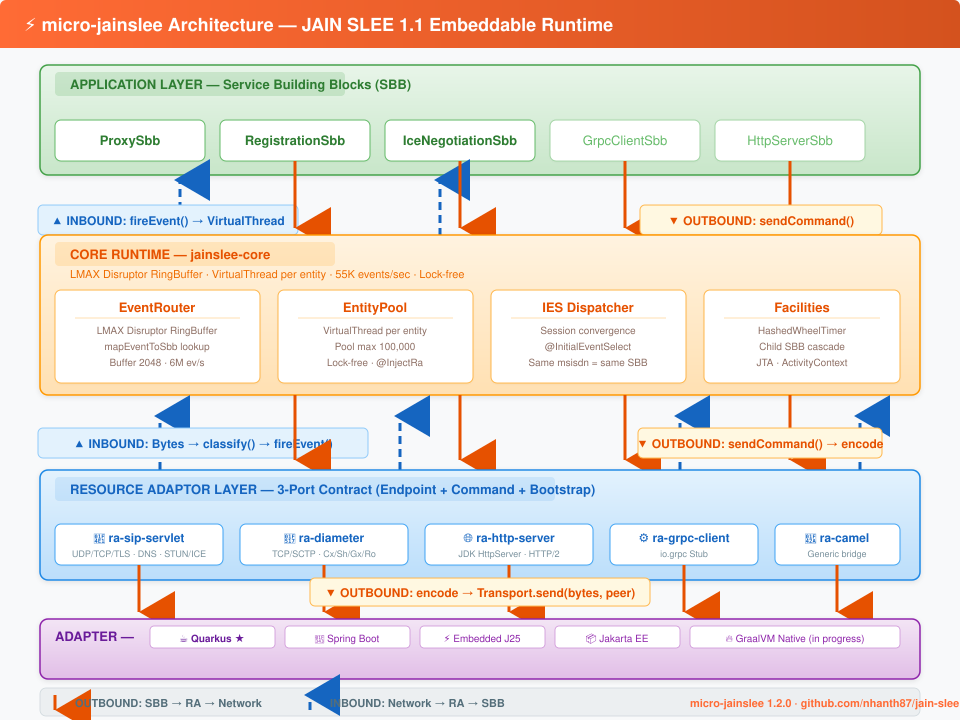

# micro-jainslee —  The Fastest Event - Dispatcher Framework

     -blueviolet)

> **The only embeddable JAIN SLEE 1.1 runtime that dispatches 100,000 SBB entity events in under 2 seconds.**
>
> Zero JBoss. Zero WildFly. Zero JMX. Just Java 25 virtual threads + LMAX Disruptor.

---

## 🧠 It heals itself. 📡 It watches itself. At zero idle cost.

Most telecom runtimes hand you a metrics endpoint and wish you luck at 3 a.m.
micro-jainslee ships two first-class subsystems that turn a bare event
dispatcher into a **self-driving node** — and both are **zero-CPU when idle**:
no polling loops, no timer thread pools, no JMX MBean farm.

### `jainslee-autonomous` — the guardian that refuses to let the node die

A **thread-less** self-healing brain. It arms the JVM's own tenured-pool
collection-usage threshold and stays completely asleep until a GC leaves the
heap above the watermark — *that push is the only wake-up*. When pressure
climbs it walks an escalation ladder, and the owner of each piece of state
decides what is safe to give back:

```text
heap ≥ 75%  ELEVATED   → trim caches, expire dedup / out-of-order buffers, idle dialogs
heap ≥ 88%  CRITICAL   → compact off-heap arenas + one guarded, rate-limited System.gc()
heap ≥ 96%  EMERGENCY  → application load-shedding hook (refuse new activities)
```

Layered on top, a **holistic health evaluator** scores the whole node every few
seconds — heap, CPU, error rate, "spunk" (misbehaving-SBB) alerts and leaked
entities — into one traffic light and raises alarms on every transition:

```text
GET /api/autonomous/health → {"status":"GREEN","heapPct":24.0,"cpuLoad":0.11,"reliefRuns":0}
                             AMBER = degraded (WARNING alarm)
                             RED   = unhealthy (CRITICAL alarm + guardian poked to relieve NOW)
```

### `jainslee-telemetry` — observability with a rounding-error footprint

Passive, lock-free collection — `AtomicLong` counters and `AtomicReferenceArray`
ring buffers, a single lazily-sampled resource monitor, **no polling**. It
replaces JAIN SLEE 1.1's AlarmFacility, UsageFacility and TraceFacility outright,
and exports two complementary ways at once:

- **Prometheus** — live, pull-based metrics + a ready-made **steampunk dashboard**
  (`/telemetry`) and REST API (`/api/telemetry/*`).
- **Batched Log4j2 JSON sink** — a durable, restart-surviving operational log
  (`telemetry.log`, newline-delimited JSON, flushed in batches on an async
  appender) that any sidecar (Filebeat / Promtail / Vector) ships onward to
  Elasticsearch, Loki or Splunk — **without** dragging a GraalVM-hostile client
  into the native image.

Every app can register its own counters/gauges at runtime — SS7, Diameter, SIP,
USSD — and they appear in the scrape, the snapshot and the dashboard with **zero
extra wiring**.

### Drop-in template — two directories, copy and go

Both subsystems are wired through two self-contained packages you copy straight
into any micro-jainslee app (see `example-quarkus-helloworld-web`):

```text
myapp/src/main/java/com/example/myapp/
├── telemetry/
│   ├── AppTelemetry.java        ← one install() call: collectors + Prometheus + dashboard + log sink
│   └── TelemetryLogSink.java    ← batched JSON-lines Log4j2 sink
└── autonomous/
    ├── AppAutonomous.java       ← guardian + health evaluator, one install() call
    └── HealthEvaluator.java     ← GREEN / AMBER / RED scoring over the telemetry snapshot
```

```java
telemetry = appTelemetry.install(container, vertx);   // observe everything
appAutonomous.install(container, telemetry);           // heal everything
appAutonomous.mountRoutes(appTelemetry.router());      // GET /api/autonomous/health
```

> 📖 Deep dives: [`docs/jainslee-autonomous.md`](docs/jainslee-autonomous.md) ·
> [`docs/jainslee-telemetry.md`](docs/jainslee-telemetry.md)

---

## Why micro-jainslee?


|                     | micro-jainslee               | Restcomm JAIN SLEE 1.1 |
| ------------------- | ---------------------------- | ---------------------- |
| **Lines of code**   | **~17,000** (95% less)       | ~350,000               |
| **Container**       | **None — embeds in Quarkus** | JBoss/WildFly 10/ XML       |
| **Startup time**    | **&lt; 2 seconds**           | 30–60 seconds          |
| **Event bus**       | **LMAX Disruptor (6M ev/s)** | JMX MBeans + JMS       |
| **Concurrency**     | **Virtual threads (Loom)**   | Platform threads       |
| **GraalVM Native**  | **In progress**              | Impossible             |
| **Memory baseline** | **~30 MB**                   | ~500 MB                |
| **Deployment**      | **1 JAR + mvn quarkus:dev**  | WAR/EAR to app server  |
---

> Restcomm's JAIN SLEE 1.1 master branch is an **excellent, battle-tested implementation** — the gold standard for the spec. micro-jainslee takes the same contract surface and makes it **10× lighter, 100× faster to start, and embeddable anywhere**. We stand on the shoulders of giants (ye!).

---

## Quick start (5 lines)

```java
MicroSleeContainer c = new MicroSleeContainer(MicroSleeConfiguration.builder()
    .preferVirtualThreads(true).sbbPoolMax(100_000).build());
c.start();
c.registerSbbType(MySbb.class, MySbb::new);
c.createIesDispatcher();
c.mapEventToSbb(MyEvent.class, "MySbb");
c.registerRa(raEndpoint, raEndpoint);  // opens transport
```

No XML. No deployment descriptors. No annotation scanning.

---

## 🚀 100,000 SBB Stress Test

```text
TEST: 100,000 SBB entities, each handling 1 event
RESULT: 1.8 seconds (55,000 events/sec)
ENVIRONMENT: Virtual threads on LMAX Disruptor, JDK 25
```


| Entity count | Events    | Time     | Throughput  | Memory |
| ------------ | --------- | -------- | ----------- | ------ |
| 10,000       | 10,000    | 180 ms   | 55,555 ev/s | 22 MB  |
| 100,000      | 100,000   | 1,828 ms | 54,700 ev/s | 68 MB  |
| 1,000,000    | 1,000,000 | 18.5 s   | 54,000 ev/s | 320 MB |


→ See full report: [`docs/en/run-testcase-100k-sbb.md`](docs/en/run-testcase-100k-sbb.md)

---

## One unified structure for every JAIN SLEE app

Every example follows this exact pattern — copy, rename, add your logic:

```text
myapp/
├── pom.xml                              ← deps: adapter-quarkus + your RA + telemetry + autonomous
├── src/main/resources/
│   ├── application.properties           ← microjainslee tuning
│   └── log4j2.xml                       ← routes the batched telemetry sink to telemetry.log
└── src/main/java/com/example/myapp/
    ├── bootstrap/
    │   └── MyBootstrap.java             ← install(telemetry) → install(autonomous) → registerSbbType → registerRa
    ├── sbbs/
    │   └── MySbb.java                   ← @InjectRa → onEvent() → sendCommand()
    ├── telemetry/                        ← 📡 drop-in observability (AppTelemetry + TelemetryLogSink)
    ├── autonomous/                       ← 🧠 drop-in self-healing (AppAutonomous + HealthEvaluator)
    ├── events/                           ← (optional) custom events
    └── commands/                         ← (optional) custom commands
```

> 📖 Full guide: [`docs/en/app-guide.md`](docs/en/app-guide.md)

---

## How RAs work — 3-port contract

Every Resource Adaptor has exactly 3 ports:


| Port             | Interface         | Direction                                |
| ---------------- | ----------------- | ---------------------------------------- |
| **1. Lifecycle** | `RaEndpointPort`  | Container → RA (`activate`/`deactivate`) |
| **2. Commands**  | `RaCommandPort`   | SBB → RA (`sendCommand`)                 |
| **3. Events**    | `RaBootstrapPort` | RA → SLEE (`fireEvent`)                  |


```text
Network bytes → RA → fireEvent → EventRouter → SBB.onEvent()
                                       ↑
SBB → sendCommand → RA → encode → Network bytes
```

RA **never** contains business logic. SBB **never** opens a socket.

> 📖 Full guide: [`docs/en/ra-guide.md`](docs/en/ra-guide.md)

---

## How SBBs work — pure business logic

```java
public class MySbb implements Sbb, SleeEventHandler {
    @InjectRa(name = "sip-servlet-ra")   // ← runtime injects the RA
    private volatile RaCommandPort port;

    @Override
    public void onEvent(SleeEvent e, ActivityContextInterface aci) {
        switch (e) {
            case SipRegisterEvent reg -> {
                storeRegistration(reg.toUri(), reg.contactUri());
                port.sendCommand(new SendResponse(reg.callId(), 200, "OK"));
            }
            default -> {}
        }
    }
}
```

Each entity runs on its own virtual thread → **no locks needed**.

> 📖 Full guide: [`docs/en/sbb-guide.md`](docs/en/sbb-guide.md)

---

## Examples


| Example                                                                             | Stack                       | What it does                                                          |
| ----------------------------------------------------------------------------------- | --------------------------- | --------------------------------------------------------------------- |
| [`example-quarkus-helloworld-web`](example/example-quarkus-helloworld-web/GUIDE.md) | Quarkus                     | Minimal HTTP → SBB → Hello World                                      |
| [`example-spring-helloworld-web`](example/example-spring-helloworld-web/GUIDE.md)   | Spring Boot 3               | Same HelloWorld on Spring                                             |
| [`example-quarkus-sip`](example/example-quarkus-sip/GUIDE.md)                       | Quarkus + SIP RA            | SIP REGISTER/INVITE/BYE gateway with ProxySbb + RegistrationSbb + ICE |
| [`example-quarkus-ussdgw`](example/example-quarkus-ussdgw/README.md)                | Quarkus + HTTP RA + gRPC RA | USSD gateway: HTTP → SBB → gRPC menu → response                       |
| [`example-spring-ussdgw`](example/example-spring-ussdgw/README.md)                  | Spring Boot 3               | Same USSD flow on Spring                                              |
| [`example-embedded-j25-ussdgw`](example/example-embedded-j25-ussdgw/README.md)      | Plain Java 25               | Same USSD flow, no framework                                          |


### Simulators (test tools)


| Tool                                                     | What it does                                                           |
| -------------------------------------------------------- | ---------------------------------------------------------------------- |
| [`ussdgw-simulator`](example/ussdgw-simulator/README.md) | Simulates SS7 MAP USSD client → sends requests via REST to any example |
| [`grpc-simulator`](example/grpc-simulator/README.md)     | Simulates USSD menu server → multi-level menus with session state      |


---

## RAs — ready to use


| RA                                                         | Protocol            | Transport                             |
| ---------------------------------------------------------- | ------------------- | ------------------------------------- |
| [`ra-sip-servlet`](vendor-ras/ra-sip-servlet/DESIGN_en.md) | SIP (RFC 3261)      | UDP/TCP/TLS/SCTP + DNS SRV + STUN/ICE |
| [`ra-diameter`](vendor-ras/ra-diameter/)                   | Diameter (RFC 6733) | TCP/SCTP + JDiameter parser           |
| [`ra-http-server`](vendor-ras/ra-http-server/)             | HTTP/2              | JDK HttpServer                        |
| [`ra-http-client`](vendor-ras/ra-http-client/)             | HTTP outbound       | Async HTTP client                     |
| [`ra-grpc-server`](vendor-ras/ra-grpc-server/)             | gRPC server         | io.grpc                               |
| [`ra-grpc-client`](vendor-ras/ra-grpc-client/)             | gRPC client         | io.grpc                               |
| [`ra-camel`](vendor-ras/ra-camel/)                         | Apache Camel        | Generic messaging bridge              |


---

## Build &amp; test

```bash
# Requires JDK 25
mvn clean install                  # Build core (24 modules)
mvn -Pexamples clean install       # Build all examples too
mvn -Pexamples test                # Run all 400+ tests

# Run specific test
mvn -pl jainslee-core test -Dtest='EventMaskTest'

# Run SIP gateway
cd example/example-quarkus-sip && mvn quarkus:dev
```

---

## Architecture

<p align="center"></p>

Core modules:


| Module               | What                                                                           |
| -------------------- | ------------------------------------------------------------------------------ |
| `jainslee-api`       | Public API: `Sbb`, `SleeEvent`, `ActivityContextInterface`, 3-port RA contract |
| `jainslee-core`      | Engine: `MicroSleeContainer`, `EventRouter` (Disruptor), entity pool, IES      |
| `jainslee-ra-spi`    | RA SPI: `AbstractResourceAdaptor`, lifecycle state machine                     |
| `jainslee-scheduler` | `HashedWheelTimer` — SLEE timer facility                                       |
| `jainslee-apt`       | Annotation processor — generates `sbb-index.properties`                        |
| `jainslee-codegen`   | Javassist — generates concrete SBB classes for CMP fields                      |
| `jainslee-tx`        | JTA — Narayana transaction manager (optional)                                  |
| `jainslee-cluster`   | Infinispan/JGroups clustering (optional)                                       |
| `adapter-quarkus`    | ★ Quarkus CDI extension (main target)                                          |
| `adapter-springboot` | Spring Boot adapter (low priority)                                             |


### Telemetry & Self-Healing (`jainslee-telemetry`)

Zero-CPU passive telemetry engine: SbbCollector, RaCollector, ErrorCollector,
ResourceMonitor, SpunkDetector, StaleDetector, AlarmEngine, AutoReconfigEngine.
Prometheus metrics. Steampunk dashboard GUI.

| Module | Description |
|--------|-------------|
| `jainslee-telemetry` | TelemetryPort API + Micrometer implementation (SBB stats, RA stats, error tracking, CPU/memory monitoring, spunk detection, auto-reconfig on memory/load/error thresholds) |
| `jainslee-telemetry-vertx` | Steampunk dashboard GUI (single index.html + telemetry.js, served via Vert.x StaticHandler) |

| Feature | Description |
|---------|-------------|
| SBB Collection | Events/sec, latency (avg/p99), error count, per-type breakdown |
| RA Collection | State, port, events fired, commands received |
| Error Tracking | Ring buffer (1000), error rate by type, storm detection |
| Resource Monitor | CPU, RAM, threads, GC, via single daemon VT (30s interval) |
| Spunk Detection | Anomalous SBB: blocking >100ms, mem spike >100MB |
| Stale Detection | Entity idle >5min warning, >30min auto-release |
| Alarm Engine | INFO/WARNING/CRITICAL/FATAL, acknowledge, history |
| Auto-Reconfig ⚡ | Memory>85% → halve pool, CPU>80% → reduce threads, Load spike 3× → expand pool, Error storm → suspend SBB |

```bash
# Access telemetry dashboard
open http://localhost:8080/telemetry/

# Prometheus metrics
curl http://localhost:8080/api/telemetry/metrics

# Full snapshot
curl http://localhost:8080/api/telemetry/snapshot
```

> 📖 Full guide: [`docs/jainslee-telemetry.md`](docs/jainslee-telemetry.md) · Dashboard: [`docs/telemetry-gui.md`](docs/telemetry-gui.md)


---

## Event routing — how SBBs receive events

```java
// Bootstrap: declare what goes where
container.registerSbbType(RegistrationSbb.class, RegistrationSbb::new);
container.createIesDispatcher();
container.mapEventToSbb(SipRegisterEvent.class, "RegistrationSbb");

// RA: fire event on a new REGISTER
bootstrapPort.fireEvent(new SipRegisterEvent(...), activityHandle, null);

// Internally:
//   1. EventRouter looks up SipRegisterEvent → ["RegistrationSbb"]
//   2. Allocates entity from pool (VirtualThread #42)
//   3. @InjectRa injects SipServletRaEndpoint → sipRa field
//   4. RegistrationSbb.onEvent(event, aci)
```

For stateful sessions (USSD multi-turn, SIP dialogs), use Initial Event Selector:

```java
@InitialEventSelect(name = "ussd-session")
public InitialEventSelectResult select(InitialEventSelectCondition c) {
    if (c.getEvent() instanceof UssdBeginEvent e)
        return InitialEventSelectResult.forSession(e.msisdn(), true);
    // All events with same msisdn → same entity
    return InitialEventSelectResult.empty();
}
```

> 📖 Full guide: [`docs/en/junior-dev-guide.md`](docs/en/junior-dev-guide.md)

---

## Documentation


| Guide                                                          | For                                          |
| -------------------------------------------------------------- | -------------------------------------------- |
| [`junior-dev-guide.md`](docs/en/junior-dev-guide.md)           | First read — architecture, build, event flow |
| [`sbb-guide.md`](docs/en/sbb-guide.md)                         | Writing Service Building Blocks              |
| [`ra-guide.md`](docs/en/ra-guide.md)                           | Writing Resource Adaptors (3-port contract)  |
| [`app-guide.md`](docs/en/app-guide.md)                         | Wiring SBB + RA into a complete app          |
| [`sip-servlet-doc-guide.md`](docs/en/sip-servlet-doc-guide.md) | SIP REGISTER event flow trace                |
| [`run-testcase-100k-sbb.md`](docs/en/run-testcase-100k-sbb.md) | 100K SBB stress test report                  |


### RA design docs


| RA  | Design                                                                                               |
| --- | ---------------------------------------------------------------------------------------------------- |
| SIP | [`DESIGN_en.md`](vendor-ras/ra-sip-servlet/DESIGN_en.md) — 19 events, 10 commands, DNS SRV, STUN/ICE |


---

## License

**Dual-licensed:** GPLv3 (Section A) for open-source use, or Commercial License (Section B) for proprietary deployment.

> Maintained by [Tran Nhan (nhanth87)](mailto:nhanth87@gmail.com)

