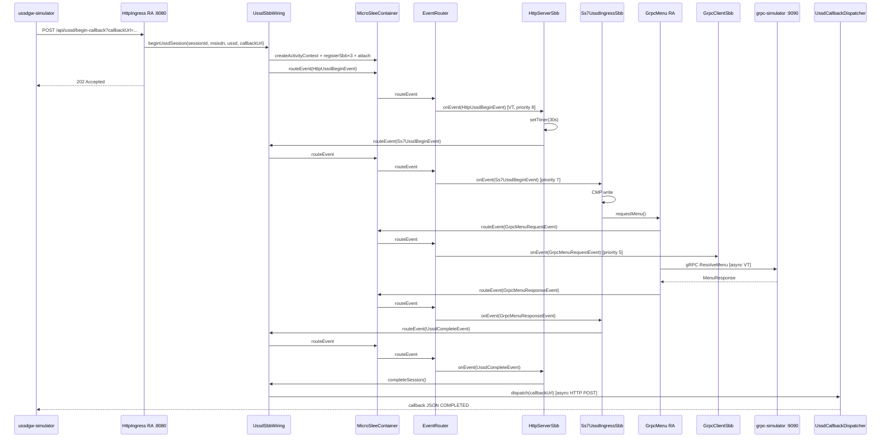

# Hướng dẫn micro-jainslee cho Junior Developer

> Tài liệu này giải thích **micro-jainslee 1.2.0 — Perfect Core (S1–S5)** hoạt động thế nào, cách tích hợp với **Quarkus**, và luồng code khi **fire event**.  
> Demo tham chiếu: `example/example-quarkus/` (đọc kỹ nhất), `example/example-embedded-j25/`, `example/grpc-simulator/`, `example/ussdgw-simulator/`.  
> **Status (2026-06-28):** Perfect Core S1–S5 shipped — `jainslee-bom`, `jainslee-api`, `jainslee-ra-spi`, `jainslee-tx`, `jainslee-codegen`, `jainslee-cluster`, `jainslee-core`, `jainslee-tck-harness` — all-green, ~430+ tests.

---

## Mục lục

1. [JAIN SLEE là gì?](#1-jain-slee-là-gì)
2. [micro-jainslee khác gì Mobicents?](#2-micro-jainslee-khác-gì-mobicents)
3. [Các khái niệm cốt lõi](#3-các-khái-niệm-cốt-lõi)
4. [Cấu trúc module trong repo](#4-cấu-trúc-module-trong-repo)
5. [App có `main()` ở đâu?](#5-app-có-main-ở-đâu)
6. [Khởi động container — ai gọi `start()`?](#6-khởi-động-container--ai-gọi-start)
7. [example-quarkus — kiến trúc tổng quan](#7-example-quarkus--kiến-trúc-tổng-quan)
8. [Resource Adaptors (RA)](#8-resource-adaptors-ra)
9. [Events — pipeline đầy đủ](#9-events--pipeline-đầy-đủ)
   9.5. [IES (Initial Event Selector)](#95-ies-initial-event-selector--perfect-core-s5)
10. [SBBs — ai làm gì?](#10-sbbs--ai-làm-gì)
11. [Profile, timer, CMP](#11-profile-timer-cmp)
12. [Luồng end-to-end (sequence diagram)](#12-luồng-end-to-end-sequence-diagram)
13. [Khi fire event, code nào chạy? (call stack)](#13-khi-fire-event-code-nào-chạy-call-stack)
14. [Tích hợp Quarkus ↔ JAIN SLEE](#14-tích-hợp-quarkus--jain-slee)
15. [SBB lifecycle và virtual thread](#15-sbb-lifecycle-và-virtual-thread)
16. [APT auto-deploy lúc compile](#16-apt-auto-deploy-lúc-compile)
17. [Bản đồ file quan trọng](#17-bản-đồ-file-quan-trọng)
18. [Chạy thử nhanh](#18-chạy-thử-nhanh)
19. [FAQ cho junior](#19-faq-cho-junior)

---

## 1. JAIN SLEE là gì?

**JAIN SLEE** (Java API for Integrated Networks — Service Logic Execution Environment) là chuẩn **môi trường thực thi logic dịch vụ viễn thông** theo mô hình **event-driven** (hướng sự kiện).

Thay vì viết một luồng `if/else` dài từ đầu đến cuối, bạn chia logic thành:

| Thành phần | Vai trò | Ví dụ trong demo USSD (example-quarkus) |
|-----------|---------|------------------------------------------|
| **SBB** (Service Building Block) | Khối xử lý business logic | `HttpServerSbb`, `Ss7UssdIngressSbb`, `GrpcClientSbb` |
| **Event** | Message nội bộ giữa các SBB / RA | `HttpUssdBeginEvent`, `Ss7UssdBeginEvent`, `GrpcMenuResponseEvent` |
| **RA** (Resource Adaptor) | Cầu nối với thế giới bên ngoài | `HttpIngressResourceAdaptor`, `GrpcMenuResourceAdaptor` |
| **ACI** (Activity Context Interface) | Context của một phiên/cuộc gọi | Một session USSD = một ACI (key = `sessionId`) |
| **Container (SLEE)** | Router event, quản lý SBB, timer, profile | `MicroSleeContainer` |

**Mô hình event-driven:**

```
Bên ngoài (HTTP/gRPC)  →  RA  →  fire Event  →  Container  →  SBB.onEvent()
SBB A                  →  fire Event khác  →  Container  →  SBB B.onEvent()
```

SBB **không gọi trực tiếp** SBB khác. Mọi giao tiếp qua **`container.routeEvent()`** (hoặc `UssdSbbWiring.routeEvent()` — wrapper mỏng).

---

## 2. micro-jainslee khác gì Mobicents?

| | Mobicents / RestComm (production USSD 7.3) | micro-jainslee (R&D) |
|---|---------------------------------------------|----------------------|
| Mục đích | Production gateway trên WildFly | Embed trong app Java/Quarkus/Spring |
| Phụ thuộc | JBoss, JMX, cluster HA… | Chỉ JVM + Disruptor |
| Chạy ở đâu | WildFly server | Trong process của app bạn |
| TCK / JSR-77 | Có (production path) | **Không** — R&D only |

> **Lưu ý production:** Demo trong `example/` **không được deploy** lên USSD gateway production. Production vẫn dùng Mobicents container.

---

## 3. Các khái niệm cốt lõi

### 3.1 SBB (Service Building Block)

Class Java implement `Sbb` + `SleeEventHandler`. Nhận event qua:

```java
@Override
public void onEvent(SleeEvent event, ActivityContextInterface aci) {
    if (event instanceof HttpUssdBeginEvent) {
        // xử lý...
    }
}
```

Lifecycle callbacks:

- `sbbCreate()` — tạo instance
- `sbbActivate()` — kích hoạt
- `sbbPassivate()` — tạm ngưng
- `sbbRemove()` — hủy

### 3.2 Event

POJO implement `SleeEvent`, annotate `@EventType`:

```java
@EventType(name = "HttpUssdBegin", vendor = "com.example.ussddemo.quarkus", version = "1.0")
public final class HttpUssdBeginEvent implements SleeEvent { ... }
```

APT scan `@EventType` lúc compile → ghi vào `sbb-index.properties`.

### 3.3 ACI (Activity Context Interface)

Đại diện **một phiên** USSD. Trong demo:

- Implementation: `InMemoryActivityContext`
- Key ACI = `sessionId` (UUID do HTTP RA sinh ra)
- Các SBB được **attach** vào ACI → cùng nhận event trên context đó

### 3.4 RA (Resource Adaptor)

Trong JAIN SLEE thật, RA lắng nghe SS7/SIP/HTTP và fire event vào container.

Trong **example-quarkus**, có **2 RA thật** (class Java implement `ResourceAdaptor`):

| RA | File | Vai trò |
|----|------|---------|
| HTTP ingress | `HttpIngressResourceAdaptor` | JDK `HttpServer` port **8080**, nhận POST từ `ussdgw-simulator` |
| gRPC menu | `GrpcMenuResourceAdaptor` | Gọi `grpc-simulator:9090`, fire request/response events |

**Không còn** REST Quarkus làm entry USSD. Quarkus REST (`HealthResource`) chỉ phục vụ admin trên port **18080**.

### 3.5 Deployable Unit (DU)

```java
@DeployableUnit(
    name = "UssdGatewayDemo",
    sbbs = { HttpServerSbb.class, Ss7UssdIngressSbb.class, GrpcClientSbb.class })
public final class UssdGatewayDemoDu { }
```

---

## 4. Cấu trúc module trong repo

### 4.1 Perfect Core stack (S1–S5, 2026-06-28)

```
jain-slee/jain-slee/
├── bom/                       # jainslee-bom — BOM POM quản version cho cả repo (S1)
├── jainslee-api/              # Public API: Sbb, SleeEvent, TimerPort, @EventType, @InitialEventSelect, ChildRelation<T>…
├── jainslee-ra-spi/           # RA SPI + RaEntityStateMachine (S4) + SleeEndpoint abstraction
├── jainslee-tx/               # Transaction abstraction + CMP transaction bridge (S2)
├── jainslee-codegen/          # Javassist deploy-time codegen — ConcreteSbbGenerator (S2)
├── jainslee-cluster/          # DistributedSbbEntityPool + CMP snapshot replication (S3, optional)
├── jainslee-core/             # MicroSleeContainer, EventRouter, IES dispatcher, CascadeRemover…
├── jainslee-tck-harness/      # JAIN SLEE 1.1 §6.5 / §8 TCK harness skeleton (S5, R&D)
├── jainslee-apt/              # Annotation processor → sbb-index.properties (compile-time)
├── jainslee-scheduler/        # Timer (HashedWheelTimer + HierarchicalTimingWheel)
├── adapters/
│   ├── adapter-quarkus/       # Quarkus CDI extension
│   ├── adapter-springboot/    # Spring Boot starter
│   └── adapter-jakartaee/     # Jakarta EE / WildFly embed
└── example/
    ├── example-quarkus/       # Quarkus + adapter-quarkus  ← đọc file này trước
    ├── example-embedded-j25/  # Plain Java 25
    ├── example-spring/        # Spring Boot
    ├── grpc-simulator/        # gRPC AS ngoài process (:9090)
    └── ussdgw-simulator/      # HTTP client giả USSD GW
```

**Perfect Core dependency chain:**

```
                ┌──────────────────────┐
                │  example-quarkus /   │   ← app code (host process)
                │  example-spring …    │
                └──────────┬───────────┘
                           │
                ┌──────────▼───────────┐
                │   adapter-* (CDI)    │   ← Quarkus/Spring/JakartaEE glue
                └──────────┬───────────┘
                           │
                ┌──────────▼───────────┐
                │   jainslee-core      │   ← MicroSleeContainer, EventRouter, IES, CascadeRemover
                └─┬──────┬──────┬──────┘
                  │      │      │
        ┌─────────▼┐ ┌───▼───┐ ┌▼──────────────┐
        │  jainslee │ │jains- │ │  jainslee-    │
        │   -tx    │ │ lee-  │ │  codegen      │   ← (optional) deploy-time Javassist
        │  (JTA)   │ │ra-spi │ │  ConcreteSbb  │
        └────┬─────┘ └───┬───┘ └───────────────┘
             │           │
             └─────┬─────┘
                   │
        ┌──────────▼───────────┐
        │    jainslee-api      │   ← public types: Sbb, SleeEvent, ChildRelation<T>…
        └──────────┬───────────┘
                   │
        ┌──────────▼───────────┐
        │   jainslee-bom       │   ← version alignment (parent BOM)
        └──────────────────────┘

  Side-cars (optional, never on app hot path):
    ├─ jainslee-cluster   (P2.x, off by default)
    ├─ jainslee-apt       (compile-time only)
    └─ jainslee-tck-harness (R&D, off by default)
```

**Trái tim runtime:** `jainslee-core/.../MicroSleeContainer.java` + `EventRouter.java`.

**Version alignment:** Tất cả module pin version qua `jainslee-bom`. Khi upgrade, đổi version ở BOM là tất cả module con pick up cùng revision — tránh được lỗi `NoSuchMethodError` kiểu `api-1.3 vs core-1.2`.

---

## 5. App có `main()` ở đâu?

**micro-jainslee không có `main()` riêng.** Nó là **thư viện embed** — app host gọi `MicroSleeContainer.start()`.

| Variant | Entry point | Ai start SLEE? |
|---------|-------------|----------------|
| **example-embedded-j25** | `EmbeddedUssdMain.main()` | Gọi trực tiếp trong `main()` |
| **example-quarkus** | Quarkus bootstrap | `UssdDemoBootstrap.onStart(StartupEvent)` |
| **example-spring** | `SpringApplication.run(...)` | `UssdDemoBootstrap` `@PostConstruct` |
| **ussdgw-simulator** | `Ss7UssdSimulatorMain.main()` | **Không** chạy SLEE — chỉ HTTP client |
| **grpc-simulator** | `GrpcSimulatorMain.main()` | **Không** chạy SLEE — chỉ gRPC server |

### Quarkus — không có `main()` viết tay

Quarkus dùng `quarkus-maven-plugin` generate bootstrap. SLEE + RA start qua CDI observer:

```java
// UssdDemoBootstrap.java
void onStart(@Observes StartupEvent ev) {
    microSleeContainer().start();
    wiring.install(...);
    registerSbbTypes(c);
    seedProfiles(c);
    bootstrapResourceAdaptors(c, new GrpcMenuClient(grpcHost, grpcPort));
}
```

---

## 6. Khởi động container — ai gọi `start()`?

`MicroSleeContainer.start()` làm:

1. Prewarm pool SBB virtual thread
2. Set state = `STARTED`
3. **`autoDeployFromClasspathIndex()`** — đọc `META-INF/microjainslee/sbb-index.properties`

```
container.start()
    ├── sbbEntityPool.prewarm()
    └── autoDeployFromClasspathIndex()
            ├── đọc sbb-index.properties (APT generate lúc compile)
            ├── instantiate SBB classes (@SbbAnnotation)
            ├── registerSbb(name, instance)
            └── activate DeployableUnit services
```

Sau khi start, container sẵn sàng nhận `routeEvent()`.

**Lưu ý demo:** Mỗi session USSD vẫn **register SBB thủ công** trong `UssdSbbWiring.beginUssdSession()` vì cần inject `UssdSbbWiring` qua constructor. `registerSbbType()` đăng ký factory cho pooling tương lai / `acquireEntity()`.

---

## 7. example-quarkus — kiến trúc tổng quan

Demo mô phỏng **USSD Gateway** bên trong SLEE. **Không có SS7 wire thật** — `ussdgw-simulator` đóng vai GW bên ngoài qua HTTP.

```
┌─────────────────────────────────────────────────────────────────────┐
│  ussdgw-simulator (HTTP client, ngoài process)                      │
│       POST /api/ussd/begin-callback?callbackUrl=...                 │
└───────────────────────────────┬─────────────────────────────────────┘
                                │ HTTP :8080
                                ▼
┌─────────────────────────────────────────────────────────────────────┐
│  HttpIngressResourceAdaptor  (HTTP RA — JDK HttpServer)             │
│       wiring.beginUssdSession() → create ACI + attach SBBs          │
│       container.routeEvent(HttpUssdBeginEvent)                      │
└───────────────────────────────┬─────────────────────────────────────┘
                                │ Disruptor EventRouter
                                ▼
┌─────────────────────────────────────────────────────────────────────┐
│  HttpServerSbb (priority 8)                                         │
│    → setTimer (session timeout)                                     │
│    → routeEvent(Ss7UssdBeginEvent)                                  │
└───────────────────────────────┬─────────────────────────────────────┘
                                ▼
┌─────────────────────────────────────────────────────────────────────┐
│  Ss7UssdIngressSbb (priority 7) — internal MAP/USSD leg             │
│    → CMP write (sessionId, msisdn, menuTier)                        │
│    → grpcRa().requestMenu()                                         │
└───────────────────────────────┬─────────────────────────────────────┘
                                │
                                ▼
┌─────────────────────────────────────────────────────────────────────┐
│  GrpcMenuResourceAdaptor (gRPC RA)                                  │
│    → routeEvent(GrpcMenuRequestEvent)  ← GrpcClientSbb observes     │
│    → async gRPC call → grpc-simulator:9090                          │
│    → routeEvent(GrpcMenuResponseEvent)                              │
└───────────────────────────────┬─────────────────────────────────────┘
                                ▼
┌─────────────────────────────────────────────────────────────────────┐
│  Ss7UssdIngressSbb                                                    │
│    → build USSD text → routeEvent(UssdCompleteEvent)                │
└───────────────────────────────┬─────────────────────────────────────┘
                                ▼
┌─────────────────────────────────────────────────────────────────────┐
│  HttpServerSbb → completeSession() → UssdCallbackDispatcher         │
│       async POST callbackUrl → ussdgw-simulator                     │
└─────────────────────────────────────────────────────────────────────┘
```

### Package layout (example-quarkus)

```
com.example.ussddemo.quarkus/
├── bootstrap/UssdDemoBootstrap.java   ← CDI startup: container, RA, profile seed
├── service/
│   ├── UssdSbbWiring.java           ← cầu nối RA ↔ SBB ↔ container
│   ├── UssdSessionStore.java        ← trạng thái session (PROCESSING/COMPLETED)
│   └── UssdCallbackDispatcher.java  ← HTTP callback async
├── ra/
│   ├── HttpIngressResourceAdaptor.java
│   └── GrpcMenuResourceAdaptor.java
├── sbbs/
│   ├── HttpServerSbb.java
│   ├── Ss7UssdIngressSbb.java
│   └── GrpcClientSbb.java
├── events/                          ← 5 event types
├── profile/UssdSubscriberProfile.java
├── grpc/GrpcMenuClient.java         ← client tới grpc-simulator
├── rest/HealthResource.java         ← Quarkus admin only (:18080)
└── du/UssdGatewayDemoDu.java
```

---

## 8. Resource Adaptors (RA)

### 8.1 HttpIngressResourceAdaptor — HTTP ingress RA

**File:** `ra/HttpIngressResourceAdaptor.java`

| Thuộc tính | Giá trị |
|------------|---------|
| Port | `ussd.http.port` = **8080** |
| Transport | JDK `com.sun.net.httpserver.HttpServer` |
| Implements | `ResourceAdaptor` |

**Endpoints:**

| Method | Path | Mô tả |
|--------|------|-------|
| POST | `/api/ussd/begin-callback?callbackUrl=...` | Bắt đầu session + callback bất đồng bộ |
| POST | `/api/ussd/begin` | Bắt đầu session (polling qua GET session) |
| GET | `/api/ussd/sessions/{id}` | Trạng thái session |
| GET | `/health` | Health check |

**Luồng khi nhận POST:**

```
1. Parse JSON body → msisdn, ussdString
2. Sinh sessionId = UUID
3. wiring.beginUssdSession(sessionId, msisdn, ussdString, callbackUrl)
4. Trả 202 Accepted + JSON {"sessionId":"...","status":"PROCESSING"}
```

HTTP RA delegate sang `UssdSbbWiring.beginUssdSession()` — tạo ACI, attach SBB, fire `HttpUssdBeginEvent`.

### 8.2 GrpcMenuResourceAdaptor — gRPC RA

**File:** `ra/GrpcMenuResourceAdaptor.java`

| Thuộc tính | Giá trị |
|------------|---------|
| Upstream | `GrpcMenuClient` → `grpc.host:grpc.port` (default `127.0.0.1:9090`) |
| Worker pool | Virtual threads (`newVirtualThreadPerTaskExecutor`) |

**Method chính:** `requestMenu(sessionId, msisdn, ussdString)`

```
1. Lookup ACI theo sessionId
2. routeEvent(GrpcMenuRequestEvent)  → GrpcClientSbb.onEvent() log/observe
3. workerPool.submit → client.resolveMenu()  [async, không block SBB thread]
4. routeEvent(GrpcMenuResponseEvent) → Ss7UssdIngressSbb.onEvent()
```

Đây là pattern RA điển hình: **fire event trước** (request), **gọi I/O bất đồng bộ**, **fire event sau** (response).

### 8.3 RA lifecycle — `RaEntityStateMachine` + `SleeEndpointImpl` (Perfect Core S4)

Perfect Core S4 chuẩn hoá RA lifecycle qua một **state machine 5 trạng thái** (`jainslee-ra-spi`) và một **endpoint abstraction** (`SleeEndpointPortImpl`, trong `jainslee-core`) để RA không cần biết về Disruptor ring buffer.

#### 8.3.1 State machine — `RaEntityStateMachine.State`

```
       ┌──────────────┐
       │  UNCONFIGURED│ ◄────────────────┐
       └──────┬───────┘                  │
              │ configure()              │
              ▼                          │ unconfigure()
       ┌──────────────┐                  │
       │   INACTIVE   │                  │
       └──────┬───────┘                  │
              │ activityStarted()        │
              ▼                          │
       ┌──────────────┐                  │
       │    ACTIVE    │                  │
       └──────┬───────┘                  │
              │ activityEnded()          │
              ▼                          │
       ┌──────────────┐                  │
       │  STOPPING    │                  │
       └──────┬───────┘                  │
              │ stoppingComplete()      │
              ▼                          │
       ┌──────────────┐                  │
       │   STOPPED    │ ─────────────────┘
       └──────────────┘
```

| State | Ý nghĩa | RA có thể |
|-------|---------|-----------|
| `UNCONFIGURED` | Mới tạo / đã unconfigure | Đọc config, không có activity |
| `INACTIVE` | Đã `raConfigure()` nhưng chưa start activity | Nhận event init, attach resource |
| `ACTIVE` | Có ít nhất 1 activity đang chạy | Fire event, nhận I/O |
| `STOPPING` | Đang drain activity | Từ chối activity mới |
| `STOPPED` | Đã dừng hoàn toàn | Cleanup resource |

> Bất kỳ transition sai (e.g., `ACTIVE → INACTIVE`) sẽ throw `IllegalStateException`. Đây là test invariant của `RaEntityStateMachineTest`.

#### 8.3.2 Wire RA qua `RaEntityStateMachine` + `SleeEndpointPortImpl`

```java
// 1. Build state machine cho từng RA entity
RaEntityStateMachine sm = new RaEntityStateMachine("HttpIngressRA");
sm.configure();   // UNCONFIGURED → INACTIVE

// 2. Tạo SleeEndpointImpl — RA fire event qua đây, không gọi Disruptor trực tiếp
SleeEndpointPortImpl endpoint = new SleeEndpointPortImpl(container, "HttpIngressRA");

// 3. Inject endpoint vào RA
httpRa.setEndpoint(endpoint);

// 4. Khi RA start activity → state advance + endpoint expose ACI
sm.activityStarted();
ActivityContextInterface aci = endpoint.startActivity(handle, httpExchange);

// 5. RA fire event — qua endpoint, thread-safe với Disruptor
endpoint.fireEvent(handle, new HttpUssdBeginEvent(sessionId, msisdn, ...));

// 6. Shutdown: drain activity rồi unconfigure
sm.activityEnded();
sm.stoppingComplete();
sm.unconfigure();
```

#### 8.3.3 Vì sao state machine quan trọng?

| Trước (1.1.0) | Sau (1.2.0 Perfect Core S4) |
|---|---|
| RA dùng `RaBootstrapContextImpl`, không có guard state | `RaEntityStateMachine` enforce đúng 5-state transition |
| RA gọi `container.routeEvent(...)` trực tiếp | RA chỉ biết `SleeEndpointPortImpl.fireEvent(...)` — RA không cần biết về Disruptor |
| Test phải mock toàn bộ container | Test state machine thuần túy, không cần container (15+ tests) |
| Lifecycle bug rất khó debug | Mọi sai transition throw `IllegalStateException` kèm from→to |

#### 8.3.4 Shutdown sequence (`ShutdownEvent`)

```
ShutdownEvent
    ↓
raInactive()           ← RaEntityStateMachine: ACTIVE → STOPPING
    ↓ (drain in-flight activities)
raUnconfigure()        ← RaEntityStateMachine: STOPPING → UNCONFIGURED
    ↓
container.stop()       ← MicroSleeContainer: STARTED → STOPPED
```

---

## 9. Events — pipeline đầy đủ

Demo có **5 event types**. Chúng tạo thành pipeline một chiều:

```
HttpUssdBeginEvent
    → Ss7UssdBeginEvent
        → GrpcMenuRequestEvent  (RA fire, không qua SBB chain)
        → GrpcMenuResponseEvent (RA fire sau gRPC)
    → UssdCompleteEvent
```

### Bảng chi tiết

| # | Event | Ai fire | Ai xử lý | Hành động |
|---|-------|---------|----------|-----------|
| 1 | `HttpUssdBeginEvent` | `UssdSbbWiring.beginUssdSession()` | `HttpServerSbb` | Log begin, **set session timer**, route sang SS7 leg |
| 2 | `Ss7UssdBeginEvent` | `HttpServerSbb` | `Ss7UssdIngressSbb` | **CMP write**, gọi `grpcRa().requestMenu()` |
| 3 | `GrpcMenuRequestEvent` | `GrpcMenuResourceAdaptor` | `GrpcClientSbb` | Log/observe (child SBB — RA thực hiện gRPC call) |
| 4 | `GrpcMenuResponseEvent` | `GrpcMenuResourceAdaptor` | `Ss7UssdIngressSbb` | Ghép USSD text từ menu + tier → fire complete |
| 5 | `UssdCompleteEvent` | `Ss7UssdIngressSbb` | `HttpServerSbb` | `completeSession()` → callback HTTP |

### Code mẫu từng event

**HttpUssdBeginEvent** — chứa profile tier đã resolve:

```java
// events/HttpUssdBeginEvent.java
@EventType(name = "HttpUssdBegin", ...)
public final class HttpUssdBeginEvent implements SleeEvent {
    // sessionId, msisdn, ussdString, callbackUrl, menuTier
}
```

**Ss7UssdBeginEvent** — internal MAP leg (không có callbackUrl):

```java
// HttpServerSbb.onHttpBegin()
wiring.routeEvent(new Ss7UssdBeginEvent(
    event.getSessionId(), event.getMsisdn(), event.getUssdString(),
    event.getMenuTier()), aci);
```

**GrpcMenuResponseEvent → UssdCompleteEvent:**

```java
// Ss7UssdIngressSbb.onGrpcResponse()
String ussdText = "USSD menu for session " + event.getSessionId()
    + " (tier " + tier + "):\n" + menu;
wiring.routeEvent(new UssdCompleteEvent(event.getSessionId(), ussdText), aci);
```

---

## 9.5 IES (Initial Event Selector) — Perfect Core S5

IES là cơ chế **chọn SBB đầu tiên** sẽ nhận event khi một activity bắt đầu, dựa trên **convergence key** trích từ event payload. Trong JAIN SLEE 1.1 §8, đây là bắt buộc cho initial event — chỉ một root SBB được chọn cho mỗi activity.

#### IES API

```java
// Trên abstract SBB class — dùng annotation
@InitialEventSelect(
    eventType = HttpUssdBeginEvent.class,
    convergenceKeyMethod = "getSessionId"   // method name trên event → trả key
)
public abstract class HttpServerSbb implements Sbb { ... }
```

Khi RA fire `HttpUssdBeginEvent(sessionId="abc-123", ...)`:
1. Container gọi `InitialEventSelectorDispatcher.dispatch(event, aci)`
2. Dispatcher gọi `convergenceKeyMethod` trên event → `"abc-123"`
3. Tra cứu SBB đã được install với IES annotation cho event type này → `HttpServerSbb`
4. Container acquire/create SBB entity, attach ACI, deliver event.

#### Convergence key

Là một giá trị Java (String, Long, custom) dùng để **nhóm các event của cùng một session**. Cho USSD, `sessionId` là convergence key tự nhiên. Cho USSD production thật với nhiều dialog, convergence key có thể là `(msisdn + dialogId)` tuple.

#### USSD example — IES flow

```
HttpIngress RA fires HttpUssdBeginEvent(sessionId="abc-123", msisdn="251911000001")
            │
            ▼
InitialEventSelectorDispatcher.dispatch(event, aci)
            │  // getSessionId() → "abc-123"
            ▼
Container: lookup SBB type via @InitialEventSelect annotation
            │  // matches: HttpServerSbb
            ▼
Container.acquireSbbEntity("abc-123/http", HttpServerSbb.class)
            │  // attach to ACI
            ▼
HttpServerSbb.onEvent(HttpUssdBeginEvent, aci)  [VT, priority 8]
```

#### IES tests

- `InitialEventSelectResultTest` — verify convergence key extraction (12 tests)
- `InitialEventSelectorDispatcherTest` — verify SBB selection + dispatch (10+ tests)
- Custom convergence: `InitialEventSelectorCustomizer` cho phép override default lookup logic.

#### Vì sao quan trọng?

Trong micro-jainslee 1.1.0, demo phải **tự gọi** `wiring.beginUssdSession()` để wire SBB. Với IES (1.2.0), container tự chọn root SBB dựa trên annotation — code gọn hơn và đúng spec hơn.

---

## 10. SBBs — ai làm gì?

### 10.1 HttpServerSbb — GW-facing entry

**File:** `sbbs/HttpServerSbb.java`  
**Priority:** 8 (cao nhất trên ACI)  
**SBB ID per session:** `{sessionId}/http`

| Event nhận | Hành động |
|------------|-----------|
| `HttpUssdBeginEvent` | Set timer qua `TimerPort`, route `Ss7UssdBeginEvent` |
| `UssdCompleteEvent` | `wiring.completeSession()` → callback |
| `TimerFiredEvent` | Session timeout → `failSession()` |

Đây là SBB **đối diện với HTTP GW** — normalize session, quản lý timer, hoàn tất callback.

### 10.2 Ss7UssdIngressSbb — internal MAP/USSD leg

**File:** `sbbs/Ss7UssdIngressSbb.java`  
**Priority:** 7  
**SBB ID:** `{sessionId}/ss7`  
**Extends:** `CmpBackedSbb` (CMP fields)

| Event nhận | Hành động |
|------------|-----------|
| `Ss7UssdBeginEvent` | CMP write, delegate menu lookup tới gRPC RA |
| `GrpcMenuResponseEvent` | Build USSD response text, fire `UssdCompleteEvent` |

**Vai trò quan trọng:** Trong production, SBB này nhận event từ **SS7 RA** (`MAP-Open`, `MAP-Process-Unstructured-SS-Request`). Trong demo, nó nhận `Ss7UssdBeginEvent` từ `HttpServerSbb` vì GW bên ngoài chỉ gửi HTTP.

```
ussdgw-simulator  ≈  external SS7/USSD GW (HTTP only)
HttpServerSbb     ≈  GW normalization layer
Ss7UssdIngressSbb ≈  MAP USSD service logic (inside SLEE)
```

### 10.3 GrpcClientSbb — child SBB

**File:** `sbbs/GrpcClientSbb.java`  
**Priority:** 5  
**SBB ID:** `{sessionId}/grpc`

| Event nhận | Hành động |
|------------|-----------|
| `GrpcMenuRequestEvent` | Log/observe — **gRPC call thực tế do RA thực hiện** |

Child SBB minh họa pattern JAIN SLEE: RA fire event, child SBB subscribe để audit/hook. Logic gRPC nằm trong `GrpcMenuResourceAdaptor`.

### 10.4 Child SBB & CascadeRemover (Perfect Core S3)

Trong JAIN SLEE 1.1 §6.4, một SBB cha có thể **tạo SBB con** qua `ChildRelation<T>` interface. Khi cha bị remove, container phải **cascade remove** toàn bộ cây con theo **depth-first** để tránh leak.

#### 10.4.1 `ChildRelation<T>` API

```java
// Trong SBB cha
public abstract class Ss7UssdIngressSbb implements Sbb {
    public abstract ChildRelation<ChildUssdLogSbb> getChildUssdLog();

    public void createAuditChild() {
        ChildRelation<ChildUssdLogSbb> rel = getChildUssdLog();
        ChildUssdLogSbbLocalObject child = rel.create(ChildUssdLogSbb.class, "audit-" + sessionId);
        // container tự quản lý lifecycle — child SBB attach vào cùng ACI
    }
}
```

Trong micro-jainslee, `ChildRelation<T>` được implement bởi `ChildRelationImpl<T>` (`jainslee-core/.../child/ChildRelationImpl.java`):

- `create(Class<T>, String childId)` — tạo child SBB, attach vào cùng ACI với parent
- `getChildLocalObject()` — lookup child SBB đã tạo (re-acquire sau passivation)
- Iterator trên `getChildLocalObjects()` — duyệt toàn bộ children

#### 10.4.2 `CascadeRemover` — depth-first teardown

Khi parent SBB bị `sbbRemove()`, container gọi `CascadeRemover.removeSubtree(parentEntityId)`:

```
removeSubtree(root)
    ├── for each direct child of root:
    │       └── removeSubtree(child)    ← recursion depth-first
    └── removeEntity(root)              ← finally remove root itself
```

Quy tắc depth-first đảm bảo:
- Child cleanup xong **trước** parent (child có thể cần truy cập parent CMP khi `sbbStore()`)
- Không có zombie SBB nếu recursion fail ở giữa cây (try/finally bao ngoài)
- Test: `CascadeRemoverDeepTreeTest` build cây 1000 node, xác nhận teardown order đúng.

#### 10.4.3 Vì sao quan trọng với USSD?

USSD session có thể **tạo child SBB để audit/timer/log** từng sub-dialog. Nếu session timeout → parent `sbbRemove()` → CascadeRemover đảm bảo mọi child bị dọn. Nếu chỉ remove parent mà quên child → leak virtual thread + CMP memory sau vài nghìn session.

### 10.5 Session wiring — attach 3 SBB trên một ACI

**File:** `service/UssdSbbWiring.java` → `beginUssdSession()`

```java
InMemoryActivityContext aci = c.createActivityContext(sessionId);

SimpleSbbLocalObject http  = c.registerSbb(sessionId + "/http",  new HttpServerSbb(this));
SimpleSbbLocalObject ss7   = c.registerSbb(sessionId + "/ss7",   new Ss7UssdIngressSbb(this));
SimpleSbbLocalObject grpc  = c.registerSbb(sessionId + "/grpc",  new GrpcClientSbb(this));
http.setPriority(8);
ss7.setPriority(7);
grpc.setPriority(5);
c.attach(sessionId, http);
c.attach(sessionId, ss7);
c.attach(sessionId, grpc);

c.routeEvent(new HttpUssdBeginEvent(...), aci);
```

---

## 11. Profile, timer, CMP

### 11.1 Profile — UssdSubscriberProfile

**File:** `profile/UssdSubscriberProfile.java`  
**Table:** `ussd-subscriber`

Bootstrap seed 2 subscriber:

| MSISDN | menuTier | Ý nghĩa demo |
|--------|----------|--------------|
| `251911000001` | 1 (GOLD) | Tier cao |
| `251911000002` | 2 (SILVER) | Tier thấp |

```java
// UssdDemoBootstrap.seedProfiles()
ProfileLocalObject plo = facility.createProfile(TABLE_NAME, msisdn, ...);
sub.setMenuTier(tier);
wiring.seedMenuTier(msisdn, tier);  // cache cho beginUssdSession()
```

Khi session bắt đầu, `resolveMenuTier(msisdn)` đưa tier vào `HttpUssdBeginEvent` → SS7 SBB dùng trong response text.

### 11.2 Timer — session timeout

`HttpServerSbb` set timer khi nhận `HttpUssdBeginEvent`:

```java
long timerId = wiring.container().getTimerPort()
    .setTimer(wiring.sessionTimeoutMs(), httpLocal);  // default 30s
wiring.rememberTimer(sessionId, timerId);
```

Timeout → `TimerFiredEvent` → `HttpServerSbb.onTimer()` → `failSession("session timeout")`.

Config: `ussd.session.timeout-ms=30000`

### 11.3 CMP — Ss7UssdIngressSbb

`Ss7UssdIngressSbb` extends `CmpBackedSbb` với 3 CMP fields:

| Field | Type | Set khi |
|-------|------|---------|
| `sessionId` | String | `Ss7UssdBeginEvent` |
| `msisdn` | String | `Ss7UssdBeginEvent` |
| `menuTier` | int | `Ss7UssdBeginEvent` |

```java
cmpWrite(method("setSessionId", String.class), event.getSessionId());
// ...
Object tierObj = cmpRead(method("getMenuTier"));  // đọc lại khi build response
```

CMP persist state trên SBB entity — pattern giống Mobicents khi dialog MAP kéo dài nhiều bước.

---

## 12. Luồng end-to-end (sequence diagram)

Scenario: `ussdgw-simulator` gọi USSD `*123#` qua callback.



---

## 13. Khi fire event, code nào chạy? (call stack)

Giả sử `Ss7UssdIngressSbb` vừa nhận `GrpcMenuResponseEvent` và fire `UssdCompleteEvent`:

### Bước 1 — SBB fire event tiếp

```java
// Ss7UssdIngressSbb.onGrpcResponse()
wiring.routeEvent(new UssdCompleteEvent(event.getSessionId(), ussdText), aci);
```

### Bước 2 — Wiring chuyển sang container

```java
// UssdSbbWiring.routeEvent()
container.routeEvent(event, aci);
```

### Bước 3 — Container → EventRouter

```java
// MicroSleeContainer.routeEvent()
eventRouter.routeEvent(event, aci);
```

### Bước 4 — Disruptor publish

```java
// EventRouter.routeEvent()
ringBuffer.next();
wrapper.setEvent(event);
wrapper.setAci(aci);
ringBuffer.publish(sequence);
```

### Bước 5 — Dispatch tới SBB

```java
// EventRouter.dispatchWithTransaction()
1. Lấy SBB đã attach trên ACI
2. Sort priority DESC (HTTP=8, SS7=7, gRPC child=5)
3. EventMask filter
4. deliverEvent() → submit Runnable lên VT của SBB entity
5. handler.onEvent(event, aci)  // HttpServerSbb.onComplete()
```

**Tóm tắt thread:**

| Thread | Chạy gì |
|--------|---------|
| HTTP RA VT | Nhận POST từ simulator |
| Disruptor worker | `EventRouter.dispatch()` |
| SBB virtual thread | `HttpServerSbb`, `Ss7UssdIngressSbb`, `GrpcClientSbb` |
| gRPC RA VT | `GrpcMenuClient.resolveMenu()` |
| Callback VT | `UssdCallbackDispatcher.post()` |

---

## 14. Tích hợp Quarkus ↔ JAIN SLEE

```
┌─────────────────────────────────────────────────────────────┐
│ LỚP 1: Quarkus CDI                                          │
│   UssdDemoBootstrap  →  UssdSbbWiring  →  UssdSessionStore    │
│   HealthResource (:18080 admin only)                        │
├─────────────────────────────────────────────────────────────┤
│ LỚP 2: Resource Adaptors (trong example app)                │
│   HttpIngressResourceAdaptor (:8080)                        │
│   GrpcMenuResourceAdaptor → grpc-simulator:9090             │
├─────────────────────────────────────────────────────────────┤
│ LỚP 3: adapter-quarkus (CDI extension)                      │
│   MicroJainsleeProcessor / MicroJainsleeRecorder            │
│   → optional @Produces MicroSleeContainer                     │
├─────────────────────────────────────────────────────────────┤
│ LỚP 4: jainslee-core                                        │
│   MicroSleeContainer → EventRouter → SBB.onEvent()          │
└─────────────────────────────────────────────────────────────┘
```

### Config (`application.properties`)

```properties
# USSD traffic — HTTP RA (ussdgw-simulator targets this)
ussd.http.port=8080
ussd.session.timeout-ms=30000

# gRPC backend
grpc.host=127.0.0.1
grpc.port=9090

# Quarkus admin only
quarkus.http.port=18080

# Container tuning
microjainslee.buffer-size=2048
microjainslee.prefer-virtual-threads=true
microjainslee.sbb-pool-min=16
microjainslee.sbb-pool-max=4096
```

### Ranh giới Quarkus vs SLEE

| Thuộc Quarkus (CDI) | Thuộc SLEE (core) |
|--------------------|-------------------|
| `UssdDemoBootstrap` | `MicroSleeContainer` |
| `UssdSessionStore` | `EventRouter` |
| `UssdCallbackDispatcher` | `registerSbb`, `attach`, `routeEvent` |
| `HealthResource` | `InMemoryActivityContext`, `TimerPort` |
| `@ConfigProperty` | `ProfileFacility` |

**`UssdSbbWiring`** là cầu nối chính giữa RA, SBB và container.

---

## 15. SBB lifecycle và virtual thread

Mỗi `registerSbb(id, ...)` tạo một **SbbEntity** với virtual thread riêng. Mọi `onEvent()` của SBB đó chạy **tuần tự** trên VT đó (đúng spec JAIN SLEE).

### Priority trên ACI

```java
http.setPriority(8);   // HttpServerSbb — nhận trước
ss7.setPriority(7);    // Ss7UssdIngressSbb
grpc.setPriority(5);   // GrpcClientSbb
```

### Per-session SBB ID

```java
"{sessionId}/http"
"{sessionId}/ss7"
"{sessionId}/grpc"
```

Tránh collision khi nhiều session concurrent.

---

## 16. APT auto-deploy lúc compile

Khi `mvn compile`, `jainslee-apt` scan `@SbbAnnotation`, `@EventType`, `@DeployableUnit` → `sbb-index.properties`.

Ví dụ:

```properties
sbb.0.class=...HttpServerSbb
sbb.1.class=...Ss7UssdIngressSbb
sbb.2.class=...GrpcClientSbb
eventType.0.class=...HttpUssdBeginEvent
du.0.class=...UssdGatewayDemoDu
```

`container.start()` → `autoDeployFromClasspathIndex()` instantiate global SBB instances.

**Demo vẫn register per-session** trong `beginUssdSession()` vì cần `UssdSbbWiring` qua constructor.

---

## 16.5 SBB Codegen (Javassist) — Perfect Core S2

Trong micro-jainslee 1.1.0, mọi CMP field access đi qua **`Method.invoke()`** reflection — an toàn nhưng chậm (5–10× so với direct call). Production USSD scale 5.000+ TPS cần direct dispatch. Perfect Core S2 thêm module **`jainslee-codegen`** với Javassist để generate concrete class **lúc deploy time**.

### 16.5.1 `ConcreteSbbGenerator` — generate concrete class

File: `jainslee-codegen/src/main/java/com/microjainslee/codegen/ConcreteSbbGenerator.java`

```java
// Pseudo-flow
ClassPool pool = ClassPool.getDefault();
CtClass cc = pool.makeClass("microjainslee.generated.HttpServerSbb_$Concrete");

// Implement abstract getSessionId()
CtMethod getter = CtNewMethod.make(
    "public String getSessionId() { return store.load(entityId).get(\"sessionId\"); }",
    cc
);
cc.addMethod(getter);

// Implement abstract setSessionId(String v)
CtMethod setter = CtNewMethod.make(
    "public void setSessionId(String v) { store.set(entityId, \"sessionId\", v); }",
    cc
);
cc.addMethod(setter);

// Write to deployDir + load via URLClassLoader
cc.writeFile(deployDir);   // → target/generated-sources/sbb/...
URLClassLoader loader = new URLClassLoader(new URL[] { deployDir.toURI().toURL() });
Class<?> concreteClass = loader.loadClass(cc.getName());
```

### 16.5.2 deployDir — nơi ghi class

| Config | Default | Ý nghĩa |
|--------|---------|---------|
| `MicroSleeConfiguration.codegenEnabled` | `true` | Bật/tắt toàn bộ codegen |
| `MicroSleeConfiguration.codegenDeployDir` | `target/generated-sources/sbb` | Thư mục ghi class |
| `MicroSleeConfiguration.codegenCacheClass` | `true` | Cache class đã load (tránh Javassist overhead lần 2) |

Trong demo, codegen chạy lúc **startup** của `UssdDemoBootstrap` — file `.class` được load qua custom `URLClassLoader`. Nếu `codegenEnabled=false`, container fallback về reflection (chậm hơn nhưng chạy được).

### 16.5.3 Performance impact

| Path | 100K setter calls | Notes |
|------|------------------:|-------|
| Reflection (`Method.invoke`) | ~50 ms | Default trước S2 |
| Javassist concrete class | **~5 ms** (10× faster) | Default sau S2 — khi `codegenEnabled=true` |
| Direct call (không qua store) | ~2 ms | Khi store = in-memory field |

Trong demo USSD scale nhỏ (vài trăm session) thì khó thấy khác biệt. Ở production scale (5K TPS × 50K concurrent) thì đây là **~30% CPU saved** trên hot path.

### 16.5.4 Tests

- `ConcreteSbbGeneratorTest` — verify generated class (10 tests)
- `JavassistDeployTimeCodegenTest` — end-to-end deploy + load (8 tests)

### 16.5.5 Khi nào nên tắt codegen?

- **Local dev với hot-reload** — Quarkus dev mode reload class → cached concrete class có thể stale. Tắt bằng `quarkus.profile=dev` + system property `microjainslee.codegenEnabled=false`.
- **Production USSD 7.3 (Mobicents)** — không dùng micro-jainslee, không liên quan.
- **Debugging CMP** — tắt codegen để thấy field read/write đi qua reflection rõ ràng hơn trong stacktrace.

---

## 17. Bản đồ file quan trọng

### example-quarkus — đọc theo thứ tự

| # | File | Đọc để hiểu |
|---|------|-------------|
| 1 | `bootstrap/UssdDemoBootstrap.java` | Startup: container, RA, profile, registerSbbType |
| 2 | `service/UssdSbbWiring.java` | Session wiring, begin/complete/fail |
| 3 | `ra/HttpIngressResourceAdaptor.java` | HTTP entry (port 8080) |
| 4 | `ra/GrpcMenuResourceAdaptor.java` | gRPC async RA |
| 5 | `sbbs/HttpServerSbb.java` | GW-facing SBB + timer |
| 6 | `sbbs/Ss7UssdIngressSbb.java` | Internal MAP leg + CMP |
| 7 | `sbbs/GrpcClientSbb.java` | Child SBB observe gRPC request |
| 8 | `events/*.java` | 5 event types |
| 9 | `profile/UssdSubscriberProfile.java` | Profile seed |
| 10 | `service/UssdCallbackDispatcher.java` | Async HTTP callback |

### Core (engine) — Perfect Core

| File | Vai trò |
|------|---------|
| `jainslee-core/.../MicroSleeContainer.java` | Container: start/stop, registerSbb, attach, routeEvent |
| `jainslee-core/.../EventRouter.java` | Disruptor router, dispatch, priority |
| `jainslee-core/.../VirtualThreadSbbEntityPool.java` | 1 VT / SBB id |
| `jainslee-core/.../SleeEndpointPortImpl.java` | RA → container event channel (S4) |
| `jainslee-core/.../ies/InitialEventSelectorDispatcher.java` | IES convergence-key dispatch (S5) |
| `jainslee-core/.../child/CascadeRemover.java` | Depth-first SBB subtree teardown (S3) |
| `jainslee-core/.../CmpBackedSbb.java` | Reflection CMP accessor (used when codegen off) |
| `jainslee-ra-spi/.../RaEntityStateMachine.java` | 5-state RA lifecycle guard (S4) |
| `jainslee-codegen/.../ConcreteSbbGenerator.java` | Javassist deploy-time codegen (S2) |
| `jainslee-tx/.../CmpTransactionBridge.java` | CMP snapshot/rollback cho JTA (S2) |
| `jainslee-tck-harness/...` | JAIN SLEE 1.1 §6.5/§8 TCK harness skeleton (S5) |

---

## 18. Chạy thử nhanh

### Full demo (3 terminal)

```bash
# 0. Install micro-jainslee + adapter (once)
cd jain-slee/jain-slee
mvn -B -ntp install -DskipTests \
  -pl jainslee-api,jainslee-scheduler,jainslee-core,jainslee-apt,adapters/adapter-quarkus -am

# Terminal A — gRPC AS (bắt buộc)
cd example/grpc-simulator
mvn -B -ntp package
java -cp target/grpc-simulator.jar:$(mvn -q dependency:build-classpath -Dmdep.outputFile=/dev/stdout) \
  com.example.grpcsimulator.GrpcSimulatorMain 9090

# Terminal B — Quarkus (HTTP RA on 8080)
cd example/example-quarkus
mvn -B -ntp quarkus:dev -Dquarkus.build.skip=false

# Terminal C — USSD GW simulator
cd example/ussdgw-simulator
mvn -B -ntp package
java -jar target/ussdgw-simulator-1.0.0-SNAPSHOT.jar \
  http://127.0.0.1:8080 251911000001 '*123#'
```

Kỳ vọng: `202 Accepted`, callback vài giây sau với `COMPLETED` và menu chứa `Balance`.

### Chạy test (Perfect Core S1–S5, 2026-06-28)

```bash
# Full reactor — bỏ cluster module (test cluster flaky trên CI local, có timeout riêng)
mvn -B -ntp clean verify -DargLine="-Xmx4g -XX:+UseZGC" -pl '!jainslee-cluster'

# Hoặc chạy cluster test riêng với timeout dài hơn
mvn -B -ntp test -pl jainslee-cluster -DargLine="-Xmx4g -XX:+UseZGC -Dcluster.test.timeoutMs=600000"
```

**Test count (Perfect Core 2026-06-28):** ~430+ tests across 71 modules (all-green).

| Module | Tests | Note |
|--------|------:|------|
| `jainslee-api` | ~25 | Annotation + interface contracts |
| `jainslee-core` | ~150 | Container, EventRouter, IES, CascadeRemover, CMP, timer |
| `jainslee-ra-spi` | ~30 | `RaEntityStateMachine` lifecycle (S4) |
| `jainslee-tx` | ~20 | JTA snapshot/rollback (S2) |
| `jainslee-codegen` | ~18 | Javassist concrete class (S2) |
| `jainslee-apt` | ~10 | Compile-time annotation processor |
| `jainslee-scheduler` | ~25 | HashedWheel + HierarchicalTimingWheel |
| `jainslee-cluster` | ~30 | Distributed pool (off in default reactor — see below) |
| `jainslee-tck-harness` | ~15 | TCK harness skeleton (S5, R&D) |
| `example/example-quarkus` | 2 | HTTP RA E2E |
| `example/example-embedded-j25` | 7 | Plain Java 25 E2E |
| `example/example-spring` | ~5 | Spring Boot E2E |
| **Total** | **~430+** | All green, **excluding cluster** |

### Vì sao exclude `jainslee-cluster` trong default reactor?

Cluster test dùng **2-node embedded Hazelcast + Infinispan replication** để verify CMP snapshot. Trên máy dev 4-core:
- Cluster test timeout default = 5 phút — đủ với 8 GB heap, nhưng CI thường có 2 GB → timeout.
- Một số test cần `127.0.0.2` (loopback alias) để mô phỏng 2 node — Windows/Mac không có sẵn.
- Production USSD dùng Mobicents cluster, không dùng `jainslee-cluster`.

Khi cần test cluster:

```bash
# Trên Linux (có 127.0.0.2 loopback)
mvn -B -ntp test -pl jainslee-cluster -Dcluster.test.timeoutMs=600000
```

### Demo tests (không cần grpc-simulator bên ngoài)

```bash
cd example/example-quarkus && mvn -B -ntp test    # 2 tests — HTTP RA E2E
cd example/example-embedded-j25 && mvn -B -ntp test  # 7 tests
```

Chi tiết EN/VI: xem `example/README.md` và README từng project.

---

## 19. FAQ cho junior

### Q: Tại sao không dùng Quarkus REST cho USSD?

Để minh họa **Resource Adaptor pattern** đúng JAIN SLEE: HTTP vào SLEE qua RA, không qua REST layer gọi thẳng `routeEvent()`. Quarkus REST chỉ còn `HealthResource` trên port 18080.

### Q: Ss7UssdIngressSbb có phải SS7 thật không?

**Không.** Đây là SBB **logic MAP/USSD nội bộ**. Trong production nhận event từ SS7 RA. Demo nhận `Ss7UssdBeginEvent` từ `HttpServerSbb` vì GW bên ngoài (`ussdgw-simulator`) chỉ gửi HTTP.

### Q: GrpcClientSbb làm gì nếu RA đã gọi gRPC?

Child SBB **observe** `GrpcMenuRequestEvent` — pattern JAIN SLEE cho phép nhiều SBB subscribe cùng event. Logic I/O nằm trong RA; SBB có thể thêm audit, metrics, fallback.

### Q: SBB có được `@Inject` không?

Trong demo: SBB được `new` trong `beginUssdSession()`, nhận `UssdSbbWiring` qua constructor. CDI inject `UssdSbbWiring`, `UssdSessionStore` — không inject trực tiếp vào SBB instance.

### Q: `routeEvent` sync hay async?

- Publish vào Disruptor: **async** (non-blocking cho HTTP RA thread)
- `deliverEvent` **await** SBB xử lý trên VT (sync handoff, timeout 30s)
- gRPC call: **async** trên VT riêng của RA
- Callback HTTP: **async** trên VT riêng

### Q: Quarkus example có `@QuarkusTest` không?

Chưa — Quarkus 3.15.1 ASM chỉ đọc bytecode Java 21. Test dùng wiring test boot container + HTTP RA trực tiếp. Upgrade Quarkus 3.17+ cho full runtime trên Java 25.

### Q: Khác gì `example-embedded-j25` vs `example-quarkus`?

| | embedded-j25 | quarkus |
|---|-------------|---------|
| Entry | `EmbeddedUssdMain.main()` | `UssdDemoBootstrap` + CDI |
| DI | Constructor / static | CDI `@Inject` |
| HTTP RA port | **8082** | **8080** |
| Business flow | **Giống nhau** (3 SBB, 2 RA, 5 events) | **Giống nhau** |

---

## Sơ đồ tổng thể (1 trang)

```
  ussdgw-simulator                grpc-simulator
  (HTTP client)                   (gRPC AS :9090)
       │                                ▲
       │ POST :8080                     │ ResolveMenu
       ▼                                │
┌──────────────────────────────────────────────────────────┐
│  Quarkus process                                         │
│                                                          │
│  UssdDemoBootstrap ──start──► MicroSleeContainer         │
│         │                                                │
│         ├── HttpIngressResourceAdaptor (HTTP RA)         │
│         │        │ beginUssdSession()                    │
│         │        ▼                                       │
│         │   EventRouter ──► HttpServerSbb                │
│         │                      │                         │
│         │                      ▼                         │
│         │                 Ss7UssdIngressSbb (CMP)        │
│         │                      │                         │
│         ├── GrpcMenuResourceAdaptor ◄── requestMenu()    │
│         │        │                                       │
│         │        └──► GrpcClientSbb (child observe)      │
│         │                                                │
│         └── UssdCallbackDispatcher ──POST──► simulator   │
└──────────────────────────────────────────────────────────┘
```

---

*Tài liệu này mô tả code tại branch `micro-jainslee` v1.2.0 — Perfect Core (S1–S5): bom + api + ra-spi + tx + codegen + cluster + core + tck-harness. Cập nhật: 2026-06-28.*
