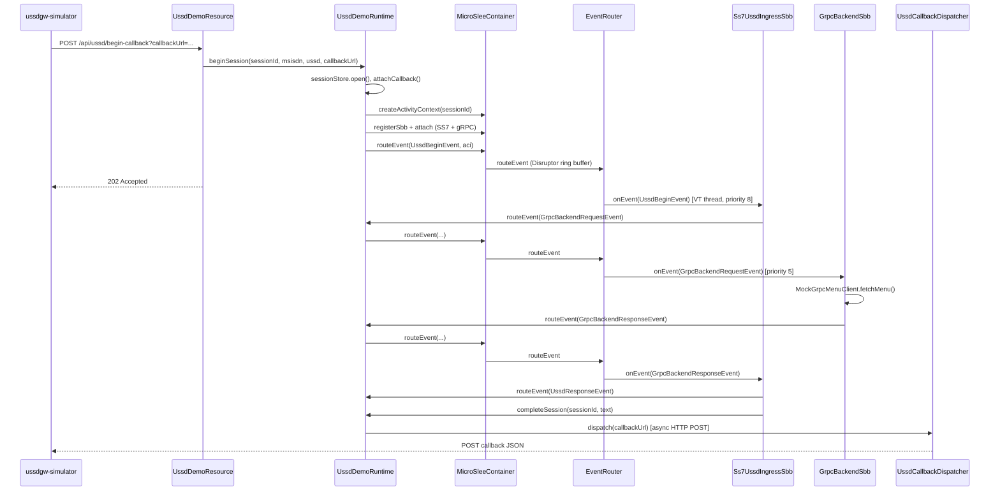

# Hướng dẫn micro-jainslee cho Junior Developer

> Tài liệu này giải thích **micro-jainslee 1.1.0** hoạt động thế nào, cách tích hợp với **Quarkus**, và luồng code khi **fire event**.  
> Demo tham chiếu: `example/example-quarkus/`, `example/example-embedded-j25/`, `example/ussdgw-simulator/`.

---

## Mục lục

1. [JAIN SLEE là gì?](#1-jain-slee-là-gì)
2. [micro-jainslee khác gì Mobicents?](#2-micro-jainslee-khác-gì-mobicents)
3. [Các khái niệm cốt lõi](#3-các-khái-niệm-cốt-lõi)
4. [Cấu trúc module trong repo](#4-cấu-trúc-module-trong-repo)
5. [App có `main()` ở đâu?](#5-app-có-main-ở-đâu)
6. [Khởi động container — ai gọi `start()`?](#6-khởi-động-container--ai-gọi-start)
7. [Tích hợp Quarkus ↔ JAIN SLEE](#7-tích-hợp-quarkus--jain-slee)
8. [Luồng end-to-end khi fire event](#8-luồng-end-to-end-khi-fire-event)
9. [Khi fire event, code nào chạy? (call stack)](#9-khi-fire-event-code-nào-chạy-call-stack)
10. [RA fire event ra sao? (demo vs production)](#10-ra-fire-event-ra-sao-demo-vs-production)
11. [SBB lifecycle và virtual thread](#11-sbb-lifecycle-và-virtual-thread)
12. [APT auto-deploy lúc compile](#12-apt-auto-deploy-lúc-compile)
13. [Bản đồ file quan trọng](#13-bản-đồ-file-quan-trọng)
14. [Chạy thử nhanh](#14-chạy-thử-nhanh)
15. [FAQ cho junior](#15-faq-cho-junior)

---

## 1. JAIN SLEE là gì?

**JAIN SLEE** (Java API for Integrated Networks — Service Logic Execution Environment) là chuẩn **môi trường thực thi logic dịch vụ viễn thông** theo mô hình **event-driven** (hướng sự kiện).

Thay vì viết một luồng `if/else` dài từ đầu đến cuối, bạn chia logic thành:

| Thành phần | Vai trò | Ví dụ trong demo USSD |
|-----------|---------|---------------------|
| **SBB** (Service Building Block) | Khối xử lý business logic | `Ss7UssdIngressSbb`, `GrpcBackendSbb` |
| **Event** | Message nội bộ giữa các SBB | `UssdBeginEvent`, `GrpcBackendRequestEvent` |
| **RA** (Resource Adaptor) | Cầu nối với thế giới bên ngoài (SS7, HTTP, DB…) | Trong demo: REST endpoint **giả lập** RA |
| **ACI** (Activity Context Interface) | Context của một phiên/cuộc gọi | Một session USSD = một ACI |
| **Container (SLEE)** | Router event, quản lý SBB, timer, transaction | `MicroSleeContainer` |

**Mô hình event-driven:**

```
Bên ngoài (network)  →  RA  →  fire Event  →  Container  →  SBB.onEvent()
SBB A                →  fire Event khác  →  Container  →  SBB B.onEvent()
```

SBB **không gọi trực tiếp** SBB khác. Mọi giao tiếp qua **container.routeEvent()**.

---

## 2. micro-jainslee khác gì Mobicents?

| | Mobicents / RestComm (production USSD 7.3) | micro-jainslee (R&D) |
|---|---------------------------------------------|----------------------|
| Mục đích | Production gateway trên WildFly | Embed trong app Java/Quarkus/Spring |
| Phụ thuộc | JBoss, JMX, cluster HA… | Chỉ JVM + Disruptor |
| Chạy ở đâu | WildFly server | Trong process của app bạn |
| TCK / JSR-77 | Có (production path) | **Không** — R&D only |

> **Lưu ý production:** Demo trong `example/` **không được deploy** lên USSD gateway production. Production vẫn dùng Mobicents container.

---

## 3. Các khái niệm cốt lõi

### 3.1 SBB (Service Building Block)

Class Java implement `Sbb` + `SleeEventHandler`. Nhận event qua:

```java
@Override
public void onEvent(SleeEvent event, ActivityContextInterface aci) {
    if (event instanceof UssdBeginEvent) {
        // xử lý...
    }
}
```

Lifecycle callbacks (giống EJB cũ):

- `sbbCreate()` — tạo instance
- `sbbActivate()` — kích hoạt
- `sbbPassivate()` — tạm ngưng
- `sbbRemove()` — hủy

### 3.2 Event

POJO implement `SleeEvent`, annotate `@EventType`:

```java
@EventType(name = "UssdBegin", vendor = "com.example.ussddemo", version = "1.0")
public final class UssdBeginEvent implements SleeEvent { ... }
```

### 3.3 ACI (Activity Context Interface)

Đại diện **một phiên** (một cuộc USSD, một cuộc gọi…). Trong micro-jainslee:

- Implementation: `InMemoryActivityContext`
- Tên ACI = `sessionId` (UUID)
- Các SBB được **attach** vào ACI → cùng nhận event trên context đó

### 3.4 RA (Resource Adaptor)

Trong JAIN SLEE thật, RA lắng nghe SS7/SIP/HTTP và gọi:

```java
container.routeEvent(ss7Event, aci);
```

Trong **demo USSD**, RA được **giả lập** bằng:

- `UssdDemoResource` (Quarkus REST) — nhận HTTP POST
- `UssdHttpServer` (embedded Java 25) — JDK `HttpServer`
- `Ss7UssdSimulatorMain` — client CLI giả USSD gateway

### 3.5 Deployable Unit (DU)

Nhóm SBB + RA thành một gói deploy. Demo:

```java
@DeployableUnit(name = "UssdGatewayDemo", sbbs = { Ss7UssdIngressSbb.class, GrpcBackendSbb.class })
public final class UssdGatewayDemoDu { }
```

---

## 4. Cấu trúc module trong repo

```
jain-slee/jain-slee/
├── jainslee-api/          # Interface: Sbb, SleeEvent, TimerPort, annotations...
├── jainslee-core/         # MicroSleeContainer, EventRouter, pools...
├── jainslee-apt/          # Annotation processor → sbb-index.properties
├── jainslee-scheduler/    # Timer (HashedWheelTimer)
├── adapters/
│   ├── adapter-quarkus/   # Quarkus CDI extension
│   └── adapter-spring/    # Spring Boot starter
└── example/
    ├── example-quarkus/       # Quarkus + adapter-quarkus
    ├── example-embedded-j25/  # Plain Java 25, không framework
    ├── example-spring/        # Spring Boot
    └── ussdgw-simulator/      # CLI client giả USSD GW
```

**Trái tim runtime:** `jainslee-core/.../MicroSleeContainer.java` + `EventRouter.java`

---

## 5. App có `main()` ở đâu?

**micro-jainslee không có `main()` riêng.** Nó là **thư viện embed** — app host gọi `MicroSleeContainer.start()`.

| Variant | Entry point (`main`) | Ai start SLEE? |
|---------|---------------------|----------------|
| **example-embedded-j25** | `EmbeddedUssdMain.main()` | Gọi trực tiếp trong `main()` |
| **example-quarkus** | Quarkus bootstrap (không có `main` viết tay) | `UssdDemoRuntime.onStart(StartupEvent)` hoặc `adapter-quarkus` |
| **example-spring** | `SpringApplication.run(...)` | `jainslee-spring-boot-starter` SmartLifecycle |
| **ussdgw-simulator** | `Ss7UssdSimulatorMain.main()` | **Không** chạy SLEE — chỉ là HTTP client |

### Embedded — entry point rõ nhất cho junior

File: `example/example-embedded-j25/.../EmbeddedUssdMain.java`

```java
public static void main(String[] args) throws Exception {
    // 1. Tạo và start MicroSleeContainer
    container = new MicroSleeContainer(configuration);
    container.start();

    // 2. Tạo services (session store, callback, gRPC mock)
    runtime = new UssdDemoRuntime(container, sessionStore, callbackDispatcher);

    // 3. Start HTTP server (giả RA)
    UssdHttpServer httpServer = new UssdHttpServer(port, runtime);
    httpServer.start();

    // 4. Chờ shutdown
    shutdownLatch.await();
}
```

### Quarkus — không có `main()` viết tay

Quarkus dùng `quarkus-maven-plugin` generate bootstrap. SLEE start qua CDI observer:

```java
void onStart(@Observes StartupEvent ev) {
    microSleeContainer().start();
}
```

---

## 6. Khởi động container — ai gọi `start()`?

`MicroSleeContainer.start()` làm:

1. Prewarm pool SBB virtual thread
2. Set state = `STARTED`
3. **`autoDeployFromClasspathIndex()`** — đọc `META-INF/microjainslee/sbb-index.properties`

```
container.start()
    ├── sbbEntityPool.prewarm()
    └── autoDeployFromClasspathIndex()
            ├── đọc sbb-index.properties (APT generate lúc compile)
            ├── instantiate SBB classes (@SbbAnnotation)
            ├── registerSbb(name, instance)
            └── activate DeployableUnit services
```

Sau khi start, container sẵn sàng nhận `routeEvent()`.

---

## 7. Tích hợp Quarkus ↔ JAIN SLEE

Có **3 lớp** tương tác:

```
┌─────────────────────────────────────────────────────────────┐
│ LỚP 1: Quarkus app (JAX-RS, CDI)                            │
│   UssdDemoResource  →  UssdDemoRuntime  →  UssdSessionStore   │
├─────────────────────────────────────────────────────────────┤
│ LỚP 2: adapter-quarkus (CDI extension)                      │
│   MicroJainsleeProcessor (build-time)                       │
│   MicroJainsleeRecorder + MicroJainsleeProducer (runtime)   │
│   → expose MicroSleeContainer, EventRouter, TimerPort...    │
├─────────────────────────────────────────────────────────────┤
│ LỚP 3: jainslee-core (SLEE engine)                          │
│   MicroSleeContainer → EventRouter → SBB.onEvent()          │
└─────────────────────────────────────────────────────────────┘
```

### 7.1 adapter-quarkus (build-time)

File: `adapters/adapter-quarkus/deployment/.../MicroJainsleeProcessor.java`

| Build step | Việc làm |
|------------|----------|
| `installContainer` (STATIC_INIT) | Tạo `MicroSleeContainer` từ config |
| `startContainer` (RUNTIME_INIT) | Gọi `container.start()` |
| `containerSyntheticBean` | Expose `MicroSleeContainer` injectable |
| `sbbSyntheticBeans` | Scan `@SbbAnnotation` → CDI bean (optional) |
| `shutdownContainer` | Stop container khi Quarkus shutdown |

Config đọc từ `application.properties`:

```properties
microjainslee.buffer-size=2048
microjainslee.prefer-virtual-threads=true
microjainslee.sbb-pool-min=16
microjainslee.sbb-pool-max=4096
```

### 7.2 UssdDemoRuntime — bridge app ↔ SLEE

File: `example/example-quarkus/.../quarkus/UssdDemoRuntime.java`

Đây là **cầu nối chính** mà junior cần hiểu:

| Trách nhiệm | Method |
|-------------|--------|
| Start/stop container | `@Observes StartupEvent` / `ShutdownEvent` |
| CDI producer fallback | `@Produces MicroSleeContainer` |
| Bắt đầu session USSD | `beginSession(...)` |
| Fire event tiếp (từ SBB) | `routeEvent(event, aci)` |
| Kết thúc session + callback | `completeSession()` / `failSession()` |

**Quan trọng:** SBB **không phải** CDI bean thực sự trong demo hiện tại. Mỗi session tạo SBB bằng `new`:

```java
SimpleSbbLocalObject ss7 = c.registerSbb(ss7Id(sessionId), new Ss7UssdIngressSbb(this));
```

SBB nhận `UssdDemoRuntime` qua **constructor**, không qua `@Inject`.

### 7.3 Ranh giới Quarkus vs SLEE

| Thuộc Quarkus (CDI) | Thuộc SLEE (core) |
|--------------------|-------------------|
| `UssdDemoResource` REST | `MicroSleeContainer` |
| `UssdSessionStore` | `EventRouter` |
| `UssdCallbackDispatcher` | `VirtualThreadSbbEntityPool` |
| `MockGrpcMenuClient` | `registerSbb`, `attach`, `routeEvent` |
| `@ConfigProperty` | `InMemoryActivityContext` |

**Chỉ `UssdDemoRuntime` nằm giữa hai thế giới.**

---

## 8. Luồng end-to-end khi fire event

Scenario: Simulator gọi USSD `*123#` qua callback.



### 4 event types trong pipeline

| # | Event | Ai fire | Ai xử lý | Hành động |
|---|-------|---------|----------|-----------|
| 1 | `UssdBeginEvent` | `UssdDemoRuntime.beginSession()` | `Ss7UssdIngressSbb` | Log MAP begin → fire request sang gRPC |
| 2 | `GrpcBackendRequestEvent` | SS7 SBB | `GrpcBackendSbb` | Gọi mock gRPC menu |
| 3 | `GrpcBackendResponseEvent` | gRPC SBB | SS7 SBB | Ghép USSD text → fire response |
| 4 | `UssdResponseEvent` | SS7 SBB | (không SBB nào handle) | Event kết thúc pipeline |

---

## 9. Khi fire event, code nào chạy? (call stack)

Giả sử SS7 SBB vừa nhận `UssdBeginEvent` và fire `GrpcBackendRequestEvent`:

### Bước 1 — SBB fire event tiếp

```java
// Ss7UssdIngressSbb.onUssdBegin()
runtime.routeEvent(new GrpcBackendRequestEvent(...), aci);
```

### Bước 2 — Bridge chuyển sang container

```java
// UssdDemoRuntime.routeEvent()
container.routeEvent(event, aci);
```

### Bước 3 — Container (optional InitialEventSelector) → EventRouter

```java
// MicroSleeContainer.routeEvent()
// Nếu ACI chưa có SBB attach → có thể auto-attach root SBB
eventRouter.routeEvent(event, aci);
```

### Bước 4 — Disruptor publish

```java
// EventRouter.routeEvent()
ringBuffer.next();
wrapper.setEvent(event);
wrapper.setAci(aci);
ringBuffer.publish(sequence);
// → Disruptor worker gọi dispatch(event, aci)
```

### Bước 5 — Dispatch tới SBB

```java
// EventRouter.dispatchWithTransaction()
1. Lấy danh sách SBB đã attach trên ACI
2. Sort theo priority DESC (SS7=8 trước gRPC=5)
3. EventMask filter — SBB không subscribe event type → skip
4. deliverEvent() → submit Runnable lên virtual thread của SBB entity
5. handler.onEvent(event, aci)  // ← GrpcBackendSbb.onEvent() chạy ở đây
6. transaction.commit() nếu không lỗi
```

### Bước 6 — Virtual thread handoff

```java
// EventRouter.deliverEvent()
entity.submit(() -> {
    ScopedValue.where(CURRENT, transaction).run(() -> {
        handler.onEvent(event, aci);  // SBB code
    });
});
// EventRouter thread await latch (timeout 30s) — sync handoff
```

**Tóm tắt thread:**

| Thread | Chạy gì |
|--------|---------|
| HTTP thread (Quarkus) | REST → `beginSession()` → fire event đầu |
| Disruptor worker | `EventRouter.dispatch()` |
| SBB virtual thread | `Ss7UssdIngressSbb.onEvent()`, `GrpcBackendSbb.onEvent()` |
| Callback VT | `UssdCallbackDispatcher.post()` |

---

## 10. RA fire event ra sao? (demo vs production)

### Production (Mobicents)

```
SS7 stack → SS7 RA → nhận MAP USSD Begin
    → RA tạo/bind ACI
    → RA gọi sleeContainer.fireEvent(ussdBeginEvent, aci)
    → SBB root nhận onEvent()
```

RA implement interface `ResourceAdaptor`, được container bootstrap qua `bootstrapResourceAdaptor()`.

### Demo (example-quarkus)

RA **không tồn tại** dưới dạng class Java riêng. Thay vào đó:

```
HTTP POST /api/ussd/begin-callback
    → UssdDemoResource.beginCallback()
    → UssdDemoRuntime.beginSession()
    → container.routeEvent(UssdBeginEvent, aci)
```

**Tương đương chức năng:** HTTP entry = RA giả lập SS7 ingress.

### Simulator (client phía ngoài)

`ussdgw-simulator/Ss7UssdSimulatorMain.java`:

1. Start embedded `HttpServer` lắng `/cb` (nhận callback)
2. `POST` tới server demo với `callbackUrl`
3. `CountDownLatch.await()` chờ server POST kết quả về

Pattern giống Mobicents **HttpClient RA callback** — 1 request ra, 0 polling.

---

## 11. SBB lifecycle và virtual thread

### Mỗi SBB ID = 1 virtual thread

`VirtualThreadSbbEntityPool`: mỗi `registerSbb(id, ...)` tạo một **SbbEntity** với queue riêng. Mọi `onEvent()` của SBB đó chạy **tuần tự** trên VT đó (đúng spec JAIN SLEE — single-threaded per SBB entity).

### Priority

```java
ss7.setPriority(8);   // cao hơn → nhận event trước
grpc.setPriority(5);
```

Khi cùng một event gửi tới nhiều SBB trên ACI, EventRouter sort priority **giảm dần**.

### Per-session SBB ID (Quarkus)

```java
"Ss7UssdIngress/" + sessionId
"GrpcBackend/" + sessionId
```

Tránh collision với SBB auto-deploy global từ APT khi nhiều session concurrent.

---

## 12. APT auto-deploy lúc compile

Khi `mvn compile`, `jainslee-apt` scan:

- `@SbbAnnotation` → SBB metadata
- `@EventType` → event metadata  
- `@DeployableUnit` → DU metadata

Output: `target/classes/META-INF/microjainslee/sbb-index.properties`

Ví dụ:

```properties
sbb.0.class=com.example.ussddemo.quarkus.sbbs.GrpcBackendSbb
sbb.0.name=GrpcBackend
eventType.2.class=...UssdBeginEvent
du.0.class=...UssdGatewayDemoDu
```

Lúc `container.start()` → `autoDeployFromClasspathIndex()` instantiate và `registerSbb`.

**Demo vẫn register SBB thủ công per-session** vì cần inject `UssdDemoRuntime` vào constructor — auto-deploy dùng no-arg ctor.

---

## 13. Bản đồ file quan trọng

### Core (engine)

| File | Vai trò |
|------|---------|
| `jainslee-core/.../MicroSleeContainer.java` | Container chính: start/stop, registerSbb, attach, routeEvent |
| `jainslee-core/.../EventRouter.java` | Disruptor router, dispatch, EventMask, deliverEvent |
| `jainslee-core/.../VirtualThreadSbbEntityPool.java` | 1 VT / SBB id |
| `jainslee-core/.../InMemoryActivityContext.java` | ACI implementation |
| `jainslee-apt/.../MicroJainsleeAnnotationProcessor.java` | Generate sbb-index |

### Quarkus adapter

| File | Vai trò |
|------|---------|
| `adapter-quarkus/deployment/.../MicroJainsleeProcessor.java` | Quarkus build steps |
| `adapter-quarkus/runtime/.../MicroJainsleeRecorder.java` | Create/start/stop container |
| `adapter-quarkus/runtime/.../MicroJainsleeProducer.java` | CDI @Produces beans |

### Example Quarkus (đọc theo thứ tự)

| # | File | Đọc để hiểu |
|---|------|-------------|
| 1 | `rest/UssdDemoResource.java` | HTTP entry (giả RA) |
| 2 | `quarkus/UssdDemoRuntime.java` | Bridge Quarkus ↔ SLEE |
| 3 | `sbbs/Ss7UssdIngressSbb.java` | SBB ingress, fire event chain |
| 4 | `sbbs/GrpcBackendSbb.java` | SBB backend gRPC |
| 5 | `events/*.java` | 4 event types |
| 6 | `service/UssdSessionStore.java` | Trạng thái session |
| 7 | `service/UssdCallbackDispatcher.java` | HTTP callback async |
| 8 | `du/UssdGatewayDemoDu.java` | Deployable unit marker |

### Example Embedded (đơn giản nhất)

| File | Vai trò |
|------|---------|
| `embedded/EmbeddedUssdMain.java` | **`main()` — đọc file này trước** |
| `embedded/UssdDemoRuntime.java` | Bridge (constructor injection, không CDI) |
| `embedded/UssdHttpServer.java` | HTTP handlers |
| `sbbs/Ss7UssdIngressSbb.java` | Dùng `EmbeddedUssdMain.runtime()` |

---

## 14. Chạy thử nhanh

```bash
# 1. Install micro-jainslee
cd jain-slee/jain-slee
mvn -B -ntp install -DskipTests \
  -pl jainslee-api,jainslee-scheduler,jainslee-core,jainslee-apt,adapters/adapter-quarkus -am

# 2. Chạy embedded (có main() rõ ràng)
cd example/example-embedded-j25
mvn -B -ntp package
java -jar target/example-embedded-j25.jar

# 3. Terminal khác — simulator
cd example/ussdgw-simulator
mvn -B -ntp package
java -cp target/ussdgw-simulator-1.0.0-SNAPSHOT.jar:$(mvn -q dependency:build-classpath -Dmdep.outputFile=/dev/stdout) \
  com.example.ussdgw.Ss7UssdSimulatorMain http://127.0.0.1:8080 251911000001 '*123#'
```

Test tự động:

```bash
cd example/example-quarkus && mvn -B -ntp test
cd example/example-embedded-j25 && mvn -B -ntp test
```

---

## 15. FAQ cho junior

### Q: SBB có được `@Inject` không?

**Hiện tại trong demo:** SBB được `new` thủ công, nhận `UssdDemoRuntime` qua constructor. `GrpcBackendSbb` có `@Inject MockGrpcMenuClient` nhưng instance per-session phải set qua `setGrpcClientForTesting()` vì không đi qua Arc.

**Hướng tương lai:** adapter-quarkus có thể scan `@SbbAnnotation` → synthetic CDI bean khi `microjainslee.deployment.scan.enabled=true`.

### Q: Tại sao SBB không gọi trực tiếp SBB khác?

Đúng spec JAIN SLEE — decouple, cho phép router áp priority, EventMask, transaction, concurrency lock trên ACI.

### Q: `routeEvent` sync hay async?

- Publish vào Disruptor: **async** (non-blocking cho caller HTTP)
- `deliverEvent` **await** SBB xử l xong trên VT (sync handoff giữa router ↔ SBB, timeout 30s)
- Callback HTTP: **async** trên VT riêng

### Q: Quarkus example có `@QuarkusTest` không?

Chưa — Quarkus 3.15.1 ASM chỉ đọc bytecode Java 21, `jainslee-core` compile Java 25. Test dùng **wiring test** reflect inject. Upgrade Quarkus 3.17+ để chạy full runtime.

### Q: Khác gì `example-embedded-j25` vs `example-quarkus`?

| | embedded-j25 | quarkus |
|---|-------------|---------|
| Entry | `EmbeddedUssdMain.main()` | Quarkus bootstrap |
| DI | Constructor / static | CDI `@Inject` |
| HTTP | JDK HttpServer | JAX-RS |
| SBB reach runtime | `EmbeddedUssdMain.runtime()` | Constructor `UssdDemoRuntime` |
| SBB id | Global (`Ss7UssdIngress`) | Per-session (`Ss7UssdIngress/{id}`) |
| Business logic | **Giống nhau** (events, flow) | **Giống nhau** |

---

## Sơ đồ tổng thể (1 trang)

```
                    ┌──────────────────────────────────────┐
  Simulator/Client  │         HOST APP (Quarkus)           │
       HTTP POST    │  UssdDemoResource                    │
  ─────────────────►│       │                              │
                    │       ▼                              │
                    │  UssdDemoRuntime (BRIDGE)            │
                    │       │ beginSession()               │
                    │       │ routeEvent()                   │
                    │       ▼                              │
                    │  ┌────────────────────────────────┐  │
                    │  │ adapter-quarkus / @Produces    │  │
                    │  │ MicroSleeContainer             │  │
                    │  └──────────────┬─────────────────┘  │
                    │                 │                    │
                    │  ┌──────────────▼─────────────────┐  │
                    │  │ jainslee-core                  │  │
                    │  │ EventRouter (Disruptor)        │  │
                    │  │   → Ss7UssdIngressSbb.onEvent  │  │
                    │  │   → GrpcBackendSbb.onEvent     │  │
                    │  └──────────────┬─────────────────┘  │
                    │                 │ completeSession    │
                    │                 ▼                    │
                    │  UssdCallbackDispatcher ──POST──► Client
                    └──────────────────────────────────────┘
```

---

*Tài liệu này mô tả code tại branch `micro-jainslee` v1.1.0. Cập nhật: 2026-06-27.*
