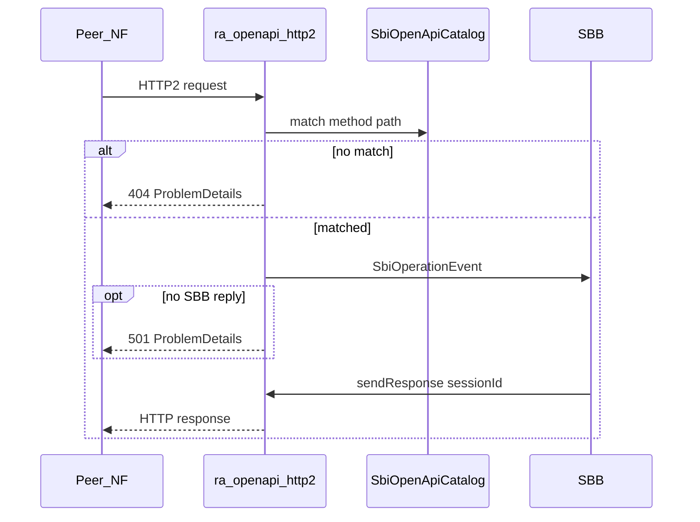
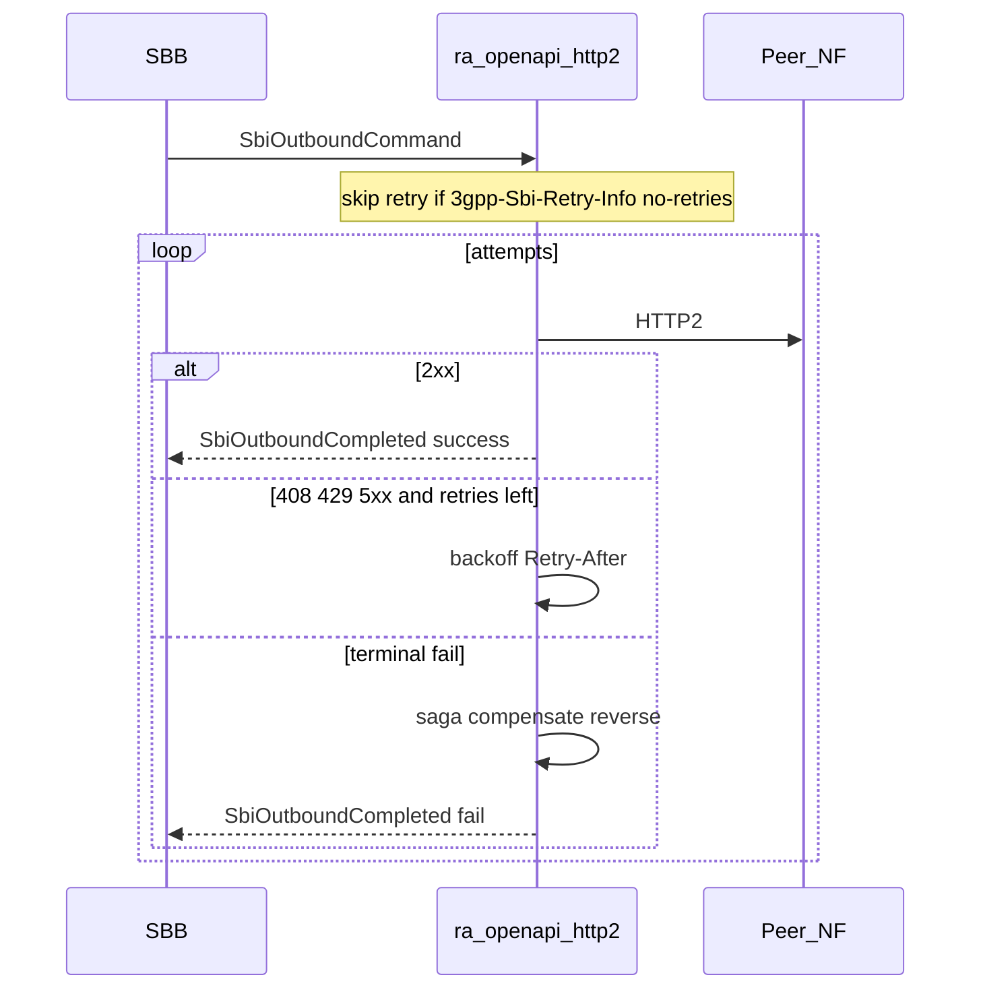

# RA OpenAPI — 5GC SBI HTTP/2 + HTTP/3

**Branch:** `micro-jainslee-2` · **JDK 25 only** · module `vendor-ras/ra-openapi`

Single Maven module consolidating the former `ra-sbi-openapi`, `ra-sbi-http2`, and
`ra-sbi-http3`. Transport RAs expose the **full 5GC SBI OpenAPI dispatch surface**
inside the RA. They do **not** implement NF business logic (AMF/SMF/…). SBBs receive
`SbiOperationEvent` and optionally reply via `sendResponse`.

Normative base: [3GPP TS 29.500](https://www.etsi.org/deliver/etsi_ts/129500_129599/129500/18.09.00_60/ts_129500v180900p.pdf)
— HTTP/2 (RFC 9113) + JSON + TLS + `3gpp-Sbi-*` + `ProblemDetails` + §5.2.8 retries.
HTTP/3 is **experimental** (not mandatory SBI).

## Module layout (`ra-openapi`)

| Package / area | Role |
|----------------|------|
| `com.microjainslee.ra.sbi.openapi.*` | Catalog (`sbi-openapi/catalog.json` ≈ Rel-18: **3047** ops / **304** APIs + YAML seeds), path matcher, `ProblemDetails`, `SbiHeaderCodec` |
| `com.microjainslee.ra.sbi.openapi.gen.*` | Rel-18 catalog generator (`SbiCatalogGenerator` / Maven `-Pgenerate-sbi-catalog`) |
| `com.microjainslee.ra.sbi.http2.*` | Vert.x **4.5** HTTP/2 server+client, retry/circuit/bulkhead, saga, admin `sbi-http2-ra` |
| `com.microjainslee.ra.sbi.http3.*` | Experimental HTTP/3 plane: Vert.x **4.5** TCP lab path; Vert.x **5.1** Quic via isolated ClassLoader (`Vertx5QuicSupport`), admin `sbi-http3-ra` |

### Vert.x isolation

- Default classpath = Vert.x **4.5** only (same as `ra-http-server`).
- Vert.x **5.1** jars are embedded under `META-INF/ra-openapi/vertx5/` at package time and loaded by a **child `URLClassLoader`** parented at the platform loader — never share `io.vertx` with Vert.x 4.
- Do **not** put Vert.x 5 on the shared app ClassLoader beside `ra-http-server`.

Legacy `ra-http-server` / `ra-http-client` remain for HTTP/1 lab ingress.

## Micro-RA deploy

`ra-openapi` follows the same vendor-RA pattern as `ra-http-server`: one jar, register
adaptors independently on `MicroSleeContainer`:

```java
SbiHttp2ResourceAdaptor h2 = new SbiHttp2ResourceAdaptor();
h2.setPort(8082);
container.registerRa(/* RaEndpointPort wrapper or AbstractResourceAdaptor path */);

SbiHttp3ResourceAdaptor h3 = new SbiHttp3ResourceAdaptor(); // optional experimental plane
h3.setTcpPort(8083);
```

H2 and H3 are separate RA instances (separate admin tabs) that share the catalog and
event/command types in one artifact — microservice-style deployables from a single module.

## Catalog update (Rel-18 OpenAPI → `catalog.json`)

Runtime loads `src/main/resources/sbi-openapi/catalog.json` (plus optional YAML seeds).
The checked-in catalog is generated from **3GPP Rel-18** OpenAPI packages; schema is fixed
(`operationId`, `method`, `path`, `apiName`, `apiVersion`, content-types) so H2/H3 RAs need
zero API changes.

### Sources

| Source | URL / branch | Notes |
|--------|----------------|-------|
| Official | [forge.3gpp.org/rep/all/5G_APIs](https://forge.3gpp.org/rep/all/5G_APIs) `REL-18` | Anonymous archive download may **403** |
| Mirror (default) | [github.com/jdegre/5GC_APIs](https://github.com/jdegre/5GC_APIs) `Rel-18` | Same YAML set; used by fetch script |

### Regenerate

```bash
cd vendor-ras/ra-openapi
./tools/fetch-rel18-openapi.sh
# optional: SBI_OPENAPI_SOURCE=forge ./tools/fetch-rel18-openapi.sh

export JAVA_HOME=/home/meodien/.local/share/mise/installs/java/zulu-25
mvn -Dmaven.repo.local=/home/meodien/.m2/repository \
  -pl vendor-ras/ra-openapi -am -Pgenerate-sbi-catalog \
  -Dsbi.catalog.input="$PWD/tools/sbi-openapi-cache/Rel-18" \
  -Dsbi.catalog.output="$PWD/src/main/resources/sbi-openapi/catalog.json" \
  exec:java
```

Generator: `com.microjainslee.ra.sbi.openapi.gen.SbiCatalogGenerator` (+ `SbiCatalogGeneratorMain`).

- Walks all OpenAPI 3 YAML/JSON under `--input` (skips schema-only CommonData files).
- Prefers `apiName` from `TS#####_<ApiName>.yaml` filename; path = `servers[0].url` prefix (minus `{apiRoot}`) + path key.
- Synthesizes **OPTIONS** (every path) and **HEAD** (every GET) to match the prior curated catalog convention.
- Disambiguates colliding `operationId`s across APIs as `apiName.operationId`.
- Deterministic sort by `apiName` / `operationId` / `method`.
- Fail-fast on parse errors; `--continue-on-error` skips individual bad files.
- Jackson YAML pinned to **2.18.2** (same as the module) to avoid YAMLParser token skew.

Offline / CI without Forge: run unit tests — `SbiCatalogGeneratorTest` regenerates from
`src/test/resources/sbi-openapi-fixtures/` and the checked-in seed YAML and round-trips through
`SbiOpenApiCatalog`.

**Note:** Rel-18 YAML uses normative `operationId`s (e.g. NRF register is `RegisterNFInstance`,
not the older curated alias `CreateNFInstance`). Path+method routing is unchanged.

Optional: keep/edit OpenAPI 3 YAML under `sbi-openapi/*.yaml` (loaded at RA start as a supplement).

Checked-in catalog size after Rel-18 generation: **~3047 operations / ~304 APIs** (includes
synthetic OPTIONS/HEAD).

## Inbound sequence



## Outbound retry (TS 29.500 §5.2.8)



## Saga

`SbiSagaCoordinator` (RA-owned): `begin` → register compensate commands → `markStepDone` /
`complete` / `failAndCompensate` (reverse order). Correlation via `3gpp-Sbi-Correlation-Info`.

## Admin hub

- Tabs: `sbi-http2-ra`, `sbi-http3-ra` (group `openapi`, panels branded **ra-openapi**)
- APIs: `/status`, `/status.html` (HTMX fragment), `/catalog`, `/config`, `/rebind`, `/resilience`, `/sagas`
- Badges: **LISTEN** ≠ peer UP; **PEER_SEEN** after ≥1 exchange; HTTP/3 **QUIC** vs **TCP_FALLBACK**

## Build / test

```bash
export JAVA_HOME=/home/meodien/.local/share/mise/installs/java/zulu-25
mvn -Dmaven.repo.local=/home/meodien/.m2/repository \
  -pl vendor-ras/ra-openapi -am \
  -Dsurefire.failIfNoSpecifiedTests=false test
```

## Link-status truth

Never report LIVE/PEER_UP from LISTEN alone. Client plane uses `peerTrafficSeen()` /
exchange counters; HTTP/3 reports `quicReady` only when the Quic path is honestly ready
(not when TCP bind alone succeeds).
