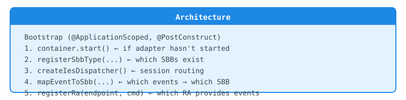
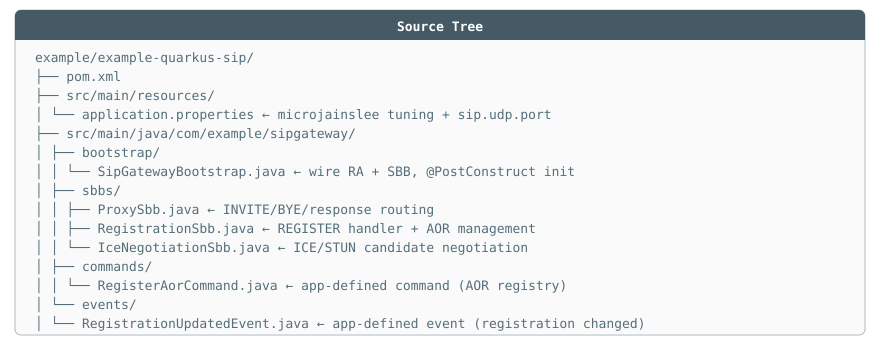
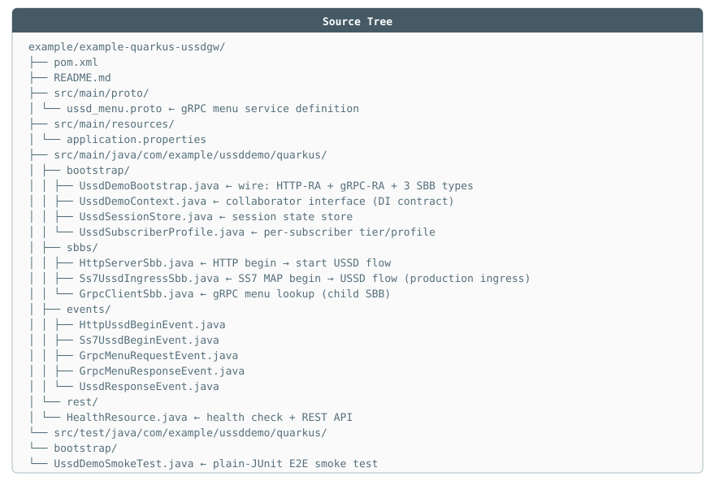

# 📕 Application Wiring Guide (Quarkus)

> Guide to wiring SBB + RA into a complete micro-jainslee app on Quarkus.
> Reference: `example/example-quarkus-sip` (SIP gateway) and `example/example-quarkus-ussdgw` (USSD).
>
> Last updated: 2026-07-06

---

## 1. Big picture

A micro-jainslee app = **3 pieces + 1 bootstrap**:

<p align="center"></p>

Order 2 → 3 → 4 → 5 is mandatory: once RA activates, events can arrive immediately, all mappings must be ready beforehand.

---

## 2. pom.xml

> 📄 File: example/example-quarkus-sip/pom.xml
```xml
<dependencies>
    <!-- micro-jainslee Quarkus extension: produces MicroSleeContainer + facilities -->
    <dependency>
        <groupId>com.microjainslee</groupId>
        <artifactId>adapter-quarkus</artifactId>
        <version>1.2.0-SNAPSHOT</version>
    </dependency>
    <!-- The RA you're using -->
    <dependency>
        <groupId>com.microjainslee</groupId>
        <artifactId>ra-sip-servlet</artifactId>
        <version>1.2.0-SNAPSHOT</version>
    </dependency>
    <dependency>
        <groupId>io.quarkus</groupId>
        <artifactId>quarkus-arc</artifactId>
    </dependency>
</dependencies>
```

`application.properties`:

> 📄 File: example/example-quarkus-sip/src/main/resources/application.properties
```properties
# container tuning (read by adapter-quarkus deployment)
microjainslee.buffer-size=2048
microjainslee.prefer-virtual-threads=true
microjainslee.sbb-pool-max=4096

# app-defined config
sip.udp.port=5060
```

---

## 3. Complete bootstrap (SIP gateway)

> 📄 File: example/example-quarkus-sip/src/main/java/com/example/sipgateway/bootstrap/SipGatewayBootstrap.java
```java
@ApplicationScoped
public final class SipGatewayBootstrap {

    @Inject
    MicroSleeContainer container;          // produced by adapter-quarkus

    @ConfigProperty(name = "sip.udp.port", defaultValue = "5060")
    int sipPort;                           // 0 = ephemeral (useful for tests)

    private volatile SipServletRaEndpoint sipEndpoint;

    @PostConstruct
    void init() {
        if (container.getState() != MicroSleeContainer.State.STARTED) {
            container.start();
        }

        // (2) SBB types — factory called each time a new entity is needed.
        //     Pass collaborators via constructor here (NOT static).
        container.registerSbbType(ProxySbb.class, ProxySbb::new);
        container.registerSbbType(RegistrationSbb.class, RegistrationSbb::new);

        // (3) IES — ALWAYS use the container-backed version.
        container.createIesDispatcher();

        // (4) declarative routing: event → SBB type (matches parent classes too)
        container.mapEventToSbb(SipInviteEvent.class,   "ProxySbb");
        container.mapEventToSbb(SipByeEvent.class,      "ProxySbb");
        container.mapEventToSbb(SipResponseEvent.class, "ProxySbb");
        container.mapEventToSbb(SipRegisterEvent.class, "RegistrationSbb");

        // (5) RA
        SipRaConfig config = new SipRaConfig();
        config.setHost("0.0.0.0");
        config.setUdpPort(sipPort);
        config.setTcpPort(sipPort);
        config.setDialogIdleSecs(300);        // prevent orphan dialog leaks

        SipServletResourceAdaptor ra = new SipServletResourceAdaptor();
        sipEndpoint = new SipServletRaEndpoint(ra);
        sipEndpoint.setConfig(config);
        container.registerRa(sipEndpoint, sipEndpoint);
        // container activates RA immediately (already STARTED) → opens UDP/TCP 5060
        // default outbound sender (Netty) auto-wires — SBB SendResponse just works
    }

    @PreDestroy
    void shutdown() {
        if (sipEndpoint != null) sipEndpoint.deactivate();
        if (container.getState() == MicroSleeContainer.State.STARTED) {
            container.stop();
        }
    }
}
```

**That's it.** No manual `acquireEntity`, no manual `attach`, no DIY IES adapter — the runtime handles the "SLEE" part.

---

## 4. Passing collaborators to SBBs correctly

SBBs often need app services (session store, config…). Pass via **constructor in factory**, using an interface type:

> 📄 File: example/example-quarkus-ussdgw/src/main/java/com/example/ussddemo/quarkus/bootstrap/UssdDemoContext.java
```java
// app defines a narrow interface
public interface UssdDemoContext {
    String tierFor(String msisdn);
    void completeSession(String sessionId, String responseText);
}

// bootstrap implements it, and passes itself into factory
container.registerSbbType(HttpServerSbb.class,
        () -> new HttpServerSbb(container, this));
```

Rules:
- Parameter type = **interface** (`UssdDemoContext`), not concrete bootstrap class — so tests can mock it (lesson from example-spring-ussdgw passing `null`).
- ❌ No static singleton/holder in SBB.
- SBB with `@InitialEventSelect` needs an **additional** no-arg ctor (IES temp instance) — collaborator fields being null in that ctor is acceptable since IES method must not use them.

---

## 5. Running

```bash
cd example/example-quarkus-sip
mvn quarkus:dev
```

Send SIP via [sipexer](https://github.com/miconda/sipexer) or `nc`:

```bash
# OPTIONS ping — expect 200 OK
sipexer -mt OPTIONS -sd udp:127.0.0.1:5060

# or manually
printf 'OPTIONS sip:gw@127.0.0.1 SIP/2.0\r\nVia: SIP/2.0/UDP 127.0.0.1:9999;branch=z9hG4bK1\r\nMax-Forwards: 70\r\nTo: <sip:gw@x>\r\nFrom: <sip:me@x>;tag=1\r\nCall-ID: t1@x\r\nCSeq: 1 OPTIONS\r\nContent-Length: 0\r\n\r\n' | nc -u -w2 127.0.0.1 5060
```

USSD demo:

```bash
cd example/example-quarkus-ussdgw && mvn quarkus:dev
curl -X POST http://127.0.0.1:8080/api/ussd/begin \
     -H 'Content-Type: application/json' \
     -d '{"msisdn":"251911000001","ussdString":"*123#"}'
# → {"sessionId":"...","status":"PROCESSING"}
curl http://127.0.0.1:8080/api/ussd/sessions/<sessionId>
# → {"sessionId":"...","status":"COMPLETED","responseText":"USSD menu ..."}
```

---

## 6. Writing a smoke test for app (no CDI)

Bootstrap should be testable with plain JUnit — template: `UssdDemoSmokeTest`:

> 📄 File: example/example-quarkus-ussdgw/src/test/java/com/example/ussddemo/quarkus/bootstrap/UssdDemoSmokeTest.java
```java
@BeforeEach
void setUp() {
    container = new MicroSleeContainer(MicroSleeConfiguration.builder()
            .eventRouterBufferSize(64).preferVirtualThreads(false).build());
    bootstrap = new UssdDemoBootstrap();
    bootstrap.container = container;        // package-private field → set directly
    bootstrap.sessionStore = new UssdSessionStore();
    bootstrap.httpPort = 0;                 // ephemeral port
    bootstrap.init();
    port = bootstrap.httpEndpoint().port(); // real port after bind
}

@Test
void flowCompletes() throws Exception {
    // POST begin → poll session endpoint until COMPLETED (deadline 15s)
}
```

Design principles for testability:
- Every listening port must be **configurable and accept 0** (ephemeral).
- Bootstrap exposes accessor for endpoint (`httpEndpoint()`) so tests can get the real port.
- `@Inject`/`@ConfigProperty` fields made package-private → test sets them directly without CDI container.

---

## 7. New app checklist

- [ ] Bootstrap follows correct order: start → registerSbbType → createIesDispatcher → mapEventToSbb → registerRa.
- [ ] Every event type the app uses has a `mapEventToSbb` (or deliberately uses manual attach — rare).
- [ ] `@InjectRa` name matches `getRaName()` of endpoint.
- [ ] Collaborators into SBB via constructor-interface, not static.
- [ ] `@PreDestroy` deactivates RA before stopping container.
- [ ] Port configurable, has smoke test plain-JUnit running in `mvn test`.
- [ ] Builds in reactor: `mvn -Pexamples test` green before opening PR.

---

## 8. GraalVM native (direction)

The goal is `mvn package -Dnative`. Current status and remaining work (check before attempting):

- `adapter-quarkus` currently records container at `STATIC_INIT` while `EventRouter` starts Disruptor thread in constructor → **must move to RUNTIME_INIT** before native build works.
- Reflection needs registration (`@InjectRa` field, IES method, JTA `Class.forName`) — no `ReflectiveClassBuildItem` in deployment processor yet.
- Track these items in `docs/gap-analysis.md` (native-readiness section).

---

## Appendix: Real Source Tree

### SIP Gateway app (`example/example-quarkus-sip/`)

<p align="center"></p>

### USSD Demo app (`example/example-quarkus-ussdgw/`)

<p align="center"></p>
