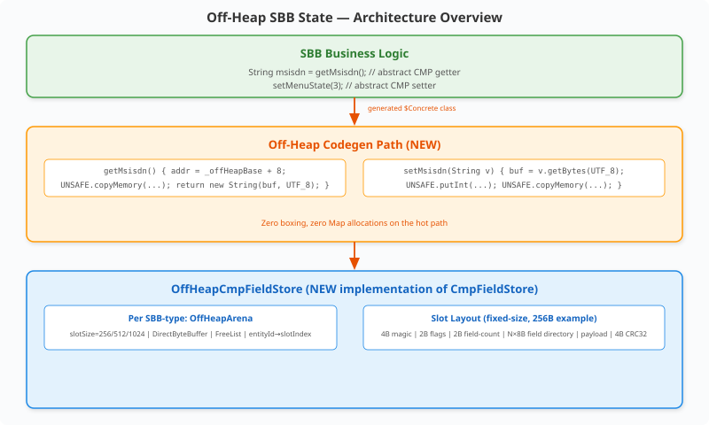
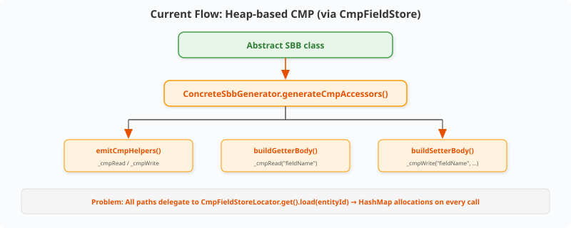
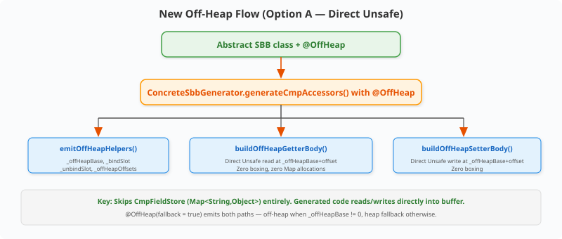
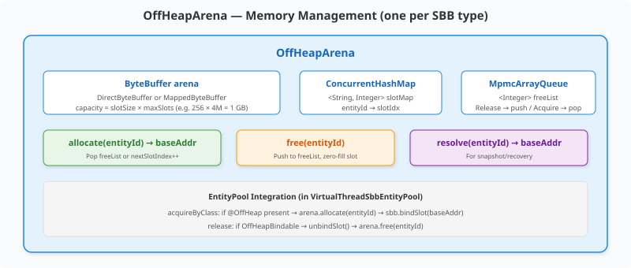
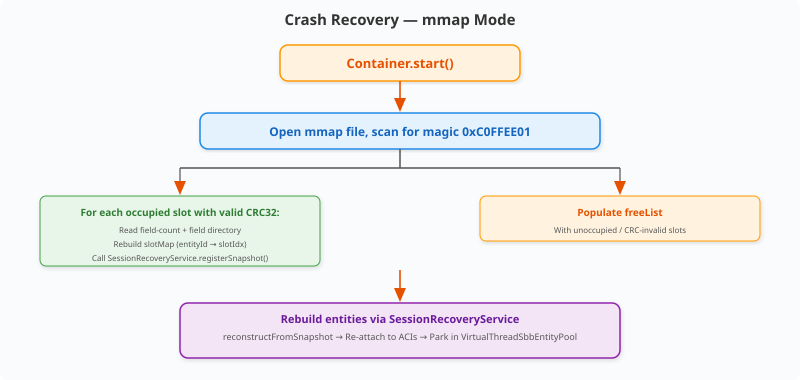

# Off-Heap SBB State — Design

> **Status:** Draft · **Target:** micro-jainslee 1.2.0-P2  
> **Audience:** Contributors & advanced users planning 1M+ SBB entity deployments

---

## 1. Problem Statement

At 100K+ SBB entities, GC pressure becomes the dominant bottleneck:

| Entity count | Typical CMP fields | Heap per entity | Total heap | GC pause (G1, 16 GB) |
|---|---|---|---|---|
| 10K | 3–5 (String, int, long) | ~300–500 bytes | ~5 MB | negligible |
| 100K | 3–5 | ~300–500 bytes | ~50 MB | 5–20 ms |
| 1M | 3–5 | ~300–500 bytes | ~500 MB | 50–200 ms |
| 5M | 3–5 | ~300–500 bytes | ~2.5 GB | 500 ms–2 s |

**Root cause:** The current `CmpFieldStore` interface returns `Map<String, Object>`. Every CMP read allocates a `HashMap` (defensive copy), every write creates a new `HashMap` + `ConcurrentHashMap` entry. At 1M entities, this generates 1M+ `HashMap` instances with boxed primitives — all on the GC heap.

**Goal:** Offer an opt-in off-heap storage path that stores CMP fields in `direct ByteBuffer`s or memory-mapped files, bypassing GC entirely while keeping the existing `@CmpField` annotation model intact.


---

## 2. Architecture Overview

<p align="center"></p>

**Key principle:** The generated `$Concrete` class knows field offsets at codegen time. It reads/writes directly into a pre-allocated off-heap slot using `Unsafe`/`VarHandle`, with **zero boxing and zero Map allocations on the hot path**.


---

## 3. Storage Backend Comparison

| Backend | Read latency | Write latency | Survives restart | Max size per arena | GC impact | Complexity |
|---|---|---|---|---|---|---|
| **Direct ByteBuffer** | ~80 ns | ~100 ns | No | 2 GB (indexed) | **Zero** | Low |
| Memory-mapped file | ~800 ns | ~1 µs | **Yes** | OS page cache | Zero | Medium |
| Chronicle Map | ~400 ns | ~500 ns | Yes | Unlimited | Zero | High (3rd-party dep) |
| `Unsafe.allocateMemory` | ~40 ns | ~50 ns | No | Unlimited | Zero | Medium |

### Recommendation

| Tier | Backend | When |
|---|---|---|
| **Primary (P2)** | `Direct ByteBuffer` | Default for 99% of deployments. Sub-100ns latency, zero GC, no external deps. 2 GB per SBB type = 8M entities at 256B each. |
| **Secondary (P3)** | Memory-mapped file (`MappedByteBuffer`) | Deployments requiring crash recovery. Activated via `@OffHeap(storage = StorageType.MMAP)`. |

`Unsafe.allocateMemory` is an implementation detail of `DirectByteBuffer` (the JVM uses `Unsafe` internally). Chronicle Map is rejected for P2 — its rich feature set (IPC, replication) overlaps with `jainslee-cluster`.

---

## 4. Serialization Format

### Slot Layout (fixed-size per SBB type)

Each entity gets a fixed-size slot for O(1) index arithmetic (`baseAddr = arenaBase + entityIndex * slotSize`):

<p align="center"></p>

### Example: SBB with `msisdn` (String max 20), `sessionId` (String max 64), `menuState` (int), `retryCount` (int)

```
@OffHeap(storage = StorageType.DIRECT, slotSize = 256)
```

Slot layout (256 bytes):

<p align="center"></p>
Abstract SBB class
  │
  ▼
ConcreteSbbGenerator.generateCmpAccessors()
  │
  ├── emitCmpHelpers() → _cmpRead(name) / _cmpWrite(name, value)
  │     └── delegates to CmpFieldStoreLocator.get().load(entityId)
  │
  ├── buildGetterBody(fieldName, type)
  │     └── returns: "Object _v = _cmpRead("fieldName"); ..."
  │
  └── buildSetterBody(fieldName, type)
        └── returns: "_cmpWrite("fieldName", ...);"
```

### New off-heap flow (recommended — Option A)

When the SBB class carries `@OffHeap`, the generator emits **direct `Unsafe`/`VarHandle` access** instead of `_cmpRead`/`_cmpWrite`:

```
Abstract SBB class + @OffHeap
  │
  ▼
ConcreteSbbGenerator.generateCmpAccessors()
  │
  ├── emitOffHeapHelpers()  (NEW)
  │     ├── private long _offHeapBase;            // slot base address
  │     ├── private static final int[] _offHeapOffsets; // per-field offsets
  │     ├── void _bindSlot(long baseAddr)          // called by EntityPool
  │     └── void _unbindSlot()                     // called by EntityPool
  │
  ├── buildOffHeapGetterBody(fieldName, type, offset)
  │     └── generates direct Unsafe read at _offHeapBase + offset
  │
  └── buildOffHeapSetterBody(fieldName, type, offset)
        └── generates direct Unsafe write at _offHeapBase + offset
```

**Why this approach over a `CmpFieldStore` wrapper (Option B)?** The `CmpFieldStore` interface uses `Map<String,Object>` — any implementation would still allocate on every call. The whole point of off-heap is to **skip the Map entirely**. Codegen lets us emit zero-allocation accessors that read/write directly into the buffer.

### Codegen output example (for `getMsisdn` — String field)

```java
// Generated body for getMsisdn() when @OffHeap, slotSize=256
public String getMsisdn() {
    long addr = this._offHeapBase;            // set at bind time
    if (addr == 0L) return null;              // unbound guard
    int payOff = UNSAFE.getInt(addr + 0x14);  // offset from directory
    if (payOff == 0) return null;             // null string
    int len = UNSAFE.getShort(addr + payOff) & 0xFFFF;
    if (len == 0) return "";
    byte[] buf = new byte[len];               // TODO: thread-local buffer in P3
    UNSAFE.copyMemory(null, addr + payOff + 2,
                      buf, UNSAFE.ARRAY_BYTE_BASE_OFFSET, len);
    return new String(buf, java.nio.charset.StandardCharsets.UTF_8);
}
```

### Dual-accessor fallback

For migration safety, `@OffHeap(fallback = true)` emits **both** off-heap and original heap accessors. When `_offHeapBase == 0`, getters fall through to the heap path. This lets a single SBB type run in both off-heap (production) and heap (tests) modes.

---

## 6. OffHeapArena — Memory Management

```
┌──────────────────────────────────────────────────────────────────┐
│  OffHeapArena  (one per SBB type)                                │
│                                                                  │
│  ByteBuffer arena  (DirectByteBuffer or MappedByteBuffer)        │
│    capacity = slotSize × maxSlots                                 │
│    e.g. 256 × 4_194_304 = 1 GB                                   │
│                                                                  │
│  ConcurrentHashMap<String, Integer> slotMap                       │
│    entityId → slotIdx  (quick lookup, ~200 bytes per entry)     │
│                                                                  │
│  MpmcArrayQueue<Integer> freeList                                 │
│    Upon release: push slotIdx to free list, zero-fill slot       │
│    Upon acquire: pop slotIdx, or allocate new (nextSlotIndex++)  │
│                                                                  │
│  allocate(entityId) → long baseAddr                              │
│  free(entityId)     → push to freeList, zero slot                │
│  resolve(entityId)  → baseAddr  (for snapshot/recovery)          │
└──────────────────────────────────────────────────────────────────┘
```

### EntityPool integration (in `VirtualThreadSbbEntityPool`)

```java
public SbbEntity acquireByClass(String sbbId, Class<? extends Sbb> sbbClass) {
    // ...existing cache check...
    Sbb sbb = instantiateSbb(sbbClass);

    // NEW: bind off-heap slot if @OffHeap present
    OffHeap offHeap = sbbClass.getAnnotation(OffHeap.class);
    if (offHeap != null) {
        OffHeapArena arena = offHeapArenas.computeIfAbsent(sbbClass,
            k -> new OffHeapArena(offHeap));
        long baseAddr = arena.allocate(sbbId);
        ((OffHeapBindable) sbb).bindSlot(baseAddr);
    }

    // ...existing slot bind...
}

public void release(SbbEntity entity) {
    // NEW: free off-heap slot
    if (entity.getSbb() instanceof OffHeapBindable ob) {
        ob.unbindSlot();
        offHeapArena.free(entity.getSbbId());
    }
    // ...existing release...
}
```

0x70    │ 00 0A  "8491234567"                      (10B msisdn)
...     │ (unused, zero-filled)
0xFC    │ CRC32 of bytes 0x00–0xFB
```

### Why fixed-size slots?

- **O(1) access** — no pointer chasing, no hash lookup
- **No fragmentation** — slots never resize; strings exceeding max are truncated
- **No read-time compaction** — compaction only during GC sweep
- **Predictable memory** — `slotSize × maxEntities` bytes, known at deploy time

`slotSize` is configured per SBB type via `@OffHeap`. A slot-size calculator utility estimates the required size from field declarations at codegen time when `slotSize = 0` (auto).


---

## 7. Garbage Collection / Compaction

### Slot lifecycle

```
[FREE] ──allocate()──▶ [OCCUPIED] ──release()──▶ [FREE] ──▶ reused
```

Fixed-size slots = no fragmentation within a slot. Only the free list matters.

### Compaction sweep

When free slots exceed 25% of allocated slots, a background daemon VT compacts:

1. Scan from highest occupied slot backwards
2. When a free slot is found below an occupied one, **move** the highest occupied slot's data down into the gap (simple `Unsafe.copyMemory`)
3. Update `slotMap` for the moved entity (entityId now points to new slotIdx)
4. Repeat until no gaps remain
5. Reduce `nextSlotIndex` to reflect the new high-water mark

Compaction is safe because each SBB entity runs on its own VT and CMP access is single-threaded per entity — no concurrent reader/writer of the same slot.

---

## 8. Crash Recovery (mmap mode)

When `@OffHeap(storage = StorageType.MMAP, filePath = "/data/sbb-cmp")`:

### Write path

Every `setXxx` writes through to the `MappedByteBuffer`. The OS flushes dirty pages lazily. `sbbStore()` calls `MappedByteBuffer.force()` for critical writes.

### Recovery on restart

<p align="center"></p>

### CRC32 commit protocol

<p align="center"></p>

---

## 9. Migration Path

| Phase | Deliverable | Risk |
|---|---|---|
| **P2.0** | `@OffHeap` annotation, `OffHeapArena` (Direct), codegen integration, `EntityPool` binding | None — opt-in |
| **P2.1** | `StorageType.MMAP`, crash recovery, `sbbStore()` force | Only mmap users |
| **P3** | Thread-local `byte[]` buffers for zero-allocation String reads, `OffHeapString` zero-copy wrapper | Performance optimization |

### Phase 1 details (P2.0)

1. New `@OffHeap` in `jainslee-api` (no new deps)
2. `ConcreteSbbGenerator` detects `@OffHeap` → emits off-heap accessors + helpers
3. `OffHeapArena` backed by `DirectByteBuffer`
4. `VirtualThreadSbbEntityPool` calls `bindSlot`/`unbindSlot` on acquire/release
5. All existing heap-based SBBs continue unchanged

### Phase 2 details (P2.1)

1. `OffHeapArena` subclass for `MappedByteBuffer`
2. EntityId stored in a reserved header area (bytes 128–255) for recovery
3. On `Container.start()`, scan mmap files and rebuild slotMap + freeList
4. Integrate with `SessionRecoveryService` for entity reconstruction


---

## 10. API Proposal

### Annotation (in `jainslee-api`)

```java
@Retention(RetentionPolicy.RUNTIME)
@Target(ElementType.TYPE)
@Documented
public @interface OffHeap {
    StorageType storage() default StorageType.DIRECT;
    int slotSize() default 0;         // 0 = auto-calculate from CMP fields
    int maxSlots() default 1_048_576; // 1M
    String filePath() default "";     // for MMAP
    boolean fallback() default false; // dual accessors for migration
}

public enum StorageType {
    DIRECT,  // DirectByteBuffer — fastest, no persistence
    MMAP     // Memory-mapped file — survives JVM restart
}
```

### Usage

```java
@SbbAnnotation(name = "Ss7UssdIngress", vendor = "com.example", version = "1.0")
@OffHeap(storage = StorageType.DIRECT, slotSize = 256)
public abstract class Ss7UssdIngressSbb extends CmpBackedSbb {
    @CmpField("msisdn")
    public abstract String getMsisdn();
    @CmpField("msisdn")
    public abstract void setMsisdn(String msisdn);

    @CmpField("menuState")
    public abstract int getMenuState();
    @CmpField("menuState")
    public abstract void setMenuState(int state);

    @CmpField("sessionId")
    public abstract String getSessionId();
    @CmpField("sessionId")
    public abstract void setSessionId(String sessionId);
}
```

### Container configuration

```java
MicroSleeConfiguration config = MicroSleeConfiguration.builder()
    .offHeapEnabled(true)
    .offHeapDefaultSlotSize(256)
    .offHeapMaxSlots(4_000_000)
    .offHeapStorageDir("/data/slee-offheap")
    .build();
```

### Interface contract (`OffHeapBindable`)

```java
// In jainslee-api — the generated $Concrete class implements this
public interface OffHeapBindable {
    void bindSlot(long baseAddr);
    void unbindSlot();
    void setEntityId(String entityId);
}
```

---

## 11. Performance Projections

| Scenario | Heap-based (current) | Off-heap (P2) | Improvement |
|---|---|---|---|
| CMP getter (int) | ~200 ns (HashMap + boxing) | ~15 ns (direct read) | **13×** |
| CMP getter (String, 10B) | ~300 ns (HashMap + String copy) | ~60 ns (Unsafe copy) | **5×** |
| CMP setter (int) | ~400 ns (HashMap copy + store) | ~20 ns (direct write) | **20×** |
| CMP setter (String, 10B) | ~500 ns | ~80 ns (Unsafe copy) | **6×** |
| GC pause, 1M entities | 50–200 ms (G1) | <1 ms (no heap CMP) | **50–200×** |
| Memory, 1M entities (256B) | ~500 MB heap | 256 MB off-heap | **2× less, 0 GC** |
| 100K getter/setter cycle | ~40 ms | ~3 ms | **13×** |

---

## 12. Risks & Mitigations

| Risk | Mitigation |
|---|---|
| `Unsafe` may be deprecated/removed in future Java | Use `VarHandle` (Java 9+) as the API layer; `Unsafe` only as internal implementation detail |
| String encoding overhead per getter call | Phase 3: thread-local `byte[]` buffer + `OffHeapString` zero-copy view |
| `slotSize` misconfiguration leads to truncation | Codegen-time validation: sum field max sizes + overhead ≤ slotSize; warn if tight |
| mmap file corruption on crash | CRC32 per slot + occupied-flag-last write ordering |
| `DirectByteBuffer` 2 GB addressability limit | One arena per SBB type, not global. 2 GB = 8M entities at 256B — more than enough per type |
| Virtual threads can't use some `Unsafe` methods | Only `Unsafe` memory access methods are used — no thread control. Fully VT-compatible |

---

## 13. Design Decisions Summary

| Decision | Rationale |
|---|---|
| Fixed-size slots over variable-length | O(1) access, no fragmentation, predictable memory |
| Codegen emits direct `Unsafe` rather than `CmpFieldStore` | `CmpFieldStore` uses `Map<String,Object>` — inherently allocates |
| One arena per SBB type, not one global | Different slot sizes and field layouts per type |
| `DirectByteBuffer` over raw `Unsafe.allocateMemory` | Cleaner API, built-in deallocation tracking, `VarHandle`-compatible |
| Per-entity slot binding via `_offHeapBase` field | Avoids arena lookup on every access; single field read |
| Opt-in via `@OffHeap` annotation | Zero risk to existing deployments |
| EntityId stored in mmap slot header (not inline in CMP area) | Enables recovery without knowing CMP field layout |
| CRC32 commit protocol (data first, flag last) | Guarantees slot is either fully written or detected as corrupt |

