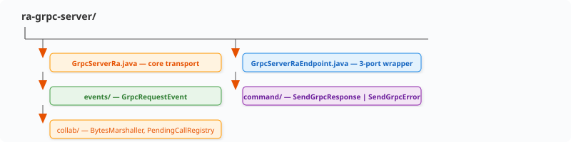
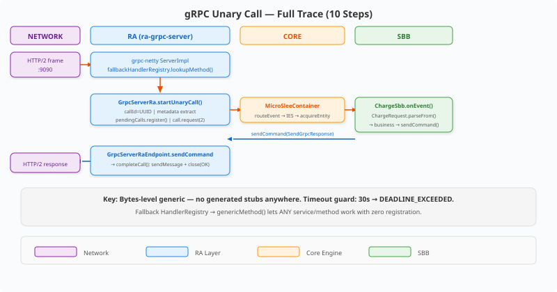
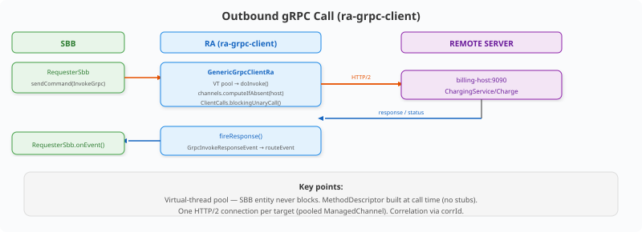

# Trace: gRPC Unary Call Event Flow — Client → RA → SBB → Response

> Full end-to-end trace of a stub-less gRPC unary call entering the
> generic `ra-grpc-server`, routing to an SBB, and the response bytes
> going back to the wire. Companion trace for the outbound direction via
> `ra-grpc-client` at the end.
>
> Both RAs are **bytes-level generic**: no generated stubs anywhere.
> Protobuf encode/decode is the application's job (inside the SBB or a
> thin mapper). The RAs are pure transport — same rule as every
> micro-jainslee RA.

---

## Files involved (inbound, ra-grpc-server)

| Step | File | Role |
|------|------|------|
| 1 | `GrpcServerRa.java` `raActive()` | NettyServerBuilder + fallback `HandlerRegistry` |
| 2 | `GrpcServerRa.java` `genericMethod()` | Materialise `MethodDescriptor<byte[],byte[]>` for ANY method name |
| 3 | `collab/BytesMarshaller.java` | Identity marshaller — raw message bytes through |
| 4 | `GrpcServerRa.java` `startUnaryCall()` | callId + metadata + `collab/PendingCallRegistry` |
| 5 | `events/GrpcRequestEvent.java` | The typed event SBBs receive |
| 6 | `jainslee-core` `MicroSleeContainer.routeEvent` | `mapEventToSbb(GrpcRequestEvent, "EchoSbb")` + IES |
| 7 | your SBB `onEvent()` | decode → business logic → `sendCommand(...)` |
| 8 | `command/SendGrpcResponse.java` / `SendGrpcError.java` | SBB → RA commands |
| 9 | `GrpcServerRaEndpoint.java` `sendCommand()` | Route command → `GrpcServerRa.sendOutbound()` |
| 10 | `GrpcServerRa.java` `completeCall()` | `ServerCall.sendMessage(bytes)` + `close(Status.OK)` |

Module structure — identical template to every vendor RA:

---

## Full trace (10 steps)

**Timeout guard:** if no SBB answers within `callTimeoutMillis`
(default 30 s), the sweeper closes the call with `DEADLINE_EXCEEDED` and
frees the pending entry — a stuck SBB can never leak open calls.

---

## Outbound direction (ra-grpc-client)

---

## Key data structures

| Structure | Where | Purpose |
|---|---|---|
| `PendingCallRegistry` | ra-grpc-server/collab | callId → open ServerCall + deadline; drained on shutdown |
| `BytesMarshaller` | ra-grpc-server/collab | identity marshaller → schema-agnostic RA |
| channel pool (`Map<String,ManagedChannel>`) | ra-grpc-client | one HTTP/2 connection per target, reused |
| `correlationMetadataKey` | GrpcServerRa | metadata value → SLEE activity id (stateful sessions) |

## Key interfaces

| Interface | Direction | Contract |
|---|---|---|
| `RaEndpointPort` | container → RA | activate(bootstrap) / deactivate / getRaName |
| `RaCommandPort` | SBB → RA | `sendCommand(SendGrpcResponse \| SendGrpcError \| InvokeGrpc)` |
| `RaBootstrapPort` | RA → SLEE | createActivityHandle / fireEvent / endActivity |

## Summary: 4 layers, 2 directions

Same shape as the SIP trace (`sip-servlet-doc-guide.md`): network ⇄
transport (grpc-netty) ⇄ RA (bytes ⇄ events/commands) ⇄ core routing ⇄
SBB. Swap "SIP dialog / Call-ID" for "gRPC call / metadata correlation"
and the model is identical — that is the point of the shared RA template.

Verified end-to-end by `GrpcServerEndToEndTest` (real socket, arbitrary
method names, error status) and `GenericGrpcClientEndToEndTest` (both
generic RAs in one container, full loop with zero generated code).
