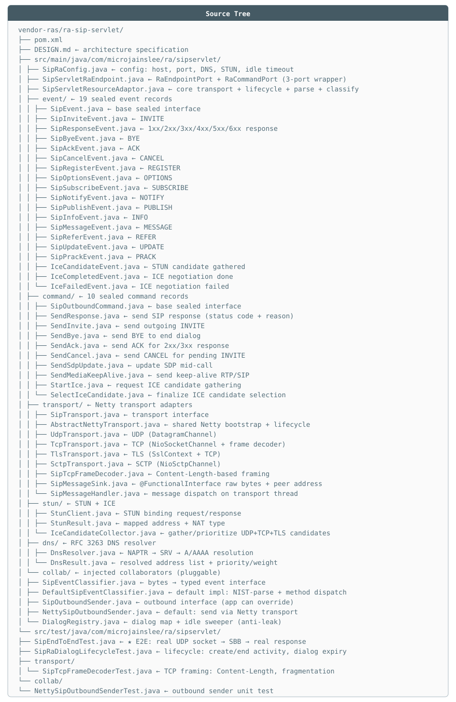

# 📙 Resource Adaptor Implementation Guide

> Guide to writing Resource Adaptors (RA) following micro-jainslee's **3-port contract**.
> Most complete reference implementation: `vendor-ras/ra-sip-servlet` — read alongside this guide.
>
> Last updated: 2026-07-06

---

## 1. What does an RA do?

RA is the **protocol ↔ SLEE** bridge, and only does 4 things:

1. **Open/close transport** per lifecycle (`activate`/`deactivate`).
2. **Inbound**: bytes → parse → identify activity (session id) → create typed event → `fireEvent`.
3. **Outbound**: receive `OutboundCommand` from SBB → encode → send to network.
4. **Activity lifecycle management**: protocol session ends → `endActivity` + cleanup state.

RA **contains no business logic** — it doesn't decide what to reply, only knows *how* to send/receive.

---

## 2. 3-Port Contract (jainslee-api)

> 📄 File: jainslee-api/src/main/java/com/microjainslee/api/RaEndpointPort.java
```java
// Port 1 — lifecycle, called by container
public interface RaEndpointPort {
    void activate(RaBootstrapPort bootstrap);  // open transport, keep bootstrap
    void deactivate();                          // close transport
    String getRaName();                         // unique name, e.g. "sip-servlet-ra"
}

// Port 2 — SBB → RA direction
public interface RaCommandPort {
    void sendCommand(OutboundCommand command);
}

// Port 3 — RA → SLEE direction, container provides in activate()
public interface RaBootstrapPort {
    ActivityHandle createActivityHandle(String id);              // create activity (ACI)
    void fireEvent(SleeEvent event, ActivityHandle h, Address a); // fire event into router
    default void endActivity(ActivityHandle handle) {}            // end activity
}
```

A single class typically implements both `RaEndpointPort` + `RaCommandPort` (see `SipServletRaEndpoint`) and delegates to the RA core object.

Registering with the container:

> 📄 File: example/example-quarkus-sip/src/main/java/com/example/sipgateway/bootstrap/SipGatewayBootstrap.java
```java
container.registerRa(endpoint, endpoint);
// container will call endpoint.activate(bootstrap) on start (or immediately if already started)
// and endpoint.deactivate() on stop.
// RaCommandPort is indexed by getRaName() for @InjectRa lookup.
```

---

## 3. Framework for a complete RA (derived from ra-sip-servlet)

### 3.1. Define events + commands

```java
// Event: immutable record, implements SleeEvent
public record MyProtoRequestEvent(String sessionId, String payload) implements SleeEvent {}

// Command: sealed interface + records — SBB may only send these commands
public sealed interface MyProtoCommand extends OutboundCommand
        permits SendReply, CloseSession {
    String sessionId();
}
public record SendReply(String sessionId, String body) implements MyProtoCommand {}
```

Sealed interface enables exhaustive `switch` pattern-matching in both SBB and RA.

### 3.2. Transport — ALWAYS include peer address

> 📄 File: vendor-ras/ra-sip-servlet/src/main/java/com/microjainslee/ra/sipservlet/transport/SipMessageSink.java
```java
// Inbound sink: bytes + source address + transport name.
// Missing peer address = cannot reply (UDP lesson from ra-sip-servlet).
@FunctionalInterface
public interface MessageSink {
    void onMessage(byte[] raw, InetSocketAddress peer, String transport);
}

// Narrow transport interface — so later swapping Netty → DPDK doesn't touch RA
public interface MyTransport {
    void start();
    void stop();
    String protocol();
    boolean send(byte[] data, InetSocketAddress target);
}
```

Transport rules:
- **Stream (TCP/TLS)**: must have frame decoder (message boundary — see `SipTcpFrameDecoder` framing by Content-Length). Netty delivers arbitrary chunks, not messages.
- **Stream**: keep `peer → Channel` registry to reply on the correct connection (RFC 3261 §18.2.2 for SIP; general principle for any protocol).
- **UDP**: reply via `DatagramPacket(data, peerAddress)` on server channel.

### 3.3. RA core object

> 📄 File: vendor-ras/ra-sip-servlet/src/main/java/com/microjainslee/ra/sipservlet/SipServletResourceAdaptor.java
```java
public final class MyProtoResourceAdaptor {
    private RaBootstrapPort bootstrap;
    private final Map<String, MyTransport> transports = new ConcurrentHashMap<>();
    private final Map<String, ActivityHandle> sessions = new ConcurrentHashMap<>();
    // + SessionRegistry: peer/transport/lastActivity per session (see DialogRegistry)

    public void setBootstrapPort(RaBootstrapPort bp) { this.bootstrap = bp; }

    public void raActive() {
        transports.put("UDP", new UdpMyTransport(config, this::onRawMessage));
        transports.values().forEach(MyTransport::start);
        // idle sweeper: abandoned sessions must be expired (see 3.5)
    }

    public void raInactive() {
        transports.values().forEach(MyTransport::stop);
        transports.clear();
        sessions.clear();
    }

    // ── inbound ──
    void onRawMessage(byte[] raw, InetSocketAddress peer, String transport) {
        MyMessage msg = parse(raw);
        String sid = msg.sessionId();
        ActivityHandle handle = sessions.computeIfAbsent(sid,
                id -> bootstrap.createActivityHandle(id));
        registry.recordInbound(sid, handle, msg, peer, transport); // remember peer to reply!
        bootstrap.fireEvent(classify(msg), handle, null);
        if (isSessionTerminating(msg)) {
            endSession(sid);   // after firing final event for SBB
        }
    }

    // ── outbound ──
    public void sendOutbound(MyProtoCommand cmd) {
        var session = registry.find(cmd.sessionId());
        byte[] wire = encode(cmd, session);
        transports.get(session.transport()).send(wire, session.peer());
    }

    // ── activity lifecycle ──
    public void endSession(String sid) {
        registry.remove(sid);
        ActivityHandle h = sessions.remove(sid);
        if (h != null && bootstrap != null) {
            bootstrap.endActivity(h);   // SBB receives ActivityEndedEvent, ACI reclaimed
        }
    }
}
```

### 3.4. Endpoint (3-port wrapper)

> 📄 File: vendor-ras/ra-sip-servlet/src/main/java/com/microjainslee/ra/sipservlet/SipServletRaEndpoint.java
```java
public final class MyProtoRaEndpoint implements RaEndpointPort, RaCommandPort {
    private final MyProtoResourceAdaptor delegate;

    @Override public String getRaName() { return "my-proto-ra"; }  // SBB @InjectRa uses this name

    @Override public void activate(RaBootstrapPort bootstrap) {
        delegate.setBootstrapPort(bootstrap);
        delegate.raConfigure();
        delegate.raActive();
    }

    @Override public void deactivate() {
        delegate.raInactive();
        delegate.raUnconfigure();
    }

    @Override public void sendCommand(OutboundCommand command) {
        if (command instanceof MyProtoCommand c) {
            delegate.sendOutbound(c);
        } else {
            LOG.warn("unknown command type: {}", command);
        }
    }
}
```

### 3.5. Session/dialog registry — leak prevention (MANDATORY)

Three rules, violating any = memory leak (actually happened with the old `dialogs` map in ra-sip-servlet):

1. **Natural remove path**: protocol-ending message (BYE, STR, FIN…) → `endSession`.
2. **Idle sweeper**: `ScheduledExecutorService` daemon scanning every N seconds, expiring sessions silent beyond `idleSecs` (see `DialogRegistry.expireIdle`).
3. **`raInactive()` clears everything.**

### 3.6. Default outbound sender

RA must **send on its own** without the app plugging anything in. Don't let `OutboundSender` be an interface with no impl (old bug: every `SendResponse` silently dropped). Correct pattern — auto-wire in `raActive()`:

> 📄 File: vendor-ras/ra-sip-servlet/src/main/java/com/microjainslee/ra/sipservlet/SipServletResourceAdaptor.java
```java
if (outboundSender == null) {
    outboundSender = new NettyMyOutboundSender(config, registry, transports);
}
```

App can still `setOutboundSender(...)` to override (test/custom stack).

---

## 4. What an RA MUST NOT do

| ❌ | Why |
|---|---|
| Publish event corresponding to just-received command | Infinite SBB ↔ RA loop (real bug in ra-grpc-client) |
| Call back into SBB business methods | Reverses dependency; SBB receives input only via events |
| Silently swallow transport errors | Log WARN + metric; intentional drops must be visible |
| Hold `MicroSleeContainer` reference | RA only knows 3 ports. Need to route event → `bootstrap.fireEvent` |
| Block transport thread (Netty event loop) waiting for SBB | Fire-and-forget; router is already async |

---

## 5. Testing an RA — 3 levels (template: ra-sip-servlet)

1. **Transport unit**: Netty `EmbeddedChannel` — framing, fragmentation, keep-alive (`SipTcpFrameDecoderTest`).
2. **RA lifecycle**: fake `RaBootstrapPort` recording `firedEvents`/`endedActivities`, push bytes directly into `onRawMessage`, assert event + dialog state + endActivity (`SipRaDialogLifecycleTest`). No real port opening needed.
3. **E2E real socket**: real container + real RA + real SBB, send request via `DatagramSocket`, receive real response (`SipEndToEndTest`). This is the "wire-correct" proof test — every RA should have one.

---

## 6. Current vendor RA status

| RA | Transport | Outbound | Notes |
|---|---|---|---|
| `ra-sip-servlet` | Netty UDP/TCP/TLS/SCTP + NIST parser | ✅ `NettySipOutboundSender` default | Reference implementation. Has DialogRegistry + idle sweep + endActivity |
| `ra-diameter` | Netty TCP + jdiameter codec | ⚠️ no default sender | No CER/CEA, DWR/DWA peer state machine — no real peer interop yet |
| `ra-http-server` | JDK HttpServer | ✅ | Sufficient for demo/USSD |
| `ra-http-client` | (app-plugged) | — | Shell — callback delivery provided by app |
| `ra-grpc-client` / `ra-grpc-server` | (app-plugged `GrpcMenuUpstream`) | — | Shell — no io.grpc dependency; app brings its own stub |

When writing a new RA: copy the `ra-sip-servlet` structure (packages `transport/`, `collab/`, `command/`, `event/`), swap the protocol.

---

## Appendix: Real Source Tree

### `vendor-ras/ra-sip-servlet/` — Reference RA

<p align="center"></p>
