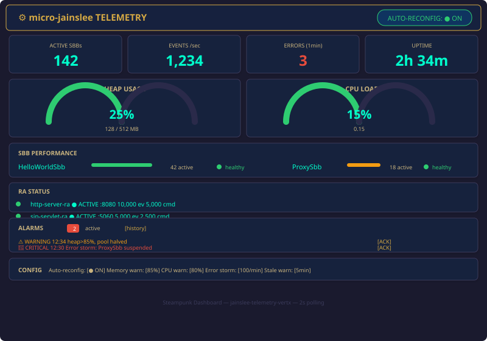
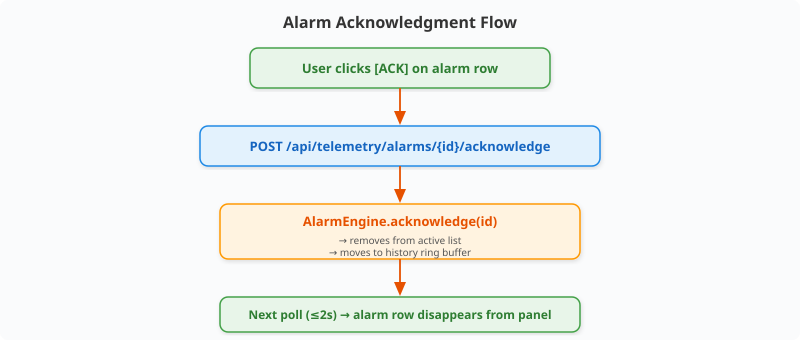
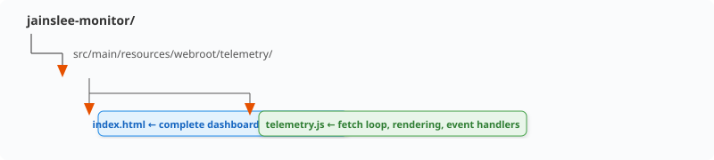

# Telemetry GUI — Steampunk Dashboard

> **Module:** `jainslee-monitor`
> **Theme:** Steampunk × Cyberpunk fusion — brass, copper, dark backgrounds, neon accents
> **Delivery:** Single `index.html` + `telemetry.js`, zero build step, served via Vert.x StaticHandler

---

## Overview

The telemetry dashboard is a browser-based real-time observability UI for
micro-jainslee. It renders live SBB metrics, resource gauges, RA status tables,
alarm panels, and sparkline charts — all in a steampunk/cyberpunk aesthetic.

**Key design decisions:**
- **Single HTML file** — no bundler, no webpack, no npm install
- **Zero framework** — vanilla JS with a few helper functions; no React/Vue/Preact bloat
- **Vert.x StaticHandler** — served from classpath, no separate web server
- **2-second polling** — simple `setInterval` fetching `/api/telemetry/snapshot`
- **CSS variables** — complete theme customization via `:root` block
- **SVG gauges** — hand-drawn arc gauges, no chart library dependency

### Screenshot Description

<p align="center"></p>

---

## Layout Breakdown

### Top Bar
- **Title:** "micro-jainslee TELEMETRY" with gear icon
- **Auto-Reconfig indicator:** Green pulse dot when enabled, grey when disabled
- **Clock:** Shows last snapshot time, updates with data

### Stat Cards (Row 1)
Four large-number cards for at-a-glance health:

| Card | Data Source | Format |
|------|-----------|--------|
| Active SBBs | `snapshot.sbbs[].active` sum | Large number |
| Events/sec | `snapshot.sbbs[].eps` sum | Formatted with comma (1,234) |
| Errors (1min) | `snapshot.recentErrors` last 60s count | Red if > 0 |
| Uptime | `snapshot.resources.uptimeSeconds` | `2h 34m` format |

### Arc Gauges (Row 2)
SVG-drawn semi-circular gauges for resource consumption:

| Gauge | Data | Colors |
|-------|------|--------|
| Heap Usage | `heapUsagePercent` | Green ≤70%, amber ≤85%, red >85% |
| CPU Load | `cpuLoad × 100` | Green ≤50%, amber ≤80%, red >80% |

Each gauge shows:
- Arc segment (filled = usage, unfilled = remaining)
- Center percentage text
- Subtitle with absolute values (e.g., "128 / 512 MB")

### SBB Performance Table (Row 3)
Per-SBB-type rows with:
- **SBB type name**
- **Sparkline** — tiny inline SVG chart of last 30 EPS samples (1 dot per second)
- **Active count**
- **Health dot** — green (healthy), amber (spunk detected), red (errors)

### RA Status Table (Row 4)
Per-RA rows with:
- **RA name**
- **State dot** — green (ACTIVE), red (ERROR), grey (INACTIVE)
- **Port** — bound address
- **Events fired** (formatted)
- **Commands received** (formatted)

### Alarm Panel (Row 5)

| Element | Description |
|---------|-------------|
| Header | "ALARMS" with active count badge and [history] link |
| Row color | Green=INFO, Amber=WARNING, Red=CRITICAL, Purple=FATAL |
| Row content | Level icon + timestamp + message |
| Action | [ACK] button → POST /api/telemetry/alarms/{id}/acknowledge |
| Empty state | "No active alarms" in green text |

### Config Panel (Row 6)
Slider/toggle controls mirroring `application.properties`:
- Auto-reconfig toggle (calls POST /api/telemetry/reconfig)
- Memory warning threshold (75–95%)
- CPU warning threshold (50–95%)
- Error storm threshold (50–500/min)
- Stale warning threshold (1–30 min)

---

## Real-time Update Mechanism

### Primary: 2-Second Polling

```javascript
// telemetry.js
const POLL_INTERVAL = 2000;  // 2 seconds

async function fetchSnapshot() {
    const res = await fetch('/api/telemetry/snapshot');
    const data = await res.json();
    render(data);
}

// Start loop
setInterval(fetchSnapshot, POLL_INTERVAL);
fetchSnapshot();  // immediate first fetch
```

### Differential Rendering

To minimize DOM churn, the render function uses dirty-checking:

```javascript
function render(data) {
    // Only update elements whose values actually changed
    if (data.resources.heapUsagePercent !== lastData.resources.heapUsagePercent) {
        updateGauge('heap-gauge', data.resources.heapUsagePercent);
    }
    // ... per-element dirty checks
    lastData = data;
}
```

### Connection Status

A small dot in the top bar pulses green when the last fetch succeeded, amber after
2 missed fetches (4s), red after 5 missed fetches (10s) with "CONNECTION LOST" text.

---

## Gauge Components Explained

### SVG Arc Gauge Implementation

```html
<svg viewBox="0 0 120 70" class="gauge">
    <!-- Background arc (unfilled) -->
    <path d="M 10 60 A 50 50 0 0 1 110 60"
          fill="none" stroke="var(--gauge-bg)" stroke-width="12"
          stroke-linecap="round" />
    <!-- Filled arc -->
    <path d="M 10 60 A 50 50 0 0 1 110 60"
          fill="none" stroke="var(--gauge-fill)" stroke-width="12"
          stroke-linecap="round"
          stroke-dasharray="157"
          stroke-dashoffset="${157 * (1 - percent/100)}" />
    <!-- Center text -->
    <text x="60" y="45" text-anchor="middle" class="gauge-value">25%</text>
    <text x="60" y="58" text-anchor="middle" class="gauge-label">128 / 512 MB</text>
</svg>
```

### Color Transitions

The fill color uses CSS custom properties that change based on threshold:

```css
.gauge[data-level="safe"]    { --gauge-fill: var(--color-green); }
.gauge[data-level="warning"] { --gauge-fill: var(--color-amber); }
.gauge[data-level="danger"]  { --gauge-fill: var(--color-red); }
```

JavaScript sets `data-level` after each fetch:

```javascript
function updateGauge(id, percent) {
    const el = document.getElementById(id);
    el.dataset.level = percent > 85 ? 'danger'
                     : percent > 70 ? 'warning'
                     : 'safe';
    // update arc stroke-dashoffset
    el.querySelector('.fill-arc')
      .style.strokeDashoffset = 157 * (1 - percent / 100);
    // update text
    el.querySelector('.gauge-value').textContent = Math.round(percent) + '%';
}
```

---

## Alarm Acknowledgment Flow

<p align="center"></p>

Acknowledged alarms can be viewed via the [history] link which fetches
`/api/telemetry/alarms/history?minutes=60`.

---

## Config Panel Usage

The config panel lets operators adjust thresholds at runtime without editing
`application.properties` or restarting the container.

```javascript
async function updateConfig(key, value) {
    await fetch('/api/telemetry/reconfig', {
        method: 'POST',
        headers: { 'Content-Type': 'application/json' },
        body: JSON.stringify({ [key]: value })
    });
}

// Example: memory threshold slider
memorySlider.addEventListener('change', () => {
    updateConfig('memory.warning-threshold', memorySlider.value);
});
```

Changes take effect immediately in the AutoReconfigEngine (no restart).

---

## Customization: CSS Variables

Edit the `:root` block in `index.html` to change the entire theme:

```css
:root {
    /* ── Steampunk Palette ── */
    --bg-primary:        #1a1a2e;    /* deep navy background */
    --bg-secondary:      #16213e;    /* card background */
    --bg-tertiary:       #0f3460;    /* panel header */
    --text-primary:      #e0c097;    /* brass text */
    --text-secondary:    #c9b37e;    /* muted brass */
    --accent-brass:      #d4a843;    /* highlights, borders */
    --accent-copper:     #b87333;    /* secondary accents */
    --accent-neon:       #00ffcc;    /* neon cyan for data */

    /* ── Status Colors ── */
    --color-green:       #2ecc71;
    --color-amber:       #f39c12;
    --color-red:         #e74c3c;
    --color-purple:      #9b59b6;    /* FATAL */

    /* ── Gauge ── */
    --gauge-bg:          #2a2a4a;
    --gauge-fill:        var(--color-green);

    /* ── Typography ── */
    --font-mono:         'JetBrains Mono', 'Fira Code', monospace;
    --font-sans:         'Segoe UI', system-ui, sans-serif;

    /* ── Borders ── */
    --border-color:      #3a3a5a;
    --border-radius:     6px;

    /* ── Shadows ── */
    --card-shadow:       0 2px 8px rgba(0, 0, 0, 0.4);
    --glow-green:        0 0 12px rgba(46, 204, 113, 0.3);
    --glow-red:          0 0 12px rgba(231, 76, 60, 0.3);
}
```

### Quick Theme Swaps

**Dark Cyberpunk:**
```css
--bg-primary: #0d0d0d;
--text-primary: #00ff41;
--accent-neon: #ff00ff;
```

**Light Industrial:**
```css
--bg-primary: #f5f0e8;
--text-primary: #3d3226;
--accent-brass: #8b6914;
```

---

## File Structure

<p align="center"></p>

**index.html** (< 15 KB gzipped):
- Inline `<style>` with all CSS
- Semantic HTML structure with data attributes
- SVG gauge templates (hidden, cloned by JS)
- `<script type="module" src="telemetry.js"></script>`

**telemetry.js** (< 8 KB gzipped):
- `fetchSnapshot()` — 2s polling loop
- `render(data)` — dirty-checked DOM updates
- `updateGauge()`, `updateSparkline()`, `renderAlarms()`, `renderRas()`
- Config slider event handlers
- Connection health monitor

**Zero external dependencies.** No CDN fetches. Works fully offline.
