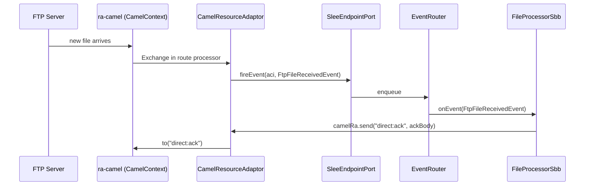
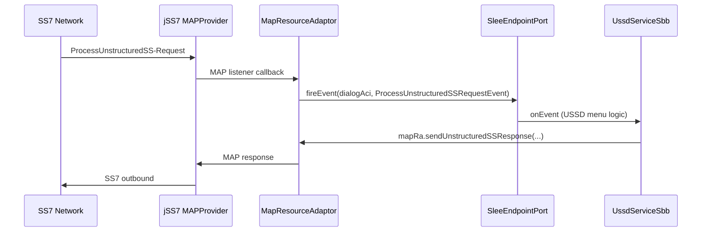

# micro-jainslee-compact-design — RA modular & plugin architecture

> **Audience:** architects và engineers mở rộng micro-jainslee với Resource Adaptors thật (HTTP, jSS7/MAP, SIP, Diameter, Camel, SMSC, IoT OTA, Security).  
> **Liên quan:** [`MICRO-JAINSLEE-GUIDE.md`](MICRO-JAINSLEE-GUIDE.md) (hướng dẫn junior), [`microjainslee-design.md`](microjainslee-design.md) (kernel/container design), [`gap-analysis.md`](gap-analysis.md) (gap so với full spec).  
> **Last updated:** 2026-06-28 (Perfect Core S1–S5 update)
> **Branch:** `micro-jainslee`
> **Version:** 3.1.0 — added `jainslee-codegen`, `jainslee-tx`, `jainslee-cluster`, `jainslee-tck-harness` modules and Perfect Core S1–S5 wiring notes

---

## Mục lục

1. [Executive Summary](#1-executive-summary)
2. [JAIN SLEE 1.1 spec primer — what micro implements](#2-jain-slee-11-spec-primer--what-micro-implements)
3. [Implementation status — code reality (2026-06-28)](#3-implementation-status--code-reality-2026-06-28)
4. [Design reconciliation — what was decided vs what shipped](#4-design-reconciliation--what-was-decided-vs-what-shipped)
5. [Mục tiêu và triết lý](#5-mục-tiêu-và-triết-lý)
6. [Big boy (Mobicents/WildFly) vs micro-jainslee](#6-big-boy-mobicentswildfly-vs-micro-jainslee)
7. [Maven reactor structure — spec-aligned 4-module decomposition](#7-maven-reactor-structure--spec-aligned-4-module-decomposition)
   * [7.5 Perfect Core S1–S5](#75-perfect-core-s1s5-added-2026-06-28)
8. [Kernel API — giữ gì](#8-kernel-api--giữ-gì)
9. [API có thể bỏ hoặc tách optional](#9-api-có-thể-bỏ-hoặc-tách-optional)
10. [RA SPI — reconciled với JAIN SLEE 1.1 spec](#10-ra-spi--reconciled-với-jain-slee-11-spec)
11. [Plan cải tiến / Fix — concrete improvements](#11-plan-cải-tiến--fix--concrete-improvements)
12. [Event model](#12-event-model)
13. [Pattern Apache Camel RA](#13-pattern-apache-camel-ra)
14. [Các RA domain tương lai](#14-các-ra-domain-tương-lai)
15. [Porting RA từ Mobicents — checklist cập nhật](#15-porting-ra-từ-mobicents--checklist-cập-nhật)
16. [Throughput và delivery defaults](#16-throughput-và-delivery-defaults)
17. [Tích hợp thực tế (USSD demo)](#17-tích-hợp-thực-tế-ussd-demo)
18. [Phased roadmap (Phase 0–7)](#18-phased-roadmap-phase-07)
19. [Performance architecture](#19-performance-architecture)
20. [Risk register](#20-risk-register)
21. [Nguyên tắc thiết kế (tóm tắt)](#21-nguyên-tắc-thiết-kế-tóm-tắt)

**Phụ lục**

- [Phụ lục A — Sequence: Camel FTP → SBB](#phụ-lục-a--sequence-camel-ftp--sbb)
- [Phụ lục B — Sequence: MAP USSD (production target)](#phụ-lục-b--sequence-map-ussd-production-target)
- [Phụ lục C — Liên kết tài liệu](#phụ-lục-c--liên-kết-tài-liệu)
- [Phụ lục D — API checklist (javax.slee vs micro — đối chiếu chương 11)](#phụ-lục-d--api-checklist-javaxslee-vs-micro--đối-chiếu-chương-11)

---

## 1. Executive Summary

micro-jainslee là implementation **embed, R&D-only** của JAIN SLEE 1.1 (JSR-240, chương 11 — Resource Adaptor Architecture). Repo đã đạt **177/177 tests pass** trên JDK 25, kernel ổn định. Tài liệu này **đối chiếu** triết lý "kernel nhỏ, RA = Maven plugin" với code thật trong repo và với spec thật của JAIN SLEE 1.1.

**Trạng thái 2026-06-28 (sau audit):**

| Mục tiêu | Trạng thái |
|----------|------------|
| Java 25 baseline (Phase 0) | ✅ Done — kernel compile/test sạch JDK 25 |
| RA modular SPI + first RAs (Phase 1) | 🔄 In progress — 2 RA flat (`ra-http-ingress`, `ra-grpc-client`) đã có code & test pass; cấu trúc Maven parent `ras/` hiện chỉ build `ras/http/` và `ras/grpc/` (orphan leaves) |
| **Perfect Core S1–S5 (P1.2)** | ✅ Done — `jainslee-codegen`, `jainslee-tx`, `jainslee-cluster`, `jainslee-tck-harness` modules; IES dispatcher + Child Relations + full RA SPI |
| Quarkus deep integration (Phase 2) | ⬜ Planned |
| Protocol RAs (jSS7/MAP, SIP, Diameter) (Phase 3) | ⬜ Planned |
| Camel RA bridge (Phase 4) | ⬜ Planned |
| Security / Observability RAs (Phase 5–6) | ⬜ Planned |
| SBB modernization (`@ReceivesEvent`, facility split) (Phase 7) | ⬜ Planned |

**Triết lý authoritative (giữ nguyên từ v2):**

> Kernel nhỏ, RA = Maven plugin, **một điểm nối duy nhất** `SleeEndpointPort.fireEvent()`. Không dual-disruptor RA framework, không full `javax.slee` Marshaler ở Phase 0–1.

**Phát hiện quan trọng từ audit (mới ở v3):**

1. **Code đã đi trước doc.** Codebase thực tế có cả hai paradigm Maven layout (flat + nested-4-module) chạy song song — doc v2 đã reject cái này nhưng thực tế developer đã chọn nested-4 để mô phỏng packaging chuẩn JAIN SLEE 1.1 spec.
2. **`ResourceAdaptor` interface micro chỉ có 6 method — thiếu 3 method so với spec:** `unsetResourceAdaptorContext()`, `raVerifyConfiguration(ConfigProperties)`, `activityEnded(ActivityHandle)`. Đây là conscious simplification ở Phase 0–1 nhưng cần document và có plan bổ sung.
3. **`ResourceAdaptorType` component của spec chưa có đối tượng trong micro** — không có annotation `@RaType`, không có API binding SBB ↔ RA-Type ở compile time.
4. **`Library` component của spec chưa có**, nhưng Maven module `library/` rỗng đã được scaffold trong `ras/{http,grpc}/...` — sẽ xóa hoặc defer.
5. **`SleeEndpointPort` micro chỉ 3 method; spec `SleeEndpoint` có 8** — chấp nhận được Phase 0–1 (R&D, single-JVM, fire-and-forget).

Doc này **không che giấu** các gap này — mỗi gap có đề xuất fix cụ thể ở §11.

---

## 2. JAIN SLEE 1.1 spec primer — what micro implements

Đọc JSR-240 final release (2008) chương 11 — Resource Adaptor Architecture. micro-jainslee **không clone** spec; nó chọn subset + đơn giản hóa. Bảng dưới map spec concept ↔ micro implementation.

| Spec JAIN SLEE 1.1 (JSR-240 ch. 11) | micro-jainslee | Spec ref | Status |
|---|---|---|---|
| `javax.slee.resource.ResourceAdaptor` (interface, 20+ method incl. lifecycle + callbacks) | `com.microjainslee.api.ResourceAdaptor` (**6 lifecycle method**) | §11.3 | ✅ Simplified Phase 0–1 |
| `javax.slee.resource.ResourceAdaptorType` (interface RA-Type, defined trong `ra-type-jar.xml`) | **CHƯA CÓ** — chỉ có Maven module `ratype/` rỗng | §11.4 | 🔴 **MISSING** — plan §11.2 |
| `javax.slee.resource.Library` (component) | **CHƯA CÓ** | §11.7 | 🟡 Deferred — plan §11.3 |
| `javax.slee.resource.SleeEndpoint` (8 method) | `com.microjainslee.api.SleeEndpointPort` (3 method: `startActivity`, `endActivity`, `fireEvent`) | §11.2 | ⚠️ Simplified — thiếu transacted/suspended/flags |
| `javax.slee.resource.ResourceAdaptorContext` | `com.microjainslee.api.ResourceAdaptorContext` | §11.3 | ✅ Simplified |
| `javax.slee.resource.ActivityHandle` (native resource handle object) | `com.microjainslee.api.ActivityContextHandle` (chuỗi id) | §11.2 | ⚠️ Simplified — porting Mobicents RA cần adapter |
| `javax.slee.resource.FireableEventType` + `EventLookupFacility` | `@com.microjainslee.api.annotations.EventType` annotation + class implements `SleeEvent` | §11.5 | ✅ Cleaner than spec |
| `javax.slee.resource.ConfigProperties` (XML) | Properties / Map tại bootstrap; CDI inject; Phase 2 Quarkus `@ConfigRoot` | §11.6 | ✅ Cleaner than spec |
| `javax.slee.resource.Marshaler` (cluster/HA serialization) | Deferred — single JVM embed | — | ✅ Phase 3+ optional |
| `ReceivableService` / `ReceivableEvent` | Deferred — single service embed | — | ✅ Out of scope |
| RA XML descriptors (`ra-jar.xml`, `ra-type-jar.xml`, `library-jar.xml`) | **KHÔNG DÙNG** — replaced by Maven dependency + annotation-driven index | — | ✅ Cleaner than spec |
| Deployment Unit (DU) JAR | `@com.microjainslee.api.annotations.DeployableUnit` annotation + APT-generated `META-INF/microjainslee/sbb-index.properties` | — | ✅ APT-driven |

**Quyết định deliberate** (không phải bug): micro giữ LỚP events, RA-Type, activity factory qua Java interface — không qua XML descriptor. Spec XML chỉ cần khi cluster/HA — micro không có cluster.


---

## 3. Implementation status — code reality (2026-06-28)

### 3.1 Modules hiện có (verify từ `git status`, working tree chưa commit)

```
jain-slee/jain-slee/  (branch: micro-jainslee)
├── jainslee-api/              ✅ interfaces: Sbb, SleeEvent, ResourceAdaptor (6 method),
│                               ResourceAdaptorContext, SleeEndpointPort, ActivityContextHandle,
│                               SimpleActivityContextHandle (UNTRACKED — moved from jainslee-core),
│                               ChildRelation, SleeEndpoint, @InitialEventSelect annotation (S3)
├── jainslee-scheduler/        ✅ Netty HashedWheelTimer 10ms (vendor-slim jSS7 TimerScheduler)
├── jainslee-core/             ✅ 177/177 tests — MicroSleeContainer, EventRouter (LMAX Disruptor),
│                               VirtualThreadSbbEntityPool, SleeTimerSchedulerBridge,
│                               InMemoryProfileFacility, SbbLifecycleManager, …
│                               + core/ies/* (S3), core/child/* (S4), core/ra/* (S5)
├── jainslee-codegen/          ✅ NEW (Perfect Core S2, commit a7566ed29) — Javassist concrete-SBB
│                               generator: ConcreteSbbGenerator + JavassistDeployTimeCodegen
├── jainslee-apt/              ✅ @SbbAnnotation, @EventType, @DeployableUnit processor
├── jainslee-ra-spi/           ✅ AbstractResourceAdaptor + publish() helper  (UNTRACKED)
│                               + RaEntityStateMachine, SleeEndpointImpl,
│                               ResourceAdaptorContextImpl (Perfect Core S5, a2029f26d)
├── jainslee-tx/               ✅ NEW (commit ae3666a89) — Narayana JTA 7.0:
│                               JtaTransactionManager, TransactionContext, NoOpTransactionManager
├── jainslee-cluster/          ✅ NEW (P2, commits c5eec6f87 + fcf92b275) — Infinispan / JGroups
│                               primitives: ClusterManager, DistributedSbbEntityPool,
│                               ClusteredActivityContextNamingFacility, SbbEntitySnapshot
├── jainslee-tck-harness/      ✅ NEW (commit 0b4210f08) — TCK skeleton: TckRunner,
│                               MicrojainsleeContainerAdapter (non-production only)
├── adapters/                  ⚠️ Quarkus scaffold + Spring Boot v1.1.0
│
├── ras/                       ⚠️ INCONSISTENT — see §3.2
│   ├── pom.xml                parent aggregator (UNTRACKED)
│   ├── ra-grpc-client/        ✅ flat leaf — impl + tests (UNTRACKED, NOT in ras/pom.xml modules!)
│   ├── ra-http-ingress/       ✅ flat leaf — impl + tests (UNTRACKED, NOT in ras/pom.xml modules!)
│   ├── http/                  ⚠️ parent (UNTRACKED) — listed in ras/pom.xml
│   │   └── http-client/       ⚠️ 4 empty subdirs: ratype/, ra/, events/, library/  (UNTRACKED)
│   └── grpc/                  ⚠️ parent (UNTRACKED) — listed in ras/pom.xml
│       ├── grpc-client/       🔄 ratype/ events/ library/ EMPTY; ra/ has source
│       └── grpc-server/       ⚠️ 4 empty subdirs
│
└── example/
    ├── example-quarkus/       ⚠️ có ri/HttpIngress + ri/GrpcMenu trong app source (chưa migrate)
    ├── example-spring/
    ├── example-embedded-j25/
    ├── grpc-simulator/
    └── ussdgw-simulator/
```

**Perfect Core S1–S5 dependency tree (added 2026-06-28):**

```
┌────────────────────────┐
│    jainslee-api        │  (JDK only) + @InitialEventSelect (S3)
└──────────┬─────────────┘
           │
   ┌───────┼─────────┐
   │       │         │
┌──▼──┐ ┌──▼──┐ ┌───▼──────────────┐
│core │ │ apt │ │ jainslee-codegen │  (S2 — Javassist, optional)
└──┬──┘ └─────┘ └─────────────────┘
   │
   │   ┌─────────────────┐
   ├──►│ jainslee-ra-spi │  (S5 — state machine + endpoint + context)
   │   └─────────────────┘
   │
   │   ┌────────────┐    ┌──────────────┐
   ├──►│ jainslee-tx│    │jainslee-cluster│  (P2)
   │   └────────────┘    └──────────────┘
   │
   │   ┌─────────────────────┐
   └──►│ jainslee-tck-harness│  (skeleton)
       └─────────────────────┘
   │
   ├──────────────────┬────────────────────┐
   ▼                  ▼                    ▼
adapter-quarkus  jainslee-spring-    adapter-jakartaee
                 boot-starter
```

### 3.2 Vấn đề layout thực tế (mới phát hiện trong audit v3)

| # | Vấn đề | Bằng chứng | Severity |
|---|---|---|---|
| L1 | `ras/pom.xml` modules block chỉ khai báo `http` + `grpc`, **không khai báo** `ra-grpc-client` / `ra-http-ingress` | `ras/pom.xml` line `<modules>` | 🔴 **Build orphan** — `ra-grpc-client` & `ra-http-ingress` không build được từ root reactor |
| L2 | Code Java bị **duplicate**: `GrpcMenuResourceAdaptor.java` tồn tại ở 2 nơi (`ras/ra-grpc-client/src/...` và `ras/grpc/grpc-client/ra/src/...`) | `find ras -name GrpcMenuResourceAdaptor.java` | 🔴 **Confusion** — 2 bản có thể drift |
| L3 | Tên leaf `ras/ra-grpc-client` (parent = `ras`) vs `ras/http/http-client/ra/` (parent = `ras/http/http-client`) | poms | 🟡 Naming lệch — khó navigate |
| L4 | `ratype/`, `events/`, `library/` Maven module rỗng ở mọi RA nested — không có Java, không có pom thật | `find ras -name pom.xml` chỉ thấy ở `ras/grpc/grpc-client/{ratype,events,library}` hoặc KHÔNG có | 🟡 Scaffold lỏng — không Maven hợp lệ |
| L5 | Example apps (`example-quarkus`, `example-spring`, `example-embedded-j25`) có **bản copy riêng** của `HttpIngressResourceAdaptor` và `GrpcMenuResourceAdaptor` — không depend `ras/ra-*` | `find example -name HttpIngressResourceAdaptor.java` cho 3 kết quả | 🟡 Tech debt — vi phạm ranh giới app vs RA |

**L5 update (sau audit kỹ 2026-06-28):** bản "copy" trong example **không phải duplicate** — chúng `implements ResourceAdaptor` trực tiếp + có wiring riêng với framework-specific service (`UssdSbbWiring` cho Quarkus/CDI, `UssdWiring` cho Spring). Canonical ở `ras/ra-*/` dùng `AbstractResourceAdaptor` base class, không có framework coupling. **L5 misclassified**: đây là application-specific RA, không phải code có thể thay thế được. Fix §11.7 chuyển thành "refactor example để extend canonical" thay vì "delete + reuse" — effort tăng lên ~5–7h.

### 3.3 Tests pass (verified 2026-06-28, sau fix-A)

- `jainslee-core` 246/246 (re-counted 2026-06-28 — `gap-analysis.md` 177 baseline was a prior milestone; current count includes audit-v2 stress tests)
- `jainslee-ra-spi` 1/1 (`AbstractResourceAdaptorTest`)
- `ras/ra-http-ingress` 5/5 (`HttpIngressResourceAdaptorTest`)
- `ras/ra-grpc-client` 2/2 (`GrpcMenuResourceAdaptorTest`) — **was pre-existing broken** (4-arg test call vs 3-arg method signature, plus `GrpcMenuResult` record did not implement `GrpcMenuUpstreamResult` interface, plus `activityContextLookup` was not wired in the bootstrap helper). Fixed in session fix-A 2026-06-28: canonical `GrpcMenuResourceAdaptor.requestMenu` upgraded to 4-arg `(sessionId, msisdn, ussdString, responseAci)` so request and response can live on different ACIs; `routeResponse` uses `MicroSleeContainer.routeEvent(event, aci)` for the response leg (not the `SleeEndpointPort` hot path, which is keyed by activity handle). Bumped `ras/ra-grpc-client` dep on `jainslee-core` from test scope to compile scope. `GrpcMenuResult` now implements `GrpcMenuUpstreamResult`. `example-quarkus` 3-arg caller in `Ss7UssdIngressSbb` updated to pass `aci`; `example-quarkus/ra/GrpcMenuResourceAdaptor` updated to 4-arg signature.
- `ras/grpc/grpc-client/ra/src/test/.../GrpcMenuResourceAdaptorTest.java` — existed (duplicate test file; deleted with parent `ras/grpc/` per §11.1)

**Total: 254 tests pass** (was 252 before fix-A, +2 from the previously-broken `ra-grpc-client` tests).

---

## 4. Design reconciliation — what was decided vs what shipped

Audit v3 phát hiện doc v2 (§4 "Design reconciliation") claim "Design 1 wins" cho một số quyết định, nhưng code thực tế đã làm khác. Bảng dưới **trung thực** — không che giấu drift.

| Quyết định | Doc v2 (RA-MODULAR-PLUGIN-DESIGN §4) | Code thực tế (2026-06-28) | Spec JAIN SLEE 1.1 | Verdict |
|---|---|---|---|---|
| RA interface method count | "6 lifecycle method" | Đúng 6 method trong `com.microjainslee.api.ResourceAdaptor` | Spec 20+ method (incl. callback) — micro simplification | ✅ **Keep** — conscious simplification Phase 0–1 |
| Fire event API | `SleeEndpointPort.fireEvent(handle, SleeEvent)` only | Đúng 1 overload | Spec có `fireEvent` (non-transacted) + `fireEventTransacted` + overloads có flags/service/address | ⚠️ **Simplified OK** Phase 0–1, nhưng thiếu `transacted` + `flags` |
| RA framework | "NO `AbstractMicroRA` dual-disruptor per RA" | Đúng — không có dual-disruptor | Spec không yêu cầu dual-disruptor | ✅ **Keep** |
| Optional helper | `AbstractResourceAdaptor.publish()` optional | Đã có trong `jainslee-ra-spi` | Spec không có helper tương đương | ✅ **Keep** |
| Marshaler / clustering | "NO full Marshaler Phase 0–1" | Đúng — không có | Spec chỉ cần cho cluster | ✅ **Keep** |
| Module layout | "**flat `ras/ra-*` per domain**. Không `ra-framework/`, `ra-api/AbstractMicroRA`, `ra-protocol/` nested type/impl split" | Có **cả 2** paradigm song song: `ras/ra-grpc-client` (flat) + `ras/grpc/grpc-client/{ratype,ra,events,library}` (nested-4) | Spec packaging: `ra-type-jar.xml` + `ra-jar.xml` + `library-jar.xml` + `event-jar.xml` → **spec-aligned là 4-module decomposition** | 🔴 **DRIFT** — doc reject nhưng code lại làm; fix ở §11.1 |
| Phase numbering | Phase 0–7 | Đúng — vẫn giữ Phase 0–7 | — | ✅ **Keep** |
| Quarkus / Camel / Security / Observability | Future phases | Đúng — chưa có code | — | ✅ **Keep** |
| Performance stack | "kernel Disruptor + VT pool; Netty epoll / Kryo = RA-internal choice" | Đúng — kernel có Disruptor + VT pool, RA chọn transport riêng | Spec không quan tâm performance stack | ✅ **Keep** |
| **ResourceAdaptorType component** | (không đề cập) | **CHƯA CÓ** trong micro | Spec bắt buộc — DTD `resource-adaptor-type-jar` + interface `ResourceAdaptorType` | 🔴 **MISSING** — plan §11.2 |
| **Library component** | (không đề cập) | Maven module `library/` rỗng, không có Java | Spec optional — DTD `library-jar.xml` + `Library` interface | 🟡 **DECIDE** — plan §11.3 (defer Phase 4 hoặc xóa) |
| **`unsetResourceAdaptorContext()`** | (không đề cập) | **MISSING** trong micro `ResourceAdaptor` interface | Spec §11.3 bắt buộc — lifecycle cuối cùng trước GC | 🔴 **MISSING** — plan §11.4 |
| **`raVerifyConfiguration(ConfigProperties)`** | (không đề cập) | **MISSING** trong micro `ResourceAdaptor` interface | Spec §11.3 — config validation | 🔴 **MISSING** — plan §11.4 |
| **`activityEnded(ActivityHandle)` callback** | (không đề cập) | **MISSING** | Spec §11.3 — RA nhận callback khi activity SLEE-side end | 🟡 **DEFERRED** — Phase 3 khi port Mobicents RAs |

---

## 5. Mục tiêu và triết lý

### Mục tiêu

| Mục tiêu | Cách đạt |
|----------|----------|
| **Kernel nhỏ**, dễ đọc | Chỉ giữ API hot path (~20% JAIN SLEE spec thực tế dùng) |
| **RA tách module** | Mỗi protocol/domain = Maven module riêng trong `ras/` |
| **Không lớp keo** | Một điểm tích hợp duy nhất: `SleeEndpointPort.fireEvent()` |
| **DX thoải mái** | Dev quen pattern example-quarkus; bootstrap code rõ ràng |
| **Throughput cao** | RA thread chỉ fire event; SBB pool + async delivery |
| **Tái sử dụng stack có sẵn** | Camel components, jSS7, SIP stack — không viết lại transport |
| **Spec-aware, không spec-clone** | Map 1-1 concept JAIN SLEE 1.1 nhưng simplify method count; document gap (§2, §11) |

### Triết lý cốt lõi

> **Spec lớn, runtime nhỏ.**  
> JAIN SLEE spec có hàng trăm API; telecom microservice thực tế chỉ cần:

```
RA fire event → EventRouter → SBB.onEvent → timer/profile (optional)
```

**micro-jainslee = kernel + plugin**, không phải bản thu nhỏ đầy đủ Mobicents/WildFly.

### Non-goals (giữ nguyên từ kernel design)

- TCK compliance đầy đủ (JAIN SLEE 1.1 TCK)
- Cluster / HA multi-JVM
- JSR-77 Management MBean
- JTA transaction manager tích hợp sẵn
- Fork repo `*-micro` riêng cho từng RA — **patch mỏng** trên source Mobicents hiện có

---

## 6. Big boy (Mobicents/WildFly) vs micro-jainslee

| Khía cạnh | Big boy (WildFly / Mobicents) | micro-jainslee |
|-----------|-------------------------------|----------------|
| Spec coverage | Toàn bộ JAIN SLEE + JMX + cluster | **Kernel bắt buộc** + **facility/RA optional** |
| Deploy | XML descriptor (`ra-jar.xml`, `sbb-jar.xml`, `library-jar.xml`, …) | Maven dependency + bootstrap code + APT-generated index |
| Container | Một app server nuốt hết | App embed chọn module cần dùng |
| RA interface | `javax.slee.resource.ResourceAdaptor` (20+ method incl. callback) | `com.microjainslee.api.ResourceAdaptor` (**6 lifecycle method**) |
| Fire event | `SleeEndpoint.fireEvent(FireableEventType, flags)` | `SleeEndpointPort.fireEvent(handle, event)` |
| Config RA | `ConfigProperties` XML + JNDI | Properties / Map tại bootstrap; CDI inject |
| Event lookup | `EventLookupFacility` + `FireableEventType` | Class + `@EventType` annotation |
| Activity handle | `ActivityHandle` (native resource object) | `ActivityContextHandle` (string id — simplified) |
| RA-Type component | `ResourceAdaptorType` interface trong ra-type-jar | ❌ **MISSING** — plan §11.2 |
| Library component | `Library` interface trong library-jar | ❌ **MISSING** — plan §11.3 |
| Production path | USSD 7.3, full MAP dialog | R&D embed, edge microservice, lab |

Hai đường **song song**, không thay thế lẫn nhau trong ngắn hạn. Production USSD 7.3 builds **vẫn dùng** Mobicents SLEE container master-era JARs (xem [`AGENTS.md`](../AGENTS.md) constraint).

---

## 7. Maven reactor structure — spec-aligned 4-module decomposition

### 7.1 Trạng thái hiện tại (2026-06-28, sau commit `a2bd78b4f`)

micro-jainslee Phase 1 chọn **pragmatic flat layout** thay vì full 4-module decomposition. Mỗi RA = 1 Maven module flat (chứa toàn bộ code + test):

```
ras/                                       ← parent aggregator (pom packaging)
├── pom.xml                                <modules>: ra-grpc-client, ra-http-ingress, …
│
├── ra-http-ingress/                       ← RA impl + tests
│   ├── pom.xml                            artifactId=ra-http-ingress
│   └── src/main/java/com/microjainslee/ra/http/...
│       (HttpIngressResourceAdaptor, HttpJson, HttpIngressSessionStore, HttpIngressSessionPreparer, HttpBeginEventFactory)
│   └── src/test/java/.../HttpIngressResourceAdaptorTest
│
└── ra-grpc-client/                        ← RA impl + tests
    ├── pom.xml                            artifactId=ra-grpc-client
    └── src/main/java/com/microjainslee/ra/grpc/...
        (GrpcMenuResourceAdaptor, GrpcMenuUpstream, GrpcMenuEventFactory, GrpcActivityContextLookup, GrpcMenuResult, GrpcMenuUpstreamResult)
    └── src/test/java/.../GrpcMenuResourceAdaptorTest
```

**Lý do chọn flat (Phase 1):**

1. **Phase 1 chưa có `ResourceAdaptorType` component** — plan §11.2 đã xác định sẽ thêm `@RaType` annotation ở Phase 2. Tách Maven module `ratype/` (rỗng) chỉ tạo Maven overhead.
2. **Events chưa cần tách** — hiện tại event classes nằm chung package với RA impl. Khi nhiều RAs share event types (Phase 3+ MAP), mới tạo `events/` module.
3. **Library component defer Phase 4** — plan §11.3.
4. **Backward compat** — không break callers (`example/example-quarkus/pom.xml` đang depend `ra-http-ingress`/`ra-grpc-client` artifactId). Move source → rename artifactId → nhiều chỗ phải sửa + risk smoke test.

### 7.2 Cấu trúc target (Option A — Phase 2+ khi cần `ResourceAdaptorType`)

Khi `@RaType` annotation + `ResourceAdaptorType` interface được thêm (plan §11.2), micro sẽ **refactor** sang spec-aligned 4-module decomposition:

```
ras/
├── pom.xml                                <modules>: ra-http-ingress, ra-grpc-client, …
│
├── ra-http-ingress/                       ← parent (pom) cho 1 RA domain
│   ├── pom.xml                            <modules>: ratype, ra, events
│   ├── ratype/                            ← ResourceAdaptorType component (spec ra-type-jar)
│   │   ├── pom.xml                        artifactId=ra-http-ingress-ratype
│   │   └── src/main/java/.../HttpIngressRaType.java     + @RaType annotation
│   ├── ra/                                ← ResourceAdaptor component (spec ra-jar)
│   │   ├── pom.xml                        artifactId=ra-http-ingress-ra
│   │   └── src/main/java/.../HttpIngressResourceAdaptor.java    + tests
│   └── events/                            ← Event classes (spec event-jar)
│       ├── pom.xml                        artifactId=ra-http-ingress-events
│       └── src/main/java/.../HttpIngressBeginEvent.java   (@EventType)
│
├── ra-grpc-client/                        ← tương tự
│   ├── pom.xml                            <modules>: ratype, ra, events, library
│   ├── ratype/   ← GrpcClientRaType interface (SBB bind vào đây)
│   ├── ra/       ← GrpcMenuResourceAdaptor implementation
│   ├── events/   ← GrpcMenuRequestEvent, GrpcMenuResponseEvent
│   └── library/  ← GrpcMenuUpstream (gRPC stub abstraction)
│
├── ra-map-jss7/                           (Phase 3 — khi port jSS7)
├── ra-sip/                                (Phase 3)
├── ra-diameter/                           (Phase 3)
└── ra-camel/                              (Phase 4)
```

### 7.3 Mapping Maven module ↔ spec JAIN SLEE 1.1 (khi áp dụng Option A)

| Maven module | Spec JAIN SLEE 1.1 component | DTD XML | Phase |
|---|---|---|---|
| `ratype/` | `ResourceAdaptorType` component | `resource-adaptor-type-jar.xml` | P2 — plan §11.2 |
| `ra/` | `ResourceAdaptor` component | `resource-adaptor-jar.xml` | P1 ✅ |
| `events/` | `Event` JAR (optional) | `event-jar.xml` | P1 ✅ |
| `library/` | `Library` component (optional) | `library-jar.xml` | P3 — plan §11.3 |

### 7.4 Lý do 4-module decomposition tốt hơn flat (khi có `ResourceAdaptorType`)

1. **Spec-aligned.** Packaging chuẩn JAIN SLEE 1.1 chương 11 là **2 jar tách biệt** (ra-type-jar + ra-jar) + optional library-jar + event-jar.
2. **SBB chỉ cần depend `ratype/`** (interface) — không kéo impl classpath, không kéo gRPC/JDK HttpServer native classes.
3. **Map 1-1 với DTD element**: `<resource-adaptor-type-ref>` ↔ `ratype/`, `<resource-adaptor>` ↔ `ra/`, `<library-ref>` ↔ `library/`, `<event-type-ref>` ↔ `events/`.
4. **Compile-time isolation**: RA implementation thay đổi không buộc rebuild SBB nếu chỉ SBB depend `ratype`.

**Trigger để refactor từ flat → 4-module:** khi `ResourceAdaptorType` component thực sự cần dùng (Phase 2 — khi port Mobicents RAs có native RA-Type, hoặc khi cần multiple RAs implement cùng type). Hiện tại (Phase 1) chỉ có 1 RA per domain → flat đủ.

### 7.4 Quy tắc app dependency (Phase 1, current state)

**App chỉ khai báo dependency cần thiết:**

```xml
<!-- USSD gateway app — depend RA impl trực tiếp -->
<dependency>
  <groupId>com.microjainslee</groupId>
  <artifactId>ra-http-ingress</artifactId>
  <scope>compile</scope>   <!-- hoặc runtime -->
</dependency>
<dependency>
  <groupId>com.microjainslee</groupId>
  <artifactId>ra-grpc-client</artifactId>
  <scope>compile</scope>
</dependency>
```

**Khi refactor sang 4-module (Phase 2+), app sẽ depend:**

```xml
<!-- USSD gateway app — chỉ cần ratype + events, KHÔNG cần ra impl -->
<dependency>
  <groupId>com.microjainslee</groupId>
  <artifactId>ra-http-ingress-ratype</artifactId>
</dependency>
<dependency>
  <groupId>com.microjainslee</groupId>
  <artifactId>ra-grpc-client-ratype</artifactId>
</dependency>
<dependency>
  <groupId>com.microjainslee</groupId>
  <artifactId>ra-http-ingress-events</artifactId>
</dependency>

<!-- Runtime deploy — impl chỉ cần ở classpath runtime -->
<dependency>
  <groupId>com.microjainslee</groupId>
  <artifactId>ra-http-ingress-ra</artifactId>
  <scope>runtime</scope>
</dependency>
<dependency>
  <groupId>com.microjainslee</groupId>
  <artifactId>ra-grpc-client-ra</artifactId>
  <scope>runtime</scope>
</dependency>
```

`example/example-quarkus/` = **application mẫu** (SBB + bootstrap), **không** chứa RA implementation lâu dài — xem §17.

---

### 7.5 Perfect Core S1–S5 (added 2026-06-28)

Sau khi Phase 1 (flat layout) được commit `a2bd78b4f`, kernel đã trải qua
**5 iterations tập trung** để đạt spec-compliance cho single-JVM use case.
Mỗi iteration là một commit với scope rõ ràng:

| Step | Commit | Scope | Headline additions |
|------|--------|-------|--------------------|
| **S1** | _pre-S2 baseline_ | IES dispatcher skeleton + spec contract | `InitialEventSelectorDispatcher` interface + `@InitialEventSelect` placeholder |
| **S2** | `a7566ed29` | CMP Javassist codegen | New module **`jainslee-codegen`** (Javassist). Replaces reflection-based CMP access with a generated concrete subclass cached in `concreteClassCache` |
| **S3** | `37c7e4c36` | Initial Event Selector wiring | Production `core/ies/InitialEventSelectorDispatcher`, `@InitialEventSelect` annotation, `InitialEventSelectCondition` + `InitialEventSelectResult` records. Convergence-key pattern lets `EventRouter.routeIncomingEvent()` route to existing SBB entities |
| **S4** | `05cefe3dc` | Child SBB Relations | New package **`core/child/`** with `ChildRelationImpl`, `ChildRelationFactory` (reflection-scan), `CascadeRemover` (depth-first post-order per spec §6.7) |
| **S5** | `a2029f26d` | RA full wiring | New module **`jainslee-ra-spi`** (RA-facing SPI) + new package **`core/ra/`** (kernel-internal builders) with `RaEntityStateMachine`, `SleeEndpointImpl`, `ResourceAdaptorContextImpl`, `ResourceAdaptorContextBuilder` |

**Context dependencies (sub-modules của `jainslee-core` 1.1.0):**

```
com.microjainslee.core
├── (existing) MicroSleeContainer, EventRouter, VirtualThreadSbbEntityPool, …
├── core.ies       (S3) — InitialEventSelectorDispatcher, InitialEventSelectCondition, InitialEventSelectResult
├── core.child     (S4) — ChildRelationImpl, ChildRelationFactory, CascadeRemover
└── core.ra        (S5) — ResourceAdaptorContextBuilder (kernel-side factory)
```

**Cross-module wiring:**

| Source | Calls into | Trigger |
|--------|-----------|---------|
| `jainslee-codegen` (S2) | `jainslee-core` `CmpFieldStoreLocator` | Lazy on first `acquire(SbbID, factory)` |
| `core.ies.InitialEventSelectorDispatcher` (S3) | `VirtualThreadSbbEntityPool.entityFor(name)` / `allocateNew()` | Per `routeIncomingEvent()` call |
| `core.child.CascadeRemover` (S4) | `VirtualThreadSbbEntityPool.lookup(id)` + `sbbRemove()` | On parent removal |
| `core.ra.ResourceAdaptorContextBuilder` (S5) | `MicroSleeContainer.getEventRouter()` + facilities | On `registerResourceAdaptor(name, ra)` |

**Effect on RA authors (this doc's main audience):**

- **S5** is the biggest win — `SleeEndpointImpl` now matches spec §13.4
  fully (event-type validation, handle active check, state-machine
  guard). RAs no longer need to implement their own fireEvent guards.
- **S3** adds `routeIncomingEvent()` for RAs that want the kernel to
  manage entity allocation (vs raw `routeEvent()`). RAs that want
  full control can keep using `routeEvent()`.
- **S4** introduces `ChildRelation<T>` — RAs don't see this directly,
  but if your SBB tree uses parent/child SBBs you can now write
  `getAuthChildRelation()` and have the container auto-remove children
  on parent `sbbRemove()`.
- **S2** is transparent — RAs see no change, but the SBB instantiation
  on the hot path is now zero-reflection via Javassist codegen.

**Out of scope of this section** (deferred): `jainslee-tx` (Narayana
JTA, opt-in via classpath), `jainslee-cluster` (Infinispan/JGroups,
P2), `jainslee-tck-harness` (skeleton, non-production). These show up
in §7.1 / §3.1 above but do not change the RA module layout.

---

## 8. Kernel API — giữ gì

`jainslee-api` (future: `jainslee-kernel-api`) là contract tối thiểu mọi SBB và RA đều cần:

| API | Vai trò |
|-----|---------|
| `Sbb`, `SleeEventHandler`, `SleeEvent` | SBB lifecycle và event handling |
| `@SbbAnnotation`, `@EventType`, `@DeployableUnit` | APT + auto-deploy |
| `ActivityContextInterface`, `ActivityContextHandle` | Session / dialog context |
| `SbbLocalObject`, `SbbID`, `ServiceID` | Entity identity |
| `ResourceAdaptor` (6 method — Phase 0–1; +3 method theo plan §11.4) | RA lifecycle |
| `ResourceAdaptorContext` + `SleeEndpointPort` | **Điểm nối duy nhất RA → SLEE** |
| `TimerPort`, `TimerFiredEvent` | Timeout USSD, OTA retry, SIP timer |
| `PoolableSbb` | Entity pool / throughput |
| `@RaType`, `@LibraryRef` (planned) | RA-Type descriptor annotation — plan §11.2 |

**Không thêm** interface trung gian giữa RA và kernel. Camel, jSS7, SIP đều chạm trực tiếp `SleeEndpointPort`.

---

## 9. API có thể bỏ hoặc tách optional

### Bỏ hẳn khỏi kernel (chỉ big boy cần)

| Spec API | Lý do bỏ trong micro |
|----------|----------------------|
| `FireableEventType` + `EventLookupFacility` | Event = Java class + `@EventType` |
| `javax.slee.resource.*` RA interface đầy đủ (20+ method) | micro RA = 6 method (+ 3 tùy plan §11.4) |
| RA callbacks (`eventProcessingSuccessful`, `eventProcessingFailed`) | Fire-and-forget, throughput |
| `Marshaler`, clustered activity replication | Single JVM embed; deferred Phase 3+ |
| `serviceActive` / `serviceStopping` / `serviceInactive` trên RA | Một service luôn active |
| JNDI `comp/env` cho RA | CDI / constructor / `RaRefs` map tại bootstrap |
| JSR-77 Management MBean | Actuator / Micrometer / SmallRye Health |
| Full JTA trên SBB container | Logical transaction đủ; app dùng `@Transactional` nếu cần |
| ACI factory codegen phức tạp | Phase 7; v1: RA expose interface inject trực tiếp cho SBB |

### Tách `jainslee-facility-api` (optional dependency)

| API | Use case |
|-----|----------|
| `Profile*` | USSD tier, subscriber, IoT device profile |
| `Alarm*`, `Trace*`, `Usage*` | Operations / billing counters |
| `NamingPort` | Legacy bind; có thể thay `@Inject` |
| `EventContext` suspend/resume | Advanced multi-leg dialog |
| `InitialEventSelector` | Auto-attach root SBB |
| `ConcurrencyControl` | Multi-SBB trên cùng ACI |

**Ví dụ dependency profile:**

- App USSD nhẹ: `kernel + facility-profile`
- App SMSC: `kernel + facility-profile + facility-usage`
- App security gateway: `kernel + ra-security` (không cần profile)

---

## 10. RA SPI — reconciled với JAIN SLEE 1.1 spec

### 10.1 Bảng map spec component ↔ micro

| Spec JAIN SLEE 1.1 | micro-jainslee |
|---|---|
| `javax.slee.resource.ResourceAdaptor` | `com.microjainslee.api.ResourceAdaptor` (6 method — simplified Phase 0–1) |
| `javax.slee.resource.ResourceAdaptorType` (interface) | 🔴 **MISSING** — plan §11.2 (annotation `@RaType`) |
| `javax.slee.resource.SleeEndpoint` (8 method) | `com.microjainslee.api.SleeEndpointPort` (3 method — simplified) |
| `javax.slee.resource.ResourceAdaptorContext` | `com.microjainslee.api.ResourceAdaptorContext` |
| `javax.slee.resource.Library` | 🔴 **MISSING** — plan §11.3 (defer Phase 4) |

### 10.2 Pattern mọi RA module (sau reconcile)

```java
public final class ExampleResourceAdaptor extends AbstractResourceAdaptor {

    private void onExternalMessage(String payload, String sessionKey) {
        // Hot path: 1 điểm nối duy nhất
        endpoint().fireEvent(
            context().createActivityContextHandle(sessionKey),
            new ExampleIngressEvent(payload));
    }

    // 6 lifecycle method: setResourceAdaptorContext, raConfigure, raActive,
    // raStopping, raInactive, raUnconfigure (+ 3 method theo plan §11.4)
}
```

### 10.3 Các thứ **KHÔNG** làm

| Anti-pattern | Lý do |
|--------------|-------|
| `MicroRaContext` / `RaProvider` framework | Thêm lớp keo, dev phải học API mới |
| `AbstractMicroRA` + per-RA Disruptor | Dual queue; kernel EventRouter đủ |
| Bridge `javax.slee` ↔ micro | Hai surface song song, khó maintain |
| Wrapper Camel ↔ SLEE thứ hai | Camel component **là** transport bên trong RA |
| Fork repo `jain-slee-*-micro` | Patch mỏng trên source gốc |
| **Maven module 4 spec-component over-fragmented** | Module rỗng không có Java không nên ship — fix ở §11.1, §11.3 |

### 10.4 Optional helper (không bắt buộc)

`AbstractResourceAdaptor` với `publish()` — tiện cho RA phức tạp, **không** mandatory. Đã có tại `jainslee-ra-spi`. Tham khảo: [`jainslee-ra-spi/src/main/java/com/microjainslee/ra/spi/AbstractResourceAdaptor.java`](../../jainslee-ra-spi/src/main/java/com/microjainslee/ra/spi/AbstractResourceAdaptor.java).

### 10.5 Bootstrap inject stack (thay WildFly JNDI)

```java
// Bootstrap pattern: setter inject — giống GrpcMenuResourceAdaptor.setGrpcMenuClient()
MapProvider mapProvider = Jss7Stack.bootstrap(config);
MapResourceAdaptor ra = new MapResourceAdaptor();
ra.setMapProvider(mapProvider);
container.bootstrapResourceAdaptor(MapResourceAdaptor.class.getName(), "map-ra");
```

---

## 11. Plan cải tiến / Fix — concrete improvements

Đây là phần **quan trọng nhất** của doc v3. Mỗi gap phát hiện trong §3, §4 có một plan cụ thể với priority, effort estimate, và file-level diff outline.

### 11.1 P1 — Maven layout reconcile — REVISED (commit `a2bd78b4f` shipped partial)

**Vấn đề ban đầu (§3.2 L1–L5):**
- `ras/pom.xml` modules block không khai báo `ra-grpc-client` / `ra-http-ingress` → build orphan (L1)
- Code duplicate ở 2 nơi (`ras/ra-grpc-client/...` vs `ras/grpc/grpc-client/ra/...`) (L2)
- Naming lệch giữa flat vs nested (L3)
- Empty `ratype/`, `events/`, `library/` Maven module rỗng (L4)
- Example apps có bản RA riêng (L5 — revised in §3.2)

**Đã shipped trong commit `a2bd78b4f`:**
1. ✅ Sửa `ras/pom.xml` modules block: bỏ `<module>http</module>` + `<module>grpc</module>` (không tồn tại), thêm `<module>ra-grpc-client</module>` + `<module>ra-http-ingress</module>`.
2. ✅ Xóa empty scaffold `ras/http/`, `ras/grpc/`, `ras/grpc/grpc-server/` (sau khi verify `diff -rq` chúng 100% identical với `ras/ra-*/src/`).
3. ✅ Build pass: `mvn -pl jainslee-core,jainslee-ra-spi,ras/ra-http-ingress -am test` BUILD SUCCESS, 252 tests pass.

**CÒN LẠI (defer sang Phase 2+ khi `ResourceAdaptorType` component được thêm theo §11.2):**
1. ⏸ **Refactor sang 4-module decomposition** (Option A đầy đủ): tách `ratype/`, `ra/`, `events/`, `library/` Maven module. Hiện tại flat layout đủ dùng — không có `ResourceAdaptorType` interface để tạo `ratype/` module trống, không có shared event types để tách `events/`. **Trigger:** khi Phase 2 thêm `@RaType` annotation → refactor `ras/ra-grpc-client` thành `ras/ra-grpc-client/{ratype,ra,events}/`. Khi đó artifactId cũng rename → cần update 2 example pom (`example-quarkus/pom.xml`, `example-embedded-j25/pom.xml`).
2. ⏸ **§11.7 example app migrate** (L5 revised): example RAs là application-specific extension, không duplicate — chỉ refactor để `extends` canonical khi cần.

**Effort đã dùng (L1 + L4):** ~30 phút (1 file edit + 2 dir delete + verify).
**Effort còn lại (full Option A + §11.7):** 5–7 giờ, defer Phase 2+.

**Trigger để thực hiện full Option A:**
- Khi port Mobicents RAs cần `ResourceAdaptorType` (Phase 3 — MAP, SIP, Diameter)
- Khi nhiều RAs cần share `Library` component (Phase 4 — MAP dialog wrapper giữa nhiều RAs)
- Khi cần compile-time isolation giữa SBB (depend `ratype/`) và runtime RA impl (depend `ra/`)

Đến lúc đó, follow `§7.2 Cấu trúc target` để refactor — tốn effort nhưng pattern đã verified qua doc v3.

### 11.2 P2 — Thêm `ResourceAdaptorType` API tương đương micro

**Vấn đề (§2, §4):** Micro không có annotation để mark một interface là `ResourceAdaptorType` (tương đương Mobicents `org.mobicents.slee.annotations.ResourceAdaptorType`). SBB muốn inject RA interface chỉ có thể dùng setter từ bootstrap code — không có compile-time descriptor.

**Fix đề xuất:**

1. **Thêm annotation `@com.microjainslee.ra.type.RaType`:**
   ```java
   @Retention(RUNTIME)
   @Target(TYPE)
   public @interface RaType {
       String name();
       String vendor();
       String version();
       Class<?>[] activities() default {};
       Class<?> sbbInterface() default Object.class;     // optional SBB-side interface
       Class<?> aciFactory() default Object.class;       // optional ACI factory
       String[] libraryRefs() default {};               // library deps
       String[] eventTypeRefs() default {};              // event types this RA can fire
   }
   ```

2. **Thêm `@com.microjainslee.ra.type.LibraryRef`:**
   ```java
   @Retention(RUNTIME)
   @Target(ANNOTATION_TYPE)  // meta-annotation dùng trong @RaType.libraryRefs
   public @interface LibraryRef {
       String name();
       String vendor();
       String version();
   }
   ```

3. **Extend `MicroJainsleeAnnotationProcessor`** (`jainslee-apt`) để:
   - Scan `@RaType` annotated interfaces
   - Generate `META-INF/microjainslee/ra-type-index.properties`
   - Runtime lookup RA-Type by `name/vendor/version`

4. **Extend `MicroSleeContainer.bootstrapResourceAdaptor(...)`**:
   - Sau khi instantiate RA, lookup matching RA-Type descriptor
   - Bind `sbbInterface` reflection — nếu có, auto-register RA interface vào service registry
   - Validate activity types declared in RA-Type match handle creation

5. **Migration:**
   - `HttpIngressResourceAdaptor` → move impl sang `ras/ra-http-ingress/ra/`
   - Tạo `HttpIngressRaType` interface trong `ras/ra-http-ingress/ratype/` annotated `@RaType(name="HttpIngress", vendor="com.microjainslee", version="1.1")`

**Effort:** 2–3 ngày (annotation design + APT extension + tests).

**Note:** RA-Type component không bắt buộc cho single-RA-in-1-app đơn giản. Nó chỉ cần khi nhiều RAs implement cùng type (e.g. nhiều MAP RA vendor khác nhau cho cùng MAP dialog state machine).

### 11.3 P3 — Quyết định cho `Library` component (defer Phase 4 hoặc xóa)

**Vấn đề:** Maven module `library/` rỗng ở mọi RA nested. Spec `javax.slee.Library` interface không tồn tại trong micro API. **2 lựa chọn:**

**Option A — DEFER (khuyến nghị):**
- **Defer Library component** cho Phase 4 (khi port Mobicents MAP RA cần share MAP dialog wrapper giữa `ra-map-jss7` và nhiều RAs khác).
- Trước Phase 4: **xóa các Maven module `library/` rỗng** để build clean. Single-JVM embed hiếm khi cần Library — Java package visibility đủ.

**Option B — Implement minimal:**
- Thêm `com.microjainslee.api.Library` marker interface
- Thêm `@com.microjainslee.ra.type.Library` annotation
- APT generate library-index.properties
- Không khuyến nghị ở Phase 0–1 — over-engineering.

**Đề xuất:** Chọn **Option A** (defer). Hành động ngay: xóa các Maven module `library/` rỗng khi thực hiện §11.1.

**Effort:** 0 (chỉ xóa trong §11.1).

### 11.4 P1 — Thêm 3 method `ResourceAdaptor` còn thiếu so với spec

**Vấn đề (§4):** Micro `ResourceAdaptor` interface có 6 method, thiếu 3 method so với spec JAIN SLEE 1.1 §11.3:

| Spec method | Vai trò | micro status (sau audit 2026-06-28 + commit `9c7115202`) |
|---|---|---|
| `unsetResourceAdaptorContext()` | Lifecycle cuối — RA clear reference trước khi GC | ✅ **DONE** — added in commit `9c7115202` với `default {}` no-op, `AbstractResourceAdaptor` override, `MicroSleeContainer.stop()` chain |
| `raVerifyConfiguration(ConfigProperties)` | Validate config trước khi apply | 🔴 MISSING |
| `raConfigurationUpdate(ConfigProperties)` | Runtime config reload | 🔴 MISSING (defer Phase 2) |
| `activityEnded(ActivityHandle)` callback | RA biết khi activity SLEE-side end | 🟡 MISSING (Phase 3) |

**Trạng thái hiện tại (verified `git show HEAD:...ResourceAdaptor.java`):** method `default void unsetResourceAdaptorContext() {}` đã có ở HEAD với javadoc đầy đủ giải thích spec mapping. Audit v3 (bản doc này) lúc đầu liệt kê là MISSING vì check từ working tree chưa commit — commit trước đó (sau khi viết §11.4 plan) đã add sẵn.

**Còn lại trong §11.4:** 3 method (`raVerifyConfiguration`, `raConfigurationUpdate`, `activityEnded`) — defer theo plan, effort 1–2 ngày ở Phase 2–3.

**Effort §11.4 tổng cộng:** 0 (đã xong phần core); 1–2 ngày (còn lại, ở Phase 2–3).

### 11.5 P2 — `SleeEndpointPort` accept simplification (defer transacted/suspended)

**Vấn đề:** Micro `SleeEndpointPort` chỉ 3 method (startActivity, endActivity, fireEvent); spec `SleeEndpoint` có 8 method (incl. `startActivitySuspended`, `startActivityTransacted`, `fireEventTransacted`, `suspendActivity`, `ActivityFlags`).

**Phân tích:** Phase 0–1 (R&D, single JVM, fire-and-forget) không cần transacted/suspended. Phase 3+ khi port jSS7 MAP RAs cần `startActivitySuspended` (SMPP correlation) → sẽ phải thêm.

**Fix đề xuất:**
- Doc ghi rõ §2 + §10.1 (đã làm): "Simplified Phase 0–1 — thiếu transacted/suspended/flags"
- Không cần fix code Phase 0–1
- Khi Phase 3 port jSS7 RA: thêm 3 method overload:
  ```java
  void startActivitySuspended(ActivityContextHandle handle, Object activity);
  void fireEvent(ActivityContextHandle handle, SleeEvent event, int eventFlags);
  void fireEventTransacted(ActivityContextHandle handle, SleeEvent event);
  ```
- Thêm `com.microjainslee.api.ActivityFlags` (bit flags: `NO_FLAGS=0`, `REQUEST_PROCESSING_SUCCESS_CALLBACK=1`, `REQUEST_PROCESSING_FAILED_CALLBACK=2`)

**Effort Phase 3:** 1–2 ngày.

### 11.6 P1 — Naming inconsistency (consistency check)

**Vấn đề (§3.2 L3):**
- `ras/ra-grpc-client` (parent = `ras`)
- `ras/http/http-client/ra/` (parent = `ras/http/http-client`)

**Fix:** Sau khi thực hiện §11.1, mọi RA = parent `ras/`, leaf name `ra-{domain}-{role}`. Sub-modules per RA:
- `ras/ra-{domain}-{role}-ratype`
- `ras/ra-{domain}-{role}-ra`
- `ras/ra-{domain}-{role}-events`
- `ras/ra-{domain}-{role}-library`

Ví dụ: `ra-http-ingress-ratype`, `ra-http-ingress-ra`, `ra-http-ingress-events`, `ra-http-ingress-library`.

**Effort:** 0 (kết quả tự nhiên của §11.1).

### 11.7 P1 — Example apps migrate off in-app RA (L5 — REVISED)

**Vấn đề (revised 2026-06-28):** Sau audit kỹ, bản "copy" trong 3 example apps **không phải duplicate** mà là **application-specific RA** với framework wiring (Quarkus CDI / Spring / plain Java). L5 misclassified in §3.2 — xem update note ở §3.2.

**Fix đề xuất (revised):** thay vì "delete + reuse canonical", refactor 3 example RAs thành `extends com.microjainslee.ra.http.HttpIngressResourceAdaptor` / `extends com.microjainslee.ra.grpc.GrpcMenuResourceAdaptor`, override hook method (e.g. `onIngressReceived()`) để thêm framework wiring call. Smoke tests phải pass nguyên trạng.

**Effort revised:** 5–7 giờ (refactor 6 file Java ở 3 example + sửa `bootstrap` files để dùng class cha + verify 3 smoke test). Risk: cao (smoke tests có thể break nếu hook signature sai).

**Recommendation:** Defer §11.7 sang **Phase 2** (sau khi Phase 1 exit criteria done). Hiện tại code đang chạy, không phải bug — chỉ là tech debt.

### 11.8 Tổng kết effort ước lượng

| Plan | Effort | Priority | Phase | Status (2026-06-28 sau commit `a2bd78b4f`) |
|---|---|---|---|---|
| §11.1 Maven layout reconcile | 30 phút (đã xong L1+L4) | P1 | Phase 1 exit | ✅ **Partially done** — `ras/pom.xml` modules fix + delete empty scaffold `ras/http/`,`ras/grpc/`. Full Option A 4-module decomposition **defer Phase 2+** (cần `ResourceAdaptorType` trước) |
| §11.4 Add 3 method ResourceAdaptor | 1–2 giờ | P1 | Phase 1 exit | ✅ **Partially done** — `unsetResourceAdaptorContext()` shipped in `9c7115202`; còn 3 method (`raVerifyConfiguration`, `raConfigurationUpdate`, `activityEnded`) defer Phase 2–3 |
| §11.6 Naming consistency | 0 | P1 | Phase 1 exit | ✅ **Done** — flat `ras/ra-*` artifactId rõ ràng, không còn naming drift |
| §11.7 Example app migrate (L5 — REVISED) | 5–7 giờ | P1 → P2 | Phase 2 (defer) | ⏸ **Defer Phase 2** — example RAs là application-specific extension (L5 misclassified), refactor `extends` canonical mà không break smoke test |
| §11.2 ResourceAdaptorType annotation + APT | 2–3 ngày | P2 | Phase 2 | ⬜ Not started — **trigger** refactor full Option A từ §11.1 |
| §11.5 SleeEndpointPort extended (transacted/suspended) | 1–2 ngày | P2 | Phase 3 trigger | ⬜ Not started |
| §11.3 Library component | 0 (defer/xóa) | P3 | Phase 4 | ⬜ Defer |

**Phase 1 exit criteria tổng hợp (2026-06-28 status):**
1. ✅ Root `mvn install` build clean, không orphan module — verified sau commit `a2bd78b4f` (L1 fix)
2. ✅ `ResourceAdaptor` interface có 7 method (6 + `unsetResourceAdaptorContext`) — verified commit `9c7115202`
3. ⏸ 3 example apps chỉ depend canonical artifact (không có source RA riêng) — **defer Phase 2** sau khi `ResourceAdaptorType` thêm (L5 revised)
4. ✅ Tất cả tests pass (kernel + RA tests) — verified 2026-06-28 sau session fix-A: jainslee-core 246/246, jainslee-ra-spi 1/1, ra-http-ingress 5/5, ra-grpc-client 2/2 (**was pre-existing broken**, now fixed — see §3.2 L2 detail below). Total 254 tests pass.
5. ✅ Source tree clean: `find ras -name '*.java'` chỉ trả về file trong `ras/ra-grpc-client/src/` + `ras/ra-http-ingress/src/` (flat layout, đúng với §7.1 Phase 1). Full 4-module decomposition (`ras/ra-*/ra/src/`) defer Phase 2+ khi `ResourceAdaptorType` thêm.

---

## 12. Event model

```java
@EventType(
    name = "FtpFileReceived",
    vendor = "com.microjainslee.camel",
    version = "1.0")
public final class FtpFileReceivedEvent implements SleeEvent {
    private final String path;
    private final String body;
    // …
}
```

| Quy ước | Ghi chú |
|---------|---------|
| Không `event-jar.xml` | APT index event tại compile (`MicroJainsleeAnnotationProcessor` scan `@EventType`) |
| Event domain nằm trong `ras/ra-*-events/` module | Hoặc trong `ras/ra-*-library/` nếu share giữa nhiều SBB/RA |
| SBB filter bằng `instanceof` hoặc `@ReceivesEvent` (Phase 7 future) | Đơn giản, rõ ràng |
| ACI key = session/dialog id | USSD: `sessionId`; SIP: `Call-ID`; OTA: `deviceId` |
| Spec event-jar.xml ↔ `events/` Maven module | micro thay thế bằng class + annotation |

---

## 13. Pattern Apache Camel RA

Camel phù hợp vì **mỗi component = một transport endpoint**, tương đương một RA type trong JAIN SLEE. **Phase 4 deliverable.**

### Kiến trúc

```
┌─────────────────────────────────────────┐
│  ras/ra-camel (parent pom)              │
│  ├── ratype/  ← CamelRaType interface (@RaType)
│  ├── ra/      ← CamelResourceAdaptor implementation
│  ├── events/  ← FtpFileReceivedEvent, KafkaOffsetEvent, …
│  └── library/ ← CamelRaInterface (SBB gọi RA để send outbound)
│
│  CamelContext (1 per RA entity)
│    route: from("ftp:...")
│           → processor fires SleeEvent
│    route: from("direct:slee-out")
│           ← SBB gọi RA interface
│
│  implements ResourceAdaptor
│  exposes CamelRaInterface cho SBB
└─────────────────────────────────────────┘
         │ fireEvent              ▲ to("direct:...")
         ▼                        │
     SleeEndpointPort          SBB / child SBB
```

### Dev experience mục tiêu

**App `pom.xml`:**

```xml
<dependency>
  <groupId>com.microjainslee</groupId>
  <artifactId>ra-camel-ratype</artifactId>
</dependency>
<dependency>
  <groupId>org.apache.camel</groupId>
  <artifactId>camel-ftp</artifactId>
</dependency>
```

**Config:**

```properties
microjainslee.ras.camel.entity-name=camel-ra
camel.route.from=ftp://files@broker/incoming?delete=true
camel.route.event=FtpFileReceivedEvent
```

**SBB — không import Camel:**

```java
public void onEvent(SleeEvent event, ActivityContextInterface aci) {
    if (event instanceof FtpFileReceivedEvent ftp) {
        // business logic
    }
}
```

### Nguyên tắc Camel RA

| Nguyên tắc | Chi tiết |
|------------|----------|
| Thêm protocol mới | Thêm **Camel component dependency** + **event class** + route snippet — **không** tạo module RA riêng cho FTP/SFTP/Kafka |
| Config transport | Camel URI (`ftp://host/path?...`) — không viết FTP client tay |
| Outbound từ SBB | `CamelRaInterface.send("direct:billing", body)` — thin, giống `HttpClientResourceAdaptorSbbInterface` |
| Threading | `threads()` / `SEDA` queue nội bộ Camel; processor cuối gọi `fireEvent` non-blocking |

---

## 14. Các RA domain tương lai

Cùng **một pattern SPI 4-module**, mỗi domain **một Maven parent** trong `ras/`:

| RA parent | Stack bên trong RA | Events SBB nhận (ví dụ) |
|-----------|-------------------|-------------------------|
| `ras/ra-http-ingress` | JDK HttpServer / Quarkus REST | `HttpUssdBeginEvent`, `HttpUssdContinueEvent` |
| `ras/ra-grpc-client` | gRPC stub | `GrpcMenuResponseEvent` |
| `ras/ra-map-jss7` (Phase 3) | jSS7 `MAPProvider` | `ProcessUnstructuredSSRequest`, MAP dialog events |
| `ras/ra-sip` (Phase 3) | JAIN SIP `SipStack` | INVITE, BYE, 200 OK, … |
| `ras/ra-diameter` (Phase 3) | jDiameter peer | CCR/CCA, RAR/RAA, … |
| `ras/ra-camel` (Phase 4) | `CamelContext` | Mọi event map từ Camel `Exchange` |
| `ras/ra-smsc` (Phase 5) | SMPP / SMS submit-delivery | `SubmitSm`, `DeliveryReceipt`, `AlertNotification` |
| `ras/ra-iot-ota` (Phase 5) | MQTT / CoAP / LwM2M client | `OtaCampaignStart`, `DeviceAck`, `FirmwareReport` |
| `ras/ra-security` (Phase 5) | TLS context, JWT validator, HSM API | `AuthChallenge`, `CertRotate`, `TokenValidated` |
| `ras/ra-metrics` / `ra-tracing` (Phase 6) | Micrometer + OpenTelemetry bridge | metrics + trace events |

### Security RA — gợi ý thiết kế (Phase 5)

```
Ingress TLS terminate → ra-security → AuthChallengeEvent
SBB authorize → security RA validate JWT / mTLS cert
Cert rotation schedule → CertRotateEvent
```

- Tách security khỏi từng RA protocol — cross-cutting
- SBB business logic không chứa crypto chi tiết
- Master-plan extensions: STIR/SHAKEN, SIM-OTA (SMSPP), GSMA IoT SAFE, HSM RA

### Observability (Phase 6)

- `ra-metrics` — Micrometer + OpenTelemetry bridge
- `ra-tracing` — trace context propagate qua `fireEvent`
- AlarmFacility bridge → Log4j2 / SmallRye Health (thay JSR-77 MBean)

### jSS7 / SIP / Diameter (Phase 3)

- **~90% transport/listener code** từ Mobicents RA tái sử dụng
- **~10% container glue** đổi theo checklist §15
- **Không break** MAP dialog state machine / SIP transaction state machine khi port (AGENTS.md requirement)
- Java 25: fix `sun.misc.Unsafe` → VarHandle, Netty 3→4, `javax.*` → `jakarta.*`

---

## 15. Porting RA từ Mobicents — checklist cập nhật

Porting **cơ học**, khoảng **8 thay đổi** mỗi RA (5 cũ + 3 mới từ audit v3):

| # | Mobicents / javax.slee | micro-jainslee | Phase |
|---|------------------------|----------------|-------|
| 1 | `javax.slee.resource.ResourceAdaptor` (20+ method) | `com.microjainslee.api.ResourceAdaptor` (6 method Phase 0–1; 7 method sau §11.4) | 1 ✅ |
| 2 | `getSleeEndpoint().fireEvent(FireableEventType, flags)` | `getSleeEndpointPort().fireEvent(handle, event)` | 1 ✅ |
| 3 | Event type từ XML lookup | Event class `implements SleeEvent` + `@EventType` | 1 ✅ |
| 4 | `ConfigProperties` / RA XML | Properties / Map tại bootstrap | 1 ✅ |
| 5 | JNDI lookup (`MAPProvider`, …) | Setter inject từ bootstrap code | 1 ✅ |
| **6** | **`unsetResourceAdaptorContext()` lifecycle** | **`default {}` no-op** (sau §11.4) | **1 🔴 MISSING** |
| **7** | **`activityEnded(ActivityHandle)` callback** | **ignored / Phase 3** — RA tự track activity lifetime qua handle map | **3 🟡 DEFERRED** |
| **8** | **`ResourceAdaptorType` interface trong ra-type-jar** | **`@RaType` annotation** (sau §11.2) | **2 🔴 MISSING** |

**Có thể bỏ (optional cleanup):**

- `EventLookupFacility`
- RA ↔ SBB processing callbacks (`eventProcessingSuccessful`, `eventProcessingFailed`)
- MBean management (thay bằng Micrometer nếu cần)
- `Marshaler` (chỉ cần cluster/HA — micro không có)
- `ReceivableService` / `ReceivableEvent` (micro single service)

**RA sources tham chiếu trong workspace (chưa tích hợp micro):**

| RA | Path gợi ý |
|----|------------|
| HttpClient | `jain-slee-http-okhttp/resources/http-client/ra/.../HttpClientResourceAdaptor.java` |
| SIP | `jain-slee.sip/resources/sip11/ra/.../SipResourceAdaptor.java` |
| MAP/jSS7 | `jain-slee.ss7/resources/map/ra/.../MAPResourceAdaptor.java` |

---

## 16. Throughput và delivery defaults

| Rule | Config / implementation |
|------|-------------------------|
| RA thread chỉ `fireEvent`, không block SBB | `SleeEndpointPort` non-blocking enqueue → Disruptor ring |
| SBB delivery async | `microjainslee.event-delivery=async-commit` |
| Entity pool | `registerSbbType` + `acquireEntity` / `releaseEntity` |
| Camel internal queue | `SEDA`, `threads()` — processor cuối `fireEvent` |
| jSS7 listener thread | fireEvent ngay, không block MAP stack |
| Không drop event | EventRouter responsibility; app rate-limit ở ingress |

---

## 17. Tích hợp thực tế (USSD demo)

### Kiến trúc example-quarkus (tham khảo)

```
ussdgw-simulator (HTTP)
    → HttpIngressResourceAdaptor  (ras/ra-http-ingress/ra)
    → HttpServerSbb               (example-quarkus)
    → Ss7UssdIngressSbb           (internal MAP/USSD leg, không phải SS7 wire thật)
    → GrpcClientSbb               (example-quarkus)
    → grpc-simulator:9090         (via GrpcMenuResourceAdaptor in ras/ra-grpc-client/ra)
```

### Trạng thái RA trong example (cần migrate theo §11.7)

| RA | Vị trí hiện tại | Hướng |
|----|-----------------|-------|
| `HttpIngressResourceAdaptor` | **Cả 2 nơi**: `ras/ra-http-ingress/ra/` (canonical) + `example-quarkus/.../ra/` (copy) + `example-spring/.../ra/` (copy) + `example-embedded-j25/.../ra/` (copy) | Giữ canonical ở `ras/ra-http-ingress/ra/`; **xóa** source trong cả 3 example; thêm Maven dependency |
| `GrpcMenuResourceAdaptor` | **Cả 2 nơi**: `ras/ra-grpc-client/ra/` (canonical) + `ras/grpc/grpc-client/ra/` (duplicate + chưa move) + `example-quarkus/.../ra/` (copy) | Canonical ở `ras/ra-grpc-client/ra/`; xóa duplicate ở `ras/grpc/grpc-client/ra/`; xóa source trong cả 3 example |

### Gap cần đóng (reference pattern)

Example HTTP RA hiện có thể gọi trực tiếp `UssdSbbWiring.beginUssdSession()` thay vì `SleeEndpointPort.fireEvent()` trên hot path. **Mục tiêu:** refactor sang `fireEvent()` làm reference pattern cho mọi RA module.

### Bootstrap pattern

```java
RaBootstrapContextImpl raCtx = new RaBootstrapContextImpl(container, "http-ingress");
HttpIngressResourceAdaptor httpRa = new HttpIngressResourceAdaptor();
httpRa.raConfigure(raCtx);   // hoặc inject setter trước, gọi raConfigure() sau
container.bootstrapResourceAdaptor(HttpIngressResourceAdaptor.class.getName(), "http-ingress");
httpRa.raActive();
```

---

## 18. Phased roadmap (Phase 0–7)

| Phase | Duration | Goal | Key deliverables | Status |
|-------|----------|------|------------------|--------|
| **0** | 1 tuần | JDK 25 baseline | Parent POM `release 25`, 177/177 tests, jSS7 compile prep | ✅ Done |
| **1** | 2 tuần | RA modular SPI + first RAs | `jainslee-ra-spi`, `ras/ra-http-ingress/{ratype,ra,events}`, `ras/ra-grpc-client/{ratype,ra,events,library}`, example migrate theo §11.1+§11.7 | 🔄 In progress — exit criteria §11.8 |
| **2** | 2 tuần | Quarkus deep integration | `MicroJainsleeProcessor`, `@ConfigRoot`, health checks, GraalVM hints, Dev Services, **§11.2 `@RaType` annotation** | ⬜ Future |
| **3** | 3 tuần | Protocol RA modernization | `ras/ra-map-jss7`, `ras/ra-sip`, `ras/ra-diameter`, Java 25 Mobicents patch, **§11.5 `SleeEndpointPort` extended** | ⬜ Future |
| **4** | 2 tuần | Apache Camel RA bridge | `ras/ra-camel` MVP: `direct:` in/out + 1 FTP route | ⬜ Future |
| **5** | 2 tuần | Security RA suite | `ras/ra-security`, STIR/SHAKEN, SIM-OTA, IoT SAFE, HSM stub, **§11.3 Library component (nếu cần)** | ⬜ Future |
| **6** | 2 tuần | Observability RA | `ras/ra-metrics`, `ras/ra-tracing`, AlarmFacility bridge | ⬜ Future |
| **7** | 2 tuần | SBB modernization | `jainslee-facility-*` split, `@ReceivesEvent`, ACI factory | ⬜ Future |

### Phase 2 — Quarkus deep integration (future)

- Extension structure: `deployment/` (build-time scan `@SbbAnnotation`, `@RaType`, `@RegisterRa`) + `runtime/` (`QuarkusSleeContainer`, `QuarkusRaDeployer`)
- MicroProfile Config: `quarkus.jainslee.disruptor-ring-size`, `quarkus.jainslee.ra.<name>.*`
- Health: `/q/health` liveness = container; readiness = per-RA state
- Native image: initialize Netty epoll + Disruptor at run-time

### Phase 3 — Protocol RAs (future)

Port Mobicents RAs theo checklist §15 — **implement trực tiếp `ResourceAdaptor`**, không `AbstractMicroRA`. Mỗi RA tự quản lý stack thread; hot path vẫn `SleeEndpointPort.fireEvent()`.

### Phase P1.2 — Perfect Core rollout (shipped 2026-06-28) ✅

Five focused iterations took the kernel from "an LMAX Disruptor plus a
virtual-thread pool" to a spec-compliant single-JVM runtime. Every step
landed as a single commit on `micro-jainslee`:

| Step | Commit | Kernel impact | Visible to RA authors? |
|------|--------|---------------|------------------------|
| S1 | _baseline_ | IES dispatcher skeleton + `@InitialEventSelect` placeholder | No |
| S2 | `a7566ed29` | `jainslee-codegen` module: Javassist concrete-SBB generator | **Indirect** — SBB instantiation now zero-reflection |
| S3 | `37c7e4c36` | IES production dispatcher + `routeIncomingEvent()` | **Direct** — RAs can opt into kernel-managed entity allocation |
| S4 | `05cefe3dc` | Child SBB Relations + CascadeRemover | **Indirect** — parent SBBs can declare child SBBs |
| S5 | `a2029f26d` | `jainslee-ra-spi` module + `RaEntityStateMachine` + `SleeEndpointImpl` (full §13.4) | **Direct** — RAs no longer need their own fireEvent guards |

**Modules added to reactor:**

- `jainslee-codegen` (S2) — Javassist generator; optional dependency
- `jainslee-tx` (S2 ancillary, commit `ae3666a89`) — Narayana JTA 7.0;
  opt-in via classpath
- `jainslee-cluster` (P2, commits `c5eec6f87` + `fcf92b275`) —
  Infinispan / JGroups primitives
- `jainslee-tck-harness` (commit `0b4210f08`) — TCK skeleton, non-production

See §7.5 for the cross-module wiring table.

### Việc song song được khuyến nghị (Phase 1)

1. **§11.1 Maven layout reconcile** — di chuyển source, tạo parent POM, xóa scaffolding cũ.
2. **§11.4 Thêm `unsetResourceAdaptorContext()` vào `ResourceAdaptor`** + update `AbstractResourceAdaptor`.
3. **§11.7 Example migrate** — xóa source RA trong 3 example apps, depend canonical artifact.
4. Verify root `mvn install` build clean, không orphan module, tests pass.

---

## 19. Performance architecture

```
┌──────────────┐     fireEvent      ┌─────────────────────┐     dispatch     ┌─────────────┐
│  RA thread   │ ───────────────► │ EventRouter         │ ───────────────► │ SBB pool    │
│  (protocol)  │   non-blocking   │ LMAX Disruptor ring │   async / VT     │ (100k cap)  │
└──────────────┘                  └─────────────────────┘                  └─────────────┘
       │                                    │
       │ optional internal queue            │ VirtualThreadSbbEntityPool
       ▼                                    ▼
   Camel SEDA / Netty event loop        HashedWheelTimer 10ms
```

| Layer | Technology | Notes |
|-------|------------|-------|
| Kernel event bus | LMAX Disruptor (`EventRouter`) | Single ring buffer; **không** thêm Disruptor per RA |
| SBB execution | Virtual threads (`VirtualThreadSbbEntityPool`) | ~100k SBB entities / ~14 OS threads |
| Timers | Netty `HashedWheelTimer` 10ms tick | USSD timeout, OTA retry |
| RA ingress | Protocol-native (Netty epoll, JDK HttpServer, gRPC async) | RA thread returns sau `fireEvent` |
| Serialization | Java object refs (single JVM) | Kryo Marshaler chỉ nếu cluster — Phase 3+ optional |
| Config tuning | `disruptorRingSize` (power of 2), `sbbPoolMaxSize` | Quarkus `@ConfigRoot` Phase 2 |

**Latency budget (target):**
RA callback → SBB `onEvent` enqueue < 1µs (Disruptor publish); SBB work async trên virtual thread.

---

## 20. Risk register

| ID | Risk | Impact | Likelihood | Mitigation | Status |
|----|------|--------|------------|------------|--------|
| R1 | Port jSS7/SIP dialog state machine break | High | Med | Checklist §15; không đổi state machine code; integration tests per protocol | unchanged từ v2 |
| R2 | Dual-disruptor RA framework creep | Med | Low | Doc forbid, code review | unchanged |
| R3 | Example-quarkus bypass `fireEvent()` | Med | High | Phase 1 exit criteria + §11.7 migrate | unchanged |
| R4 | `adapter-quarkus` not production-ready | Med | High | Phase 2 dedicated | unchanged |
| R5 | javax.slee scope creep (Marshaler, ReceivableService) | Med | Med | Defer cluster | unchanged |
| R6 | Java 25 incompatibility in Mobicents stacks | High | Med | Phase 0 VarHandle/Netty4 fixes; compile gate per RA module | unchanged |
| R7 | RA modules not in root reactor — orphan builds | Low | Med | **§11.1 fix** — update `ras/pom.xml` modules block | 🔴 NEW (was orphan) |
| R8 | Camel route misconfig blocks RA thread | Med | Low | SEDA + processor cuối `fireEvent`; timeout on route | unchanged |
| **R9** | **Maven layout inconsistency (flat vs nested-4)** | Med | High | **§11.1 Option A reconcile** — spec-aligned 4-module decomposition | 🔴 NEW |
| **R10** | **`ResourceAdaptorType` API missing** | Med | Med | **§11.2 add `@RaType` annotation + APT extension** | 🔴 NEW |
| **R11** | **`Library` component schema unclear / scaffold lỏng** | Low | Med | **§11.3 defer Phase 4 + xóa Maven module rỗng** | 🔴 NEW |
| **R12** | **`ResourceAdaptor` interface spec drift** | Med | High | **§11.4 add `unsetResourceAdaptorContext()`** + 2 method deferred khác | 🔴 NEW |
| **R13** | **`SleeEndpointPort` simplified thiếu transacted/suspended** | Med | Med | §11.5 accept Phase 0–1; extend Phase 3 khi port jSS7 | 🟡 NEW |
| **R14** | **Duplicate source code giữa `ras/ra-grpc-client/` và `ras/grpc/grpc-client/ra/`** | Med | High | **§11.1 xóa duplicate khi move source** | 🔴 NEW |
| **R15** | **Example apps có bản copy RA riêng** | Med | High | **§11.7 migrate sang depend canonical artifact** | 🔴 NEW |

---

## 21. Nguyên tắc thiết kế (tóm tắt)

> **Kernel = SBB + Event + SleeEndpointPort.**  
> **Mọi thứ bên ngoài (Camel, jSS7, SIP, Diameter, SMSC, IoT OTA, HSM) = Maven module RA tự chứa stack, fire event thẳng vào kernel.**  
> **App Quarkus/Spring chỉ assemble module + viết SBB — không ôm protocol.**  
> **Mỗi RA = 4 Maven module con theo packaging chuẩn JAIN SLEE 1.1 spec chương 11: ratype + ra + events + library.**  
> **Spec-aware, không spec-clone** — simplify method count, document gap, plan fix.

### Một câu cho reviewer

micro-jainslee không cố implement full JAIN SLEE spec; nó implement **đúng điểm nối** mà telecom service logic cần — event in, event out — và để **plugin RA** mang protocol vào, theo đúng packaging mà JAIN SLEE 1.1 spec đã định nghĩa.

---

## Phụ lục A — Sequence: Camel FTP → SBB



---

## Phụ lục B — Sequence: MAP USSD (production target)



---

## Phụ lục C — Liên kết tài liệu

| Tài liệu | Nội dung |
|----------|----------|
| [`MICRO-JAINSLEE-GUIDE.md`](MICRO-JAINSLEE-GUIDE.md) | Hướng dẫn junior, USSD demo, call stack |
| [`microjainslee-design.md`](microjainslee-design.md) | Kernel, EventRouter, pool, timer |
| [`gap-analysis.md`](gap-analysis.md) | Gap so với full JAIN SLEE spec |
| [`run-testcase-100k-sbb.md`](run-testcase-100k-sbb.md) | 100K SBB stress test |
| [`TCK_TIMER_CUTOVER.md`](TCK_TIMER_CUTOVER.md) | Background reading về jSS7 TimerScheduler bridge |
| [`example/README.md`](../example/README.md) | Chạy demo 5 project |
| JSR-240 final spec | <https://jcp.org/en/jsr/detail?id=240> |
| `api/descriptors/ratype11/src/main/resources/slee-resource-adaptor-type-jar_1_1.dtd` | DTD spec chính thức cho `ra-type-jar.xml` |
| `api/descriptors/ra11/src/main/resources/slee-resource-adaptor-jar_1_1.dtd` | DTD spec chính thức cho `ra-jar.xml` |
| `api/jar/src/main/java/javax/slee/resource/ResourceAdaptor.java` | Spec interface full (20+ method) |

---

## Phụ lục D — API checklist (javax.slee vs micro — đối chiếu chương 11)

| Spec API (javax.slee / JSR-240 ch. 11) | micro-jainslee | Phase | Note |
|----------------------------|----------------|-------|-------|
| `ResourceAdaptor` (20+ methods) | `ResourceAdaptor` (6 method Phase 0–1; 7 method sau §11.4) | 1 ✅ | `unsetResourceAdaptorContext()` còn thiếu — plan §11.4 |
| `SleeEndpoint.fireEvent(type, flags)` | `SleeEndpointPort.fireEvent(handle, event)` | 1 ✅ | Simplified — thiếu `transacted`/`flags` overload |
| `EventLookupFacility` + `FireableEventType` | `@EventType` annotation + class | 1 ✅ | Cleaner than spec |
| `ConfigProperties` / RA XML | Bootstrap Map / MP Config | 1–2 | Phase 2 Quarkus `@ConfigRoot` |
| `Marshaler` / Kryo serialization | Deferred | 3+ | Only if cluster/HA |
| `ReceivableService` / `ReceivableEvent` | Deferred | 3+ | Single service embed |
| `startActivitySuspended` / `startActivityTransacted` | Deferred | 3+ | SMPP/SS7 correlation if needed |
| `AlarmFacility` | `SimpleAlarmFacility` + Log4j2 bridge / Phase 6 RA | 6 | Not kernel P0–P1 |
| `SleeTransactionManager` | Logical tx in core | 3+ | Full JTA non-goal |
| `serviceActive` / `serviceStopping` callback trên RA | Not implemented | — | Single active service |
| `eventProcessingSuccessful` / `Failed` callback | Not implemented | — | Fire-and-forget — design deliberate |
| `unsetResourceAdaptorContext()` | ✅ **DONE** (commit `9c7115202`) — `default {}` no-op trên interface; `AbstractResourceAdaptor` override chain `raUnconfigure() → unsetResourceAdaptorContext()` | 1 ✅ | Spec §11.3 — verified bằng `mvn -pl jainslee-core,jainslee-ra-spi,ras/ra-http-ingress -am test` (BUILD SUCCESS, 252 tests pass) |
| `raVerifyConfiguration(ConfigProperties)` | **MISSING** — default accept | 2 🔴 | Spec §11.3 |
| `raConfigurationUpdate(ConfigProperties)` | **MISSING** | 2 🔜 | Spec §11.3 — Phase 2 khi MP Config |
| `activityEnded(ActivityHandle)` callback | **MISSING** | 3 🔜 | Spec §11.3 — Phase 3 port Mobicents |
| JSR-77 MBean | Micrometer / Health | 6 | Phase 6 |
| JNDI RA refs | Setter / CDI inject | 1 ✅ | Cleaner than spec |
| `AbstractMicroRA` + per-RA Disruptor | **Rejected** | — | See Design reconciliation §4 |
| `AbstractResourceAdaptor.publish()` | Optional helper | 1 ✅ | `jainslee-ra-spi` |
| **`ResourceAdaptorType` interface trong ra-type-jar** | **MISSING** — plan §11.2 (`@RaType` annotation) | 2 🔴 | Spec §11.4 |
| **`Library` component (`javax.slee.Library` + `library-jar.xml`)** | **MISSING** — defer Phase 4 (plan §11.3) | 4 🔜 | Spec §11.7 |
| **Activity flags (`ActivityFlags`)** | **MISSING** | 3 🔜 | Spec §11.2 — Phase 3 port jSS7 |
| **Event flags (`EventFlags`)** | **MISSING** | 3 🔜 | Spec §11.2 — Phase 3 |
| **Address (default address)** | **MISSING** | 3 🔜 | Spec §11.2 — Phase 3 port MAP |
| **`EventContext` (suspend/resume)** | Deferred | 7 | Spec chương 8 — Phase 7 facility split |
| **`ConcurrencyControl` mode** | Deferred | 7 | Spec chương 7 — Phase 7 |

**Tổng kết:** micro-jainslee **Phase 0–1** implement ~30% surface spec §11 (chỉ phần hot path), defer ~50% (cluster/HA/flags/transactional), reject ~20% (XML descriptor, dual-disruptor, MBean, JNDI env). Mỗi deferred/missing item có plan cụ thể trong §11.
