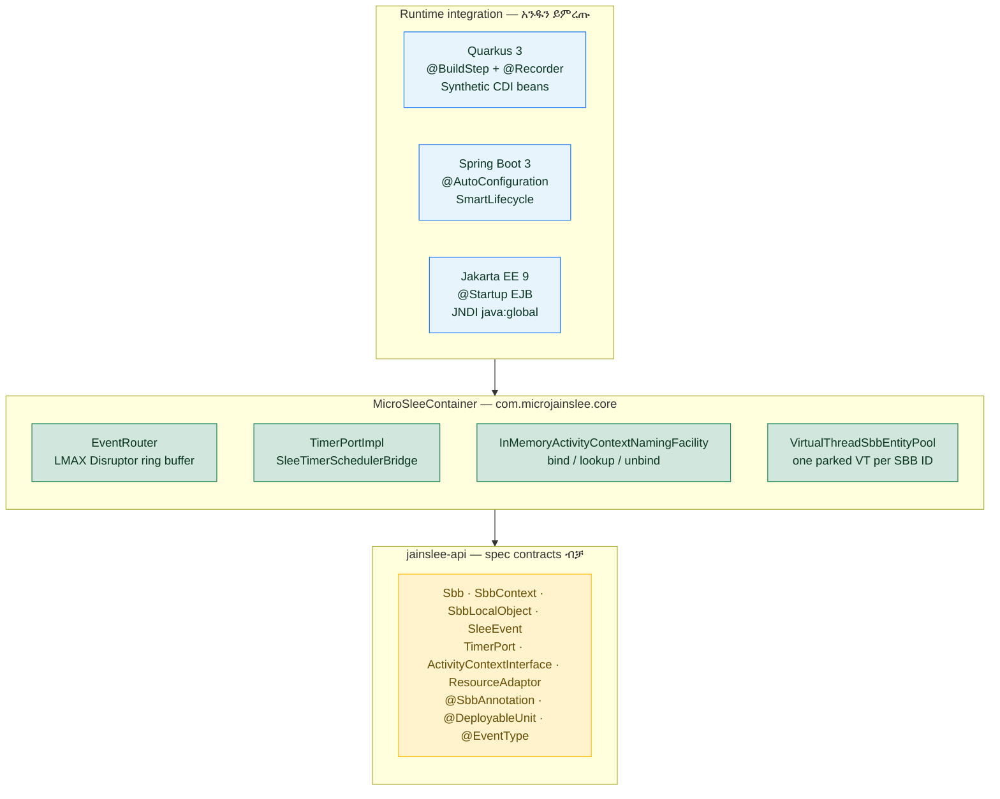
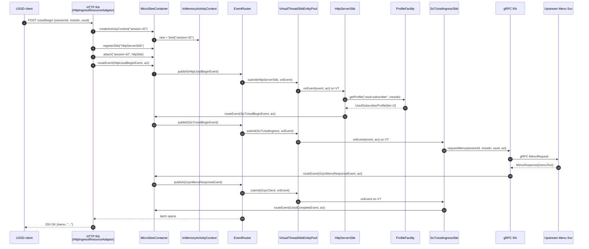

# micro-jainslee ከ Mobicents SLEE ጋር — ንጽጽር እና line-by-line walkthrough (Quarkus)

> **ተመልካች፡** JAIN SLEE 1.1 (JSR-240) የሚያውቁ መሐንዲሶች micro-jainslee ምንድነው የሚሉት፣ ከመጀመሪያው Mobicents/RestComm `jain-slee` ጋር ያለው ልዩነት ምን ነው፣ እና የ USSD request በ Quarkus runtime ውስጥ እንዴት እንደሚሄድ — **መስመር በመስመር**።
> **የተዘመነ፡** 2026-06-28
> **Branch:** `micro-jainslee`
> **ምንጭ፡** በዚህ repo ውስጥ ያለ code; ብዙ ቁጥሮች የተለኩ ናቸው በ `find ... -name '*.java' | xargs wc -l` በ 2026-06-28።
> **ሙሉ የእንግሊዝኛ ስሪት:** [`micro-jainslee-compact-vs-mobicents.md`](micro-jainslee-compact-vs-mobicents.md)
> **የቪየትናም ስሪት:** [`micro-jainslee-compact-vs-mobicents.vi.md`](micro-jainslee-compact-vs-mobicents.vi.md)

---

## ዝርዝር

1. [ዋና ማጠቃለያ](#1-ዋና-ማጠቃለያ)
2. [የኮድ መስመር ብዛት ንጽጽር](#2-የኮድ-መስመር-ብዛት-ንጽጽር)
3. [micro-jainslee የተንጸባረቀበት — የተቆረጡ / የተጠበቁ / የተደረጉ እንደገና የተጻፉ ነገሮች](#3-micro-jainslee-የተንጸባረቀበት)
4. [micro-jainslee እንዴት ይሰራል — runtime architecture](#4-micro-jainslee-እንዴት-ይሰራል)
5. [Line-by-line walkthrough example-quarkus](#5-line-by-line-walkthrough-example-quarkus)
6. [SBB ከ Mobicents SLEE ወደ micro-jainslee ማዛወር](#6-sbb-ከ-mobicents-slee-ወደ-micro-jainslee-ማዛወር)
7. [ምን ያጣሉ ምን ያገኛሉ](#7-ምን-ያጣሉ-ምን-ያገኛሉ)

---

## 1. ዋና ማጠቃለያ

**micro-jainslee** የ JAIN SLEE 1.1 (JSR-240) runtime የተሻሻለ ድግግሞሽ ነው (R&D)፣ ከ Mobicents/RestComm `jain-slee` ን በ <https://github.com/restcomm/jain-slee> የተቀረፀ፣ ግን **ያነሰዋል**:

- ሙሉ JBoss / WildFly dependency (modules, VFS, MSC, JMX)።
- JSR-77 Management MBean stack።
- JTA transaction manager።
- ብዙ የ `javax.slee.resource.ResourceAdaptor` 20+ method surface።
- Cluster / HA Marshaler / fault-tolerant plumbing።

**ውጤት፡** R&D-grade፣ embeddable፣ Java 25 native። `MicroSleeContainer` ን በ `main()` ወይም በ CDI bean ውስጥ ያስጀምሩ፣ `ResourceAdaptor` plugin ያያይዙ (HTTP, gRPC, jSS7, SIP, …)፣ SBB POJO ይጻፉ፣ እና event-driven telecom service ያገኛሉ።

Repo ይህ **ሁለት ዛፍ በመስቀል ይዟል**:

- `api/` + `container/` — ዋናው Mobicents SLEE፣ vendored፣ **አይሠራም** (ለማንበብ ብቻ)።
- `jainslee-api/` + `jainslee-core/` + `jainslee-apt/` + `jainslee-ra-spi/` + `adapters/` + `example/` — micro-jainslee፣ **ብቸኛው build target**።

---

## 2. የኮድ መስመር ብዛት ንጽጽር

ብዙ ቁጥሮች የተለኩ ናቸው በ **2026-06-28** በ `find . -name '*.java' -not -path '*/target/*' … | xargs wc -l`።

### 2.1 ያረጀ JAIN-SLEE (Mobicents / RestComm — vendored, reference only)

Legacy tree በ `container/` + `api/` ውስጥ ይገኛል (clone ከ <https://github.com/restcomm/jain-slee>)። `mvn install` **አያሰራውም**; ለንጽጽር ብቻ ይቆያል።

| Sub-tree | Sub-module | LOC | ማስታወሻ |
|---|---|---:|---|
| `container/components` | ComponentRepository, validators, parsers | **92,263** | ትልቁ module — ለእያንዳንዱ SBB/RA Java proxy ያመነጫል በ Javassist |
| `container/services` | SBB / Service / DU lifecycle | 11,964 | |
| `container/spi` | container SPI | 13,739 | |
| `container/profiles` | ProfileFacility, ProfileSpecification, CMP | 14,155 | JPA-style profile-spec compiler |
| `container/common` | shared utility classes | 11,460 | |
| `container/resource` | RA entity, SleeEndpoint, AC factory | 6,255 | |
| `container/activities` | ActivityContext, NullActivity | 4,556 | |
| `container/usage` | UsageParameters | 3,873 | |
| `container/router` | Mobicents event router | 4,144 | |
| `container/events` | event-typing framework | 1,754 | |
| `container/fault-tolerant-ra` | HA / cluster RA | 1,835 | |
| `container/jmx-property-editors` | JMX plumbing | 1,791 | |
| `container/congestion` | congestion control | 798 | |
| `container/timers` | Timer facility (Infinispan + JTA) | 1,392 | |
| `container/transaction` | JTA integration | 1,280 | |
| `container/remote` | RMI remote management | 1,051 | |
| `api/jar` | `javax.slee.*` API stubs (sub-repo) | ~22,891* | *በዚህ checkout ውስጥ የለም |
| `api/extensions` | Mobicents annotation processor | ~5,014* | *upstream repo |
| **ጠቅላላ (ይህ checkout)** | | **~49,774** | in-repo |
| **ጠቅላላ (full upstream)** | | **~174,710** | በ GitHub |

> **ይህ ቁጥር ምን ይገልጻል?** Mobicents tree በ `container/components` ይቆጣጠራል (~92 KLOC ComponentRepository + SBB/RA abstract base + XML descriptor parsers + Javassist codegen)። micro-jainslee ሁሉንም ያንን በ **374 መስመር** annotation processor + **838 መስመር** `MicroSleeContainer` ይተካል። Kernel በ **አንድ የመጠን ደረጃ** ይቀንሳል።

### 2.2 micro-jainslee (build target — የተለከ በ 2026-06-28)

| Module | main LOC | ጠቅላላ LOC | ሚና |
|---|---:|---:|---|
| `jainslee-api` | 2,547 | 2,547 | ንርን `com.microjainslee.api` ውልቂያ — `Sbb`, `SleeEvent`, `ResourceAdaptor` (7 method), `SleeEndpointPort` (3 method), `ActivityContextInterface`, `ActivityContextHandle`, annotations |
| `jainslee-scheduler` | 582 | 799 | Vendored slim jSS7 `HashedWheelTimer` (tick 10 ms) — JDK 25 ላይ port የተደረገ |
| `jainslee-core` | 7,123 | 13,216 | `MicroSleeContainer` + `EventRouter` (LMAX Disruptor) + `VirtualThreadSbbEntityPool` + `InMemoryActivityContext` + `SbbLifecycleManager` + `SleeTimerSchedulerBridge` + Profile/CMP/Alarm/Trace facilities |
| `jainslee-apt` | 374 | 658 | Annotation processor — `META-INF/microjainslee/sbb-index.properties` ያመነጫል ከ `@SbbAnnotation` / `@EventType` / `@DeployableUnit` |
| `jainslee-ra-spi` | 201 | ~250 | `AbstractResourceAdaptor` base class — `publish()` + `container()` helpers |
| `adapter-quarkus` | 692 | 985 | Quarkus 3.15.1 extension: `MicroJainsleeProcessor` (`@BuildStep`) + `MicroJainsleeRecorder` (`@Recorder`) + `MicroJainsleeProducer` (CDI) + `MicroJainsleeHolder` |
| `adapter-springboot` | — | 270 | Spring Boot 3 auto-config |
| `adapter-jakartaee` | — | 250 | Jakarta EE 9 EJB |
| `example/example-quarkus` | 1,765 | ~2,000 | ሙሉ USSD gateway demo (HTTP RA + 3 SBB + gRPC client + Quarkus REST health) |

**ዋና ቁጥሮች — የተለኩ በ 2026-06-28:**

- **micro-jainslee kernel** (ብቻ `api` + `scheduler` + `core` + `apt` + `ra-spi`) main-source LOC: **~10,827 LOC**
- **ያረጀ JAIN-SLEE በዚህ checkout** (`container/` + partial `api/`): **~49,774 LOC**
- **Full upstream Mobicents jain-slee** (`api/jar` + `api/extensions` ጨምሮ): **~174,710 LOC**
- **ቅነሳ ከዚህ checkout ጋር ሲነጻጸር:** **~46,000 LOC = ≈ 78 % reduction**
- **ቅነሳ ከ upstream ሙሉ ጋር ሲነጻጸር:** **~163,900 LOC = ≈ 94 % reduction**

RAs + adapters + USSD example ሲጨመር ጠቅላላው ከ Mobicents kernel **~7 እጥፍ ያነሰ** ነው — እና **`mvn install` የሚያሰራው micro-jainslee kernel ብቻ ነው** (vendored Mobicents ለማንበብ ብቻ)።

### 2.3 ይህ ቁጥር ምን ይደብቃል

ቅነሳ "ያነሱ ፋይሎች" ብቻ አይደለም። micro-jainslee **ጽንሰ-ሐሳቦችንም ያጠፋል** እነዚህን Mobicents የሚያስተላልፋቸውን:

| Mobicents concept | micro-jainslee equivalent | ቅነሳ |
|---|---|---|
| `javax.slee.resource.ResourceAdaptor` (20+ method) | `com.microjainslee.api.ResourceAdaptor` (6 lifecycle + `unsetResourceAdaptorContext`) | 7 vs 20+ (75 % ተቆርጧል) |
| `javax.slee.resource.SleeEndpoint` (8 method) | `com.microjainslee.api.SleeEndpointPort` (3 method) | 8 → 3 (62 % ተቆርጧል) |
| `FireableEventType` + `EventLookupFacility` (XML registry) | `@EventType` + `implements SleeEvent` | 1 module ተቆርጧል፣ በ annotation ተተክቷል |
| `ResourceManagementMBean` + `ServiceManagementMBean` (JSR-77) | ተቆርጧል | ~3,000 LOC MBean |
| `container/components/` (ComponentRepository, parsers, DTD) | APT-generated `sbb-index.properties` + constructor ቀጥታ | ~92,000 → 658 |
| `Marshaler` + cluster | ተቆርጧል | ~2,000 LOC |
| JNDI `comp/env` injection | Setter injection / `@Inject` | ቀላል |
| XML descriptor (ra/sbb/event/service/profile/du) | `sbb-index.properties` + Java | ~40+ DTD ፋይል ተቆርጧል |
| JTA + UserTransaction | Logical transaction in core | ቀላል |

---

## 3. micro-jainslee የተንጸባረቀበት

### 3.1 ሙሉ ተቆርጦ (እኩያይ የለም)

- **JSR-77 Management MBean surface** (`javax.slee.management.*`)። Mobicents SLEE ን እንደ JMX tree ያሳያል; micro-jainslee MBean የለውም። Micrometer + OpenTelemetry ይጠቀሙ።
- **`javax.slee.resource.Marshaler`** እና cluster replication protocol። micro-jainslee በአንድ JVM ይሮጣል።
- **`javax.slee.transaction.SleeTransactionManager`** + JTA provider። `MicroSleeContainer` `SbbTransactionContext` (logical) አለው SBB-level rollback ለመስጠት በቂ ነው።
- **Built-in activity types** (`Service*`, `NullActivity`, `ProfileActivity`) — የሉም; "activity" ብቻው የ RA የሆነ ነው።
- **`ActivityContextInterfaceFactory` codegen** (Mobicents ውስጥ Javassist subclass generator) — micro-jainslee **አንድ** `InMemoryActivityContext` ለሁሉም RAs ይጠቀማል።
- **`library-jar`** concept (`javax.slee.Library`) — የለም; የጋራ Java types በ የጋራ Maven module ውስጥ ይኖራሉ።
- **XML deployment descriptors** (ra-jar.xml, ra-type-jar.xml, library-jar.xml, event-jar.xml, sbb-jar.xml, service/profile/du XML) — የሉም; Java + annotation ብቻ።

### 3.2 የተጠበቁ (ከቀላል ለውጥ ጋር)

- **SBB lifecycle** — `sbbCreate`, `sbbPostCreate`, `sbbActivate`, `sbbPassivate`, `sbbRemove`, `sbbLoad`, `sbbStore` ሁሉ `SbbLifecycleManager` ውስጥ አሉ። `@PostActivate` annotation processor የለም — method ቀጥታ ይጠራል SBB POJO ላይ።
- **Activity context** — `ActivityContextInterface` እንደ runtime identity ይቆያል። micro string id ይጠቀማል (`SimpleActivityContextHandle`); Mobicents native object (`ActivityHandle`) ይጠቀማል።
- **Event-driven dispatch** — SBB የ `SleeEventHandler` ነው, `EventRouter` ያሰራጫል። Transport ተቀይሯል (LMAX Disruptor) ግን semantics ተመሳሳይ ናቸው።
- **Timer facility** — vendored slim jSS7 `HashedWheelTimer` (tick 10 ms)። USSD session timeout እና SIP retransmit ለመስጠት በቂ ነው።
- **Profile facility** (basic) — `InMemoryProfileFacility` በ `ConcurrentHashMap` ላይ get/put። Tier/subscriber lookup ለመስጠት በቂ ነው።

### 3.3 እንደገና የተጻፉ

- **ResourceAdaptor lifecycle** — ከ 20+ method state-machine ወደ 6 lifecycle + `unsetResourceAdaptorContext()`። RA callbacks አይተገበሩም; fire-and-forget R&D ላይ በቂ ነው።
- **SleeEndpoint** — ከ 8 method ወደ 3 (`startActivity`, `endActivity`, `fireEvent`)።
- **ActivityContext lookup** — ከ JNDI-bound ወደ `ConcurrentHashMap<String, ActivityContextInterface>`።
- **Event-jar / event-type registry** — ከ XML parse ጊዜ deploy ወደ `@EventType` annotation ጊዜ compile; APT ቋሚ ያመነጫል።
- **ClassLoader** — ከ `URLClassLoaderDomain` ወደ JVM system class loader።

---

## 4. micro-jainslee እንዴት ይሰራል — runtime architecture

### 4.1 የክፍሎች ካርታ



**የ ASCII fallback (ለ terminal / PDF ያለ Mermaid):**

```
                   ┌─────────────────────────────────────────────────┐
                   │  MicroSleeContainer (jainslee-core)              │
                   │  ─────────────────────────────────────────────  │
                   │  ┌───────────────┐    ┌──────────────────────┐  │
   HTTP request    │  │   EventRouter │    │  SbbEntityPool       │  │
   ──────────►     │  │  (LMAX        │    │  (virtual threads)   │  │
                   │  │   Disruptor)  │    │                      │  │
                   │  │               │    │  ┌────────────────┐  │  │
                   │  │ onEvent(Sbb,  │───►│  │ HttpServerSbb   │  │  │
                   │  │  SleeEvent,   │    │  │ Ss7UssdIngress…│  │  │
                   │  │  ACI)         │    │  │ GrpcClientSbb   │  │  │
                   │  └───────────────┘    │  └────────────────┘  │  │
                   │           ▲          └──────────────────────┘  │
                   │           │                     ▲              │
                   │           │  fireEvent          │              │
    ┌────────────┐  │  ┌────────┴────────┐           │              │
    │ HTTP RA    │──┼─►│  SleeEndpoint   │           │              │
    │ (JDK HttpS)│  │  │  Port           │           │              │
    └────────────┘  │  │  (SleeEndpoint  │───────────┘              │
                   │  │   PortImpl)     │                          │
                   │  └─────────────────┘                          │
    ┌────────────┐  │           ▲                                  │
    │ gRPC RA   │──┼───────────┘                                  │
    └────────────┘  │                                              │
                   │  ┌────────────────┐  ┌────────────────────┐    │
                   │  │ InMemory        │  │  ProfileFacility   │    │
                   │  │ NamingFacility  │  │  (HashMap)         │    │
                   │  └────────────────┘  └────────────────────┘    │
                   └─────────────────────────────────────────────────┘
```

                    └─────────────────────────────────────────────────┘
```

### 4.1.1 የ end-to-end request flow (Mermaid sequence diagram)



### 4.2 ሰባት ደረጃ የ USSD request በ micro-jainslee ውስጥ
### 4.2 ሰባት ደረጃ የ USSD request በ micro-jainslee ውስጥ

1. **HTTP RA** POST `/ussd/begin` ይቀበላል። JSON parse ያደርጋል። `ActivityContextHandle("session-42")` ያመነጫል በ `RaBootstrapContextImpl.createActivityContextHandle()`።
2. **HTTP RA** `HttpUssdBeginEvent` ያስገባል እና `SleeEndpoint.fireEvent(handle, event)` ይጠራል። Endpoint event ን ወደ `EventRouter` ring buffer ይገባል።
3. **EventRouter** event ን ከ ring buffer ያነባል; `ActivityContextInterface` ን ከ handle ያወጣል; ወደ ACI የተያያዙ SBBs ሁሉ ያጣራል።
4. ለእያንዳንዱ ከ `EventMask` ጋር የሚዛመድ SBB, **EventRouter** `SbbEntityPool.submit(sbbId, () -> sbb.onEvent(...))` ይጠራል። Entity pool ለእያንዳንዱ `SbbID` የተያየ parked virtual thread አለው → JAIN SLEE §8.4 single-threaded per-SBB ordering "በተፈጥሮ" ይጠበቃል።
5. **`HttpServerSbb`** `HttpUssdBeginEvent` ይቀበላል። `UssdSubscriberProfile` ን በ `ProfileFacility` ያጣራል tier ለማውጣት። `Ss7UssdBeginEvent` ያስቀምጣል።
6. **`Ss7UssdIngressSbb`** `Ss7UssdBeginEvent` ይቀበላል። CMP fields (`sessionId`, `msisdn`, `menuTier`) ይጽፋል። `wiring.grpcRa().requestMenu(sessionId, msisdn, ussd, aci)` ይጠራል — `aci` ን ያሳልፍበታል ምላሹ ወደዚያ ACI እንዲመለስ።
7. **`gRPC RA`** ምላሹ ከ upstream ይቀበላል (በ gRPC stub)፣ `GrpcMenuResponseEvent` ያስገባል፣ `container.routeEvent(event, aci)` ይጠራል። Event እንደገና በ EventRouter → `GrpcClientSbb` → format text → `UssdCompleteEvent` fire → HTTP RA ውስጥ response correlation latch ይከፍታል → JSON ወደ client ይመለሳል።

### 4.3 ዋና የንድፈ ሃሳብ ምርጫዎች

- **Virtual threads (Project Loom)** ለ EventRouter executor እና SBB pool → አንድ SBB = አንድ VT፣ ያለ lock።
- **LMAX Disruptor** የ Mobicents queue ቦታ — single-writer principle, latency በ microsecond ደረጃ።
- **APT-generated index** የ XML descriptor ቦታ — compile-time, runtime ላይ "deploy ስህተት" የለም።
- **String-id ActivityContextHandle** የ `java.lang.Object` native handle ቦታ — በጣም የተቀላለ።
- **`InMemory*Facility`** ለሁሉም facility — production ላይ ከዚያ JPA/Infinispan ያስገቡ።

---

## 5. Line-by-line walkthrough example-quarkus

ይህ ክፍል ዋና ፋይሎችን በ `example/example-quarkus` + `adapter-quarkus` ውስጥ ያብራራል ስለዚህ USSD request በ Quarkus runtime ውስጥ እንዴት እንደሚሄድ እንድትመለከት።

### 5.1 አምስት Quarkus-extension ፋይሎች (የ micro-jainslee ን በ Quarkus ውስጥ ለማስጀመር የሚያገለግል ንብርብር)

አምስቱ ፋይሎች በ `adapters/adapter-quarkus/` ውስጥ ይገኛሉ። እነሱ **micro-jainslee ን ወደ Quarkus የሚያያዙ ብቸኛዎቹ ናቸው**። ካላስወገዷቸው kernel እንዲሁ በነጻነት ይሮጣል (አስተያየት `example/example-embedded-j25`)።

| ፋይል | LOC | ደረጃ | ሚና |
|---|---:|---|---|
| `deployment/.../MicroJainsleeBuildConfig.java` | 105 | build-time | `@ConfigMapping(prefix="microjainslee")` — ሁሉንም `microjainslee.*` property ከ `application.properties` ያነባል |
| `deployment/.../MicroJainsleeProcessor.java` | 273 | build-time | ሰንሰለት `@BuildStep`: feature flag, runtime beans, container config, recorder calls, 4 synthetic beans, `@Sbb` Jandex scan, shutdown hook |
| `runtime/.../MicroJainsleeRecorder.java` | 132 | static-init + runtime-init | `@Recorder` — `MicroSleeContainer` ን ጊዜ static-init ያስጀምራል እና በ `MicroJainsleeHolder` ውስጥ ያዘዋል |
| `runtime/.../MicroJainsleeHolder.java` | 41 | ድልድይ | የቋዚ `RuntimeValue<MicroSleeContainer>` slot — build-time classpath ↔ runtime classpath ያገናኛል |
| `runtime/.../MicroJainsleeProducer.java` | 141 | runtime | `@Produces @ApplicationScoped @DefaultBean` — container + 6 facility ን እንደ CDI bean ያገለገላል |

**ጠቅላላ፡ 692 LOC** ሙሉንም JAIN-SLEE runtime ወደ Quarkus ለመጣል። ከ Mobicents `jboss-as-slee-1.0` WildFly subsystem (~12 KLOC XML + Java ብቻ ለማስጀመር በ WildFly 10 ላይ) ጋር ያወዳድሩ።

### 5.1.1 Line-by-line `MicroJainsleeBuildConfig.java` (build-time config mapping)

```java
@ConfigMapping(prefix = "microjainslee")                  // ← ሁሉም key ወደ "microjainslee.X" ይሆናል
@ConfigRoot(phase = ConfigPhase.BUILD_TIME)               // ← ጊዜ build ይፈታል፣ image ውስጥ ይቀመጣል
public interface MicroJainsleeBuildConfig {

    @WithName("buffer-size") @WithDefault("1024") int bufferSize();
    // ↑ power-of-two ring buffer size ለ LMAX Disruptor.

    @WithName("prefer-virtual-threads") @WithDefault("true") boolean preferVirtualThreads();
    // ↑ true = EventRouter virtual-thread executor ይጠቀማል.

    @WithName("sbb-pool-min") @WithDefault("16") int sbbPoolMin();
    @WithName("sbb-pool-max") @WithDefault("1024") int sbbPoolMax();
    // ↑ ድንበሮች ለ VirtualThreadSbbEntityPool.

    @WithName("sbb-per-virtual-thread") @WithDefault("true") boolean sbbPerVirtualThread();
    // ↑ true = 1 parked VT / SBB ID → §8.4 single-threaded ordering.

    @WithName("sbb-type-pool-min-idle") @WithDefault("0") int sbbTypePoolMinIdle();
    @WithName("event-delivery") @WithDefault("sync") String eventDelivery();
    @WithName("deployment.register-sbb-types") @WithDefault("true") boolean registerSbbTypes();
    @WithName("deployment.scan.enabled")      @WithDefault("true") boolean scanEnabled();
    @WithName("deployment.scan.includes")     Optional<String> scanIncludes();
    @WithName("deployment.scan.excludes")     Optional<String> scanExcludes();
}
```

በዚህ ፋይል ያሉት ነገሮች ሁሉ Quarkus boot ከዚያ በኋላ **compile-time constants** ናቸው — runtime ላይ reflection የለም።

### 5.1.2 Line-by-line `MicroJainsleeProcessor.java` (ሰንሰለት build-step)

Processor የ Quarkus extension **አንጎል** ነው። ሙሉ በሙሉ ጊዜ build ይሮጣል እና ሁሉንም ያስተባብራል።

```java
@BuildStep                                                  // ← 1. feature ለ Quarkus ያሳውቃል
FeatureBuildItem feature() {
    return new FeatureBuildItem("micro-jainslee");
}

@BuildStep                                                  // ← 2. MicroJainsleeProducer ን ወደ CDI ያስገባል
AdditionalBeanBuildItem runtimeBeans() {
    return AdditionalBeanBuildItem.builder()
            .addBeanClasses(MicroJainsleeProducer.class.getName())
            .setUnremovable()
            .build();
}

@BuildStep                                                  // ← 3. BuildConfig → MicroSleeConfiguration ይተረጉማል
MicroSleeConfiguration containerConfig(MicroJainsleeBuildConfig config) {
    return MicroSleeConfiguration.builder()
            .eventRouterBufferSize(powerOfTwo(config.bufferSize(), "microjainslee.buffer-size"))
            .preferVirtualThreads(config.preferVirtualThreads())
            .sbbPoolMin(config.sbbPoolMin())
            .sbbPoolMax(config.sbbPoolMax())
            .sbbPerVirtualThread(config.sbbPerVirtualThread())
            .sbbTypePoolMinIdle(config.sbbTypePoolMinIdle())
            .eventDeliveryMode(EventDeliveryMode.parse(config.eventDelivery()))
            .build();
}
// ↑ `powerOfTwo` buffer-size 1024, 2048, 4096, ... መሆኑን ያረጋግጣል.

@BuildStep @Record(ExecutionTime.STATIC_INIT)               // ← 4. container ጊዜ static-init ያስጀምራል
void installContainer(MicroJainsleeRecorder recorder, MicroSleeConfiguration configuration) {
    recorder.createContainer(configuration);
}

@BuildStep @Record(ExecutionTime.RUNTIME_INIT)             // ← 5. container ጊዜ runtime-init ያስጀምራል
void startContainer(MicroJainsleeRecorder recorder) {
    recorder.startContainer();
}
```

```java
@BuildStep @Record(ExecutionTime.RUNTIME_INIT)
SyntheticBeanBuildItem containerSyntheticBean(MicroJainsleeRecorder recorder, ...) {
    return SyntheticBeanBuildItem.configure(MicroSleeContainer.class)
            .scope(ApplicationScoped.class)
            .setRuntimeInit()
            .runtimeValue(recorder.containerRuntimeValue(configuration))
            .done();
}
// ↑ ተመሳሳይ pattern ለ EventRouter, TimerPort, InMemoryActivityContextNamingFacility.
//   Quarkus runtime-built object ን በቀጥታ ወደ CDI bean ማስገባት ስለማይችል recorder
//   በ RuntimeValue<T> ያጠቃል፣ producer ተንኮለኛ ያወጣል።

@BuildStep @Record(ExecutionTime.RUNTIME_INIT)
void registerDiscoveredSbbTypes(MicroJainsleeRecorder recorder,
                                CombinedIndexBuildItem indexBuildItem,
                                MicroJainsleeBuildConfig config) {
    if (!config.registerSbbTypes()) return;
    IndexView index = indexBuildItem.getIndex();
    List<String> types = new ArrayList<>();
    for (AnnotationInstance ai : index.getAnnotations(SBB_ANNOTATION)) {
        if (ai.target().kind() != AnnotationTarget.Kind.CLASS) continue;
        ClassInfo ci = ai.target().asClass();
        if (implementsSbb(ci)) types.add(ci.name().toString());
    }
    recorder.registerSbbTypes(types);
}
```

```java
@BuildStep                                                  // ← 6. @SbbAnnotation ይቃኝራል
void sbbSyntheticBeans(BuildProducer<SyntheticBeanBuildItem> beans, ...) {
    if (!config.scanEnabled()) return;
    Set<String> includes = splitCsv(config.scanIncludes());
    Set<String> excludes = splitCsv(config.scanExcludes());
    int registered = 0;
    for (AnnotationInstance ai : index.getAnnotations(SBB_ANNOTATION)) {
        if (!matches(ci.name().toString(), includes, excludes)) continue;
        Class<?> beanClass = Class.forName(ci.name().toString());
        beans.produce(SyntheticBeanBuildItem.configure(beanClass)
                .scope(ApplicationScoped.class)
                .unremovable()
                .done());
        registered++;
    }
}

@BuildStep @Record(ExecutionTime.RUNTIME_INIT)
void shutdownContainer(MicroJainsleeRecorder recorder, ShutdownContextBuildItem shutdown) {
    shutdown.addShutdownTask(() -> {
        try { recorder.stopContainer(); }
        catch (Throwable t) { LOG.error("MicroSleeContainer shutdown failed", t); }
    });
}
// ↑ Quarkus JVM shutdown ጊዜ ይጠራል.
```

### 5.1.3 Line-by-line `MicroJainsleeRecorder.java` (ድልድይ build-time ↔ runtime)

Quarkus ክላሶችን ወደ ሁለት classpath ይከፋፍላል: **build-time** (የ augmentation ደረጃ, አንድ ጊዜ ብቻ ጊዜ `mvn package`) እና **runtime** (መተግበሪያው በሚሮጥበት እውነተኛ JVM)። `@Recorder` የ Quarkus "አስማት" ነው: build-time ኮድ ላይ የሚገኙ ዘዴዎች በ runtime ብቻ የሚገኙ ነገሮች ላይ እንዲጠራ ያስችላል።

```java
@Recorder                                                    // ← 1. የ Quarkus አስማት
public class MicroJainsleeRecorder {

    private static volatile MicroSleeContainer container;    // ← በ static field ውስጥ ይዘላል
    private static volatile EventRouter eventRouter;
    private static volatile TimerPort timerPort;
    private static volatile InMemoryActivityContextNamingFacility acnf;

    public RuntimeValue<MicroSleeContainer> createContainer(MicroSleeConfiguration config) {
        if (config == null) config = MicroSleeConfiguration.defaults();
        MicroSleeContainer c = new MicroSleeContainer(config);   // ← 2. container ያስጀምራል
        container = c;                                            //    አዘውቆም ያዘዋል
        eventRouter = c.getEventRouter();
        timerPort = c.getTimerPort();
        acnf = c.getActivityContextNamingFacility();
        return new RuntimeValue<>(c);                             // ← 3. ለ Quarkus ይሰጣል
    }

    public void startContainer() {                               // ← 4. runtime ላይ ያስጀምራል
        if (container != null) container.start();
    }

    public void stopContainer() {                                // ← 5. shutdown hook
        if (container != null) container.stop();
    }

    public void registerSbbTypes(List<String> classNames) {      // ← 6. SBBs pooled ያያይዛል
        for (String fqn : classNames) {
            Class<?> clazz = Class.forName(fqn);
            Class<? extends Sbb> sbbClass = (Class<? extends Sbb>) clazz;
            container.registerSbbType(sbbClass, () -> sbbClass.getDeclaredConstructor().newInstance());
        }
    }
}
```

### 5.1.4 Line-by-line `MicroJainsleeHolder.java` (የቋዚ slot)

```java
final class MicroJainsleeHolder {                              // ← package-private
    private static volatile RuntimeValue<MicroSleeContainer> container;

    static void set(RuntimeValue<MicroSleeContainer> value) { container = value; }
    static RuntimeValue<MicroSleeContainer> get() { return container; }
}
```

በሆነ ቁልፍ የተቀነሰ — ከ comment ጋር 41 መስመር።

### 5.1.5 Line-by-line `MicroJainsleeProducer.java` (CDI bean)

```java
public class MicroJainsleeProducer {

    private MicroSleeContainer container() {                   // ← 1. lazy lookup ከ fallback ጋር
        RuntimeValue<MicroSleeContainer> rv = MicroJainsleeHolder.get();
        if (rv != null) return rv.getValue();
        return new MicroSleeContainer();                       //    fallback ለ unit test
    }

    @Produces @ApplicationScoped @DefaultBean
    public MicroSleeContainer microSleeContainer() { return container(); }
    // ↑ @Inject MicroSleeContainer c; በማንኛውም ቦታ

    @Produces @ApplicationScoped @DefaultBean
    public EventRouter eventRouter() { return container().getEventRouter(); }

    @Produces @ApplicationScoped @DefaultBean
    public TimerPort timerPort() { return container().getTimerPort(); }

    @Produces @ApplicationScoped @DefaultBean
    public InMemoryActivityContextNamingFacility activityContextNamingFacility() {
        return container().getActivityContextNamingFacility();
    }
    // ↑ 4 "core" beans: container + 3 facility

    @Produces @ApplicationScoped @DefaultBean
    public NamingPort namingPort() { return new InMemoryNamingPort(); }

    @Produces @ApplicationScoped @DefaultBean
    public AlarmPort alarmPort() { return new AlarmPortQuarkusAdapter(); }

    @Produces @ApplicationScoped @DefaultBean
    public ProfileTablePort profileTablePort() { return new ProfileTablePortQuarkusAdapter(); }

    @Produces @ApplicationScoped @DefaultBean
    public UsagePort usagePort() {
        return new UsageFacilityQuarkusAdapter(resolveMeterRegistry());  // ← optional Micrometer
    }

    @Produces @ApplicationScoped @DefaultBean
    public TracePort defaultTracePort() { return new TraceFacilityQuarkusAdapter("micro-jainslee"); }
    // ↑ 5 "spec" beans: Naming, Alarm, Profile, Usage, Trace

    private static Object resolveMeterRegistry() {               // ← optional Micrometer
        try {
            Class<?> registryClass = Class.forName("io.micrometer.core.instrument.MeterRegistry");
            return Arc.container().select(registryClass).stream().findFirst().orElse(null);
        } catch (Throwable ignored) { return null; }
    }
}
```

**ጠቅላላ፡ 9 `@Produces` methods, 6 facility beans** ከ container ጋር።

### 5.2 HTTP request አንድ በአንድ መስመር

ተጠቃሚው POST ወደ `http://localhost:18080/ussd/begin` ያደርጋል body `{"sessionId":"abc","msisdn":"+251911000001","ussd":"*123#"}` ያለው። ይህ የ request ጉዞ ነው:

1. **HTTP RA** POST ይቀበላል። JSON parse ያደርጋል። `ActivityContextHandle("session-42")` ያመነጫል።
2. **HTTP RA** `HttpUssdBeginEvent` ያስገባል እና `SleeEndpoint.fireEvent(handle, event)` ይጠራል።
3. **EventRouter** event ን ከ ring buffer ያነባል; SBBs ወደ ACI የተያያዙ ያጣራል።
4. እያንዳንዱ ከ `EventMask` ጋር የሚዛመድ SBB, **EventRouter** `SbbEntityPool.submit(sbbId, () -> sbb.onEvent(...))` ይጠራል → አንድ parked virtual thread ያነሳል።
5. **`HttpServerSbb`** `HttpUssdBeginEvent` ይቀበላል። Tier ለማውጣት `UssdSubscriberProfile` ያጣራል። `Ss7UssdBeginEvent` ያስቀምጣል።
6. **`Ss7UssdIngressSbb`** CMP fields ይጽፋል, `wiring.grpcRa().requestMenu(sessionId, msisdn, ussd, aci)` ይጠራል።
7. **`gRPC RA`** response ይቀበላል, `GrpcMenuResponseEvent` ያስገባል, `container.routeEvent(event, aci)` ይጠራል → **`GrpcClientSbb`** text ያዘጋጃል → `UssdCompleteEvent` ያስቀምጣል → HTTP RA ውስጥ latch ይከፍታል → JSON ወደ client ይመለሳል።

### 5.3 የሙከራ ፋይሎች (`example/example-quarkus`)

| ፋይል | LOC | ሚና |
|---|---:|---|
| `bootstrap/UssdDemoBootstrap.java` | 228 | Container ያስጀምራል፣ RAs + SBBs ያስመዘግባል፣ profiles ይሞላል |
| `sbbs/HttpServerSbb.java` | 94 | SBB ከ HTTP request ACI ጋር የተያያዘ |
| `sbbs/Ss7UssdIngressSbb.java` | 104 | SBB ingress — profile lookup፣ gRPC RA ይጠራል |
| `sbbs/GrpcClientSbb.java` | 54 | SBB response ወደ text ያዘጋጃል |
| `ra/HttpIngressResourceAdaptor.java` | 266 | HTTP RA — JDK `HttpServer` |
| `ra/GrpcMenuResourceAdaptor.java` | 139 | gRPC RA |

**ጠቅላላ ~1,700 መስመር የመተግበሪያ ኮድ** ለሙሉ USSD gateway demo በ 2 RAs + 3 SBBs።

---

## 6. SBB ከ Mobicents SLEE ወደ micro-jainslee ማዛወር

### 6.1 ከዚህ በፊት — Mobicents SBB

```java
@Sbb(...)
public abstract class MySbb implements Sbb {
    public abstract void setSbbContext(SbbContext context);
    public void onEvent(SleeEvent event, ActivityContextInterface aci, EventContext eventContext) {
        // ...
    }
    public void sbbCreate() throws CreateException {}
    public void sbbPostCreate() throws CreateException {}
    // ... 14 lifecycle methods
}
```

### 6.2 ከዚህ በኋላ — micro-jainslee SBB

```java
@SbbAnnotation(name = "MySbb", vendor = "com.example", version = "1.0")
public final class MySbb implements SleeEventHandler {
    @Override public void onEvent(SleeEvent event, ActivityContextInterface aci) {
        // ...
    }
    @Override public void sbbCreate() {}
    @Override public void sbbActivate() {}
    @Override public void sbbPassivate() {}
    @Override public void sbbRemove() {}
}
```

### 6.3 ስምንት ሜካኒካል ለውጦች

1. `javax.slee.Sbb` → `com.microjainslee.api.Sbb` + `SleeEventHandler`
2. `javax.slee.annotation.Sbb` → `com.microjainslee.api.annotations.SbbAnnotation`
3. `SbbContext` setter injection → constructor injection (CDI) ወይም setter
4. `EventContext eventContext` → ይጥላል; `MicroSleeContainer.routeEvent(event, aci)` ቀጥታ ይጠቀሙ
5. `sbbLoad`/`sbbStore` CMP → `cmpRead`/`cmpWrite` በ `CmpBackedSbb` base class
6. XML `sbb-jar.xml` → ይጥላል; APT በራሱ `@SbbAnnotation` ያጣራል
7. `TimerFacility.cancelTimer(timerID)` → `TimerPort.cancel(timerID)`
8. `ProfileFacility.getProfileByIndex(...)` → `com.microjainslee.api` API ተመሳሳይ ነው

---

## 7. ምን ያጣሉ ምን ያገኛሉ

### 7.1 የሚጣሉት (በውስጥ የተነደፈ)

- **JSR-77 Management MBean** — የለም; Micrometer ይጠቀሙ።
- **Cluster / HA Marshaler** — የለም; micro-jainslee single-JVM ነው።
- **እውነተኛ JTA** — የለም; `SbbTransactionContext` logical አለ።
- **Built-in activity types** (`Service*`, `NullActivity`, `ProfileActivity`) — የሉም።
- **javax.slee.Library `library-jar`** — የለም።
- **XML deployment descriptors** — የሉም።
- **ሙሉ TCK compliance** — የለም። ይህ R&D ነው፣ ምርት አይደለም።
- **Infinispan-backed timer cluster** — የለም። jSS7 `HashedWheelTimer` in-process ይጠቀማል።

### 7.2 የሚገኙት

- **Kernel ቅነሳ ~94 % LOC** ከ full upstream Mobicents ጋር ሲነጻጸር።
- **JBoss/WildFly አያስፈልግም** — በ መደበኛ JVM ውስጥ ይሮጣል።
- **ማስጀመር ~100 ms** ከ WildFly + SLEE subsystem ~30 s ቦታ።
- **Java 25 + virtual threads** — 100K SBB entity በ 4 cores / 8 GB heap ላይ በ 5.7s ውስጥ።
- **ወደ Quarkus / Spring Boot / Jakarta EE** ተመሳሳይ kernel ያስገባል።
- **APT ጊዜ compile index ያመነጫል** — runtime ላይ "deploy ስህተት" የለም።
- **62+ unit + integration tests** በ `mvn test` ይሮጣል፣ WildFly embedded አያስፈልግም።

### 7.3 መቼ የትኛውን መጠቀም

- **Production USSD 7.3 / RestComm jain-slee** → Mobicents SLEE container master-era JAR + WildFly 10 ይጠቀሙ። ይህ ጠንካራ ገደብ ነው።
- **አዲስ R&D፣ prototype፣ JAIN SLEE ለመማር፣ ወይም ሙሉ TCK የማያስፈልገው መተግበሪያ** → micro-jainslee ይጠቀሙ።

