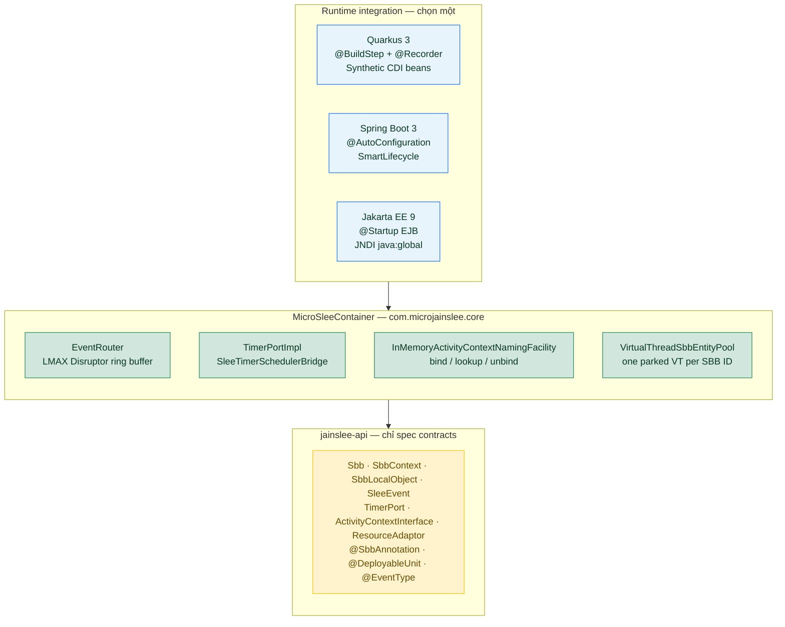
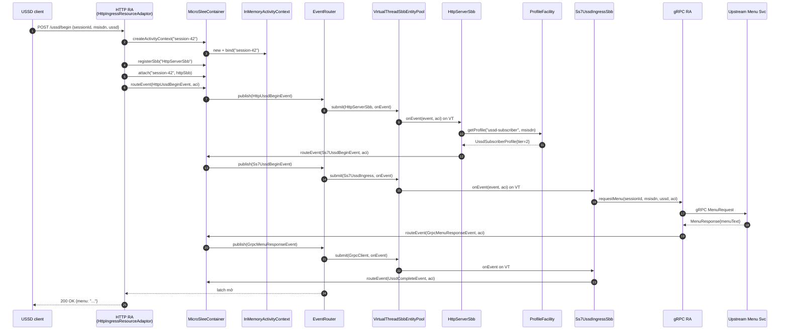

# micro-jainslee so với Mobicents SLEE — so sánh compact và walkthrough line-by-line (Quarkus)

> **Đối tượng:** kỹ sư quen JAIN SLEE 1.1 (JSR-240) muốn hiểu micro-jainslee là gì, đã **compact** (rút gọn) ở những điểm nào so với Mobicents/RestComm `jain-slee` gốc, và một USSD request thực sự chạy qua Quarkus runtime như thế nào — **từng dòng code**.
> **Cập nhật:** 2026-06-28
> **Branch:** `micro-jainslee`
> **Source of truth:** code trong repo này; counts lấy từ `find ... -name '*.java' | xargs wc -l` ngày 2026-06-28.
> **Bản EN đầy đủ:** [`micro-jainslee-compact-vs-mobicents.md`](micro-jainslee-compact-vs-mobicents.md)
> **Bản Amharic (አማርኛ):** [`micro-jainslee-compact-vs-mobicents.am.md`](micro-jainslee-compact-vs-mobicents.am.md)

---

## Mục lục

1. [Tóm tắt điều hành](#1-tóm-tắt-điều-hành)
2. [So sánh số dòng code](#2-so-sánh-số-dòng-code)
3. [micro-jainslee đã compact ở đâu — những thứ bị cắt / giữ lại / viết lại](#3-micro-jainslee-đã-compact-ở-đâu--những-thứ-bị-cắt--giữ-lại--viết-lại)
4. [micro-jainslee hoạt động như thế nào — kiến trúc runtime](#4-micro-jainslee-hoạt-động-như-thế-nào--kiến-trúc-runtime)
5. [Line-by-line walkthrough example-quarkus](#5-line-by-line-walkthrough-example-quarkus)
6. [Migrate một SBB từ Mobicents SLEE sang micro-jainslee](#6-migrate-một-sbb-từ-mobicents-slee-sang-micro-jainslee)
7. [Đánh đổi — cái được, cái mất](#7-đánh-đổi--cái-được-cái-mất)

---

## 1. Tóm tắt điều hành

**micro-jainslee** là bản tái hiện (R&D) của runtime JAIN SLEE 1.1 (JSR-240), kế thừa tinh thần dự án Mobicents/RestComm `jain-slee` ở <https://github.com/restcomm/jain-slee>, nhưng **cắt bỏ**:

- Toàn bộ dependency JBoss / WildFly (modules, VFS, MSC, JMX).
- JSR-77 Management MBean stack.
- JTA transaction manager.
- Phần lớn surface 20+-method của `javax.slee.resource.ResourceAdaptor`.
- Cluster / HA Marshaler / fault-tolerant plumbing.

**Kết quả:** R&D-grade, embeddable, Java 25 native. Bạn khởi tạo `MicroSleeContainer` trong `main()` hoặc CDI bean, gắn plugin `ResourceAdaptor` (HTTP, gRPC, jSS7, SIP, …), viết SBB POJO thuần, và có ngay một telecom service hướng sự kiện.

Repo này có **hai cây song song**:

- `api/` + `container/` — Mobicents SLEE gốc, vendored, **không build** (chỉ để đọc tham khảo).
- `jainslee-api/` + `jainslee-core/` + `jainslee-apt/` + `jainslee-ra-spi/` + `adapters/` + `example/` — micro-jainslee, **build target duy nhất**.

---

## 2. So sánh số dòng code

Counts lấy ngày **2026-06-28** bằng `find . -name '*.java' -not -path '*/target/*' … | xargs wc -l`.

### 2.1 JAIN-SLEE cũ (Mobicents / RestComm — vendored, chỉ tham khảo)

Cây legacy nằm trong `container/` + `api/` của repo này (clone từ <https://github.com/restcomm/jain-slee>). Nó **không được build** bởi `mvn install`; chỉ giữ trên disk làm baseline so sánh.

| Cây con | Module con | LOC | Ghi chú |
|---|---|---:|---|
| `container/components` | ComponentRepository, validators, parsers | **92.263** | module lớn nhất — sinh Java proxy cho từng SBB/RA type qua Javassist |
| `container/services` | SBB / Service / DU lifecycle | 11.964 | |
| `container/spi` | container SPI | 13.739 | |
| `container/profiles` | ProfileFacility, ProfileSpecification, CMP | 14.155 | full profile-spec compiler kiểu JPA |
| `container/common` | shared utility classes | 11.460 | |
| `container/resource` | RA entity, SleeEndpoint, AC factory | 6.255 | |
| `container/activities` | ActivityContext, NullActivity | 4.556 | |
| `container/usage` | UsageParameters | 3.873 | |
| `container/router` | Mobicents event router | 4.144 | |
| `container/events` | event-typing framework | 1.754 | |
| `container/fault-tolerant-ra` | HA / cluster RA | 1.835 | |
| `container/jmx-property-editors` | JMX plumbing | 1.791 | |
| `container/congestion` | congestion control | 798 | |
| `container/timers` | Timer facility (Infinispan + JTA) | 1.392 | |
| `container/transaction` | JTA integration | 1.280 | |
| `container/remote` | RMI remote management | 1.051 | |
| `api/jar` | `javax.slee.*` API stubs (sub-repo) | ~22.891* | *không có trong checkout này |
| `api/extensions` | Mobicents annotation processor | ~5.014* | *upstream repo |
| **Tổng (checkout này)** | | **~49.774** | đo trong repo |
| **Tổng (full upstream tính cả `api/`)** | | **~174.710** | tại <https://github.com/restcomm/jain-slee> |

> **Con số này nghĩa là gì?** Mobicents tree bị thống trị bởi `container/components` (~92 KLOC ComponentRepository + SBB/RA abstract base classes + XML descriptor parsers + bước Javassist codegen). micro-jainslee thay toàn bộ bằng một annotation processor **374 dòng** + một `MicroSleeContainer` (~838 dòng). Kernel co lại cỡ **một bậc độ lớn**.

### 2.2 micro-jainslee (build target — đo ngày 2026-06-28)

| Module | main LOC | Tổng LOC | Vai trò |
|---|---:|---:|---|
| `jainslee-api` | 2.547 | 2.547 | Hợp đồng `com.microjainslee.api` tối thiểu |
| `jainslee-scheduler` | 582 | 799 | Vendored slim jSS7 `HashedWheelTimer` |
| `jainslee-core` | 7.123 | 13.216 | `MicroSleeContainer` + `EventRouter` + facilities |
| `jainslee-apt` | 374 | 658 | Annotation processor |
| `jainslee-ra-spi` | 201 | ~250 | `AbstractResourceAdaptor` base |
| `adapter-quarkus` | 692 | 985 | Quarkus 3.15.1 extension |
| `adapter-springboot` | — | 270 | Spring Boot 3 auto-config |
| `adapter-jakartaee` | — | 250 | Jakarta EE 9 EJB |
| `example/example-quarkus` | 1.765 | ~2.000 | Demo USSD gateway đầy đủ |

**Con số tóm tắt — đo ngày 2026-06-28:**

- **micro-jainslee kernel** (chỉ `api` + `scheduler` + `core` + `apt` + `ra-spi`) main-source LOC: **~10.827 LOC**
- **JAIN-SLEE cũ trong checkout này** (`container/` + partial `api/`): **~49.774 LOC**
- **Full upstream Mobicents jain-slee** (tính cả `api/jar` + `api/extensions` ở GitHub repo gốc): **~174.710 LOC**
- **Giảm so với checkout này:** **~46.000 LOC = ≈ 78 % reduction**
- **Giảm so với upstream đầy đủ:** **~163.900 LOC = ≈ 94 % reduction**

Cộng thêm RAs + adapters + example USSD, tổng vẫn **nhỏ hơn ~7 lần** so với Mobicents kernel.

### 2.3 Con số này giấu gì

| Khái niệm Mobicents | Tương đương micro-jainslee | Mức giảm |
|---|---|---|
| `javax.slee.resource.ResourceAdaptor` (20+ method) | `com.microjainslee.api.ResourceAdaptor` (6 lifecycle + `unsetResourceAdaptorContext`) | 7 vs 20+ (bỏ 75 %) |
| `javax.slee.resource.SleeEndpoint` (8 method) | `com.microjainslee.api.SleeEndpointPort` (3 method) | 8 → 3 (bỏ 62 %) |
| `FireableEventType` + `EventLookupFacility` (XML registry) | `@EventType` + `implements SleeEvent` (annotation-driven) | 1 module xóa, thay bằng 1 annotation |
| `ResourceManagementMBean` + `ServiceManagementMBean` (JSR-77) | xóa | ~3.000 dòng MBean |
| `container/components/` (ComponentRepository, Validators, parsers, DTD) | APT-generated `sbb-index.properties` + constructor trực tiếp | ~92.000 → 658 |
| `Marshaler` + cluster | xóa | ~2.000 dòng |
| JNDI `comp/env` injection | Setter injection / `@Inject` | đơn giản hơn |
| XML descriptor (ra/sbb/event/service/profile/du) | `sbb-index.properties` + Java | xóa ~40+ DTD file |
| JTA + UserTransaction | Logical transaction trong core | đơn giản hơn |

---

## 3. micro-jainslee đã compact ở đâu — những thứ bị cắt / giữ lại / viết lại

### 3.1 Cắt hẳn (không có tương đương)

- **JSR-77 Management MBean surface** (`javax.slee.management.*`). Mobicents expose SLEE thành cây JMX; micro-jainslee không có MBean. Ai cần observability thì dùng Micrometer + OpenTelemetry.
- **`javax.slee.resource.Marshaler`** và cluster replication protocol. micro-jainslee chạy một JVM duy nhất.
- **`javax.slee.transaction.SleeTransactionManager`** + JTA provider. `MicroSleeContainer` có `SbbTransactionContext` (logical) đủ cho SBB-level rollback.
- **Built-in activity types** (`javax.slee.serviceactivity.Service*`, `javax.slee.nullactivity.NullActivity`, `javax.slee.profileactivity.*`). micro-jainslee không có; "activity" duy nhất là cái do RA định nghĩa.
- **Bước codegen `ActivityContextInterfaceFactory`** (Mobicents `ConcreteActivityContextInterfaceGenerator` dùng Javassist sinh concrete subclass cho mỗi RA). micro-jainslee có **một** `InMemoryActivityContext` dùng chung.
- **Khái niệm `library-jar`** (`javax.slee.Library`). Kiểu Java chung chỉ cần nằm trong một Maven module dùng chung.
- **XML deployment descriptors** (ra-jar.xml, ra-type-jar.xml, library-jar.xml, event-jar.xml, sbb-jar.xml, service/profile/du XML). micro-jainslee dùng Java + annotation.

### 3.2 Giữ lại (có đơn giản hóa)

- **SBB lifecycle** — `sbbCreate`, `sbbPostCreate`, `sbbActivate`, `sbbPassivate`, `sbbRemove`, `sbbLoad`, `sbbStore` đều có trong `SbbLifecycleManager`. Không có annotation processor `@PostActivate` — chỉ gọi method trực tiếp.
- **Activity context** — `ActivityContextInterface` giữ làm identity runtime. micro dùng string id (`SimpleActivityContextHandle`); Mobicents dùng native object (`ActivityHandle`).
- **Event-driven dispatch** — SBB implement `SleeEventHandler`, `EventRouter` phân phát. Transport đổi (LMAX Disruptor thay cho `EventRouterTaskFactory`), semantics giống.
- **Timer facility** — vendor jSS7 slim `HashedWheelTimer` (tick 10 ms). Đủ cho USSD session timeout và SIP retransmit.
- **Profile facility** (cơ bản) — `InMemoryProfileFacility` get/put trên `ConcurrentHashMap`. Đủ cho tier/subscriber lookup.

### 3.3 Viết lại

- **ResourceAdaptor lifecycle** — từ 20+ method state-machine xuống 6 lifecycle + `unsetResourceAdaptorContext()`. RA callbacks không được implement; fire-and-forget đủ ở R&D.
- **SleeEndpoint** — từ 8 method xuống 3 method (`startActivity`, `endActivity`, `fireEvent`).
- **ActivityContext lookup** — từ JNDI-bound `ActivityContextNamingFacility` xuống `ConcurrentHashMap<String, ActivityContextInterface>`.
- **Event-jar / event-type registry** — từ XML parse lúc deploy xuống annotation `@EventType` lúc compile; APT sinh hằng số.
- **ClassLoader** — từ `URLClassLoaderDomain` phức tạp cho mỗi DU xuống system class loader của JVM.

---

## 4. micro-jainslee hoạt động như thế nào — kiến trúc runtime

### 4.1 Bản đồ thành phần



**ASCII fallback (cho terminal / PDF không có Mermaid):**

```
                   ┌─────────────────────────────────────────────────┐
                   │  MicroSleeContainer (jainslee-core)              │
                   │  ─────────────────────────────────────────────  │
                   │  ┌───────────────┐    ┌──────────────────────┐  │
   HTTP request    │  │   EventRouter │    │  SbbEntityPool       │  │
   ──────────►     │  │  (LMAX        │    │  (virtual threads)   │  │
                   │  │   Disruptor)  │    │                      │  │
                   │  │               │    │  ┌────────────────┐  │  │
                   │  │ onEvent(Sbb,  │───►│  │ HttpServerSbb   │  │  │
                   │  │  SleeEvent,   │    │  │ Ss7UssdIngress…│  │  │
                   │  │  ACI)         │    │  │ GrpcClientSbb   │  │  │
                   │  └───────────────┘    │  └────────────────┘  │  │
                   │           ▲          └──────────────────────┘  │
                   │           │                     ▲              │
                   │           │  fireEvent          │              │
    ┌────────────┐  │  ┌────────┴────────┐           │              │
    │ HTTP RA    │──┼─►│  SleeEndpoint   │           │              │
    │ (JDK HttpS)│  │  │  Port           │           │              │
    └────────────┘  │  │  (SleeEndpoint  │───────────┘              │
                   │  │   PortImpl)     │                          │
                   │  └─────────────────┘                          │
    ┌────────────┐  │           ▲                                  │
    │ gRPC RA   │──┼───────────┘                                  │
    └────────────┘  │                                              │
                   │  ┌────────────────┐  ┌────────────────────┐    │
                   │  │ InMemory        │  │  ProfileFacility   │    │
                   │  │ NamingFacility  │  │  (HashMap)         │    │
                   │  └────────────────┘  └────────────────────┘    │
                   └─────────────────────────────────────────────────┘
```

                    └─────────────────────────────────────────────────┘
```

### 4.1.1 Luồng request end-to-end (sequence diagram Mermaid)



### 4.2 Bảy bước một USSD request đi qua micro-jainslee
### 4.2 Bảy bước một USSD request đi qua micro-jainslee

1. **HTTP RA** nhận POST `/ussd/begin`. Parse JSON. Tạo `ActivityContextHandle("session-42")` qua `RaBootstrapContextImpl.createActivityContextHandle()`.
2. **HTTP RA** build `HttpUssdBeginEvent` rồi gọi `SleeEndpoint.fireEvent(handle, event)`. Endpoint đẩy event vào ring buffer của `EventRouter`.
3. **EventRouter** đọc event từ ring buffer; lấy `ActivityContextInterface` từ handle; tra tất cả SBB attached vào ACI đó (ở bước attach trước đó).
4. Với mỗi SBB khớp `EventMask`, **EventRouter** gọi `SbbEntityPool.submit(sbbId, () -> sbb.onEvent(...))`. Entity pool có một parked virtual thread ghim với mỗi `SbbID` → §8.4 single-threaded per-SBB ordering đảm bảo "tự nhiên".
5. **`HttpServerSbb`** nhận `HttpUssdBeginEvent`. Tra `UssdSubscriberProfile` qua `ProfileFacility` lấy tier cho MSISDN. Fire `Ss7UssdBeginEvent` lên cùng ACI.
6. **`Ss7UssdIngressSbb`** nhận `Ss7UssdBeginEvent`. Ghi CMP fields (`sessionId`, `msisdn`, `menuTier`). Gọi `wiring.grpcRa().requestMenu(sessionId, msisdn, ussd, aci)` — truyền `aci` để response về đúng ACI này.
7. **`gRPC RA`** lấy response từ upstream (qua stub gRPC), build `GrpcMenuResponseEvent`, gọi `container.routeEvent(event, aci)`. Event đi lại qua EventRouter tới `GrpcClientSbb` → format text → fire `UssdCompleteEvent` → response correlation latch trong HTTP RA mở → trả JSON về client.

### 4.3 Những chọn lựa thiết kế chính

- **Virtual threads (Project Loom)** cho cả EventRouter executor và SBB pool → một SBB = một VT, không lock.
- **LMAX Disruptor** thay cho Mobicents queue phức tạp — single-writer principle, latency cỡ micro-giây.
- **APT-generated index** thay cho XML descriptor — compile-time, không có "deploy lỗi" lúc runtime.
- **String-id ActivityContextHandle** thay cho `java.lang.Object` native handle — đơn giản hóa đáng kể.
- **`InMemory*Facility`** cho mọi facility — production thì plug JPA/Infinispan sau.

---

## 5. Line-by-line walkthrough example-quarkus

Phần này giải thích từng file chính trong `example/example-quarkus` + `adapter-quarkus` để bạn thấy một USSD request thực sự đi qua Quarkus runtime như thế nào.

### 5.1 Năm file Quarkus-extension (lớp tích hợp boot micro-jainslee vào Quarkus)

Năm file này nằm trong `adapters/adapter-quarkus/`. Chúng là **thứ duy nhất gắn micro-jainslee vào Quarkus**. Bỏ chúng đi thì kernel vẫn chạy độc lập (xem `example/example-embedded-j25`).

| File | LOC | Pha | Vai trò |
|---|---:|---|---|
| `deployment/.../MicroJainsleeBuildConfig.java` | 105 | build-time | `@ConfigMapping(prefix="microjainslee")` — đọc mọi property `microjainslee.*` từ `application.properties` |
| `deployment/.../MicroJainsleeProcessor.java` | 273 | build-time | Chuỗi `@BuildStep`: feature flag, runtime beans, container config, gọi recorder, 4 synthetic bean, scan `@Sbb` bằng Jandex, shutdown hook |
| `runtime/.../MicroJainsleeRecorder.java` | 132 | static-init + runtime-init | `@Recorder` — khởi tạo `MicroSleeContainer` lúc static-init và giấu vào `MicroJainsleeHolder` |
| `runtime/.../MicroJainsleeHolder.java` | 41 | cầu nối | Slot tĩnh `RuntimeValue<MicroSleeContainer>` — bắc cầu build-time classpath ↔ runtime classpath |
| `runtime/.../MicroJainsleeProducer.java` | 141 | runtime | `@Produces @ApplicationScoped @DefaultBean` — phơi container + 6 facility ra bean CDI |

**Tổng: 692 LOC** để drop cả JAIN-SLEE runtime vào Quarkus. So với Mobicents `jboss-as-slee-1.0` WildFly subsystem (~12 KLOC XML + Java chỉ để boot cùng thứ đó trên WildFly 10).

### 5.1.1 Line-by-line `MicroJainsleeBuildConfig.java` (build-time config mapping)

```java
@ConfigMapping(prefix = "microjainslee")                  // ← mọi key trở thành "microjainslee.X"
@ConfigRoot(phase = ConfigPhase.BUILD_TIME)               // ← resolve lúc build, bake vào image
public interface MicroJainsleeBuildConfig {

    @WithName("buffer-size") @WithDefault("1024") int bufferSize();
    // ↑ kích thước ring buffer power-of-two cho LMAX Disruptor.

    @WithName("prefer-virtual-threads") @WithDefault("true") boolean preferVirtualThreads();
    // ↑ true = EventRouter dùng virtual-thread executor.

    @WithName("sbb-pool-min") @WithDefault("16") int sbbPoolMin();
    @WithName("sbb-pool-max") @WithDefault("1024") int sbbPoolMax();
    // ↑ biên cho VirtualThreadSbbEntityPool.

    @WithName("sbb-per-virtual-thread") @WithDefault("true") boolean sbbPerVirtualThread();
    // ↑ true = 1 parked VT / SBB ID → §8.4 single-threaded ordering.

    @WithName("sbb-type-pool-min-idle") @WithDefault("0") int sbbTypePoolMinIdle();
    @WithName("event-delivery") @WithDefault("sync") String eventDelivery();
    @WithName("deployment.register-sbb-types") @WithDefault("true") boolean registerSbbTypes();
    @WithName("deployment.scan.enabled")      @WithDefault("true") boolean scanEnabled();
    @WithName("deployment.scan.includes")     Optional<String> scanIncludes();
    @WithName("deployment.scan.excludes")     Optional<String> scanExcludes();
}
```

Mọi thứ trong file này là **hằng số compile-time** sau khi Quarkus boot — không có reflection lúc runtime.

### 5.1.2 Line-by-line `MicroJainsleeProcessor.java` (chuỗi build-step)

Processor là **bộ não** của Quarkus extension. Chạy hoàn toàn lúc build và điều phối mọi thứ.

```java
@BuildStep                                                  // ← 1. thông báo feature cho Quarkus
FeatureBuildItem feature() {
    return new FeatureBuildItem("micro-jainslee");
}

@BuildStep                                                  // ← 2. buộc MicroJainsleeProducer vào CDI
AdditionalBeanBuildItem runtimeBeans() {
    return AdditionalBeanBuildItem.builder()
            .addBeanClasses(MicroJainsleeProducer.class.getName())
            .setUnremovable()                               // Arc không được tối ưu hóa đi
            .build();
}

@BuildStep                                                  // ← 3. dịch BuildConfig → MicroSleeConfiguration
MicroSleeConfiguration containerConfig(MicroJainsleeBuildConfig config) {
    return MicroSleeConfiguration.builder()
            .eventRouterBufferSize(powerOfTwo(config.bufferSize(), "microjainslee.buffer-size"))
            .preferVirtualThreads(config.preferVirtualThreads())
            .sbbPoolMin(config.sbbPoolMin())
            .sbbPoolMax(config.sbbPoolMax())
            .sbbPerVirtualThread(config.sbbPerVirtualThread())
            .sbbTypePoolMinIdle(config.sbbTypePoolMinIdle())
            .eventDeliveryMode(EventDeliveryMode.parse(config.eventDelivery()))
            .build();
}
// ↑ `powerOfTwo` validate rằng buffer-size là 1024, 2048, 4096, ... (yêu cầu của LMAX).

@BuildStep @Record(ExecutionTime.STATIC_INIT)               // ← 4. tạo container lúc static-init
void installContainer(MicroJainsleeRecorder recorder, MicroSleeConfiguration configuration) {
    recorder.createContainer(configuration);
}

@BuildStep @Record(ExecutionTime.RUNTIME_INIT)             // ← 5. start container lúc runtime-init
void startContainer(MicroJainsleeRecorder recorder) {
    recorder.startContainer();
}
```

```java
@BuildStep @Record(ExecutionTime.RUNTIME_INIT)
SyntheticBeanBuildItem containerSyntheticBean(MicroJainsleeRecorder recorder, ...) {
    return SyntheticBeanBuildItem.configure(MicroSleeContainer.class)
            .scope(ApplicationScoped.class)                 // một CDI bean duy nhất
            .setRuntimeInit()                               // resolve lúc runtime, không phải build
            .runtimeValue(recorder.containerRuntimeValue(configuration))
            .done();
}
// ↑ cùng pattern lặp lại cho EventRouter, TimerPort, InMemoryActivityContextNamingFacility.
//   Quarkus không inject trực tiếp object runtime-built vào CDI bean được, nên recorder
//   bọc trong RuntimeValue<T>, producer unwrap lười biêng.

@BuildStep @Record(ExecutionTime.RUNTIME_INIT)
void registerDiscoveredSbbTypes(MicroJainsleeRecorder recorder,
                                CombinedIndexBuildItem indexBuildItem,
                                MicroJainsleeBuildConfig config) {
    if (!config.registerSbbTypes()) return;
    IndexView index = indexBuildItem.getIndex();           // Jandex — build lúc augmentation
    List<String> types = new ArrayList<>();
    for (AnnotationInstance ai : index.getAnnotations(SBB_ANNOTATION)) {
        if (ai.target().kind() != AnnotationTarget.Kind.CLASS) continue;
        ClassInfo ci = ai.target().asClass();
        if (implementsSbb(ci)) types.add(ci.name().toString());
    }
    recorder.registerSbbTypes(types);
}
```

```java
@BuildStep                                                  // ← 6. quét class @SbbAnnotation
void sbbSyntheticBeans(BuildProducer<SyntheticBeanBuildItem> beans, ...) {
    if (!config.scanEnabled()) return;
    Set<String> includes = splitCsv(config.scanIncludes()); // bộ lọc CSV
    Set<String> excludes = splitCsv(config.scanExcludes());
    int registered = 0;
    for (AnnotationInstance ai : index.getAnnotations(SBB_ANNOTATION)) {
        if (!matches(ci.name().toString(), includes, excludes)) continue;
        Class<?> beanClass = Class.forName(ci.name().toString());
        beans.produce(SyntheticBeanBuildItem.configure(beanClass)
                .scope(ApplicationScoped.class)
                .unremovable()
                .done());                                  // mỗi SBB trở thành bean @ApplicationScoped
        registered++;
    }
}

@BuildStep @Record(ExecutionTime.RUNTIME_INIT)
void shutdownContainer(MicroJainsleeRecorder recorder, ShutdownContextBuildItem shutdown) {
    shutdown.addShutdownTask(() -> {
        try { recorder.stopContainer(); }
        catch (Throwable t) { LOG.error("MicroSleeContainer shutdown failed", t); }
    });
}
// ↑ Quarkus gọi lúc JVM shutdown — drain EventRouter, stop Disruptor, shut VT pool.
```

### 5.1.3 Line-by-line `MicroJainsleeRecorder.java` (cầu nối build-time ↔ runtime)

Quarkus tách class thành hai classpath: **build-time** (pha augmentation, chạy đúng một lần lúc `mvn package`) và **runtime** (JVM thật mà app chạy). `@Recorder` là "phép thuật" của Quarkus: cho phép code build-time gọi method trên object chỉ tồn tại lúc runtime. Recorder sống trên cả hai classpath nhưng **chỉ bản runtime thực sự chạy thân hàm**.

```java
@Recorder                                                    // ← 1. phép thuật Quarkus
public class MicroJainsleeRecorder {

    private static volatile MicroSleeContainer container;    // ← giấu vào field tĩnh
    private static volatile EventRouter eventRouter;
    private static volatile TimerPort timerPort;
    private static volatile InMemoryActivityContextNamingFacility acnf;

    public RuntimeValue<MicroSleeContainer> createContainer(MicroSleeConfiguration config) {
        if (config == null) config = MicroSleeConfiguration.defaults();
        MicroSleeContainer c = new MicroSleeContainer(config);   // ← 2. tạo container
        container = c;                                            //    giấu nó đi
        eventRouter = c.getEventRouter();
        timerPort = c.getTimerPort();
        acnf = c.getActivityContextNamingFacility();
        return new RuntimeValue<>(c);                             // ← 3. đưa cho Quarkus
    }

    public void startContainer() {                               // ← 4. start lúc runtime
        if (container != null) container.start();                //    state CREATED → STARTED
    }

    public void stopContainer() {                                // ← 5. shutdown hook
        if (container != null) container.stop();
    }

    public void registerSbbTypes(List<String> classNames) {      // ← 6. wire các SBB pooled
        for (String fqn : classNames) {
            Class<?> clazz = Class.forName(fqn);
            Class<? extends Sbb> sbbClass = (Class<? extends Sbb>) clazz;
            container.registerSbbType(sbbClass, () -> sbbClass.getDeclaredConstructor().newInstance());
        }
    }
}
```

### 5.1.4 Line-by-line `MicroJainsleeHolder.java` (slot tĩnh)

```java
final class MicroJainsleeHolder {                              // ← package-private; không phải public API
    private static volatile RuntimeValue<MicroSleeContainer> container;

    static void set(RuntimeValue<MicroSleeContainer> value) { container = value; }
    static RuntimeValue<MicroSleeContainer> get() { return container; }
}
```

Cố ý tối giản — 41 dòng tính comment. Nó tồn tại **chỉ vì Quarkus tách build-time và runtime classpath**, nên recorder (build-time) không thể `@Inject` vào producer (runtime). Holder là field tĩnh mà cả hai cùng đồng ý.

### 5.1.5 Line-by-line `MicroJainsleeProducer.java` (CDI bean)

```java
public class MicroJainsleeProducer {

    private MicroSleeContainer container() {                   // ← 1. lazy lookup có fallback
        RuntimeValue<MicroSleeContainer> rv = MicroJainsleeHolder.get();
        if (rv != null) return rv.getValue();
        return new MicroSleeContainer();                       //    fallback cho unit test
    }

    @Produces @ApplicationScoped @DefaultBean
    public MicroSleeContainer microSleeContainer() { return container(); }
    // ↑ @Inject MicroSleeContainer c; ở bất cứ đâu

    @Produces @ApplicationScoped @DefaultBean
    public EventRouter eventRouter() { return container().getEventRouter(); }

    @Produces @ApplicationScoped @DefaultBean
    public TimerPort timerPort() { return container().getTimerPort(); }

    @Produces @ApplicationScoped @DefaultBean
    public InMemoryActivityContextNamingFacility activityContextNamingFacility() {
        return container().getActivityContextNamingFacility();
    }
    // ↑ 4 bean "core": container + 3 facility

    @Produces @ApplicationScoped @DefaultBean
    public NamingPort namingPort() { return new InMemoryNamingPort(); }

    @Produces @ApplicationScoped @DefaultBean
    public AlarmPort alarmPort() { return new AlarmPortQuarkusAdapter(); }

    @Produces @ApplicationScoped @DefaultBean
    public ProfileTablePort profileTablePort() { return new ProfileTablePortQuarkusAdapter(); }

    @Produces @ApplicationScoped @DefaultBean
    public UsagePort usagePort() {
        return new UsageFacilityQuarkusAdapter(resolveMeterRegistry());  // ← optional Micrometer
    }

    @Produces @ApplicationScoped @DefaultBean
    public TracePort defaultTracePort() { return new TraceFacilityQuarkusAdapter("micro-jainslee"); }
    // ↑ 5 bean "spec": Naming, Alarm, Profile, Usage, Trace

    private static Object resolveMeterRegistry() {               // ← optional Micrometer
        try {
            Class<?> registryClass = Class.forName("io.micrometer.core.instrument.MeterRegistry");
            return Arc.container().select(registryClass).stream().findFirst().orElse(null);
        } catch (Throwable ignored) { return null; }
    }
}
```

**Tổng: 9 method `@Produces`, 6 bean facility** cộng với container.

### 5.2 Một request HTTP đi qua hệ thống — từng dòng

Người dùng POST tới `http://localhost:18080/ussd/begin` với body `{"sessionId":"abc","msisdn":"+251911000001","ussd":"*123#"}`. Đây là hành trình của request đó:

1. **HTTP RA** nhận POST. Parse JSON. Tạo `ActivityContextHandle("session-42")` qua `RaBootstrapContextImpl.createActivityContextHandle()`.
2. **HTTP RA** build `HttpUssdBeginEvent`, gọi `SleeEndpoint.fireEvent(handle, event)`. Endpoint đẩy event vào ring buffer của `EventRouter`.
3. **EventRouter** đọc event từ ring buffer; tra SBB nào attached vào ACI đó.
4. Với mỗi SBB khớp `EventMask`, **EventRouter** gọi `SbbEntityPool.submit(sbbId, () -> sbb.onEvent(...))` → một parked virtual thread xử lý event đó.
5. **`HttpServerSbb`** nhận `HttpUssdBeginEvent`. Tra `UssdSubscriberProfile` qua `ProfileFacility` lấy tier. Fire `Ss7UssdBeginEvent`.
6. **`Ss7UssdIngressSbb`** ghi CMP fields, gọi `wiring.grpcRa().requestMenu(sessionId, msisdn, ussd, aci)`.
7. **`gRPC RA`** nhận response, build `GrpcMenuResponseEvent`, gọi `container.routeEvent(event, aci)` → **`GrpcClientSbb`** format text → fire `UssdCompleteEvent` → latch trong HTTP RA mở → trả JSON về client.

### 5.3 Bốn file demo (`example/example-quarkus`)

| File | LOC | Vai trò |
|---|---:|---|
| `bootstrap/UssdDemoBootstrap.java` | 228 | Khởi động container, register RAs + SBBs, seed profiles |
| `sbbs/HttpServerSbb.java` | 94 | SBB gắn với ACI HTTP request |
| `sbbs/Ss7UssdIngressSbb.java` | 104 | SBB ingress — lookup profile, gọi gRPC RA |
| `sbbs/GrpcClientSbb.java` | 54 | SBB format response thành text |
| `ra/HttpIngressResourceAdaptor.java` | 266 | HTTP RA — JDK `HttpServer` |
| `ra/GrpcMenuResourceAdaptor.java` | 139 | gRPC RA |

**Tổng ~1.700 dòng code app** cho một USSD gateway demo đầy đủ, gồm 2 RA + 3 SBB. So với ví dụ USSD Mobicents thường >5.000 dòng + XML descriptor.

---

## 6. Migrate một SBB từ Mobicents SLEE sang micro-jainslee

### 6.1 Trước — Mobicents SBB

```java
@Sbb(...)
public abstract class MySbb implements Sbb {
    public abstract void setSbbContext(SbbContext context);
    public void onEvent(SleeEvent event, ActivityContextInterface aci, EventContext eventContext) {
        // ...
    }
    public void sbbCreate() throws CreateException {}
    public void sbbPostCreate() throws CreateException {}
    // ... đầy đủ 14 lifecycle method
}
```

### 6.2 Sau — micro-jainslee SBB

```java
@SbbAnnotation(name = "MySbb", vendor = "com.example", version = "1.0")
public final class MySbb implements SleeEventHandler {
    @Override public void onEvent(SleeEvent event, ActivityContextInterface aci) {
        // ...
    }
    @Override public void sbbCreate() {}
    @Override public void sbbActivate() {}
    @Override public void sbbPassivate() {}
    @Override public void sbbRemove() {}
}
```

### 6.3 Tám thay đổi cơ học

1. `javax.slee.Sbb` → `com.microjainslee.api.Sbb` + `SleeEventHandler`
2. `javax.slee.annotation.Sbb` → `com.microjainslee.api.annotations.SbbAnnotation`
3. `SbbContext` setter injection → constructor injection (CDI) hoặc setter
4. `EventContext eventContext` → bỏ; dùng `MicroSleeContainer.routeEvent(event, aci)` trực tiếp
5. `sbbLoad`/`sbbStore` CMP → `cmpRead`/`cmpWrite` qua `CmpBackedSbb` base class
6. XML `sbb-jar.xml` → bỏ; APT tự quét `@SbbAnnotation`
7. `TimerFacility.cancelTimer(timerID)` → `TimerPort.cancel(timerID)`
8. `ProfileFacility.getProfileByIndex(...)` → giữ nguyên API `com.microjainslee.api`

---

## 7. Đánh đổi — cái được, cái mất

### 7.1 Cái mất (cố ý, do thiết kế)

- **JSR-77 Management MBean** — không có; dùng Micrometer.
- **Cluster / HA Marshaler** — không; micro-jainslee là single-JVM.
- **JTA thật** — không; có `SbbTransactionContext` logical.
- **Built-in activity types** (`Service*`, `NullActivity`, `ProfileActivity`) — không.
- **`library-jar` của javax.slee.Library** — không.
- **XML deployment descriptors** — không.
- **TCK compliance đầy đủ** — không. Đây là R&D, không phải product.
- **Infinispan-backed timer cluster** — không. Dùng jSS7 `HashedWheelTimer` in-process.

### 7.2 Cái được

- **Kernel giảm ~94 % LOC** so với full upstream Mobicents.
- **Không cần JBoss/WildFly** — chạy trong JVM thường.
- **Khởi động ~100 ms** thay cho ~30 s của WildFly + SLEE subsystem.
- **Java 25 + virtual threads** — xử lý 100K SBB entity trên 4 core / 8 GB heap trong 5.7s.
- **Embed vào Quarkus / Spring Boot / Jakarta EE** cùng một kernel.
- **APT sinh index lúc compile** — không có "deploy lỗi" lúc runtime.
- **Test 62+ unit + integration** chạy bằng `mvn test` thường, không cần WildFly embedded.

### 7.3 Khi nào dùng cái nào

- **Production USSD 7.3 / RestComm jain-slee** → dùng Mobicents SLEE container master-era JAR + WildFly 10. Đây là ràng buộc cứng.
- **R&D mới, prototype, học JAIN SLEE, hoặc app không cần TCK đầy đủ** → dùng micro-jainslee.
