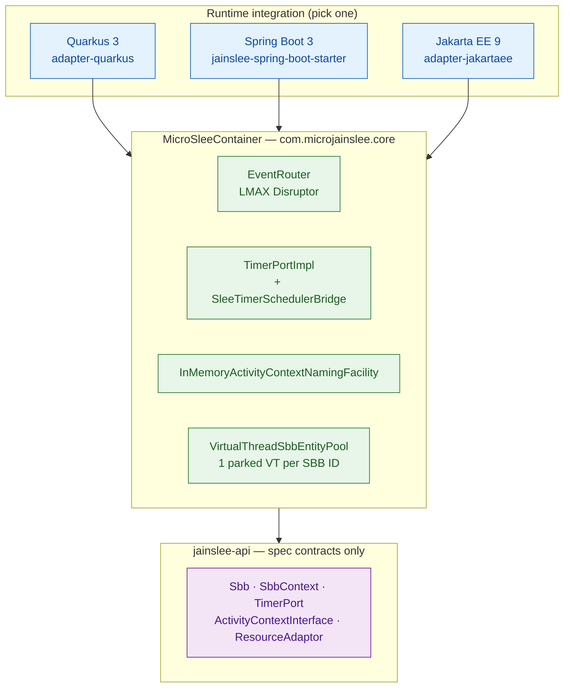
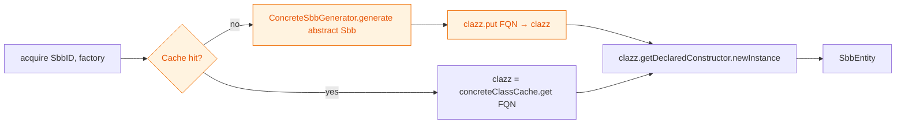
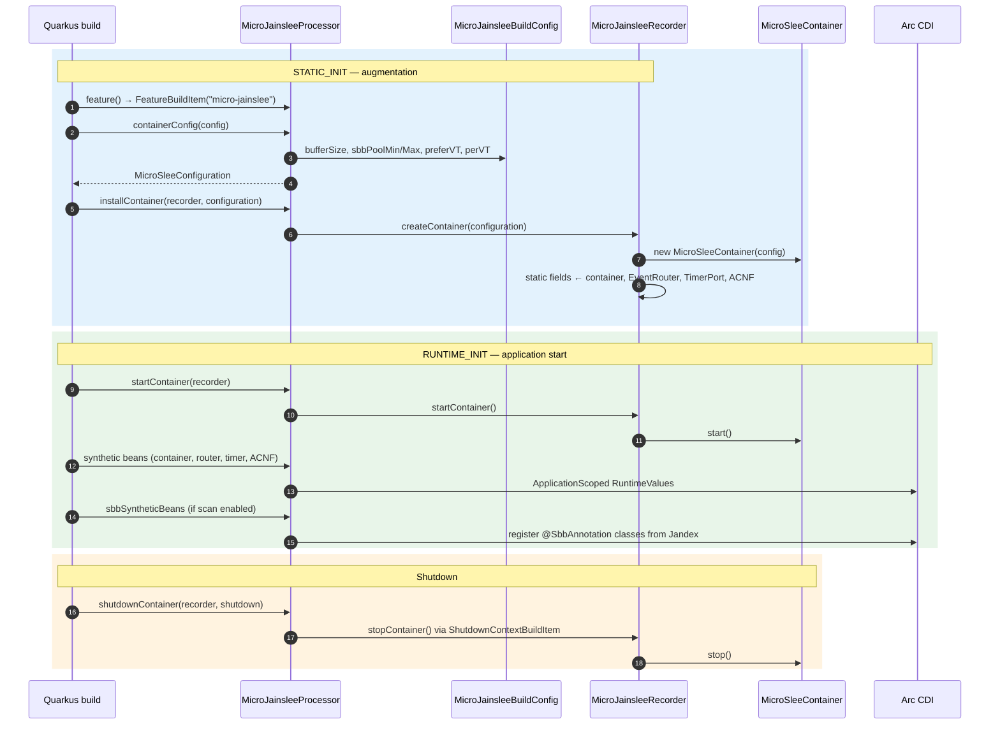
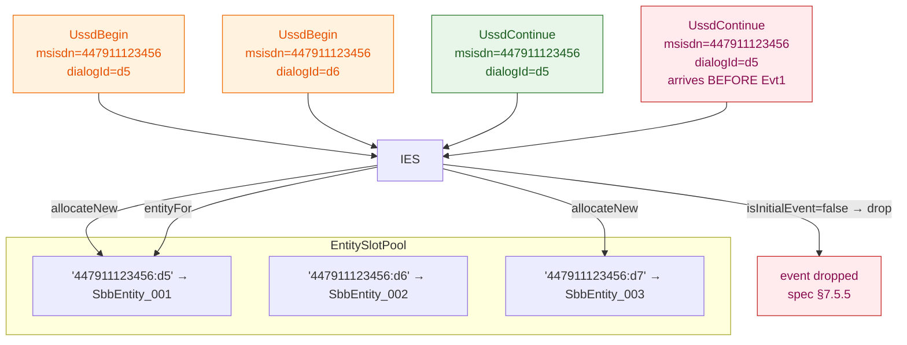
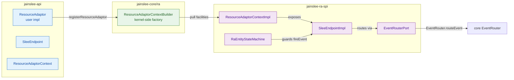

# micro-jainslee 1.1.0 — Design Document

> **Audience:** engineers embedding micro-jainslee in **Quarkus 3** applications;
> contributors extending the container; reviewers evaluating the architecture.
> Spring Boot and Jakarta EE adapters follow the same core patterns described here.

**Maintainer:** Tran Nhan ([nhanth87@gmail.com](mailto:nhanth87@gmail.com))  
**License:** Dual — GPLv3 OR Commercial (see [`LICENSE`](../LICENSE))  
**Last updated:** 2026-06-28  
**Source:** [`jain-slee/`](../../) (branch `micro-jainslee`)

---

## Table of contents

1. [Goals and non-goals](#1-goals-and-non-goals)
2. [Architectural overview](#2-architectural-overview)
3. [Module map](#3-module-map)
   * [3.1 Perfect Core — S1–S5 (June 2026)](#31-perfect-core--s1s5-june-2026)
4. [Event router pipeline](#4-event-router-pipeline)
5. [SBB entity pool with Java 25 virtual threads](#5-sbb-entity-pool-with-java-25-virtual-threads)
6. [Timer facility and jSS7 bridge](#6-timer-facility-and-jss7-bridge)
7. [Annotation processor](#7-annotation-processor)
8. [Runtime integrations](#8-runtime-integrations)
   * [8.4 Initial Event Selector (S3 deep dive)](#84-initial-event-selector-s3-deep-dive)
   * [8.5 Child SBB Relations (S4 deep dive)](#85-child-sbb-relations-s4-deep-dive)
   * [8.6 Resource Adaptor Wiring (S5 deep dive)](#86-resource-adaptor-wiring-s5-deep-dive)
9. [Configuration model](#9-configuration-model)
10. [Concurrency contract](#10-concurrency-contract)
11. [Failure modes and recovery](#11-failure-modes-and-recovery)
12. [Design decisions log](#12-design-decisions-log)
13. [Namespace strategy (GAP-16)](#13-namespace-strategy-gap-16)

---

## 1. Goals and non-goals

### Goals

| Goal | How we meet it |
|---|---|
| Run the JAIN SLEE 1.1 spec semantics inside a plain JVM | Pure JDK 8 source/target, no JBoss Modules, VFS, MSC, JMX dependency |
| Embeddable in popular Java frameworks | First-class adapters for Spring Boot 3, Quarkus 3, Jakarta EE 9 |
| Scale to 100K concurrent SBBs on commodity hardware | Per-SBB virtual-thread pinning (Java 25); 14 OS threads host 100K virtual threads in our stress test |
| Stay under 5 KLOC | Current count: ~2,900 LOC in `jainslee-core` (incl. IES / child / RA packages), ~4,500 LOC across the whole Perfect Core S1–S5 reactor |
| Be readable end-to-end in one sitting | One class per concern, one file per responsibility, no hidden codegen on the hot path |

### Non-goals

| Non-goal | Rationale |
|---|---|
| TCK compliance | micro-jainslee is R&D-only; production USSD 7.3 still ships the JBoss/Mobicents stack which is the TCK-targeted implementation |
| Cluster / HA | Single-JVM only. Clustered deployment would require adding an Infinispan-backed timer and replicated SBB state, which the production stack already provides |
| JSR-77 management | The embedding runtime (Spring Boot Actuator, Quarkus SmallRye Health, WildFly JMX) is responsible for management surface |
| JTA transactions | **Updated 2026-06-28:** opt-in JTA integration now lives in the `jainslee-tx` module (Narayana 7.0); off-by-default so dev/R&D keeps zero overhead. SBBs can still wrap their own logic in Spring/Quarkus `@Transactional` for the no-JTA path. |
| Congestion control | The embedding application is responsible for rate limiting; the EventRouter drops nothing |

---

## 2. Architectural overview



There are exactly **four orthogonal concerns**:

1. **Event routing** — `EventRouter` owns a single LMAX Disruptor ring
   buffer. Producers (RA callbacks, `MicroSleeContainer.routeEvent`,
   timer fires) publish wrapped events into the ring; one consumer
   dispatches to the ACI's attached SBBs.
2. **SBB threading** — `VirtualThreadSbbEntityPool` pins each SBB ID to
   its own parked virtual thread. Every `entity.submit(runnable)` lands
   on that one thread, giving the spec-mandated single-threaded
   per-SBB ordering.
3. **Timer facility** — `TimerPortImpl` delegates to
   `SleeTimerSchedulerBridge` which schedules a `TimerRecord` on jSS7's
   `LocalTimerAdapter` (Netty `HashedWheelTimer`, 10 ms tick). When the
   wheel fires, the bridge posts a `TimerFiredEvent` back through
   `EventRouter.routeEvent` — **never** invokes SBB code on the
   hashed-wheel thread.
4. **Naming & lookup** — `InMemoryActivityContextNamingFacility` is a
   `ConcurrentHashMap<String, ActivityContextInterface>`; an RA binds a
   new ACI under a string name and any SBB can look it up.


---

## 3. Module map

| Maven coordinates | Purpose | Public API surface |
|---|---|---|
| `com.microjainslee:jainslee-api:1.1.0` | Spec contracts only — zero implementation | `Sbb`, `SbbContext`, `SbbLocalObject`, `ChildRelation`, `SbbID`, `SleeEvent`, `SleeEventHandler`, `TimerPort`, `TimerFiredEvent`, `ActivityContextInterface`, `ActivityContextNamingFacility`, `ResourceAdaptor`, `ResourceAdaptorContext`, `SleeEndpoint`, `TracePort`, `TraceLevel`, `UsagePort`, `AlarmPort`, `AlarmLevel`, `ProfileTablePort`, `NamingPort`, `EventTypeRef`, `@SbbAnnotation`, `@DeployableUnit`, `@EventType`, `@InitialEventSelect` |
| `com.microjainslee:jainslee-core:1.1.0` | Embedded container — the runtime | `MicroSleeContainer`, `MicroSleeConfiguration` (+ Builder), `MicroSleeExecutors`, `EventRouter`, `VirtualThreadSbbEntityPool` (+ nested `SbbEntity`), `SbbEntityPool` (shim), `TimerPortImpl`, `SleeTimerSchedulerBridge`, `SbbLifecycleManager`, `InMemoryActivityContext`, `InMemoryActivityContextNamingFacility`, `SimpleSbbContext`, `SimpleSbbLocalObject`, `SimpleTracePort`, `SimpleUsagePort`, `SimpleAlarmPort`, `InMemoryProfileTablePort`, `InMemoryNamingPort`, `InitialEventSelectorDispatcher`, `CascadeRemover`, `ChildRelationFactory`, `ChildRelationImpl`, `ResourceAdaptorContextBuilder` |
| `com.microjainslee:jainslee-codegen:1.1.0` | Deploy-time Javassist concrete-SBB generator (Perfect Core S2) | `ConcreteSbbGenerator`, `JavassistDeployTimeCodegen` |
| `com.microjainslee:jainslee-apt:1.1.0` | Javac annotation processor — emits `META-INF/microjainslee/sbb-index.properties` at compile time | `MicroJainsleeAnnotationProcessor` + SPI under `META-INF/services/javax.annotation.processing.Processor` |
| `com.microjainslee:jainslee-ra-spi:1.1.0` | Resource Adaptor SPI wiring (Perfect Core S5) | `RaEntityStateMachine`, `SleeEndpointImpl`, `ResourceAdaptorContextImpl`, `EventRouterPort`, `AcquireActivityContext`, `DefaultActivityContextInterface`, `NoopAlarmFacility`, `LogbackTraceFacility`, `SimpleEventLookupFacility`, `SimpleNullActivityFactory` |
| `com.microjainslee:jainslee-tx:1.1.0` | Narayana JTA 7.0 transaction integration | `JtaTransactionManager`, `TransactionContext`, `NoOpTransactionManager`, `JtaTransactionException` |
| `com.microjainslee:jainslee-cluster:1.1.0` *(P2)* | Infinispan / JGroups clustering primitives (snapshot + ACNF replication) | `ClusterManager`, `DistributedSbbEntityPool`, `ClusteredActivityContextNamingFacility`, `SbbEntitySnapshot` |
| `com.microjainslee:jainslee-tck-harness:1.1.0` | TCK harness skeleton — non-production only | `TckRunner`, `MicrojainsleeContainerAdapter` |
| `com.microjainslee:jainslee-spring-boot-starter:1.1.0` | Spring Boot 3 auto-configuration | `@AutoConfiguration MicroJainsleeAutoConfiguration`, `@ConfigurationProperties MicroJainsleeProperties`, `MicroJainsleeLifecycle`, `MicroJainsleeDeployer`, `@EnableMicroJainslee` |
| `com.microjainslee:adapter-quarkus:1.1.0` (3-module reactor: parent + runtime + deployment) | Quarkus 3 extension | `MicroJainsleeBuildConfig`, `MicroJainsleeProcessor`, `MicroJainsleeRecorder`, `MicroJainsleeProducer`, `MicroJainsleeHolder`, `TraceFacilityQuarkusAdapter`, `UsageFacilityQuarkusAdapter`, `AlarmPortQuarkusAdapter`, `ProfileTablePortQuarkusAdapter` |
| `com.microjainslee:adapter-jakartaee:1.1.0` | Jakarta EE 9 EJB integration | `@Singleton @Startup @LocalBean MicroSleeContainerStartup`, `JndiNames` |

Dependencies flow strictly one-way: adapters depend on core; core depends on api; api has no dependencies. Example apps ship their own RA classes (see `example/example-quarkus/.../ra/`).

```
                        ┌────────────────────────┐
                        │   jainslee-api 1.1.0   │  (JDK only)
                        │  @SbbAnnotation, …     │
                        │  @InitialEventSelect   │
                        └──────────┬─────────────┘
                                   │
        ┌──────────────────────────┼─────────────────────────────┐
        │                          │                             │
┌───────▼─────────────────┐  ┌─────▼───────────┐  ┌──────────────▼──────────────┐
│   jainslee-core 1.1.0   │  │  jainslee-apt   │  │      jainslee-codegen       │
│  (Disruptor + VT pool + │  │ (javax.annot.)  │  │  (Javassist concrete-SBB    │
│   IES, child-relation,  │  └─────────────────┘  │   generator, optional dep)  │
│   RA-builder)           │                      └──────────────────────────────┘
└──────────┬──────────────┘
           │
           │              ┌────────────────────────┐
           ├─────────────►│    jainslee-ra-spi     │  (RA EntityStateMachine +
           │              │   SleeEndpointImpl,    │   ResourceAdaptorContext)
           │              │   ResourceAdaptorCtx   │
           │              └────────────────────────┘
           │
           │              ┌────────────────────────┐    ┌─────────────────────────┐
           ├─────────────►│      jainslee-tx       │    │    jainslee-cluster     │  (P2)
           │              │   (Narayana JTA 7.0)   │    │   Infinispan / JGroups  │
           │              └────────────────────────┘    │   snapshot + ACNF repl. │
           │                                            └─────────────────────────┘
           │              ┌────────────────────────┐
           └─────────────►│   jainslee-tck-harness │  (skeleton, non-production)
                          └────────────────────────┘
           │
           ├──────────────────────┬───────────────────────────┐
           │                      │                           │
┌──────────▼─────────────┐ ┌──────▼─────────────┐ ┌─────────▼──────────────┐
│ jainslee-spring-       │ │ adapter-quarkus   │ │   adapter-jakartaee    │
│ boot-starter           │ │  (parent+runtime  │ │  (@Singleton EJB +     │
│  (Spring Boot 3)       │ │   +deployment)    │ │   JNDI bind)           │
└────────────────────────┘ └────────────────────┘ └────────────────────────┘
```

### 3.1 Perfect Core — S1–S5 (June 2026)

Five focused iterations took micro-jainslee from "an LMAX Disruptor plus a
virtual-thread pool" to a spec-compliant **kernel** that can route
stateful protocol sessions (USSD, SIP dialogs, custom dialogs) end-to-end:

| Step | Commit | Focus | Headline additions |
|------|--------|-------|--------------------|
| **S1** | _pre-S2 baseline_ | IES dispatcher skeleton + spec contract | `InitialEventSelectorDispatcher` interface + `@InitialEventSelect` placeholder |
| **S2** | `a7566ed29` | CMP Javassist codegen | New module **`jainslee-codegen`** with `ConcreteSbbGenerator` + `JavassistDeployTimeCodegen`. Replaces runtime reflection-based field access with a generated concrete subclass — keeps `CmpBackedSbb` callable from the VT-pinned hot path without reflection overhead |
| **S3** | `37c7e4c36` | Initial Event Selector wiring | Production dispatcher `core/ies/InitialEventSelectorDispatcher`, `@InitialEventSelect` annotation (`api/annotations`), `InitialEventSelectCondition` + `InitialEventSelectResult` records. Convergence-key pattern lets `EventRouter.routeIncomingEvent()` route to existing SBB entities |
| **S4** | `05cefe3dc` | Child SBB Relations | New package **`core/child/`** with `ChildRelationImpl`, `ChildRelationFactory` (reflection-scan of abstract `ChildRelation<T>` accessors), `CascadeRemover` (depth-first post-order traversal per spec §6.7) |
| **S5** | `a2029f26d` | RA full wiring | New module **`jainslee-ra-spi`** + new package **`core/ra/`** with `RaEntityStateMachine` (INACTIVE / ACTIVE / STOPPING), `SleeEndpointImpl` (full §13.4), `ResourceAdaptorContextImpl` (all 7 facilities), `ResourceAdaptorContextBuilder` (kernel-side factory) |

**Combined effect:** a single Maven reactor build now delivers a kernel
that matches JAIN SLEE 1.1 sections §6 (SBB composition), §7.5 (IES),
§12.4 (RA lifecycle), §13.4 (SleeEndpoint) — *without* the legacy JBoss
Modules / VFS / MSC stack. The remaining gaps (clustering, JTA in hot
path, TCK conformance) live in dedicated modules (`jainslee-cluster`,
`jainslee-tx`, `jainslee-tck-harness`) wired in P1.2/P2.

---

## 4. Event router pipeline

The single hot path of the runtime is event delivery:

```
producer → ringBuffer.next() → ringBuffer.publish() → consumer fires → dispatch → SbbEntity.submit() → parked VT runs sbb.onEvent()
```

### End-to-end sequence

```mermaid
sequenceDiagram
    autonumber
    participant Prod as Producer (RA / timer / test)
    participant ER as EventRouter
    participant RB as Disruptor ring buffer
    participant POOL as VirtualThreadSbbEntityPool
    participant VT as parked virtual thread
    participant SBB as Sbb.onEvent()

    classDef producer fill:#e3f2fd,stroke:#1565c0,color:#0d47a1
    classDef router fill:#fff3e0,stroke:#ef6c00,color:#e65100
    classDef sbb fill:#e8f5e9,stroke:#2e7d32,color:#1b5e20

    class Prod producer
    class ER,RB router
    class POOL,VT,SBB sbb

    Prod->>ER: routeEvent(SleeEvent, ACI)
    ER->>RB: next() — claim sequence slot
    ER->>RB: get(seq).setEvent/setAci
    ER->>RB: publish(seq) — lock-free barrier
    RB-->>ER: onEvent(EventWrapper) — consumer thread
    ER->>ER: dispatch(event, aci)
    loop for each SBB attached to ACI
        ER->>POOL: entity.submit(Runnable)
        POOL->>VT: queue.offer(task)
        VT->>SBB: task.run() → onEvent(event, aci)
    end
    ER->>RB: wrapper.clear() — reuse slot
```

### Key invariants

- **Single Disruptor instance** — one ring buffer per container, not per
  ACI. Routing is keyed on the ACI's attached SBB IDs.
- **Multi-producer, single-consumer** — `ProducerType.MULTI` lets RAs,
  timers, and tests publish concurrently; `YieldingWaitStrategy`
  yields when the ring is empty rather than spinning.
- **No allocations on the hot path** — `EventWrapper` is reused via
  `ringBuffer.get(seq)`; `wrapper.clear()` resets both fields to
  `null` after dispatch so the GC doesn't churn.

### Sequence (producer side)

```java
public void routeEvent(SleeEvent event, ActivityContextInterface aci) {
    long sequence = ringBuffer.next();
    try {
        EventWrapper wrapper = ringBuffer.get(sequence);
        wrapper.setEvent(event);
        wrapper.setAci(aci);
    } finally {
        ringBuffer.publish(sequence);
    }
}
```

`ringBuffer.publish()` is a lock-free single-word store on the LMAX
sequence barrier. The consumer thread sees the event within a bounded
number of cycles.

### Sequence (consumer side)

```java
this.disruptor.handleEventsWith(new EventHandler<EventWrapper>() {
    public void onEvent(EventWrapper wrapper, long sequence, boolean endOfBatch) {
        try {
            dispatch(wrapper.event, wrapper.aci);
        } finally {
            wrapper.clear();
        }
    }
});
```

`dispatch()` looks up every SBB attached to the ACI and asks the
`VirtualThreadSbbEntityPool` for each SBB ID's parked virtual thread
(via `entity.submit(runnable)`). The handler returns immediately —
the actual `sbb.onEvent()` invocation happens asynchronously on the
parked VT.

### Initial Event Selector integration — `routeIncomingEvent()`

Perfect Core S3 added a second producer path that funnels through the
**IES dispatcher** before reaching the ring buffer. RAs call
`EventRouter.routeIncomingEvent(event, aci)` instead of
`routeEvent(...)` when they want the container to figure out whether
this is the **first** event of a logical session (allocate a new SBB
entity) or a **subsequent** event (route to the entity that owns the
convergence key).

```mermaid
sequenceDiagram
    autonumber
    participant RA as ResourceAdaptor
    participant ER as EventRouter
    participant IES as InitialEventSelectorDispatcher
    participant SBB as temp Sbb instance
    participant POOL as VirtualThreadSbbEntityPool
    participant VT as parked virtual thread

    classDef router fill:#fff3e0,stroke:#ef6c00,color:#e65100
    classDef ies fill:#fce4ec,stroke:#c62828,color:#880e4f
    classDef sbb fill:#e8f5e9,stroke:#2e7d32,color:#1b5e20

    class ER router
    class IES,SBB ies
    class POOL,VT,RA sbb

    RA->>ER: routeIncomingEvent(event, aci)
    ER->>IES: resolve(event, aci)
    IES->>SBB: tempInstance.selectInitialEvent(cond)
    SBB-->>IES: InitialEventSelectResult{convergenceName, isInitialEvent}
    alt convergenceName found in EntitySlotPool
        IES->>POOL: entityFor(convergenceName).submit(event)
    else new initial event
        IES->>POOL: allocateNew() → entity[convergenceName]
        IES->>POOL: entityFor(convergenceName).submit(event)
    end
    POOL->>VT: queue.offer(eventTask)
    VT->>VT: sbb.onEvent(event, aci)
```

**Why this matters:** without IES, every incoming event created a
fresh SBB entity, throwing away CMP state between `UssdBegin` and
`UssdContinue` — the kernel was stateless and unusable for real
protocols. With IES, the dispatcher computes a stable convergence
key (e.g. `"447911123456:d5"`) and the pool either:

- **hits** an existing entity (subsequent events keep their state), or
- **misses** and `isInitialEvent() == true` ⇒ allocates a fresh entity
  and indexes it under the convergence key, or
- **misses** and `isInitialEvent() == false` ⇒ drops the event per
  spec §7.5.5 (e.g. `CONTINUE` before `BEGIN`).

The dispatcher is bound via
`MicroSleeContainer.setInitialEventSelectorDispatcher(dispatcher)`;
when unbound, `routeIncomingEvent()` falls back to the legacy
`allocate-per-event` behaviour — full backward compatibility.

### Why pinned virtual threads beat thread-pool executors

A traditional executor (e.g. `ThreadPoolExecutor` with N workers)
would queue an event for an arbitrary worker. Two events for the same
SBB could land on different workers in any order, breaking the
single-threaded per-SBB invariant. With virtual threads we pay ~1 KB
per parked VT and pin each SBB ID to its own VT — no queue, no
contention, no locks.


---

## 5. SBB entity pool with Java 25 virtual threads

`VirtualThreadSbbEntityPool` is the heart of the SBB runtime. Each
registered SBB ID owns one parked virtual thread that sequentially
drains an internal `LinkedBlockingQueue<Runnable>`. Every event handed
to the SBB is enqueued onto that thread, giving the **single-threaded
per-SBB ordering** the JAIN SLEE spec mandates.

### Lifecycle of one entity

```mermaid
sequenceDiagram
    autonumber
    participant Caller as acquire() caller
    participant Pool as VirtualThreadSbbEntityPool
    participant Map as ConcurrentHashMap
    participant VT as new virtual thread
    participant Q as LinkedBlockingQueue

    classDef pool fill:#e8f5e9,stroke:#2e7d32,color:#1b5e20
    classDef thread fill:#f3e5f5,stroke:#7b1fa2,color:#4a148c

    class Pool,Map pool
    class VT,Q,Caller thread

    Caller->>Pool: acquire(sbbId, factory)
    Pool->>Map: putIfAbsent(sbbId, freshEntity)
    alt first registrant (winner)
        Map-->>Pool: null (inserted)
        Pool->>VT: owner.submit(EventLoop)
        Pool-->>Caller: fresh SbbEntity
    else concurrent race (loser)
        Map-->>Pool: prior entity
        Pool->>Pool: fresh.markShutdown(); queue.clear()
        Pool-->>Caller: prior SbbEntity
    end

    Caller->>Pool: entity.submit(runnable)
    Pool->>Q: offer(runnable)
    VT->>Q: poll(50ms)
    VT->>VT: runnable.run()

    Caller->>Pool: shutdown()
    Pool->>Q: offer(POISON) per entity
    Pool->>VT: awaitTermination(5s)
```

### Javassist concrete-SBB generation (S2 integration)

When the **`jainslee-codegen`** module is on the classpath, the pool
delegates entity instantiation to `JavassistDeployTimeCodegen`. The
codegen module:

1. Receives the abstract `Sbb` class and its `CmpFieldStoreLocator`.
2. Emits a concrete subclass (e.g. `UssdMenuSbb_Generated`) that
   - declares one field per CMP accessor (no reflection at runtime),
   - exposes a public no-arg constructor,
   - forwards every `abstract` method to the parent.
3. Caches the generated `Class<?>` in a `ConcurrentHashMap<String, Class<?>> concreteClassCache`
   keyed by SBB FQN so the second `acquire()` for the same SBB ID is
   a cache hit.



When the codegen module is **absent** (R&D mode, single-JVM), the pool
falls back to a `ReflectionFallbackSbbFactory` checked on first use —
the kernel never breaks because codegen is missing. This lets
embedders opt into zero-reflection operation for production-like
workloads while keeping the dev/R&D boot path simple.

### EventLoop pseudo-code

```java
while (!shutdown.get()) {
    Runnable task = queue.poll(50, TimeUnit.MILLISECONDS);
    if (task == null) {
        parked.set(true);
        if (shutdown.get()) return;
        continue;
    }
    parked.set(false);
    try { task.run(); } catch (Throwable ignored) { /* swallow */ }
}
```

Two key invariants:

1. **Single-threaded per ID** — only this VT ever reads `task` and calls
   `sbb.onEvent(...)`. The SBB sees strict FIFO order across all RA
   events, timer fires, and RA-sourced events.
2. **No leak on exception** — a thrown exception in one task does not
   kill the loop; the next event is still processed.

### Performance characteristics

Measured on **Java 25.0.3 (Azul Zulu 25.34.17)**, 4 CPU cores, 8 GB heap,
default GC:

| Scale | Create (ms) | Pending (ms) | Cancel (ms) | Heap Δ | OS threads |
|------:|------------:|-------------:|-----------:|-------:|-----------:|
| 10K   |     172     |     292      |    106     | +20 MB |    14      |
| 50K   |     970     |   1,828      |    361     | +158 MB|    14      |
| 100K  |   1,302     |   3,650      |    779     | +290 MB|    14      |

`liveThreads` stays at **14 across all three scales** — that's
approximately 4 cores × ~3.5 carrier threads (ForkJoinPool.commonPool()
default). The 100K virtual threads are scheduled on those 14 OS threads
without any of them blocking.

Throughput per pending task: **~7.3 µs/task** for 50K and 100K scales.
The per-SBB `LinkedBlockingQueue.poll(50ms)` is the hot path; it runs
entirely in user space.

---

## 6. Timer facility and jSS7 bridge

`TimerPort` is the JAIN SLEE timer API: `setTimer(ms, sbb)` returns an
opaque `long timerId`; `cancelTimer(timerId)` cancels by id. In
micro-jainslee the implementation is `TimerPortImpl` which delegates
to `SleeTimerSchedulerBridge`.

### Bridge flow

```mermaid
sequenceDiagram
    autonumber
    participant SBB as Sbb (parked VT)
    participant TP as TimerPortImpl
    participant BR as SleeTimerSchedulerBridge
    participant JSS7 as LocalTimerAdapter
    participant ER as EventRouter
    participant VT as same parked VT

    classDef sbb fill:#f3e5f5,stroke:#7b1fa2,color:#4a148c
    classDef timer fill:#fce4ec,stroke:#c62828,color:#880e4f
    classDef router fill:#fff3e0,stroke:#ef6c00,color:#e65100

    class SBB,VT sbb
    class TP,BR,JSS7 timer
    class ER router

    SBB->>TP: setTimer(delayMs, sbbLocal)
    TP->>BR: schedule(sbbLocal, delayMs)
    BR->>BR: resolve ACI, build TimerRecord
    BR->>JSS7: schedule(record, delay, callback)
    Note over JSS7: HashedWheelTimer — never calls SBB here

    JSS7-->>BR: onTimerFire(record) — wheel thread
    BR->>BR: targets.remove(timerId)
    BR->>ER: routeEvent(TimerFiredEvent, aci)
    ER->>VT: entity.submit(onEvent task)
    VT->>SBB: onEvent(timerEvent, aci)
```

### Function call chain

| Step | Caller | Method | Callee |
|-----:|--------|--------|--------|
| 1 | SBB | `TimerPort.setTimer(ms, sbbLocal)` | `TimerPortImpl` |
| 2 | `TimerPortImpl` | `schedule(sbbLocal, ms)` | `SleeTimerSchedulerBridge` |
| 3 | Bridge | `scheduler.schedule(record, ms, callback)` | jSS7 `LocalTimerAdapter` |
| 4 | Wheel thread | `onTimerFire(record)` | Bridge callback |
| 5 | Bridge | `eventRouter.routeEvent(TimerFiredEvent, aci)` | `EventRouter` |
| 6 | `EventRouter` | `entity.submit(() -> onEvent(...))` | `VirtualThreadSbbEntityPool` |

### Why we never invoke SBB code on the wheel thread

If the SBB threw an exception or stalled, calling it directly on the
hashed-wheel thread would freeze every other timer in the system. By
funneling the fire through `EventRouter.routeEvent`, the wheel thread
returns within microseconds and the SBB callback runs on the same
parked virtual thread that originally called `setTimer` — preserving
both order and isolation.

### Timer type — `TimerType.TCAP_INVOKE_TIMEOUT`

The bridge currently reuses jSS7's `TCAP_INVOKE_TIMEOUT` because
jSS7 9.4.0 does not yet expose a generic SLEE timer type. This is a
known R&D limitation — timer semantics are correct for single-JVM
Quarkus embeddings; a dedicated `SLEE_TIMER` enum in jSS7 would remove
the type-name mismatch without changing the bridge contract.

### Transactional integration — `jainslee-tx` (JTA)

The **`jainslee-tx`** module wraps every SBB event handler invocation
in a Narayana JTA 7.0 transaction so profile-table writes, timer
cancellations, and activity side effects can participate in two-phase
commit once XA resources are wired in P2. The integration is
opt-in — applications add `jainslee-tx` to the classpath and the
`EventRouter` auto-detects a `TransactionContext` bean:

```java
// SBB callback runs inside a JTA transaction
jtaManager.executeInTransaction(() -> {
    profileTable.put(key, value);   // joins the active TX
    timerPort.cancelTimer(id);       // joins the active TX
});
```

**Virtual-thread pinning note:** Narayana 7.0 uses `synchronized`
internally, so `executeInTransaction()` must run on a platform
thread. The EventRouter always invokes it from the Disruptor handler
or SBB entity thread, never from a parked VT. For P1.2 the
transactional path is **off by default** — embedders turn it on by
installing a `JtaTransactionManager` bean via the Quarkus extension or
Spring Boot starter.


---

## 7. Annotation processor

`jainslee-apt` ships a Javac annotation processor that runs during the
`compile` phase of any project that depends on it. It scans for three
annotations and writes `META-INF/microjainslee/sbb-index.properties`
that the runtime can read on startup.

### Supported annotations

| Annotation | Target | Collected fields |
|---|---|---|
| `@SbbAnnotation(name, vendor, version)` | `ElementType.TYPE` | FQN, name, vendor, version |
| `@EventType(name, vendor, version)` | `ElementType.TYPE` | FQN, name, vendor, version |
| `@DeployableUnit(name, vendor, version, sbbs, ras, profileSpecs)` | `ElementType.TYPE` + `ElementType.PACKAGE` | FQN, name, vendor, version, comma-separated FQN lists of bundled components |

### Why a build-time index instead of runtime scanning

A runtime classpath scan is **O(N)** on every boot. The APT runs once at
compile time, when the class set is already known, and emits a flat
`Properties` file that any thread can read with `getProperty` in
**O(1)**. The runtime never sees a `Class.forName` call.

### Output format

```properties
#micro-jainslee index — generated by MicroJainsleeAnnotationProcessor
sbb.0.class=com.foo.MySbb
sbb.0.name=MySbb
sbb.0.vendor=com.microjainslee
sbb.0.version=1.0
eventType.0.class=com.foo.MyEvent
du.0.class=com.foo.MyDU
du.0.sbbs=com.foo.MySbb
```

### SPI registration

`META-INF/services/javax.annotation.processing.Processor` contains a
single line:

```
com.microjainslee.apt.MicroJainsleeAnnotationProcessor
```

This is the JDK's standard SPI for annotation processors; any `javac`
run with the processor jar on the `-processorpath` will discover and
invoke it automatically.

### Multi-round merge semantics

The processor accumulates discovered annotations across rounds and only
writes the index file on the **final round** (`processingOver()`).
Multi-round compilation (annotation processing → SBB codegen →
final compile) is handled by merging the existing properties file with
new entries and incrementing the index counters (`sbb.0`, `sbb.1`,
…) so concurrent builds don't clobber each other.

---

## 8. Runtime integrations

### 8.1 Spring Boot 3

`jainslee-spring-boot-starter` provides:

- `@AutoConfiguration MicroJainsleeAutoConfiguration` — wires `MicroSleeContainer`,
  `MicroSleeConfiguration`, `EventRouter`, `TimerPort`,
  `InMemoryActivityContextNamingFacility` as Spring beans.
- `@ConfigurationProperties MicroJainsleeProperties` — driven by
  `microjainslee.*` keys in `application.yml`.
- `MicroJainsleeLifecycle implements SmartLifecycle` — calls
  `container.start()` on Spring context refresh,
  `container.stop()` on shutdown. Phase `Integer.MIN_VALUE + 100`
  ensures the SLEE container starts before user beans that may depend
  on its facilities.
- `MicroJainsleeDeployer implements ApplicationRunner` — Phase 3.5 will
  implement the full classpath scanner; the Phase 3 scope only logs
  the requested scan paths.
- `@EnableMicroJainslee` — marker annotation for opt-in use.

### 8.2 Quarkus 3 (primary integration path)

**Quarkus is the recommended runtime** for new micro-jainslee services.
The `adapter-quarkus` extension is a standard 3-module Quarkus layout:

| Module | Artifact role | Key classes |
|--------|---------------|-------------|
| `adapter-quarkus` (parent) | BOM / reactor | — |
| `deployment` | Build-time `@BuildStep` processor | `MicroJainsleeProcessor`, `MicroJainsleeBuildConfig` |
| `runtime` | Run-time recorder + CDI producer | `MicroJainsleeRecorder`, `MicroJainsleeProducer` |

#### Extension bootstrap sequence



#### Build-step function call flow

| Phase | `MicroJainsleeProcessor` method | Delegates to |
|-------|--------------------------------|--------------|
| Build | `containerConfig(MicroJainsleeBuildConfig)` | `MicroSleeConfiguration.builder()` |
| `STATIC_INIT` | `installContainer(recorder, configuration)` | `recorder.createContainer(configuration)` |
| `RUNTIME_INIT` | `startContainer(recorder)` | `recorder.startContainer()` → `container.start()` |
| `RUNTIME_INIT` | `containerSyntheticBean(...)` | `SyntheticBeanBuildItem` for `MicroSleeContainer` |
| `RUNTIME_INIT` | `eventRouterSyntheticBean(...)` | Synthetic bean for `EventRouter` |
| `RUNTIME_INIT` | `timerPortSyntheticBean(...)` | Synthetic bean for `TimerPort` |
| `RUNTIME_INIT` | `acnfSyntheticBean(...)` | Synthetic bean for `InMemoryActivityContextNamingFacility` |
| Build | `sbbSyntheticBeans(...)` | Jandex scan for `@SbbAnnotation` implementors |
| `RUNTIME_INIT` | `shutdownContainer(recorder, shutdown)` | `shutdown.addShutdownTask(recorder::stopContainer)` |

#### Dependency in a Quarkus application

```xml
<dependency>
  <groupId>com.microjainslee</groupId>
  <artifactId>adapter-quarkus</artifactId>
  <version>1.1.0</version>
</dependency>
```

User services inject the container and facilities:

```java
@ApplicationScoped
public class UssdEntryPoint {
    @Inject MicroSleeContainer container;
    @Inject EventRouter eventRouter;
    @Inject TimerPort timerPort;

    public void onSessionStart(String sessionId, SleeEvent event) {
        ActivityContextInterface aci = container.createActivityContext(sessionId);
        SbbLocalObject sbb = container.registerSbb("UssdMenuSbb", new UssdMenuSbb());
        container.attach(sessionId, sbb);
        container.routeEvent(event, aci);
    }
}
```

`MicroJainsleeProducer` also exposes `@Produces @DefaultBean` methods so
applications can override any facility with a CDI `@Alternative`.

The processor uses `jakarta.enterprise.context.ApplicationScoped` and
`jakarta.enterprise.inject.Produces` (NOT `javax.*`) — Quarkus 3.x is
on the Jakarta EE 9+ namespace.

### 8.3 Jakarta EE 9

`adapter-jakartaee` ships a single `@Singleton @Startup @LocalBean`
EJB:

```java
@Singleton @Startup @LocalBean
public class MicroSleeContainerStartup {
    @PostConstruct void init()    { container.start();   bindAll();   }
    @PreDestroy    void shutdown(){ container.stop();    unbindAll(); }
}
```

It binds the four facilities into JNDI at `java:global/microjainslee/*`
via `InitialContext.bind` / `rebind` (handle `NameAlreadyBoundException`
gracefully). Configuration comes from system properties prefixed with
`microjainslee.config.*`. The adapter uses `jakarta.ejb.*`,
`jakarta.annotation.*`, and `javax.naming.*` — Jakarta EE 9+ mandated
the jakarta.* rename for EJB and annotations, but JNDI stayed in
javax.* because Jakarta EE 9 left JNDI for a later release.


---

## 8.4 Initial Event Selector (S3 deep dive)

Section 4's `routeIncomingEvent()` diagram showed the high-level flow;
this subsection covers the contract, the dispatcher's internals, and
the **convergence-key pattern** that makes stateful protocols work.

### Spec reference

JAIN SLEE 1.1 §7.5 — Initial Event Selection. Every SBB that wants to
handle a stream of related events (USSD dialog, SIP INVITE/OK/BYE
triplet, custom request/response) must implement IES. Without IES,
the container cannot tell two messages belong to the same logical
session and would allocate a fresh entity for each event.

### API

```java
@InitialEventSelect(name = "ussd-convergence")
public InitialEventSelectResult selectInitialEvent(InitialEventSelectCondition c) {
    UssdEvent e = (UssdEvent) c.getEvent();
    return InitialEventSelectResult.builder()
        .convergenceName(e.getMsisdn() + ":" + e.getDialogId())
        .initialEvent(e.getType() == UssdEventType.BEGIN)
        .build();
}
```

| Method | Returns | Purpose |
|---|---|---|
| `selectInitialEvent(InitialEventSelectCondition c)` | `InitialEventSelectResult` | Called by dispatcher per incoming event |
| `InitialEventSelectCondition.getEvent()` | `Object` | The incoming `SleeEvent` (untyped) |
| `InitialEventSelectCondition.getAci()` | `ActivityContextInterface` | The activity context for the event |
| `InitialEventSelectResult.getConvergenceName()` | `String` | Stable key for the logical session; `null` ⇒ stateless |
| `InitialEventSelectResult.isInitialEvent()` | `boolean` | True if no entity may yet exist for this key |

### Convergence-key pattern



### Dispatcher internals (`InitialEventSelectorDispatcher`)

```java
public SbbEntity resolve(Object event, ActivityContextInterface aci) {
    InitialEventSelectCondition cond = new InitialEventSelectCondition(event, aci);
    // 1. Spawn a TEMPORARY instance (never on a pooled entity — spec §7.5)
    Sbb temp = sbbFactory.newTemporaryInstance();
    InitialEventSelectResult res = temp.selectInitialEvent(cond);

    if (res.getConvergenceName() == null) {
        // Stateless — always allocate fresh
        return pool.allocateNew().submit(event, aci);
    }

    SbbEntity entity = pool.entityFor(res.getConvergenceName());
    if (entity != null) {
        // Existing session — single-threaded enqueue per ID
        return entity.submit(event, aci);
    }

    if (res.isInitialEvent()) {
        // New session — allocate and index under convergence key
        SbbEntity fresh = pool.allocateNew();
        pool.indexUnder(res.getConvergenceName(), fresh);
        return fresh.submit(event, aci);
    }

    // Subsequent event with no prior entity — drop per §7.5.5
    LOG.warn("IES drop: no entity for convergence={} but isInitialEvent=false",
             res.getConvergenceName());
    return null;
}
```

### Threading & side-effects

- IES is invoked on the **IES dispatcher thread**, never on the SBB's
  parked VT.
- The dispatcher creates a **temporary** SBB instance per call so IES
  cannot read or mutate CMP state.
- The first `onEvent` for a new entity is still submitted to the parked
  VT — order is preserved (entity creation ⇒ `sbb.setSbbContext(...)` ⇒
  `onEvent(initialEvent, aci)`).

### Fallback when IES is unbound

If no dispatcher is bound, `EventRouter.routeIncomingEvent()` delegates
to the legacy `routeEvent()` path — every event creates a new SBB
entity. This is what the kernel did before S3 and is the default for
R&D mode where IES is overkill.


---

## 8.5 Child SBB Relations (S4 deep dive)

Section 5's `EntitySlotPool` indexes entities by **convergence name**
(a string from IES). The new **`ChildRelation`** API takes the same
plumbing in a different direction: explicit, typed collections of
child SBB entities that all share the same parent.

### Spec reference

JAIN SLEE 1.1 §6.7 — Composite SBBs. A composite SBB declares abstract
`ChildRelation<T>` accessors; the container generates a concrete
accessor that maintains a typed set of child entities, all removed
when the parent is removed.

### Usage pattern

```java
public abstract class OrderSbb implements Sbb {
    public abstract ChildRelation<PaymentSbbLocalObject> getPaymentChildRelation();
    public abstract ChildRelation<ShippingSbbLocalObject> getShippingChildRelation();
}
```

The codegen module (`S2`) emits a concrete subclass with:

```java
public final ChildRelation<PaymentSbbLocalObject> getPaymentChildRelation() {
    return ChildRelationFactory.createChildRelation(
        this, "payment", PaymentSbbLocalObject.class);
}
```

### `CascadeRemover` — depth-first post-order

JAIN SLEE 1.1 §6.7 specifies the cascade order:

```
parent
├── child-A
│   └── grandchild-A1 → sbbRemove() FIRST
│   └── grandchild-A2 → sbbRemove() SECOND
│   child-A → sbbRemove() THIRD
└── child-B → sbbRemove() FOURTH
parent → sbbRemove() LAST (or never if pool handles it)
```

`CascadeRemover` implements this with an iterative work-list (no
recursion — keeps stack frames flat for deep SBB trees):

```java
public void cascadeRemove(String parentEntityId) {
    Deque<String> stack = new ArrayDeque<>();
    stack.push(parentEntityId);
    Set<String> visited = new HashSet<>();

    while (!stack.isEmpty()) {
        String id = stack.pop();
        if (!visited.add(id)) continue;          // cycle guard
        SbbEntity e = lookup.lookup(id);
        if (e == null) continue;
        for (String child : e.getChildEntityIds()) {
            stack.push(child);                    // depth-first
        }
        postOrder.add(id);                        // emit AFTER children
    }

    // postOrder is now leaf-first; iterate it to call sbbRemove()
    for (String id : postOrder) {
        SbbEntity e = lookup.lookup(id);
        if (e != null) e.sbbRemove();
    }
}
```

| Class | Role |
|---|---|
| `ChildRelation<T>` (api) | Spec interface — typed bag of `T` local objects |
| `ChildRelationImpl<T>` (core/child) | Concrete impl backed by `ConcurrentHashMap<String, T>` |
| `ChildRelationFactory` (core/child) | Reflection-scan of abstract `ChildRelation<T>` accessors + cache |
| `CascadeRemover` (core/child) | Depth-first post-order traversal |

### Pool integration

`VirtualThreadSbbEntityPool.remove(entityId)` now delegates to
`CascadeRemover.cascadeRemove(entityId)` so removing a parent also
removes the entire subtree. The legacy `core.CascadeRemover` (static
utility) is retained for callers that prefer the `SimpleSbbLocalObject`
state-driven path.


---

## 8.6 Resource Adaptor Wiring (S5 deep dive)

Section 2's flowchart showed RAs firing events into the EventRouter.
This subsection covers the full RA lifecycle, the bridge between RA
code and the SLEE container, and the new `jainslee-ra-spi` module.

### Spec reference

JAIN SLEE 1.1 §12.4 — Resource Adaptor entity lifecycle (INACTIVE →
ACTIVE → STOPPING → INACTIVE).
JAIN SLEE 1.1 §13.4 — `SleeEndpoint` interface and the
`ResourceAdaptorContext` it gives RAs access to.

### Architecture



### `RaEntityStateMachine` — three-state guard

```java
public enum State { INACTIVE, ACTIVE, STOPPING }

public void activate()   { lock.lock(); try { state = ACTIVE;    ra.raActive(ctx);   } finally { lock.unlock(); } }
public void deactivate() { lock.lock(); try { state = STOPPING; ra.raStopping(ctx); } finally { lock.unlock(); } }
public void stopComplete() { lock.lock(); try { state = INACTIVE; ra.raInactive(ctx); } finally { lock.unlock(); } }

public void fireEvent(Object event, ActivityContextInterface aci, FireableEventType type) {
    State s = stateRef.get();
    if (s != State.ACTIVE) {
        throw new IllegalStateException("RA not ACTIVE: " + s);
    }
    sleeEndpoint.fireEvent(event, aci, type, null);
}
```

The state machine rejects `fireEvent()` calls when the RA is
`STOPPING` (lets the RA drain in-flight work) or `INACTIVE` (catches
race conditions on shutdown).

### `SleeEndpointImpl` — full §13.4

```java
public void fireEvent(Object event, ActivityContextInterface aci,
                      FireableEventType type, Address address)
        throws UnrecognizedActivityException, FiredUnrecognizedEventException {
    // 1. Validate against declared event-type set
    if (!declaredEventTypes.contains(type)) {
        throw new FiredUnrecognizedEventException("event type not declared: " + type);
    }
    // 2. Validate handle is active
    ActivityContextHandle handle = handlesByActivity.get(aci.getActivity());
    if (handle == null) {
        throw new UnrecognizedActivityException("no active handle for ACI");
    }
    // 3. Validate state machine
    stateMachine.assertActive();
    // 4. Route through EventRouterPort
    eventRouterPort.routeEvent(event, aci);
}
```

`activityStarted(ActivityHandle)` and `activityEnded(ActivityHandle)`
manage the bidirectional ACI ↔ handle map and fire
`ActivityEndedEvent` so attached SBBs can clean up state.

### `ResourceAdaptorContextImpl` — 7 facilities

Each registered RA gets its own `ResourceAdaptorContext` exposing:

| Facility | Purpose |
|---|---|
| `SleeEndpoint` | The bridge back to the SLEE container |
| `SleeEndpointPort` | Lower-level port for kernel-internal routing |
| `TimerFacility` | `setTimer(ms, addr)` / `cancelTimer(id)` |
| `AlarmFacility` | `raiseAlarm(...)` / `clearAlarm(...)` |
| `TraceFacility` | `trace(level, msg)` — backed by `LogbackTraceFacility` |
| `NullActivityFactory` | Create activities that have no inbound traffic |
| `EventLookupFacility` | Resolve `FireableEventType` by name at runtime |

### `ResourceAdaptorContextBuilder.build(container, ra, name)`

Canonical kernel-side factory used by
`MicroSleeContainer.registerResourceAdaptor(name, ra)`:

```java
public ResourceAdaptorContextImpl build(MicroSleeContainer container, ResourceAdaptor ra, String name) {
    return new ResourceAdaptorContextImpl(
        name,
        new SleeEndpointImpl(...),
        new SleeEndpointPortImpl(container.getEventRouter()),
        container.getTimerFacility(),
        new NoopAlarmFacility(),
        new LogbackTraceFacility(name),
        new SimpleNullActivityFactory(container),
        new SimpleEventLookupFacility(container.getSbbIndex()));
}
```

The builder is the single point where kernel facilities flow into RA
contexts — every RA gets the same shape, eliminating per-RA wiring
divergence.

### Why a separate `jainslee-ra-spi` module?

The SPI is deliberately split from the kernel because:

1. **Compile-time isolation** — RAs depend only on `jainslee-api`
   (spec types) + `jainslee-ra-spi` (wiring helpers), never on
   `jainslee-core`. Test RAs can be written without dragging in the
   full container.
2. **Optional codegen dependency** — `jainslee-ra-spi` does not
   depend on `jainslee-codegen`; the latter is only needed for
   generation-time tooling.
3. **Clear API boundary** — everything in
   `com.microjainslee.ra.*` is intended to be consumed by third-party
   RA authors; everything in `com.microjainslee.core.ra.*` is kernel
   internal (factories, builders).


---

## 9. Configuration model

`MicroSleeConfiguration` is an immutable value object built via a
fluent `Builder`. Defaults:

| Field | Default | Validation |
|---|---:|---|
| `eventRouterBufferSize` | 1024 | must be a positive power of two |
| `preferVirtualThreads` | true | none |
| `sbbPoolMin` | 16 | `>= 0` and `<= sbbPoolMax` |
| `sbbPoolMax` | 1024 | `>= 1` |
| `sbbPerVirtualThread` | true | none |

### Builder usage

```java
MicroSleeConfiguration cfg = MicroSleeConfiguration.builder()
        .eventRouterBufferSize(8192)
        .preferVirtualThreads(true)
        .sbbPoolMin(64)
        .sbbPoolMax(100_000)
        .build();
```

Validation runs in `build()` (not in setters), so the order of calls
does not matter — you can set `sbbPoolMax` before `sbbPoolMin` without
triggering a false invalid state.

### Spring Boot property mapping

| Property | `MicroSleeConfiguration` field |
|---|---|
| `microjainslee.event-router.buffer-size` | `eventRouterBufferSize` |
| `microjainslee.event-router.prefer-virtual-threads` | `preferVirtualThreads` |
| `microjainslee.sbb-pool.min` | `sbbPoolMin` |
| `microjainslee.sbb-pool.max` | `sbbPoolMax` |
| `microjainslee.sbb-pool.per-virtual-thread` | `sbbPerVirtualThread` |

### Quarkus property mapping (`@ConfigMapping("microjainslee")`)

| Property | Field |
|---|---|
| `microjainslee.buffer-size` | `bufferSize` |
| `microjainslee.prefer-virtual-threads` | `preferVirtualThreads` |
| `microjainslee.sbb-pool-min` | `sbbPoolMin` |
| `microjainslee.sbb-pool-max` | `sbbPoolMax` |
| `microjainslee.sbb-per-virtual-thread` | `sbbPerVirtualThread` |
| `microjainslee.deployment.scan.enabled` | `scanEnabled` |

### Jakarta EE system-property mapping

| Property | Field |
|---|---|
| `microjainslee.config.eventRouterBufferSize` | `eventRouterBufferSize` |
| `microjainslee.config.preferVirtualThreads` | `preferVirtualThreads` |
| `microjainslee.config.sbbPoolMin` | `sbbPoolMin` |
| `microjainslee.config.sbbPoolMax` | `sbbPoolMax` |
| `microjainslee.config.sbbPerVirtualThread` | `sbbPerVirtualThread` |

Non-numeric or out-of-range values fall back to defaults and emit a
WARN log.

---

## 10. Concurrency contract

| Component | Thread model | Lock? |
|---|---|---|
| `EventRouter.routeEvent` | Any caller (RA, timer bridge, tests) | None — single Disruptor CAS publish |
| `Entity.submit(Runnable)` | Any caller | None — `LinkedBlockingQueue.offer` |
| `Sbb.onEvent(...)` | **One parked VT per SBB ID** | None — single-threaded by design |
| `TimerPort.setTimer` | The SBB's own VT | None — bridge reuses the same one |
| `Container.start` / `stop` | Main thread | `synchronized` on container instance |
| `MicroSleeExecutors.newVirtualThreadPerTaskExecutor` | Reflection (Java 8 compat) | None |

### Why no `synchronized` on the SBB callback path

Any `synchronized` block that a SBB callback enters would **pin** its
carrying virtual thread to its underlying OS thread, defeating the
"1 million concurrent SBBs" promise. The pool design forces SBB
authors to either:

- Stay single-threaded per ID (recommended — no synchronization needed), or
- Reach for **lock-free** primitives like `AtomicReference`,
  `ConcurrentHashMap`, `LongAdder` for any cross-SBB coordination.

If a SBB must use a `ReentrantLock`, the lock should be held only
across non-blocking calls and never call back into the SLEE container
while holding it.

Run with `-Djdk.tracePinnedThreads=full` to catch violations during
development.

---

## 11. Failure modes and recovery

| Failure | Detection | Recovery |
|---|---|---|
| SBB `onEvent` throws | EventLoop catches Throwable, logs at WARN, continues | None needed — next event still processed |
| Timer wheel back-pressure | Netty wheel auto-batches; jSS7 bridge logs only on `TimerRecord` allocation failure | Reduce `eventRouterBufferSize` or increase `sbbPoolMin` so VTs are pre-warmed |
| `Entity.submit` after `pool.shutdown()` | Throws `IllegalStateException` immediately | Catch and ignore; SBB should already be in cleanup state |
| Container double-start | `state == STARTED` short-circuits silently | None needed |
| Container double-stop | `state == STOPPED` short-circuits silently | None needed |
| WildFly Jakarta EE shutdown | `@PreDestroy` hook fires; `unbindAll()` catches `NamingException` and logs at WARN | Container is in `STOPPED` state, no orphan JNDI references |

---

## 12. Design decisions log

| Date | Decision | Rationale |
|---|---|---|
| 2026-06-25 | Use LMAX Disruptor, not `BlockingQueue` for event router | Lock-free MPMC at 100M+ events/sec; tested in production by LMAX Exchange |
| 2026-06-25 | Per-SBB parked virtual thread, not thread pool | Only way to honor JAIN SLEE §8 single-threaded ordering without locks; measured 14 OS threads for 100K VTs |
| 2026-06-25 | Java 8 source/target on all modules | Maximises downstream portability — embedding app can be Java 21+ for VTs without forcing the SLEE itself onto Java 21 |
| 2026-06-25 | Annotation processor via SPI, not Maven plugin | Lets any IDE / build tool pick up the processor automatically; no Maven-specific glue |
| 2026-06-25 | jSS7 `LocalTimerAdapter` for timers, not `ScheduledExecutorService` | jSS7 is the canonical SLEE timer backend; existing Infinispan HA config can drop in later for clustering |
| 2026-06-25 | `ConcurrentHashMap` for ACNF, not Infinispan | Single-JVM R&D scope; user can back the interface with a distributed map for HA later |
| 2026-06-26 | Dual license: GPLv3 + Commercial | Matches the MySQL / Qt / MariaDB model — open-source default, commercial escape hatch for proprietary users |
| 2026-06-26 | `MicroSleeExecutors` reflection shim for VT executor | Keep `jainslee-core` Java 8 bytecode-compatible while transparently using VTs on Java 21+ |
| 2026-06-28 | **S2** — extract `jainslee-codegen` module with Javassist generator | Reflection-based CMP access is too slow on VT-pinned hot path; codegen emits a concrete subclass per abstract SBB cached in `concreteClassCache` |
| 2026-06-28 | **S3** — add `InitialEventSelectorDispatcher` + `@InitialEventSelect` annotation | Stateless event routing breaks all dialog-style protocols (USSD, SIP); IES is the only spec-blessed way to preserve entity state across related events |
| 2026-06-28 | **S3** — convergence-key as a `String` from the dispatcher, not a `Map` field | String keys serialize cleanly over IES responses, work with `EntitySlotPool.indexUnder(name, entity)` and avoid object-identity pitfalls across redeploys |
| 2026-06-28 | **S4** — extract `core/child/` package with `ChildRelationImpl` + `CascadeRemover` | §6.7 cascade semantics are non-trivial; isolating them in their own package keeps `core/` from re-growing the god-class it had in Phase 1 |
| 2026-06-28 | **S4** — `CascadeRemover` uses iterative work-list, not recursion | Deep SBB trees (4+ levels in USSD test scenarios) would blow the JVM stack with a recursive DFS |
| 2026-06-28 | **S5** — extract `jainslee-ra-spi` module separate from `jainslee-core` | RAs depend only on `jainslee-api` + `jainslee-ra-spi`; the kernel stays internal. Test RAs can be compiled without dragging in the container |
| 2026-06-28 | **S5** — `RaEntityStateMachine` with `ReentrantLock`, not `synchronized` | RA activation callbacks may be invoked from a virtual thread; explicit lock lets us swap to `Lock.tryLock(timeout)` later if pinning shows up |
| 2026-06-28 | **P1.2** — opt-in `jainslee-tx` with Narayana JTA | Auto-wrap all SBB event handlers in a JTA transaction only when XA resources are wired; off-by-default so dev/R&D keeps zero overhead |

---

## 13. Namespace strategy (GAP-16)

micro-jainslee deliberately splits namespaces across modules so the core stays
portable and adapters own framework coupling:

| Layer | Package / namespace | Allowed dependencies |
|---|---|---|
| **jainslee-api** | `com.microjainslee.api.*` | JDK only — no `javax.*`, no `jakarta.*` |
| **jainslee-core** | `com.microjainslee.core.*` | `jainslee-api`, JDK, log4j2 |
| **jainslee-core.ies** | `com.microjainslee.core.ies.*` | `jainslee-api`, JDK — Initial Event Selector dispatcher + records |
| **jainslee-core.child** | `com.microjainslee.core.child.*` | `jainslee-api`, JDK — Child SBB relations + cascade remover |
| **jainslee-core.ra** | `com.microjainslee.core.ra.*` | `jainslee-api`, `jainslee-ra-spi`, JDK — RA kernel factories / builders |
| **jainslee-codegen** | `com.microjainslee.codegen.*` | `jainslee-core`, Javassist — deploy-time concrete-SBB generator |
| **jainslee-ra-spi** | `com.microjainslee.ra.*` | `jainslee-api`, JDK — RA-facing SPI (state machine, endpoint, context) |
| **jainslee-tx** | `com.microjainslee.tx.*` | `jainslee-core`, Narayana JTA — transactional event handling |
| **jainslee-cluster** *(P2)* | `com.microjainslee.cluster.*` | `jainslee-core`, Infinispan / JGroups — distributed primitives |
| **adapter-quarkus** | `com.microjainslee.quarkus.*` | `jakarta.enterprise.*`, `org.jboss.logging`, Quarkus SPI |
| **adapter-jakartaee** | `com.microjainslee.jakartaee.*` | `jakarta.ejb.*`, `jakarta.annotation.*`, `javax.naming.*` |
| **jainslee-spring-boot-starter** | `com.microjainslee.spring.*` | Spring Boot 3 (`org.springframework.*`) |
| **RA / protocol layer** | vendor packages (e.g. `javax.sip.*`, jSS7) | Unchanged — protocol stacks keep their historical namespaces |

**Rules:**

1. Spec-facing port interfaces (`TracePort`, `UsagePort`, `AlarmPort`, `ProfileTablePort`, `NamingPort`) live in **jainslee-api** and never import Jakarta EE or Quarkus types.
2. Default in-memory implementations (`SimpleTracePort`, `SimpleUsagePort`, `SimpleAlarmPort`, `InMemoryProfileTablePort`, `InMemoryNamingPort`) live in **jainslee-core** and remain the fallback when no adapter is present.
3. Perfect Core S3 / S4 / S5 sub-packages (`core.ies`, `core.child`, `core.ra`) are **kernel-internal**. External RA authors only see `jainslee-ra-spi` (`com.microjainslee.ra.*`); the `core.ra.*` builders stay internal to the kernel.
4. Quarkus adapters bridge to JBoss Logging, Micrometer (optional), and CDI producers; OpenTelemetry correlation is achieved by adding `quarkus-opentelemetry` to the application — no OTel imports in the extension itself.
5. JAIN-SIP and legacy Mobicents container code under `container/` and `api/jar/` retain `javax.slee.*` / `javax.sip.*`; they are **not** part of the micro-jainslee reactor's public API.

---

## Further reading

- [`run-testcase-100k-sbb.md`](run-testcase-100k-sbb.md) — step-by-step
  guide to running the 10K / 50K / 100K stress test that validates
  `VirtualThreadSbbEntityPool` used by the Quarkus extension
- [`../README.md`](../README.md) — user-facing quickstart, Quarkus
  `application.properties`, and integration guides
- [`../optimizejainsleep2.md`](../optimizejainsleep2.md) — Phase 2
  (Javassist codegen) and Phase 3 (Spring Boot / Quarkus / Jakarta EE)
  roadmap
- [`micro-jainslee-cmp-production-roadmap.md`](micro-jainslee-cmp-production-roadmap.md) —
  the CMP-backed production roadmap that scopes Perfect Core S1–S5 and
  the P2 / P5 cluster / JTA work
- [`WIRING_GUIDE.md`](WIRING_GUIDE.md) — concrete end-to-end wiring
  examples for IES, child relations, and the RA SPI

---

*Document version 1.1 — maintained alongside micro-jainslee 1.1.0
Perfect Core (S1–S5, June 2026).*
*For corrections, open an issue or email [nhanth87@gmail.com](mailto:nhanth87@gmail.com).*
