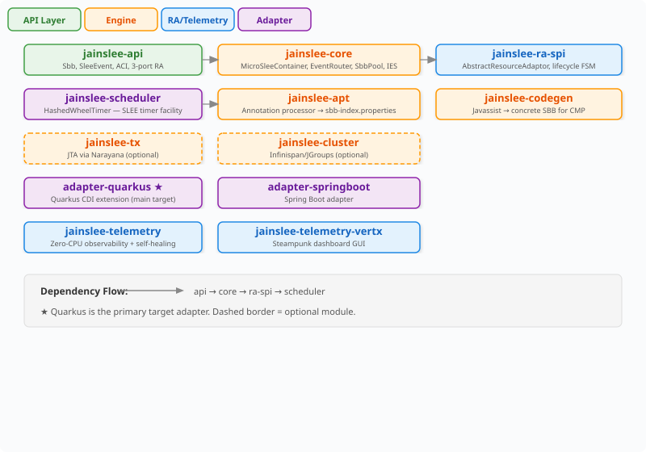
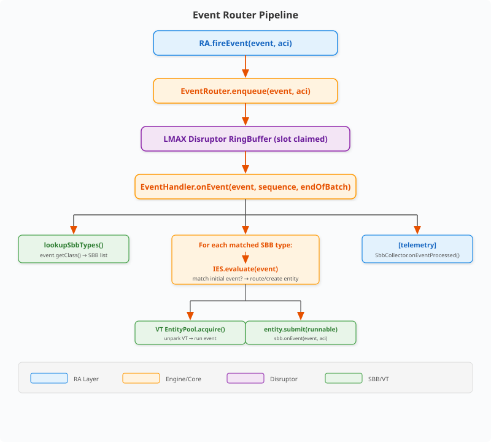
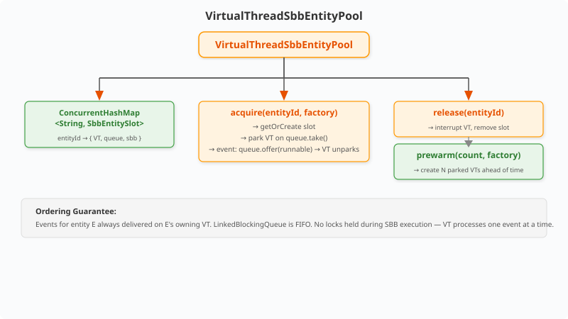
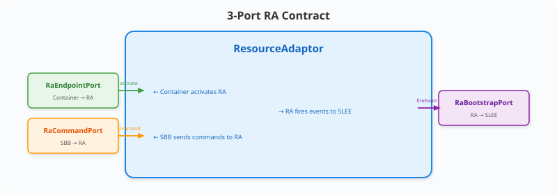
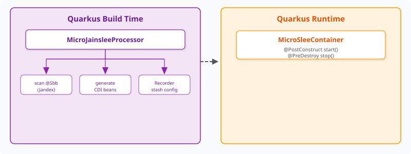
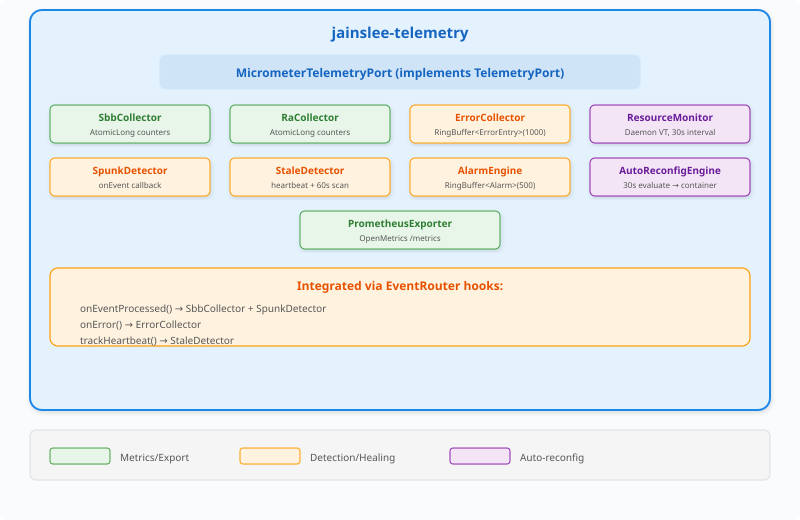
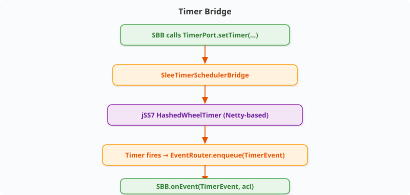

# micro-jainslee — Kiến trúc & Thiết kế

> **Đối tượng hướng tới:** Người đóng góp và người dùng nâng cao cần hiểu
> về nội tại engine, ranh giới module, và lý do thiết kế.

---

## Mục tiêu & Phi mục tiêu

### Mục tiêu
- JAIN SLEE 1.1 runtime nhúng trong một JAR duy nhất
- Thông lượng 100.000+ events/giây trên phần cứng thông dụng
- Khởi động nguội dưới 2 giây
- Không phụ thuộc container ngoài (không JBoss, không WildFly)
- Mô hình đồng thời native Virtual Thread
- Tương thích GraalVM native-image (đang phát triển)

### Phi mục tiêu
- Tuân thủ đầy đủ JAIN SLEE 1.1 TCK (giai đoạn R&D)
- JSR-77 JMX management MBeans
- Phân cụm đa JVM (chỉ đơn JVM)
- Phân tích cú pháp XML deployment descriptor

---

## Sơ đồ Module

<p align="center"></p>

---

## Pipeline Định tuyến Sự kiện

<p align="center"></p>


---

## Virtual Thread SBB Pool

Mỗi SBB entity sở hữu một virtual thread riêng. Thread được park
(qua `LinkedBlockingQueue.take()`) khi rảnh và được unpark khi có sự kiện
đến. Điều này đảm bảo JAIN SLEE §8.4 thứ tự đơn-luồng-trên-SBB
mà không cần khóa.

<p align="center"></p>

### Đảm bảo Thứ tự

Các sự kiện cho entity `E` luôn được phân phối trên virtual thread sở hữu của `E`.
`LinkedBlockingQueue` là FIFO. Không có khóa nào được giữ trong khi thực thi SBB —
VT chỉ đơn giản xử lý từng sự kiện một.

---

## Hợp đồng 3-Port RA

Mỗi Resource Adaptor phơi bày chính xác ba cổng:

<p align="center"></p>

### Mẫu PolyVoice

Mỗi RA sử dụng mẫu Wrapper+Delegate:

```java
// Wrapper — triển khai SLEE lifecycle
public class HttpServerRaEndpoint implements RaEndpointPort {
    private final HttpServerResourceAdaptor delegate;

    public void activate(Properties config) { delegate.start(config); }
    public void deactivate() { delegate.stop(); }
    public RaCommandPort getCommandPort() { return delegate; }
    public void setBootstrapPort(RaBootstrapPort port) { delegate.setPort(port); }
}

// Delegate — triển khai giao thức nghiệp vụ + cổng lệnh
public class HttpServerResourceAdaptor implements RaCommandPort {
    public void sendCommand(RaCommand cmd) {
        switch (cmd) {
            case SendResponse r -> send(r);
            ...
        }
    }
}
```

---

## Mẫu Adapter

### Quarkus (Chính)

<p align="center"></p>

### Spring Boot

<p align="center"></p>


---

## Telemetry & Tự phục hồi

Module `jainslee-telemetry` thay thế AlarmFacility,
UsageFacility, và TraceFacility của JAIN SLEE 1.1 bằng một hệ thống thu thập
thụ động zero-CPU hiện đại xây dựng trên Micrometer + Prometheus.

### Kiến trúc

<p align="center"></p>

### Các Điều kiện Tự phục hồi

| Điều kiện | Ngưỡng | Hành động |
|-----------|--------|-----------|
| Bộ nhớ cao | Heap > 85% | Giảm một nửa SBB pool max |
| Bộ nhớ nghiêm trọng | Heap > 95% | Giải phóng stale + GC |
| Áp lực CPU | CPU > 80% duy trì | Giảm RA threads |
| Đột biến tải | EPS > 3× baseline | Mở rộng SBB pool ×2 |
| Bão lỗi | >100 errors/phút | Tạm ngưng loại SBB |
| Rò rỉ entity | Idle > 30 phút | Buộc giải phóng |
| RA sập | State = ERROR | Khởi động lại RA |

Mỗi điều kiện có bộ đếm thời gian cooldown độc lập (5–15 phút) để ngăn
dao động. Engine đánh giá mỗi 30 giây trên một daemon VT duy nhất.

### Dashboard GUI

Module `jainslee-monitor` phục vụ một dashboard chủ đề steampunk
tại `/telemetry/`. Tệp `index.html` + `telemetry.js` đơn, không bước build,
polling 2 giây `/api/telemetry/snapshot`. SVG arc gauges cho heap/CPU,
biểu đồ sparkline, xác nhận alarm, và thanh trượt cấu hình runtime.

> 📖 Hướng dẫn đầy đủ: [`docs/jainslee-telemetry.md`](jainslee-telemetry.md)
> 📖 Dashboard: [`docs/telemetry-gui.md`](telemetry-gui.md)

---

## Cầu Nối Timer

<p align="center"></p>

---

## Mô hình Cấu hình

```java
MicroSleeConfiguration config = MicroSleeConfiguration.builder()
    .preferVirtualThreads(true)
    .sbbPoolMin(10)
    .sbbPoolMax(100_000)
    .sbbPerVirtualThread(1)
    .eventRouterRingBufferSize(4096)
    .build();
```

### application.properties (Quarkus/Spring)

```properties
microjainslee.sbb.pool.min=10
microjainslee.sbb.pool.max=100000
microjainslee.event-router.ring-buffer-size=4096
microjainslee.virtual-threads=true
microjainslee.telemetry.enabled=true
microjainslee.telemetry.auto-reconfig.enabled=true
```

---

## Hợp đồng Đồng thời

| Ranh giới | Cơ chế |
|-----------|--------|
| Nhận sự kiện | Một luồng Disruptor producer duy nhất |
| Phân phối sự kiện | Virtual Thread trên mỗi SBB (không trạng thái chia sẻ) |
| Trạng thái cục bộ SBB | Thuộc sở hữu VT của SBB — không cần khóa |
| Trường CMP | Bảo vệ bởi synchronized blocks (codegen) |
| Telemetry counters | AtomicLong (lock-free) |
| Error ring buffer | AtomicLong write pointer + mảng volatile |
| ACNF | ConcurrentHashMap (không khóa toàn cục) |

---

## Chế độ Lỗi

| Lỗi | Phát hiện | Phục hồi |
|------|-----------|----------|
| SBB ném ngoại lệ | EventRouter bắt → ErrorCollector.record() | SBB tiếp tục xử lý sự kiện tiếp theo |
| RA sập | RA state → ERROR | AutoReconfigEngine khởi động lại RA |
| OOM | Cấp JVM | Pre-mortem: AutoReconfigEngine giảm pool |
| Disruptor đầy | BlockingWaitStrategy gây áp lực ngược producer | RA.fireEvent() chặn tạm thời |
| Rò rỉ VT | StaleDetector phát hiện entity idle > 30phút | Tự động giải phóng entity |

---

## Nhật ký Quyết định Thiết kế

| Quyết định | Lý do | Ngày |
|------------|-------|------|
| LMAX Disruptor thay vì java.util.Queue | 6M events/giây so với 500K, zero GC | 2024-Q3 |
| Virtual threads thay vì platform thread pool | Mở rộng đến triệu entity, không cần tinh chỉnh pool | 2025-Q4 |
| Micrometer thay vì custom metrics | Tiêu chuẩn công nghiệp, Prometheus native | 2026-Q2 |
| Dashboard HTML đơn thay vì React/Node | Zero build, zero deps, 15KB | 2026-Q2 |
| AtomicLong ring buffers thay vì khóa | Không tranh chấp, bộ nhớ giới hạn | 2026-Q2 |
| Một daemon VT duy nhất cho scheduler | Tránh overhead của ScheduledExecutorService | 2026-Q2 |
