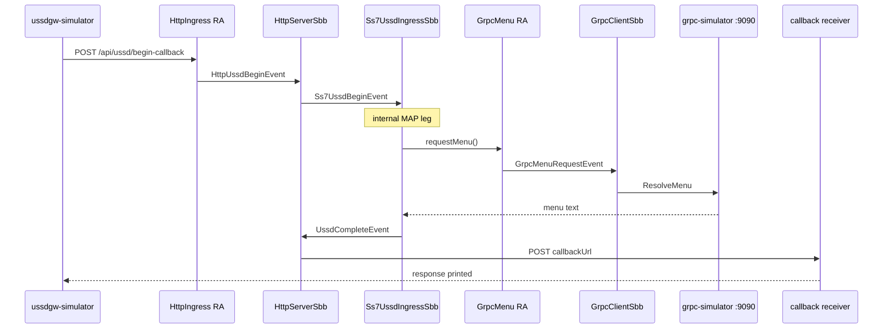

# micro-jainslee examples / Ví dụ micro-jainslee

**English:** Five runnable projects demonstrating micro-jainslee 1.1.0 USSD call flow.  
**Tiếng Việt:** Năm project chạy được, minh họa luồng USSD với micro-jainslee 1.1.0.

| Project | Role | Port |
|---------|------|------|
| [`grpc-simulator/`](grpc-simulator/) | gRPC USSD AS (`ResolveMenu`) | **9090** |
| [`example-quarkus/`](example-quarkus/) | Quarkus 3 + HTTP RA | **8080** |
| [`example-spring/`](example-spring/) | Spring Boot 3 + HTTP RA | **8081** |
| [`example-embedded-j25/`](example-embedded-j25/) | Plain Java 25 + HTTP RA | **8082** |
| [`ussdgw-simulator/`](ussdgw-simulator/) | USSD GW HTTP client | ephemeral callback |

Each example is a **standalone Maven project** (copy-not-share). Per-project run/test guides:

- [example-embedded-j25/README.md](example-embedded-j25/README.md) — EN + VI
- [example-quarkus/README.md](example-quarkus/README.md) — EN + VI
- [example-spring/README.md](example-spring/README.md) — EN + VI
- [grpc-simulator/README.md](grpc-simulator/README.md) — EN + VI
- [ussdgw-simulator/README.md](ussdgw-simulator/README.md) — EN + VI

---

## SS7 SBB role / Vai trò Ss7UssdIngressSbb

**English:** Production USSD GW terminates real SS7/MAP. **This demo has no external SS7 stack.**

| Component | Role |
|-----------|------|
| `ussdgw-simulator` | External GW over HTTP |
| `HttpIngressResourceAdaptor` | Brings HTTP into SLEE (replaces SS7 RA on ingress) |
| `HttpServerSbb` | GW-facing: normalize, profile lookup, session |
| `Ss7UssdIngressSbb` | **Internal MAP/USSD leg** — CMP, timer, dialog state (would receive MAP from SS7 RA in production) |
| `GrpcClientSbb` + gRPC RA | Backend menu client |
| `grpc-simulator` | External menu AS |

**Tiếng Việt:** Trong production, GW USSD kết nối SS7/MAP thật. **Demo này không có SS7 bên ngoài.**

| Thành phần | Vai trò |
|------------|---------|
| `ussdgw-simulator` | GW bên ngoài qua HTTP |
| `HttpIngressResourceAdaptor` | Đưa HTTP vào SLEE |
| `HttpServerSbb` | Lớp GW: chuẩn hóa, profile, session |
| `Ss7UssdIngressSbb` | **Lớp MAP/USSD nội bộ** — CMP, timer, state machine |
| `GrpcClientSbb` + gRPC RA | Client menu backend |
| `grpc-simulator` | AS menu bên ngoài |

---

## Scenario / Kịch bản



---

## Prerequisites / Yêu cầu

| | English | Tiếng Việt |
|---|---------|------------|
| JDK | **25** (Java 25 features) | **25** |
| Maven | 3.9+ | 3.9+ |
| Local install | micro-jainslee **1.1.0** | Cài micro-jainslee **1.1.0** vào local repo |

```bash
cd jain-slee/jain-slee
mvn -B -ntp install -DskipTests \
  -pl jainslee-api,jainslee-scheduler,jainslee-core,jainslee-apt \
  -am
```

For Quarkus/Spring examples also install the adapter:

```bash
mvn -B -ntp install -DskipTests -pl adapter-quarkus -am    # Quarkus
mvn -B -ntp install -DskipTests -pl adapter-springboot -am  # Spring
```

---

## Full 5-project runbook / Hướng dẫn chạy đầy đủ

### English

```bash
# Terminal A — gRPC backend (start first)
cd example/grpc-simulator && mvn -B -ntp package
java -cp target/grpc-simulator.jar:$(mvn -q dependency:build-classpath -Dmdep.outputFile=/dev/stdout) \
  com.example.grpcsimulator.GrpcSimulatorMain 9090

# Terminal B — pick ONE example (see per-project README)
# Quarkus:   cd example/example-quarkus && mvn quarkus:dev
# Spring:    cd example/example-spring && mvn spring-boot:run
# Embedded:  cd example/example-embedded-j25 && mvn package && java -jar target/example-embedded-j25.jar

# Terminal C — fire USSD session
cd example/ussdgw-simulator && mvn -B -ntp package
java -jar target/ussdgw-simulator-1.0.0-SNAPSHOT.jar http://127.0.0.1:8080 251911000001 '*123#'
```

Expected: `202 Accepted`, callback within seconds with `COMPLETED` and menu text containing `Balance`.

### Tiếng Việt

```bash
# Terminal A — backend gRPC (chạy trước)
cd example/grpc-simulator && mvn -B -ntp package
java -cp target/grpc-simulator.jar:$(mvn -q dependency:build-classpath -Dmdep.outputFile=/dev/stdout) \
  com.example.grpcsimulator.GrpcSimulatorMain 9090

# Terminal B — chọn MỘT example (xem README từng project)
# Quarkus:   cd example/example-quarkus && mvn quarkus:dev
# Spring:    cd example/example-spring && mvn spring-boot:run
# Embedded:  cd example/example-embedded-j25 && mvn package && java -jar target/example-embedded-j25.jar

# Terminal C — bắn phiên USSD
cd example/ussdgw-simulator && mvn -B -ntp package
java -jar target/ussdgw-simulator-1.0.0-SNAPSHOT.jar http://127.0.0.1:8082 251911000001 '*123#'
```

Kỳ vọng: `202 Accepted`, callback trả về `COMPLETED` và menu có chữ `Balance`.

---

## Run all tests / Chạy toàn bộ test

### English

From `jain-slee/jain-slee/example/` — no external processes needed (tests use in-process stubs):

```bash
cd example/grpc-simulator          && mvn -B -ntp test   # 4 tests
cd example/example-embedded-j25    && mvn -B -ntp test   # 7 tests
cd example/example-quarkus         && mvn -B -ntp test   # 2 tests
cd example/example-spring          && mvn -B -ntp test   # 2 tests
```

One-liner:

```bash
cd jain-slee/jain-slee/example && \
  for d in grpc-simulator example-embedded-j25 example-quarkus example-spring; do \
    echo "=== $d ===" && (cd "$d" && mvn -B -ntp test -q) || exit 1; \
  done && echo "All example tests passed."
```

### Tiếng Việt

Từ thư mục `example/` — test tự dùng stub trong process, **không cần** chạy grpc-simulator hay example server:

```bash
cd example/grpc-simulator          && mvn -B -ntp test   # 4 test
cd example/example-embedded-j25    && mvn -B -ntp test   # 7 test
cd example/example-quarkus         && mvn -B -ntp test   # 2 test
cd example/example-spring          && mvn -B -ntp test   # 2 test
```

Lệnh gộp:

```bash
cd jain-slee/jain-slee/example && \
  for d in grpc-simulator example-embedded-j25 example-quarkus example-spring; do \
    echo "=== $d ===" && (cd "$d" && mvn -B -ntp test -q) || exit 1; \
  done && echo "Tất cả test example đã pass."
```

---

## Per-example quick reference / Bảng tra nhanh

| Example | Run (EN) | Test (EN) | Chạy (VI) | Test (VI) |
|---------|----------|-----------|------------|-----------|
| embedded-j25 | [`README`](example-embedded-j25/README.md#english--run) | `mvn test` (7) | [`README`](example-embedded-j25/README.md#tiếng-việt--chạy-thử) | `mvn test` |
| quarkus | [`README`](example-quarkus/README.md#english--run) | `mvn test` (2) | [`README`](example-quarkus/README.md#tiếng-việt--chạy-thử) | `mvn test` |
| spring | [`README`](example-spring/README.md#english--run) | `mvn test` (2) | [`README`](example-spring/README.md#tiếng-việt--chạy-thử) | `mvn test` |
| grpc-simulator | [`README`](grpc-simulator/README.md#english--run) | `mvn test` (4) | [`README`](grpc-simulator/README.md#tiếng-việt--chạy-thử) | `mvn test` |
| ussdgw-simulator | [`README`](ussdgw-simulator/README.md#english--build-and-run) | manual E2E | [`README`](ussdgw-simulator/README.md#tiếng-việt--build-và-chạy) | E2E thủ công |

---

## How the three examples differ / So sánh ba example

| Aspect | embedded-j25 | quarkus | spring |
|--------|--------------|---------|--------|
| Framework | none | Quarkus 3 | Spring Boot 3 |
| DI | direct calls | CDI `@Inject` | `@Autowired` |
| Container boot | `main()` | adapter-quarkus | `SmartLifecycle` |
| HTTP ingress | JDK HttpServer RA | JDK HttpServer RA | JDK HttpServer RA |
| USSD port | **8082** | **8080** | **8081** |
| gRPC backend | `grpc-simulator:9090` | same | same |

---

## Production note / Lưu ý production

**English:** R&D demo only. Production USSD 7.3 uses Mobicents JAIN-SLEE on WildFly.  
**Tiếng Việt:** Chỉ dùng cho R&D. Production USSD 7.3 vẫn dùng Mobicents JAIN-SLEE trên WildFly.
