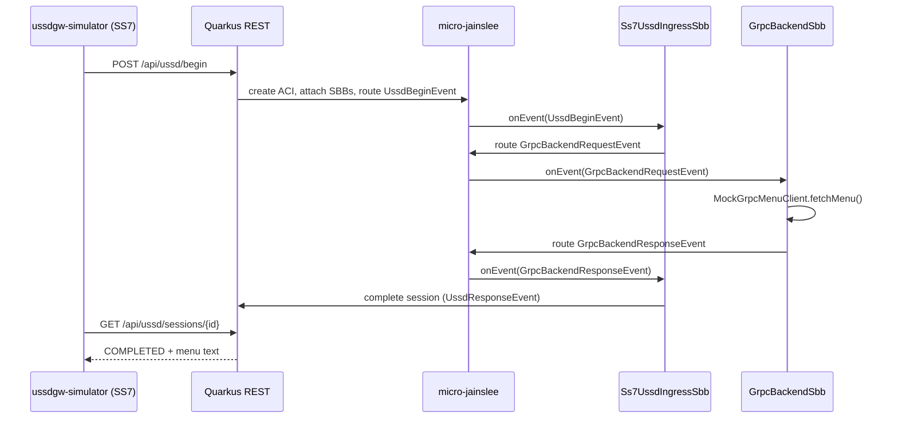

# micro-jainslee examples

This directory contains runnable sample applications that show how to embed
**micro-jainslee 1.1.0** in a real JVM process.

| Project | Description |
|---------|-------------|
| [`ussd-quarkus-demo/`](ussd-quarkus-demo/) | Quarkus 3 REST app with two SBBs (SS7 ingress + mock gRPC backend) |
| [`ussdgw-simulator/`](ussdgw-simulator/) | Standalone CLI JAR that simulates the USSD gateway firing SS7 USSD begin |

## Scenario

The demo models a simplified USSD gateway call flow:



## Prerequisites

- **JDK 21+** (JDK 25 recommended — matches micro-jainslee CI)
- **Maven 3.9+**
- micro-jainslee **1.1.0** installed in the local Maven repository

The demo embeds `jainslee-core` directly via `EmbeddedMicroJainsleeProducer` (CDI
`@ApplicationScoped` bootstrap). The in-tree `adapter-quarkus` extension can replace
this producer once its build-time CDI wiring is published to a registry.

## 1. Build and install micro-jainslee

From the repository root:

```bash
cd jain-slee/jain-slee
mvn -B -ntp install -DskipTests \
  -pl jainslee-api,jainslee-scheduler,jainslee-core,jainslee-apt \
  -am
```

## 2. Run the Quarkus demo

```bash
cd example/ussd-quarkus-demo
mvn -B -ntp quarkus:dev
```

The app listens on **http://localhost:8080**.

### Manual curl test

```bash
curl -s -X POST http://localhost:8080/api/ussd/begin \
  -H 'Content-Type: application/json' \
  -d '{"msisdn":"251911000001","ussdString":"*123#"}'

# Poll the session id returned above:
curl -s http://localhost:8080/api/ussd/sessions/<sessionId>
```

### Run integration test

```bash
mvn -B -ntp test
```

## 3. Build and run the USSD gateway simulator JAR

In a second terminal (while Quarkus dev mode is running):

```bash
cd example/ussdgw-simulator
mvn -B -ntp package
java -jar target/ussdgw-simulator-1.0.0-SNAPSHOT.jar
```

Optional arguments:

```text
java -jar target/ussdgw-simulator-1.0.0-SNAPSHOT.jar [baseUrl] [msisdn] [ussdString]
```

Example:

```bash
java -jar target/ussdgw-simulator-1.0.0-SNAPSHOT.jar http://127.0.0.1:8080 251911000001 '*123#'
```

Expected output ends with a multi-line USSD menu returned by the mock gRPC backend.

## Project layout (ussd-quarkus-demo)

```text
example/ussd-quarkus-demo/
├── pom.xml
├── src/main/java/com/example/ussddemo/
│   ├── events/          # @EventType classes (UssdBegin, GrpcBackend*, UssdResponse)
│   ├── sbbs/            # @SbbAnnotation SBBs (SS7 ingress + gRPC backend)
│   ├── service/         # UssdDemoRuntime, UssdSessionService, UssdSessionStore
│   ├── grpc/            # MockGrpcMenuClient
│   ├── runtime/         # EmbeddedMicroJainsleeProducer (Quarkus CDI bootstrap)
│   ├── rest/            # JAX-RS resource
│   └── du/              # @DeployableUnit marker
└── src/main/resources/application.properties
```

APT generates `META-INF/microjainslee/sbb-index.properties` at compile time so
`MicroSleeContainer.start()` auto-registers both SBBs on boot.

## Production note

This demo is **R&D only**. Production USSD 7.3 still uses the Mobicents JAIN-SLEE
container on WildFly. Do not deploy this example to production gateways.
