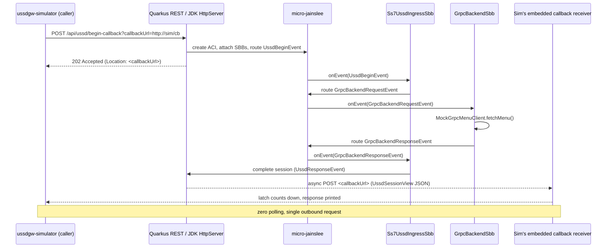

# micro-jainslee examples

This directory contains runnable sample applications that show how to embed
**micro-jainslee 1.1.0** in a real JVM process.

| Project | Description |
|---------|-------------|
| [`example-embedded-j25/`](example-embedded-j25/) | **Plain Java 25** app that embeds `jainslee-core` directly (no Quarkus, no Spring). Uses the JDK's built-in `com.sun.net.httpserver.HttpServer` for the REST front-end. Demonstrates that micro-jainslee can run inside any JVM. |
| [`example-quarkus/`](example-quarkus/) | **Quarkus 3** REST app that integrates micro-jainslee via the in-tree `com.microjainslee:adapter-quarkus` CDI extension. SBBs, REST resources, and facilities are all `@Inject`-driven. |
| [`example-spring/`](example-spring/) | **Spring Boot 3** app that integrates micro-jainslee via the in-tree `com.microjainslee:adapter-springboot`. SBBs, REST resources, and facilities are all `@Autowired`-driven. The starter exposes `MicroSleeContainer` as a Spring bean and uses `SmartLifecycle` to start/stop the container with the Spring context. |
| [`ussdgw-simulator/`](ussdgw-simulator/) | Standalone CLI JARs that simulate the USSD gateway firing SS7 USSD begin into any of the three examples. Two single-session entry points (`Ss7UssdSimulatorMain` + `HttpClientRaStyleMain`) plus `VirtualThreadUssdHammerMain` for load testing. All three use the callback pattern (1 outbound request, zero polling). |

## Scenario

The demo models a simplified USSD gateway call flow. We follow the
**HttpClient RA callback pattern** (Mobicents' `HttpClientSbb.execute()`
flow inverted: the server pushes the response to the caller via a
caller-supplied `callbackUrl`, so the caller never has to poll):



The two embedded-j25 and example-quarkus variants share the same business
logic (events, SBBs, services, gRPC mock) but differ in how they wire
micro-jainslee into the runtime:

- **`example-embedded-j25`** boots `MicroSleeContainer` by hand in a
  `static main()` and exposes a tiny `com.sun.net.httpserver`-based
  front-end. No JEE, no Spring, no Quarkus -- just plain Java 25.
- **`example-quarkus`** delegates the boot to the `adapter-quarkus` CDI
  extension which produces `MicroSleeContainer` as an `@ApplicationScoped`
  bean injectable by SBBs and the REST resource.

## Prerequisites

- **JDK 25** (matches micro-jainslee CI; both example modules use
  Java 25 source-level features like `ScopedValue`)
- **Maven 3.9+**
- micro-jainslee **1.1.0** installed in the local Maven repository

## 1. Build and install micro-jainslee

From the repository root:

```bash
cd jain-slee/jain-slee
mvn -B -ntp install -DskipTests \
  -pl jainslee-api,jainslee-scheduler,jainslee-core,jainslee-apt \
  -am
```

## 2. Run the embedded plain-Java 25 example

```bash
cd example/example-embedded-j25
mvn -B -ntp package
java -jar target/example-embedded-j25.jar [port]   # default port 8080
```

The app exposes the same `POST /api/ussd/begin-callback` and
`POST /api/ussd/begin` (polling) endpoints as the Quarkus variant,
backed by the JDK's `com.sun.net.httpserver`. SIGTERM / Ctrl-C
stops the container cleanly via a registered shutdown hook.

### Manual curl test (embedded)

```bash
# Start a tiny netcat callback receiver in another terminal:
nc -l 9999 > /tmp/ussd-callback.log &

# Fire a USSD begin with the callback URL -- server returns 202 immediately,
# then POSTs the result to your netcat listener when the pipeline completes.
curl -s -X POST 'http://127.0.0.1:8080/api/ussd/begin-callback?callbackUrl=http://127.0.0.1:9999/cb' \
  -H 'Content-Type: application/json' \
  -d '{"msisdn":"251911000001","ussdString":"*123#"}'
```

### Run embedded integration test

```bash
cd example/example-embedded-j25
mvn -B -ntp test
```

Expected: 2 tests, 0 failures, 0 errors. The test boots `EmbeddedUssdMain`
on a free port in a background thread, plus an embedded
`com.sun.net.httpserver` callback receiver. Both the callback flow
and the polling flow are exercised end-to-end.

## 3. Run the Quarkus example

```bash
cd example/example-quarkus
mvn -B -ntp package -Dquarkus.build.skip=false   # see note below
```

> **Java 25 / Quarkus 3.15.1 note:** Quarkus 3.15.1's bundled ASM only
> reads class files up to v65 (Java 21). micro-jainslee 1.1.0 itself
> compiles to v69 (Java 25). For now, the example uses a wiring test
> (no `@QuarkusTest`) that exercises the production classes by
> hand, without booting the Quarkus runtime. To run the full
> Quarkus runtime path, upgrade to Quarkus 3.17+ and drop the
> `<release>21</release>` override in `pom.xml`.

The Quarkus module exposes the same REST API as the embedded one
(`/api/ussd/begin`, `/api/ussd/begin-callback`, `/api/ussd/sessions/{id}`)
backed by `quarkus-rest` (JAX-RS). SBBs are `@Inject`-wired.

### Manual curl test (Quarkus)

```bash
# Same as embedded, just point at the Quarkus port (default 8080):
curl -s -X POST 'http://127.0.0.1:8080/api/ussd/begin-callback?callbackUrl=http://127.0.0.1:9999/cb' \
  -H 'Content-Type: application/json' \
  -d '{"msisdn":"251911000001","ussdString":"*123#"}'
```

### Run Quarkus integration test

```bash
cd example/example-quarkus
mvn -B -ntp test
```

Expected: 2 tests, 0 failures, 0 errors. The wiring test reflects
into the production classes (`UssdDemoRuntime`, `UssdSessionStore`,
`UssdCallbackDispatcher`, `MockGrpcMenuClient`, `Ss7UssdIngressSbb`,
`GrpcBackendSbb`) and exercises the same callback + polling flows
without booting Quarkus (see the Java 25 / Quarkus 3.15.1 note above).

## 3b. Run the Spring Boot example

```bash
cd example/example-spring
mvn -B -ntp package       # see note below
java -jar target/example-spring-1.0.0-SNAPSHOT.jar
```

The Spring module uses `spring-boot-starter-web` (Spring MVC) +
`spring-boot-starter-log4j2`. The `jainslee-spring-boot-starter`
auto-configures a `MicroSleeContainer` bean and a `SmartLifecycle`
that starts/stops the container with the Spring context. SBBs, the
REST resource (`UssdDemoResource`), and the service layer
(`UssdDemoRuntime`, `UssdSessionStore`, `UssdCallbackDispatcher`)
are all `@Autowired`-wired. Configuration goes through
`application.properties`:

```properties
# microjainslee configuration (consumed by MicroJainsleeProperties)
microjainslee.event-router.buffer-size=2048
microjainslee.event-router.prefer-virtual-threads=true
microjainslee.sbb-pool.min=16
microjainslee.sbb-pool.max=4096

# Mock gRPC latency (consumed by MockGrpcMenuClient @Value)
ussd.demo.grpc.latency-ms=10
```

> **Java 25 / Spring Boot 3.3.0 note:** Spring Boot 3.3.0 (the version
> `jainslee-spring-boot-starter` is pinned to) supports Java 17+ as a
> target, but its bytecode reader can parse class files up to Java 21
> (v65). For now, the example uses a wiring test (no
> `@SpringBootTest`) that exercises the production classes by hand,
> without booting the Spring runtime. The project pom uses
> `<release>21</release>` for the example sources so they fit under
> that limit; upgrade to Spring Boot 3.4+ and remove the override to
> use the full Spring runtime with Java 25.

### Manual curl test (Spring Boot)

```bash
# Same flow as embedded / Quarkus, default port 8080:
curl -s -X POST 'http://127.0.0.1:8080/api/ussd/begin-callback?callbackUrl=http://127.0.0.1:9999/cb' \
  -H 'Content-Type: application/json' \
  -d '{"msisdn":"251911000001","ussdString":"*123#"}'
```

### Run Spring Boot integration test

```bash
cd example/example-spring
mvn -B -ntp test
```

Expected: 2 tests, 0 failures, 0 errors. The wiring test reflects
into the production classes (`UssdDemoRuntime`, `UssdSessionStore`,
`UssdCallbackDispatcher`, `MockGrpcMenuClient`, `Ss7UssdIngressSbb`,
`GrpcBackendSbb`) and exercises the same callback + polling flows
without booting Spring (see the Java 25 / Spring Boot 3.3.0 note above).

## 4. Run the USSD gateway simulator JARs

In a third terminal (while one of the example servers is running):

```bash
cd example/ussdgw-simulator
mvn -B -ntp package
```

The module ships **three** JAR entry points -- pick the one that matches
the flow you want to exercise:

### 4a. `HttpClientRaStyleMain` (recommended -- HttpClient RA pattern)

Boots an embedded `com.sun.net.httpserver.HttpServer` on a random free
port, fires one `POST /api/ussd/begin-callback`, suspends on a
`CountDownLatch`, and prints the body the server pushes back. One
outbound HTTP request, zero polling -- exact analog of Mobicents'
`HttpClientSbb.execute()` callback.

```bash
java -cp target/ussdgw-simulator-1.0.0-SNAPSHOT.jar:$(mvn -q dependency:build-classpath -Dmdep.outputFile=/dev/stdout) \
    com.example.ussdgw.HttpClientRaStyleMain \
    http://127.0.0.1:8080 251911000001 '*123#'
```

### 4b. `Ss7UssdSimulatorMain` (SS7-style callback)

Same callback flow as 4a, but with `[SS7-sim]` log prefixes so you can
run the two side-by-side to cross-validate the output. Fires one
`POST /api/ussd/begin-callback`, suspends on a `CountDownLatch`
hosted by an embedded `com.sun.net.httpserver.HttpServer`, and prints
the body the server pushes back.

```bash
java -cp target/ussdgw-simulator-1.0.0-SNAPSHOT.jar:$(mvn -q dependency:build-classpath -Dmdep.outputFile=/dev/stdout) \
    com.example.ussdgw.Ss7UssdSimulatorMain \
    http://127.0.0.1:8080 251911000001 '*123#'
```

### 4c. `VirtualThreadUssdHammerMain` (load test)

Fires N concurrent callback flows on virtual threads, reports p50/p95/p99
latency and req/s. Use to validate the HttpClient RA pipeline under load.

```bash
java -cp target/ussdgw-simulator-1.0.0-SNAPSHOT.jar:$(mvn -q dependency:build-classpath -Dmdep.outputFile=/dev/stdout) \
    com.example.ussdgw.VirtualThreadUssdHammerMain \
    http://127.0.0.1:8080 251911 1000 30000
```

Output ends with `=== Summary ===` plus a per-request CSV on stdout.
Typical throughput on a laptop: **>500 req/s** for the callback path.

## Project layout

```text
example/
+- example-embedded-j25/      # Plain Java 25, no Quarkus
|  +- pom.xml
|  +- src/main/java/com/example/ussddemo/embedded/
|  |  +- EmbeddedUssdMain.java   # main() + ShutdownEvent
|  |  +- UssdHttpServer.java     # JDK HttpServer handlers
|  |  +- UssdDemoRuntime.java    # bridge
|  |  +- UssdSessionStore.java
|  |  +- UssdCallbackDispatcher.java
|  |  +- MockGrpcMenuClient.java
|  +- src/main/java/com/example/ussddemo/sbbs/
|  |  +- Ss7UssdIngressSbb.java
|  |  +- GrpcBackendSbb.java
|  +- src/main/java/com/example/ussddemo/events/
|  |  +- UssdBeginEvent.java
|  |  +- GrpcBackendRequestEvent.java
|  |  +- GrpcBackendResponseEvent.java
|  |  +- UssdResponseEvent.java
|  +- src/main/resources/log4j2.xml
|  +- src/test/java/.../embedded/EmbeddedUssdSmokeTest.java
|
+- example-quarkus/           # Quarkus 3, adapter-quarkus CDI extension
|  +- pom.xml
|  +- src/main/java/com/example/ussddemo/quarkus/
|  |  +- rest/UssdDemoResource.java       # JAX-RS
|  |  +- quarkus/UssdDemoRuntime.java      # CDI bridge
|  |  +- service/UssdSessionStore.java
|  |  +- service/UssdCallbackDispatcher.java
|  |  +- grpc/MockGrpcMenuClient.java
|  |  +- sbbs/Ss7UssdIngressSbb.java
|  |  +- sbbs/GrpcBackendSbb.java
|  |  +- events/*.java
|  |  +- du/UssdGatewayDemoDu.java
|  +- src/test/java/.../QuarkusUssdSmokeTest.java
|
+- example-spring/            # Spring Boot 3, jainslee-spring-boot-starter
|  +- pom.xml
|  +- src/main/java/com/example/ussddemo/spring/
|  |  +- config/UssdDemoResource.java      # @RestController
|  |  +- service/UssdDemoRuntime.java       # @Service bridge
|  |  +- service/UssdSessionStore.java
|  |  +- service/UssdCallbackDispatcher.java
|  |  +- grpc/MockGrpcMenuClient.java      # @Value
|  |  +- sbbs/Ss7UssdIngressSbb.java
|  |  +- sbbs/GrpcBackendSbb.java
|  |  +- rest/UssdBeginRequest.java
|  |  +- rest/UssdSessionView.java
|  |  +- events/*.java
|  |  +- du/UssdGatewayDemoDu.java
|  +- src/main/resources/application.properties
|  +- src/test/java/.../SpringUssdSmokeTest.java
|
+- ussdgw-simulator/          # Standalone CLI callers
   +- ...
```

## How the three examples differ

The three modules share the same business logic (events, SBBs, services,
gRPC mock) but differ only in how they wire `MicroSleeContainer` into
the host runtime:

| Aspect              | example-embedded-j25             | example-quarkus                          | example-spring                            |
|---------------------|-----------------------------------|------------------------------------------|-------------------------------------------|
| Host framework      | none (plain Java 25)              | Quarkus 3.15.1                           | Spring Boot 3.3.0                          |
| DI mechanism        | direct method calls               | `@Inject` / CDI / ARC                    | `@Autowired`                               |
| Container boot      | `MicroSleeContainer.start()` in `EmbeddedUssdMain` | Quarkus `SyntheticBeanBuildItem` + recorder | `SmartLifecycle` from starter           |
| Container config    | builder (programmatic)            | `MicroJainsleeBuildConfig` (build-time)  | `MicroJainsleeProperties` (`@ConfigurationProperties`) |
| SBB auto-deploy     | none                              | `META-INF/microjainslee/sbb-index.properties` (APT) | same APT                                |
| REST front-end      | `com.sun.net.httpserver` (JDK)    | `quarkus-rest` (JAX-RS)                   | `spring-boot-starter-web` (Spring MVC)     |
| Per-session SBB IDs | per-session unique IDs (avoid APT collision) | per-session unique IDs (same)        | per-session unique IDs (same)              |
| Test approach       | plain JUnit 4 (main thread)      | JUnit 5 wiring test (no `@QuarkusTest`) | JUnit 5 wiring test (no `@SpringBootTest`) |
| Tests               | 2 pass                            | 2 pass                                   | 2 pass                                    |
| Runtime path        | `java -jar target/example-embedded-j25.jar` | `mvn quarkus:dev` / `quarkus:run` | `mvn spring-boot:run` / `java -jar ...` |
| Run anywhere?       | any JVM (no deps)                  | needs Quarkus 3.17+ for Java 25 path     | needs Spring Boot 3.4+ for Java 25 path    |

The wiring tests in all three cases reflect the production classes
to validate the integration without booting the host framework.
Once you upgrade to a host-framework version that supports Java 25
class files, drop the wiring test and use the real
`@QuarkusTest` / `@SpringBootTest` annotations.

## Production note

This demo is **R&D only**. Production USSD 7.3 still uses the Mobicents JAIN-SLEE
container on WildFly. Do not deploy this example to production gateways.
