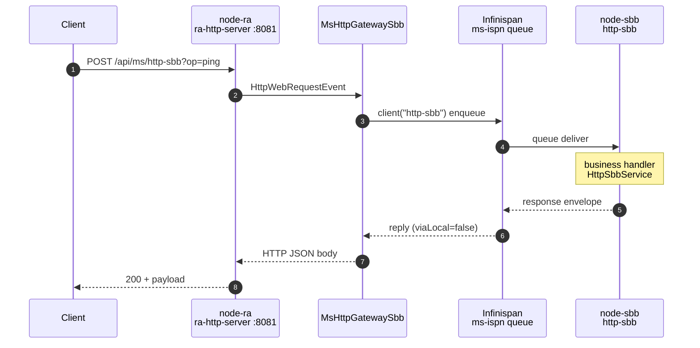
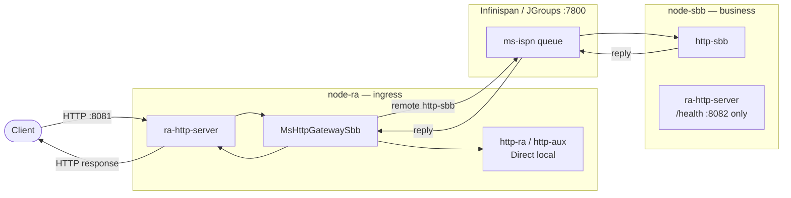

# example-quarkus-ms

Quarkus 3 **CDI host** for the micro-jainslee microservice layer (`ms-api` / `ms-core` / `ms-ispn`):

- Thin boot: `@Inject MicroSleeContainer` + `MsQuarkusBootstrap` — adapter owns create/start/stop and wires HTTP ingress via `MsHttpIngressSupport`
- Gateway SBB lives in **adapter-quarkus**: `com.microjainslee.quarkus.ms.MsHttpGatewaySbb` (not an example-local gateway)
- Real **SBBs** + **events** + **`ra-http-server`** — not Quarkus REST controllers
- Service catalog: `META-INF/jainslee/slee-services` (APT / classpath) + SPI handlers via `SleeServiceHandlerRegistry` (**n-n**, not one-handler-per-service)

### Demo path (micro-services) — Client → :8081 → Infinispan → SBB → reply

Ingress is **only** on `node-ra` (`http.ra.port=8081`). `node-sbb` (`:8082`) serves leaf `/health` and runs `http-sbb`; it is **not** the demo HTTP ingress.



Local leaves on the same node skip the fabric (`http-ra` / `http-aux` → `DirectServiceClient`).



### n-n diagram (handlers ↔ services ↔ nodes)

```
  Handlers                          Services                         Nodes
  ────────                          ────────                         ─────
  HttpRaService (self *) ─────────► http-ra  ─────────────────────► node-ra (:8081 ingress)
  HttpAuxService (self *) ────────► http-aux ─────────────────────► node-ra
  HttpSbbService (self *) ────────► http-sbb ─────────────────────► node-sbb (:8082 /health)
  MsSharedStatusProvider ──status──► http-ra + http-sbb + http-aux     (1 provider → N services)
  MsSharedDiagHandler ─────diag────► http-ra + http-sbb + http-aux     (1 instance → N services)
```

Same codebase, two deploy modes:

| Mode | What runs | How services call each other |
|------|-----------|------------------------------|
| **single** (default) | `http-ra` + `http-aux` + `http-sbb` in one JVM | `DirectServiceClient` (in-process) |
| **micro-services** | each process activates only its services | Infinispan queue (`ms-ispn`) |

`mode: micro-services` is **service placement** (which JVM runs which `@SleeService`).  
`jainslee.ms.cluster-enabled` is the **JGroups/Infinispan fabric** — different knob.  
Deprecated YAML alias: `mode: cluster` → same as `micro-services`.

---

## Prerequisites

- **Java 25**
- **Maven 3.9+**
- micro-jainslee `1.2.0-SNAPSHOT` installed in the local reactor:

```bash
export JAVA_HOME=/path/to/jdk-25
cd /path/to/jain-slee   # repo root
mvn -pl jainslee-ms/ms-api,jainslee-ms/ms-core,jainslee-ms/ms-ispn,jainslee-adapter/adapter-quarkus/runtime,vendor-ras/ra-http-server -am install -DskipTests
```

---

## Build

```bash
cd example/example-quarkus-ms
mvn package
# or from repo root:
mvn -Pexamples -pl example/example-quarkus-ms -am package
```

Runnable Quarkus app: `target/quarkus-app/quarkus-run.jar`

### Micro-services: separate node copies (required)

Both MS JVMs **must not** share `target/quarkus-app`. Starting `run-ms-sbb.sh` used to run `mvn package` into that tree while `node-ra` still had jars open → `NoSuchFileException` under `lib/main/*.jar`, dead Vert.x listener, **curl :8081 hangs with no `MsHttpGatewaySbb` logs**.

```bash
./scripts/prepare-ms-nodes.sh
# stages:
#   target/node-ra/quarkus-run.jar
#   target/node-sbb/quarkus-run.jar
```

- `run-ms-ra.sh` / `run-ms-sbb.sh` call prepare (package only if needed) and launch from their **own** copy.
- After code changes: **stop both JVMs**, then `MS_REBUILD=1 ./scripts/prepare-ms-nodes.sh`.
- **Never** `mvn clean` / `mvn package` while either node is running.

---

## 1) Single mode (recommended first)

```bash
./scripts/run-single.sh
# or: mvn quarkus:dev
```

Listen: **http://127.0.0.1:8080** (`http.ra.port` — `ra-http-server`)

```bash
curl -s http://127.0.0.1:8080/api/health | jq .
curl -s http://127.0.0.1:8080/api/ms/state | jq .
curl -s http://127.0.0.1:8080/api/ms/handlers | jq .

# Generic path (preferred)
curl -s -X POST 'http://127.0.0.1:8080/api/ms/http-ra?op=ping' \
  -H 'Content-Type: text/plain' -d '' | jq .
# → viaLocal=true

# Demo alias (same leaf)
curl -s -X POST 'http://127.0.0.1:8080/api/demo/call-ra?op=status' \
  -H 'Content-Type: text/plain' -d '' | jq .
# → shared-status:http-ra  (n-n ServiceLoader provider)
```

---

## 2) Micro-services mode (two processes, ISPN queue)

**Ingress is on the RA node (:8081)** — not the SBB node.

| Process | Node id | HTTP (`http.ra.port`) | Local services | Role |
|---------|---------|----------------------|----------------|------|
| A | `node-ra` | **8081 (demo ingress)** | `http-ra`, `http-aux` | `ra-http-server` + `MsHttpGatewaySbb` |
| B | `node-sbb` | 8082 | `http-sbb` | Business MS only; built-in `/health` (no gateway) |

Ingress is gated by `jainslee.ms.ingress-service=http-ra` (full gateway on the node that hosts that service). Leaf nodes keep `ra-http-server` for `GET /health` when `jainslee.ms.health-ra-on-leaf=true`.

### Terminal A — ingress / RA (start first)

```bash
./scripts/run-ms-ra.sh
# log must include: gateway=true httpRa=true ingressService=http-ra
#   http.ra.port=8081 localServices=http-ra,http-aux
# and: ra-http-server registered on port 8081
```

### Terminal B — http-sbb (after A is up)

```bash
./scripts/run-ms-sbb.sh
# log must include: gateway=false httpRa=true ingressService=http-ra
#   http.ra.port=8082 localServices=http-sbb
# (uses target/node-sbb — does NOT rewrite target/node-ra)
```

### Verify — curl **8081** (primary)

```bash
curl -s http://127.0.0.1:8081/api/health | jq .
# → mode=MICROSERVICES, local.http-ra=true, local.http-aux=true, local.http-sbb=false

curl -s http://127.0.0.1:8081/api/ms/state | jq .
curl -s http://127.0.0.1:8081/api/ms/handlers | jq .
# → n-n bindings (self + status provider + diag)

# Local leaf on RA node (generic path)
curl -s -X POST 'http://127.0.0.1:8081/api/ms/http-ra?op=ping' \
  -H 'Content-Type: text/plain' -d '' | jq .
# → {"success":true,"payload":"pong","service":"http-ra","viaLocal":true,...}

# Second local service
curl -s -X POST 'http://127.0.0.1:8081/api/ms/http-aux?op=ping' \
  -H 'Content-Type: text/plain' -d '' | jq .
# → viaLocal=true, service=http-aux

# Cross-node: gateway on 8081 → ISPN → http-sbb on node-sbb
curl -s -X POST 'http://127.0.0.1:8081/api/ms/http-sbb?op=ping' \
  -H 'Content-Type: text/plain' -d '' | jq .
# → {"success":true,"payload":"http-sbb-handled:ping","service":"http-sbb","viaLocal":false,...}
# Watch **stdout of run-ms-sbb.sh** for:
#   [IspnQueueServer:http-sbb] received ...
#   [http-sbb] invoke op=ping ...

# Demo aliases (same as /api/ms/{service})
curl -s -X POST 'http://127.0.0.1:8081/api/demo/call-ra?op=ping' \
  -H 'Content-Type: text/plain' -d '' | jq .
curl -s -X POST 'http://127.0.0.1:8081/api/demo/call-aux?op=ping' \
  -H 'Content-Type: text/plain' -d '' | jq .
curl -s -X POST 'http://127.0.0.1:8081/api/demo/call-sbb?op=status' \
  -H 'Content-Type: text/plain' -d '' | jq .
# → payload=shared-status:http-sbb

# Fire-and-forget
curl -s -X POST 'http://127.0.0.1:8081/api/ms/http-sbb?op=ping&notify=true' \
  -H 'Content-Type: text/plain' -d '' | jq .
# or: /api/demo/notify-sbb?op=ping
```

### Fail-hard when SBB is down

Local calls (`http-ra` / `http-aux`) stay on node-ra — they **must** still succeed if you only stop 8082.

Remote `http-sbb` must **not** return `success:true` without a READY peer. `MsHttpGatewaySbb` maps:

| Condition | HTTP | Body |
|-----------|------|------|
| `ServiceUnavailableException` (STOPPED / no READY peer) | **503** | `success:false` |
| `ServiceCallTimeoutException` (READY peer, no consumer) | **504** | `success:false` |
| Handler returned `success:false` | **502** | `success:false` |

```bash
# stop run-ms-sbb.sh (Ctrl+C), then:
curl -s -o /tmp/sbb.json -w '%{http_code}\n' -X POST \
  'http://127.0.0.1:8081/api/ms/http-sbb?op=ping' \
  -H 'Content-Type: text/plain' -d ''
# → HTTP 503, body success=false, error mentions STOPPED / no READY peer
cat /tmp/sbb.json | jq .
```

If the peer was killed without publishing STOPPED, stale READY is treated as
STOPPED when the owner leaves the cluster view — expect HTTP **503**
(`success:false`, not READY). A READY peer with no consumer yields HTTP **504**
timeout — never a fake OK.

### 8082 — not demo ingress

```bash
curl -s http://127.0.0.1:8082/health
# → RA built-in {"status":"ok"} — no /api/ms gateway here
# Business invoke logs are in stdout of run-ms-sbb.sh, not in this HTTP body.
```

If a remote call is unavailable/times out: both processes need `jainslee.ms.cluster-enabled=true`, same `cluster-initial-hosts`, RA started first, and a live READY `http-sbb` on node-sbb.

---

## Wireshark / tcpdump

| Port | Traffic |
|------|---------|
| **8081** | Client → HTTP gateway (demo ingress) |
| 8082 | Optional `/health` on SBB node |
| 7800 | JGroups / Infinispan fabric |

```bash
wireshark -i lo -f "tcp port 8081 or tcp port 8082 or tcp port 7800"
sudo ./scripts/capture-lo.sh /tmp/quarkus-ms-lo.pcap
```

Suggested sequence: start capture → `run-ms-ra.sh` → `run-ms-sbb.sh` → `curl POST …:8081/api/ms/http-sbb?op=ping` → expect HTTP on **8081**, JGroups on **7800**, `"viaLocal":false`.

---

## HTTP API (via ra-http-server → MsHttpGatewaySbb on ingress node)

| Method | Path | Description |
|--------|------|-------------|
| `GET` | `/health` | RA built-in probe (any node with HTTP RA) |
| `GET` | `/api/health` | Mode, node id, local services |
| `GET` | `/api/ms/state` | Orchestrator + ISPN + n-n counters |
| `GET` | `/api/ms/handlers` | n-n registry bindings |
| `POST` | `/api/ms/{service}?op=` | Sync call to named service (`http-ra`, `http-aux`, `http-sbb`, …) |
| `POST` | `/api/ms/{service}?op=&notify=true` | Fire-and-forget notify |
| `POST` | `/api/demo/call-ra\|aux\|sbb?op=` | Demo aliases → `http-ra` / `http-aux` / `http-sbb` |
| `POST` | `/api/demo/notify-ra\|aux\|sbb?op=` | Demo notify aliases |

Useful ops: `ping`, `echo`, `status` (shared provider), `diag` (shared programmatic).

Body for POST: raw `text/plain` (optional).

---

## Config knobs

| Property / env | Meaning |
|----------------|---------|
| `http.ra.port` | `ra-http-server` listen port |
| `jainslee.ms.ingress-service` | Service name whose node gets full gateway (`http-ra`) |
| `jainslee.ms.health-ra-on-leaf` | Leaf nodes keep HTTP RA for built-in `/health` (`true`) |
| classpath `deployment.yml` | Default single topology |
| `-Djainslee.deployment.resource=deployment-microservices.yml` | Two-process topology |
| `-Djainslee.node-id=` / `JAINSLEE_NODE_ID` | This process’s node |
| `jainslee.ms.cluster-enabled` | Enable JGroups/Infinispan fabric |
| `jainslee.ms.cluster-initial-hosts` | JGroups discovery hosts |

---

## Layout

```
example/example-quarkus-ms/
├── README.md
├── pom.xml
├── scripts/
│   ├── prepare-ms-nodes.sh   ← package + copy to target/node-{ra,sbb}
│   ├── run-single.sh
│   ├── run-ms-ra.sh      ← :8081 ingress (target/node-ra)
│   ├── run-ms-sbb.sh     ← :8082 health / http-sbb (target/node-sbb)
│   └── capture-lo.sh
└── src/main/
    ├── java/com/example/ms/quarkus/
    │   ├── bootstrap/MsQuarkusBootstrap.java   ← thin CDI boot + ingress wire
    │   ├── sbbs/MsAppBridgeSbb.java            ← optional app bridge on ingress
    │   └── services/
    │       ├── HttpRaService.java / HttpAuxService.java / HttpSbbService.java
    │       ├── MsSharedStatusProvider.java   ← ServiceLoader → many services
    │       ├── MsSharedDiagProvider.java
    │       └── MsSharedDiagHandler.java      ← programmatic → many services
    └── resources/
        ├── META-INF/jainslee/slee-services    ← service catalog (FQCN lines)
        └── META-INF/services/…SleeServiceHandlerProvider
```

Gateway implementation: `jainslee-adapter/adapter-quarkus/.../ms/MsHttpGatewaySbb.java`.

---

## Tests

```bash
cd example/example-quarkus-ms
mvn test
```

- `MsBootstrapLogicTest` — single Direct + micro-services ISPN + n-n registry
- `MsHttpSleeSmokeTest` — RA → gateway → call-ra / shared status
- `MsAppBridgeSbbTest` — `MsServiceCallEvent` → bridge → http-ra

---

## Notes

- Quarkus is the **CDI host only** — no `quarkus-rest`.
- Example pins Infinispan **15.0.0.Final** + protostream **5.0.1.Final**.
- Sibling: `example/example-ms-two-service`. Design: `docs/vi/microjainslee-microservice.md`.
- This demo does **not** claim SS7 CONTINUE sticky failover — HTTP MS n-n only.
