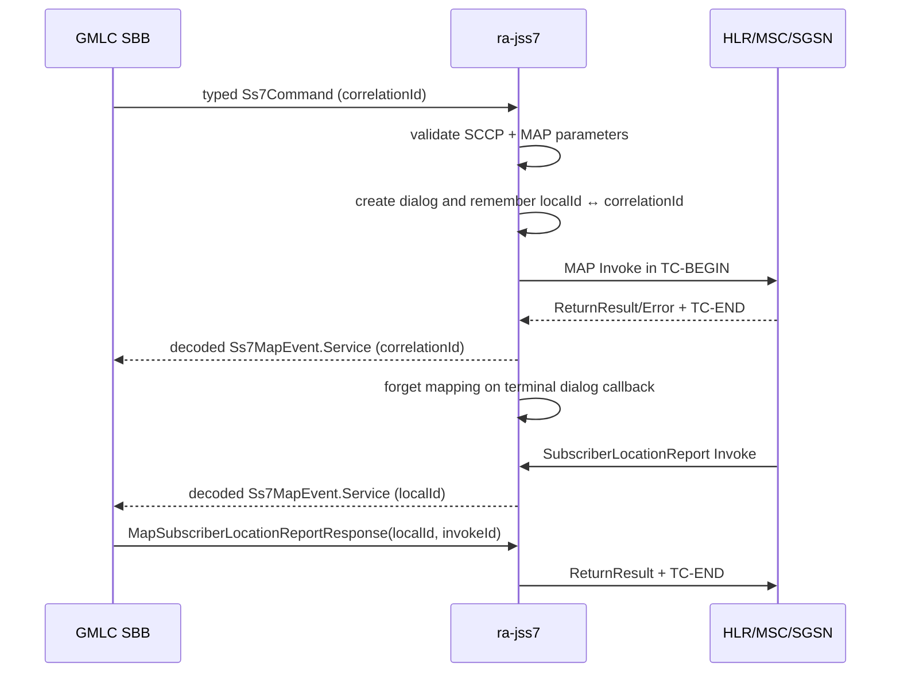

# ra-jss7

SS7 Resource Adaptor (SCTP → M3UA → SCCP → TCAP → MAP/CAP) for micro-jainslee.

## Clustering / n-n (ADR 0001)

- **P1 (shipped):** sticky dialog ownership write-through + outbound routing to the owner RA via Infinispan (`Ss7DialogOwnershipTracker`, `StickyRaCommandRouter`, `IspnStickyCommandBus`). Bind a `ClusterManager` with `Ss7ResourceAdaptor.setClusterManager(...)` before `raActive()`.
- **P2 (RA-wired, not STP-lab HA):** `Jss7TcapDialogFailoverPort` calls jSS7 `exportDialog` / `importDialog`, stores `TcapDialogSnapshotPayload` in ISPN, and registers `TcapMissingDialogResolver` for CONTINUE miss. Multi-ASP / MAP state / invoke timers remain open.

Design: [`docs/adr/0001-ss7-ra-nn-tcap-failover.md`](../../docs/adr/0001-ss7-ra-nn-tcap-failover.md)

## Link status truth

Use `Ss7ResourceAdaptor.isM3uaRouteReady()` for peer route readiness — never `isActive()` / `Ss7Stack.isStarted()` alone.

## jSS7 dependency

`ss7.version` = `9.2.8-j25`. Requires a local (or published) install of coral-valley `j25` that includes `exportDialog` / `importDialog` / `TcapMissingDialogResolver`.

## GMLC outbound MAP

`MapGmlcOutbound` accepts typed `Ss7Command` records for ATI, call-handling
SRI, PSI, SRI-for-LCS, PSL, and same-dialog SLR acknowledgement. SRI-SM
continues through `MapSmsOutbound`. New dialogs use MAP v3 application
contexts, fail closed on invalid addressing/parameters, and retain
`localDialogId → application correlationId` until a terminal dialog callback.
jSS7 owns operation and dialog timers; the RA releases a dialog immediately
when a request fails before reaching the wire.

